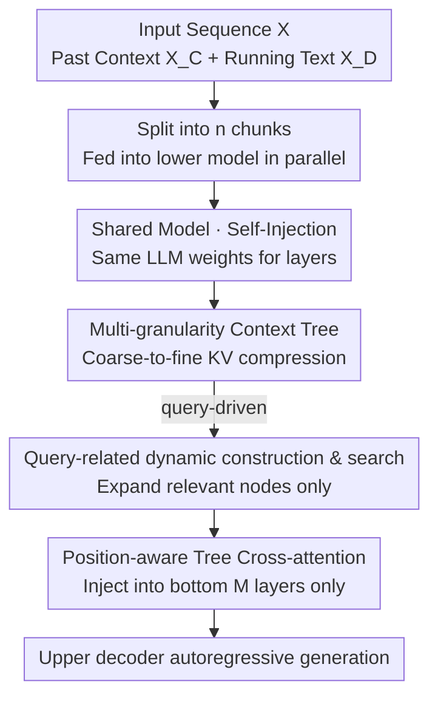

# Stacked From One: Multi-Scale Self-Injection for Context Window Extension

**Conference**: ICLR 2026  
**OpenReview**: [https://openreview.net/forum?id=lh3Aa1u7kU](https://openreview.net/forum?id=lh3Aa1u7kU)  
**Code**: https://github.com/Clement25/SharedLLM  
**Area**: LLM Efficiency  
**Keywords**: Context Window Extension, Long Context Compression, KV Sharing, Context Tree, Self-Injection

## TL;DR
SHAREDLLM stacks a single short-context LLM into two parts: a "lower-layer compressor" and an "upper-layer decoder." The lower layer compresses long inputs into coarse-to-fine multi-granularity context trees and "self-injects" KV pairs into the upper layer only at the bottom few layers. This enables extrapolation to 128K using only 8K sequence training, achieving 2× speedup over streaming methods and 3× over encoder-decoder architectures, while maintaining equal or superior performance.

## Background & Motivation
**Background**: Extending the context window of LLMs from a few thousand to 128K tokens currently follows three main paths: 1) Continual pre-training on long corpora combined with RoPE interpolation (PI, YaRN) for "train short, test long" extrapolation; 2) Prompt compression using semantic tokens to replace long prompts; 3) Modifying Transformers for streaming processing (StreamingLLM, Activation Beacon) to maintain a constant-sized sliding window memory.

**Limitations of Prior Work**: The first path is prohibitively expensive; for instance, reaching 128K with YaRN requires pre-training on 64K lengths, posing immense data and compute costs. Prompt compression only accelerates inference without true window extension and has narrow applicability. While streaming methods maintain constant memory, their specialized attention patterns are often incompatible with high-performance implementations like FlashAttention, causing benchmarks to slow down as input length increases. Encoder-decoder approaches (CEPE) feed context into an independent encoder (e.g., 24-layer RoBERTa), but the latent space mismatch between the encoder and decoder necessitates a heavy warmup phase for alignment, complicating the training pipeline.

**Key Challenge**: Extending context windows is essentially a trade-off between "efficiency" and "performance." Scrimping on memory requires compression or streaming, which either loses information or breaks the hardware-friendliness of attention mechanisms. Preserving performance usually requires full-token processing, leading back to quadratic complexity. Existing methods fail to optimize both ends simultaneously.

**Goal**: The objective is to compress long inputs into controllable memory while preserving performance on downstream long-context tasks, achieving high execution speed without expensive long-sequence pre-training or heterogeneous encoders.

**Key Insight**: The authors observed a neglected fact: if the compressor and decoder are initialized with weights from the same LLM, their latent spaces are naturally aligned, eliminating the need for warmup. Combined with the uneven distribution of "task-relevant information" in long texts (e.g., looking at topic sentences for summaries vs. details for key retrieval), a tree structure can be used for coarse-to-fine multi-granularity compression. This allows the model to adaptively decide where to be precise or coarse based on the query.

**Core Idea**: A short-context LLM is "stacked twice"—the lower layers act as a compressor to encode long context into a multi-granularity context tree, while the upper layers act as the decoder. They interact only at the bottom $M$ layers via shared KV "self-injection," achieving long-context extrapolation with minimal trainable parameters.

## Method

### Overall Architecture
SHAREDLLM addresses the challenge of fitting ultra-long contexts into a short-window LLM without performance loss. It partitions the input sequence $X$ into two segments: $X=\text{concat}([X_C; X_D])$, where the past context $X_C$ is processed by the **lower model** (compressor) and the current running text $X_D$ (e.g., a question) is handled by the **upper model** (decoder). The lower model segments $X_C$ into $n$ non-overlapping chunks $\{C_i\}$. Each chunk is compiled in parallel into a **context tree**. Relevant nodes are dynamically expanded based on the query, and hierarchical downsampling is applied to the KV pairs of retained nodes to produce highly compressed, multi-granularity KV caches. These are injected into only the bottom $M$ layers of the upper model through cross-attention, which then generates text autoregressively. This workflow reduces self-attention complexity from $O(T^2)$ to $O(n\cdot(T/n)^2 + T_D\cdot|S'|)$, where $|S'|$ is the compressed KV length.

### Key Designs

**1. Self-Injection: Shared LLM weights with KV exchange at bottom M layers**

The most critical design is "self-injection"—the lower compressor consists of the first $M$ shallow layers of the target LLM, while the upper decoder is a full-layer version of the same LLM, both initialized from the same checkpoint. This solves the latent space misalignment found in encoder-decoder architectures like CEPE. Because the weights share the same source, the KV pairs produced by the lower layers exist in the same semantic coordinate system as the upper layers' latent space. Consequently, the model can be fine-tuned directly without any warmup phase, significantly lowering training costs.

Crucially, information is injected only at the **bottom $M$ layers** ($M=4$ for language modeling, $M=16$ for SFT). The lower model stops after $M$ layers, avoiding a full forward pass, while the upper model inserts cross-attention only at these shallow layers, bypassing redundant inter-layer projections. This "shallow compression + shallow injection" path allows SHAREDLLM to achieve 2× to 3× speedups compared to CEPE or streaming methods. Ablations show that moving injection to the "top layers" or using "interleaving" significantly degrades performance.

**2. Multi-granularity Context Tree: Coarse-to-fine KV compression using a binary tree**

To address the uneven information density in long texts, the authors build a binary **context tree** for each chunk. The root node contains the entire chunk, and non-leaf nodes $\{x_{u+1},...,x_{u+l}\}$ are split into $C_{\text{left}}=\{x_{u+k}\}_{k=1}^{b}$ and $C_{\text{right}}=\{x_{u+k}\}_{k=b+1}^{l}$, where the split point $b=\lfloor l/2-\epsilon\rfloor$ involves random perturbation $\epsilon\sim N(0,\sigma^2)$. This noise acts as a structural data augmentation during training to prevent overfitting to fixed splits and reduces the risk of cutting through semantic boundaries (e.g., splitting an entity name). During testing, $\epsilon$ is fixed to 0.

Once the tree is built, $M$-layer KV pairs $S=\{K,V\}\in\mathbb{R}^{M\times l\times d}$ are extracted for each retained node and downsampled uniformly along the length dimension (using fractional steps to ensure equidistant retention without extra pooling parameters) to obtain $S'=\{K',V'\}$. A key feature is the **hierarchically decreasing compression rate**: layer $w$ uses a compression rate $\alpha_w$, where $\alpha_w=2\alpha_{w+1}$ as one moves from top to bottom. This creates a coarse-to-fine semantic distribution: higher-level nodes have longer sequences but are heavily compressed (coarse info), while lower-level nodes are lightly compressed (fine-grained details). The global compression rate $\beta=\frac{|C|}{\sum_w l'_w n_w}$ can reach 8 without collapsing performance.

**3. Query-Aware Dynamic Tree Construction: Compute only for relevant nodes**

Building full static trees for every chunk wastes GPU memory and time on nodes irrelevant to the query. The authors use a **query-driven dynamic tree**: a depth-first search (DFS) "split-and-select" approach. Each node is split into children, and a non-parametric strategy $\pi((\vec{x}_{\text{left}},\vec{x}_{\text{right}}),\vec{y})\to\text{left or right}$ decides which child to expand. Unselected siblings are marked as "retained" and not expanded further.

The strategy $\pi$ is task-dependent. For language modeling (non-SFT), where no explicit query exists, the right branch $\pi\equiv\text{right}$ is consistently selected to simulate a useful $\Lambda$-shaped attention pattern. For instruction following (SFT), the node with higher semantic similarity to the query is chosen: $\pi=\arg\max_{\phi\in\{\text{left},\text{right}\}}\text{sim}(\vec{h}_{\vec{x}_\phi},\vec{h}_{\vec{y}})$, using cosine similarity of the last token's hidden vectors. This recursion continues until a leaf or until both children are retained. This granularity allocation saves significant memory and time.

**4. Position-Aware Tree Cross-attention: Temporal alignment of chunked KV**

Since the lower model processes chunks in parallel, the resulting KV sequences are "scrambled" relative to the original global timeline. The authors assign chunk-level position indices in the cross-attention: for query $Q$, $P_Q$ is set to the maximum value $n$ (since $Q$ follows all context); for keys $K$, $P_K$ is assigned $0,1,...,n-1$ according to chunk order. RoPE is applied based on these indices, ensuring cross-attention respects the relative distance between the query and compressed chunks. The final output is integrated into the upper layer's self-attention via residual connection: $O=\text{cross\_attn}(Q,\text{concat}([K'_1;...;K'_n]),\text{concat}([V'_1;...;V'_n]))$.

### Loss & Training
Training utilizes standard language modeling loss $L=-\sum_{x_t\in X_{\text{tar}}}\log P(x_t\mid X_C; x_{<t})$. For language modeling, $X_{\text{tar}}=X_D$. For instruction following, $X_D$ includes instructions $X_{\text{inst}}$ and response $X_{\text{res}}$, with $X_{\text{tar}}=X_{\text{res}}$ (instruction tokens are masked). Cross-attention layers are fully trainable. During the language modeling phase, the upper $N-M$ self-attention layers are also trained to accelerate convergence for post-injection aggregation. Data consists of 20B (1%) tokens sampled from RedPajama truncated to 8192, trained on 8× A800.

## Key Experimental Result

### Main Results
Language modeling perplexity (continual pretraining setting, LLaMA-2 base, lower is better):

| Dataset | Length | SHAREDLLM | CEPE | YaRN |
|--------|------|-----------|------|------|
| Arxiv | 32K | **2.46** | 2.51 | 2.58 |
| Arxiv | 128K | **2.91** | 2.97 | OOM |
| PG19 | 128K | **5.96** | 6.10 | OOM |
| ProofPile | 128K | 2.40 | **2.39** | OOM |

Trained on only 8K but avoiding perplexity explosion at 128K, showing strong extrapolation. It broadly outperforms CEPE without requiring additional pre-training or warmup.

Long-context understanding (SFT, LongBench 14 tasks + InfBench 3 tasks, LLaMA-2 base):

| Method | MD-QA | Summ. | Math.F | Ret.N |
|------|-------|-------|--------|-------|
| Activation Beacon | 28.44 | 25.15 | 12.14 | 80.58 |
| LongAlpaca-16K | 28.10 | 27.80 | 6.23 | 4.87 |
| SHAREDLLM | **30.93** | **25.76** | **13.82** | **82.79** |

Performance is consistent with or exceeds strong baselines across five major categories, with significant advantages in extreme-length numerical retrieval (Ret.N).

### Ablation Study

| Configuration | arxiv (ppl↓) | MD-QA (F1↑) | Description |
|------|-------------|-------------|------|
| Default (Bottom Injection) | 2.46 | 30.93 | Full Model |
| Continuous Top | 2.61 | 28.66 | Top layer injection |
| Interleaving | 2.57 | 29.15 | Interleaved injection |
| without query-aware | — | 29.27 | No query-driven expansion |
| without noise | 2.51 | 30.08 | No split perturbation |
| without chunk pid | 2.49 | 29.81 | No chunk position indices |

### Key Findings
- **Bottom Injection is Optimal**: Continuous bottom injection performs best and is the most efficient due to the shortest backpropagation path.
- **Query-aware Mechanism is Critical**: Removing this mechanism results in the largest performance drop in query-driven tasks.
- **Significant Efficiency Gains**: Memory usage remains near-constant. Inference is ~2× faster than Activation Beacon and ~3× faster than CEPE. YaRN suffers OOM at 128K due to $O(L^2)$ complexity.
- **Hyperparameter Sensitivity**: Trends become unstable when tree height < 3 or compression ratio < 8. A ratio of 8 is the sweet spot for performance and efficiency.

## Highlights & Insights
- **The Elegance of "Self-Injection"**: Using the same LLM weights for both compressor and decoder eliminates the alignment problem, removing the need for warmup and driving faster training and inference.
- **Structural Intuition**: The multi-granularity tree transforms the intuition of "uneven information density" into a computable structure, allowing the model to allocate compression budgets as needed.
- **Bottom-Layer KV Exchange**: This design balances efficiency and hardware-friendliness, shortening computational paths without introducing attention mechanisms incompatible with FlashAttention.
- This "same-model stacking" strategy is transferable to other scenarios requiring long inputs (e.g., RAG, long-document summarization).

## Limitations & Future Work
- The books3 subset was excluded from the training set due to copyright, which may affect comparability with earlier works despite separate sensitivity analyses.
- Performance is sensitive to hyperparameters; tree height and compression ratios require task-specific tuning.
- The selection strategy $\pi$ for language modeling (fixed right branch) is a coarse heuristic and may not be optimal for non-$\Lambda$ attention distributions.
- Some baselines used middle-truncation which might have lowered task difficulty and inflated their scores.

## Related Work & Insights
- **vs CEPE (encoder-decoder)**: CEPE uses an independent RoBERTa encoder, requiring full 24-layer passes and linear projections. SHAREDLLM's shared shallow layers bypass these, running ~3× faster.
- **vs StreamingLLM (Streaming)**: Streaming methods use specialized attention patterns that lose speed as inputs lengthen. SHAREDLLM uses standard attention + shallow injection, yielding ~2× speedup and better performance.
- **vs YaRN / PI (Position Encoding)**: These rely on full $O(L^2)$ attention and face OOM at 128K, whereas SHAREDLLM's hierarchical compression prevents memory explosion.

## Rating
- **Novelty**: ⭐⭐⭐⭐ The "Self-Injection + Multi-granularity Context Tree" is a clever combination that leverages weight homogeneity perfectly.
- **Experimental Thoroughness**: ⭐⭐⭐⭐⭐ Robust comparison across LM/Understanding/Efficiency with multiple base models like LLaMA and Mistral.
- **Writing Quality**: ⭐⭐⭐⭐ Clear methodology and motivation, though some diagrams and notations are dense.
- **Value**: ⭐⭐⭐⭐ Extrapolating 8K training to 128K with 2×/3× speedup is highly practical for low-cost long-context deployment.

<!-- RELATED:START -->

## Related Papers

- [\[ICLR 2026\] Beyond Real: Imaginary Extension of Rotary Position Embeddings for Long-Context LLMs](beyond_real_imaginary_extension_of_rotary_position_embeddings_for_long-context_l.md)
- [\[ICLR 2026\] Short Window Attention Enables Long-Term Memorization](short_window_attention_enables_long-term_memorization.md)
- [\[ICLR 2026\] Cartridges: Lightweight and General-Purpose Long Context Representations via Self-Study](cartridges_lightweight_and_general-purpose_long_context_representations_via_self.md)
- [\[ICLR 2026\] Smooth Reading: Bridging the Gap of Recurrent LLM to Self-Attention LLM on Long-Context Understanding](smooth_reading_bridging_the_gap_of_recurrent_llm_to_self-attention_llm_on_long-c.md)
- [\[ICLR 2026\] One-Prompt Strikes Back: Sparse Mixture of Experts for Prompt-based Continual Learning](one-prompt_strikes_back_sparse_mixture_of_experts_for_prompt-based_continual_lea.md)

<!-- RELATED:END -->
