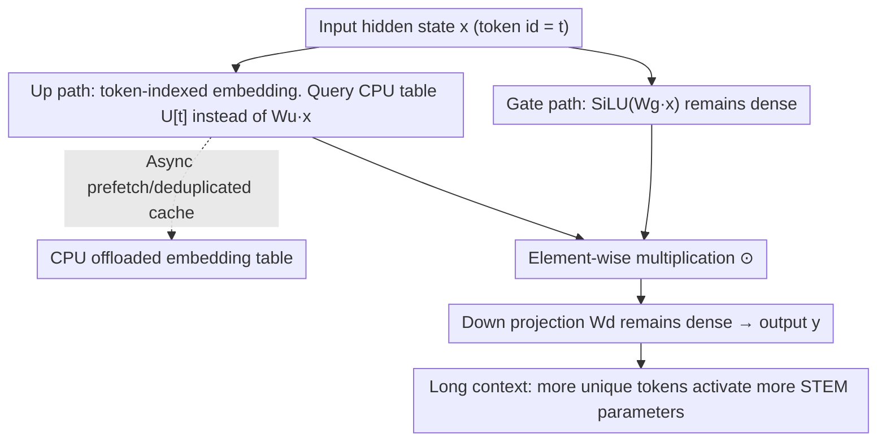

# STEM: Scaling Transformers with Embedding Modules

**Conference**: ICLR 2026  
**OpenReview**: [https://openreview.net/forum?id=gufRimweSQ](https://openreview.net/forum?id=gufRimweSQ)  
**Code**: None  
**Area**: LLM Efficiency  
**Keywords**: Static Sparsity, Token Indexing, FFN, Parameter Memory, CPU offload

## TL;DR
STEM replaces the up-projection matrix in the SwiGLU FFN with a layer-local embedding table indexed by token ID. By utilizing static sparsity instead of dynamic MoE routing, it eliminates approximately one-third of FFN parameters and reduces per-token FLOPs. This approach results in more stable training and larger knowledge capacity, improving downstream average scores by approximately 3–4% at the 350M/1B scales.

## Background & Motivation
**Background**: To benefit from the "more parameters are better" scaling law without disproportionately increasing per-token computation, sparse computation is the primary method, particularly Mixture-of-Experts (MoE). In MoE, each token activates only a small subset of experts, increasing total parameters while keeping active FLOPs relatively constant. Recent works further advocate for "fine-grained" sparsity (large numbers of micro-experts), arguing for stronger expressivity, higher knowledge storage, and better efficiency metrics.

**Limitations of Prior Work**: Fine-grained sparsity faces significant hurdles in both optimization and systems. Regarding optimization: routing is often highly uneven, leaving many experts under-trained and causing loss spikes or training instability. To mitigate this, load-balancing auxiliary losses are added, but these can interfere with the primary objective if poorly tuned. Regarding systems: more experts lead to more all-to-all messages of smaller size, decreasing bandwidth utilization and increasing communication overhead. Small sub-networks also lead to under-utilization of dense matrix kernels, potentially slowing down end-to-end performance.

**Key Challenge**: The goal is to simultaneously achieve (a) stable optimization, (b) widespread expert utilization (ensuring each micro-expert learns useful representations), and (c) negligible expert retrieval latency and communication overhead. The inherent nature of dynamic routing makes it difficult to satisfy all three, as routing introduces uncertainty (instability, imbalance) along with runtime scheduling and cross-device communication.

**Key Insight**: The authors turn to **static sparsity**, where computation paths are fixed at compile time (no runtime routing latency), enabling prefetching, CPU offloading, and eliminating cross-node communication. One validated static method is "token-indexed routing" (fixed mapping from token ID to experts, such as Hash Layers). however, naively selecting experts by token lacks context-adaptability, which weakens expressivity and can degrade quality even with more parameters. Thus, **where to introduce sparsity within the FFN** is the critical factor for success.

**Core Idea**: Only the **up-projection** of the SwiGLU FFN is replaced with a "vector retrieved from a layer-local table by token ID," while the gate and down projections remain dense and shared across tokens. By replacing dynamic routing with static token indexing, capacity is decoupled from both "per-token FLOPs" and "cross-device communication."

## Method

### Overall Architecture
Reviewing the standard SwiGLU FFN: $y_\ell = W^d_\ell\big(\mathrm{SiLU}(W^g_\ell x_\ell)\odot(W^u_\ell x_\ell)\big)$, where gate, up, and down projections are all dense matrices applied to every token. STEM makes exactly one modification—it replaces the up-projection output $W^u_\ell x_\ell$ with a single row $U_\ell[t]$ from a layer-local embedding table $U_\ell\in\mathbb{R}^{V\times d_{ff}}$ corresponding to the current token ID $t$:

$$y_\ell = W^d_\ell\Big(\mathrm{SiLU}(W^g_\ell x_\ell)\odot U_\ell[t]\Big).$$

This single replacement yields three benefits: (1) the up-projection matrix multiplication is eliminated, reducing both per-token FLOPs and parameter access; (2) the embedding table is physically decoupled from matmul weights, allowing it to be stored in CPU memory and **asynchronously prefetched** to the GPU based on the tokens present in the batch, saving approximately one-third of FFN VRAM; (3) table lookup is static with no routing logic, thus avoiding the all-to-all communication associated with MoE. The default configuration **replaces only one-third of the FFN layers** (placed at uniform intervals), while the remaining layers remain dense.

### Key Designs

**1. Static token indexing module replacing only up-projection**

This is the technical core of STEM, directly addressing the instability and tuning difficulties of fine-grained sparsity. Instead of using routers or auxiliary losses, the authors replace the dense up-projection matrix with a layer-local embedding table $U_\ell[t]\in\mathbb{R}^{d_{ff}}$ for direct row retrieval, while gate and down projections remain unchanged. Why up-projection specifically? Ablations provide a clear explanation: in SwiGLU, the gate $\sigma(W^g x)$ depends on the current hidden state $x$ to perform **context-dependent** modulation of $\phi(W^u x)$. If the gate projection is replaced with a token-indexed vector $\sigma(e_t)$, the gate becomes nearly independent of the input, and the non-linear selective function is "absorbed" by the learned embedding, causing the model to underperform relative to the dense baseline. Applying STEM to the up-projection preserves the full contextual information of the gate path—this is the key to coexisting "static sparsity + context-adaptability." Since the mapping is static, the rows to be fetched are known at compile time, naturally supporting prefetching and offloading with zero routing latency or load-balancing instability.

**2. System design with CPU offload, async prefetching, and deduplication cache**

Beyond the architectural change, the authors translate the physical decoupling of embedding tables and matmul weights into a system-level gain. These tables are token-indexed and layer-local, meaning they do not need to reside permanently on the GPU like MoE expert sub-networks. They can be stored in CPU memory, with the specific rows required for the current batch prefetched to the GPU on demand, saving about one-third of the FFN's GPU memory. Prefetch costs are further reduced by **deduplicating** repeated tokens within a batch (fetching only unique rows) and using the saved VRAM to cache high-frequency token embeddings. A crucial scaling property is noted: as model embedding size increases, computation costs grow quadratically, while prefetching costs grow only linearly. Thus, STEM becomes more cost-effective as models scale. In contrast to MoE, where parameter traffic swells with batch size and routing diversity, STEM's parameter traffic grows primarily with the "number of unique tokens seen," making it much more predictable.

**3. Geometric expansion of embeddings for greater knowledge capacity**

This explains why STEM is not just faster, but more accurate. Following the view of "FFNs as key-value memories," each row of the up-projection acts as a key, each column of the down-projection as a value, and the gate provides context-dependent multiplicative modulation for selective reading. The pre-activation $h=\phi(W^u x)$ is equivalent to soft-addressing memory slots. STEM replaces this learned affine addressing with "token-indexed address vectors." The authors measured the cosine similarity between these address vectors and found the distribution highly concentrated near zero (P95 $|\cos|$ only ~0.026–0.033). This indicates the vectors are nearly pairwise orthogonal, showing **large geometric expansion**. This large expansion reduces cross-talk/interference between memory slots, providing more distinguishable storage "slots" for a fixed width, which significantly improves performance on knowledge-intensive tasks. This geometric property also explains the training stability—reduced representation interference lead to smoother convergence.

**4. Inference-time capacity expansion via context length adaptation**

Because STEM uses token-indexed fine-grained sparsity, the **amount of unique parameters touched in a single forward pass grows with the number of unique tokens in the window**. Beyond the shared Q/K/V/O and gate/down projections, the STEM module retrieves only one vector per token ID per layer. Repeated tokens reuse the same vector, while new tokens activate new vectors. Formally, the STEM-specific parameters activated by a single sequence are:

$$\mathrm{Params}^{\mathrm{STEM}}_{\mathrm{act}}(L)=|S|\,d_{ff}\,L_{\mathrm{uniq}},$$

where $S$ is the set of STEM layers and $L_{\mathrm{uniq}}$ is the number of unique tokens in the sequence. In natural text, $L_{\mathrm{uniq}}$ grows sub-linearly with length (Heaps' Law), allowing active parameters to increase with context length without increasing per-token FLOPs. The dense gate/down paths ensure context mixing, while the STEM path adds capacity at minimal cost. This results in "inference-time capacity expansion" with predictable latency. Activated parameters grow continuously with context rather than saturating quickly like in MoE, leading to increasing gains in long-context tasks (the lead over dense models on NIAH grows from 8.4% to 13% as length increases).

### Loss & Training
STEM does not require any load-balancing auxiliary losses, simplifying it compared to MoE. It is trained using a standard language modeling objective with AdamW and a cosine schedule. During training, gradients for STEM embeddings must be sent back to the CPU for optimizer updates, roughly doubling communication compared to inference. The authors also tested a hybrid variant, **STEM†**, which retains the up-projection and adds the token vector as additive modulation $W^u_\ell x_\ell + U_\ell[t]$; however, experiments showed this added parameters and FLOPs without performance gains, confirming that "pure replacement" is the superior design. Scaling experiments were conducted at 350M (100B tokens) and 1B (1T tokens) scales, with the 1B model including mid-training (100B) and context-extension (20B, 32k length, cross-document masking) stages.

## Key Experimental Results

### Main Results
While controlling for training compute (active FLOPs) and tokens, STEM was compared to a dense baseline and Hash-MoE (total parameters aligned). STEM-1/3 replaces one-third of the FFN layers.

| Scale / Setup | Model | Total Params (B) | Active Params (B) | Downstream Avg | GFLOPs | Training ROI |
|------|------|------|------|------|------|------|
| 350M Pre-training | Baseline (Dense) | 0.37 | 0.37 | 49.72 | 0.74 | 1× |
| 350M Pre-training | Hash-MoE (top-1/16) | 1.22 | 0.37 | 50.58 | 0.74 | 1.02× |
| 350M Pre-training | **STEM-1/3** | 1.14 | 0.35 | **50.90** | 0.70 | **1.08×** |
| 350M Pre-training | STEM-1/2 | 1.85 | 0.34 | 54.20 | 0.67 | 1.20× |
| 350M Pre-training | STEM-full | 3.25 | 0.30 | **53.43** | 0.60 | **1.33×** |
| 1B Pre-training | Baseline | 1.50 | 1.50 | 55.82 | 3.00 | 1× |
| 1B Pre-training | **STEM-1/3** | 6.75 | 1.41 | **56.63** | 2.83 | **1.08×** |

After 1B mid-training, STEM's advantages in reasoning and knowledge retrieval became more prominent:

| Model (1B mid) | Downstream Avg | GSM8K | MMLU |
|------|------|------|------|
| Baseline | 57.50 | 44.2 | 29.92 |
| **STEM** | **58.49** | **46.4** | **32.38** |

Knowledge-intensive tasks saw the largest gains: at 350M, ARC-Challenge improved from 30.55 to 32.68; at 1B, OpenBookQA improved from 39.84 to 45.90 (+6 points).

### Ablation Study

| Configuration | 350M Downstream Avg | Description |
|------|------|------|
| STEM-1/3 (Replace up) | 50.90 | Default, optimal |
| STEM (gate-proj) | 49.10 | Replacing gate, performs worse than dense baseline (49.72) |
| STEM† (up + additive) | 50.60 | More params/FLOPs but no gain |
| STEM-1/3 → 1/2 → full | 50.90 → 54.20 → 53.43 | Higher ratio increases avg score; gains plateau after 1/2 |

### Key Findings
- **Sparsity location is critical**: Replacing the up-projection consistently improves performance, whereas replacing the gate-projection drops performance below the dense baseline because it breaks token-input dependency.
- **Replacement Ratio vs. ROI**: Average scores jump from 1/3 to 1/2 replacement but plateau thereafter. However, more replacement saves more FLOPs, leading to monotonically increasing ROI (1.08×→1.20×→1.33×).
- **Training Stability**: Unlike Hash-MoE, STEM's training loss has no spikes. As training tokens increase, STEM's loss curve eventually outperforms other architectures, indicating higher capacity.
- **Long Context**: Longer sequences increase activated unique parameters; the lead over dense models on NIAH expands from 8.4% to 13% as length increases.

## Highlights & Insights
- **Bypassing dynamic routing complexities by "changing one matrix"**: By not introducing routers or auxiliary losses and simply swapping the up-projection for a lookup table, STEM achieves stable training, offloading capability, and zero routing communication. Its engineering value lies in this simplicity.
- **Robust geometric explanation**: Using the "FFN = key-value memory" framework, the paper links knowledge task improvements to "large embedding expansion → low interference → more effective storage slots." This is supported by quantitative cosine similarity evidence rather than abstract claims.
- **Static sparsity enables automatic context capacity scaling**: Since unique tokens grow sub-linearly with sequence length, active parameters increase with context without increasing FLOPs—a property dynamic MoE cannot provide, highly beneficial for RAG or long CoT scenarios.
- **Interpretability and Editability**: Each token has an independent vector per layer. Swapping `e_Spain ← e_Germany` directly shifts the model's top-k prediction for "The capital of Spain is" toward Germany's distribution, providing a transparent and reversible entry point for factual knowledge editing.

## Limitations & Future Work
- The authors acknowledge that pure STEM (replacing only up) may lose some in-context learning capability due to architectural bias. While the STEM† hybrid was designed to address this, it was not cost-effective, suggesting the "free lunch" for restoring context capability is still missing.
- Evaluation scales are relatively small (350M / 1B, up to 1T tokens). Whether the advantages hold at larger scales or against the strongest MoE baselines remains unknown. Comparisons were primarily against dense baselines and Hash-MoE, not modern fine-grained learned routers.
- The embedding table size is $V\times d_{ff}$. Large vocabularies may make CPU memory and prefetching bandwidth a new bottleneck. The benefits of deduplication and caching depend heavily on the skewness of the token distribution.
- Future directions: combining static token indexing with small dynamic components (e.g., dense paths for infrequent tokens) or investigating indexing at granularities above the sub-word level to enhance context adaptability.

## Related Work & Insights
- **vs MoE (Switch / fine-grained MoE)**: MoE uses learned routers for dynamic selection, introducing instability, load-balancing issues, and all-to-all communication. STEM eliminates routing via static token indexing, ensuring training stability and allowing CPU offloading. The trade-law is slightly weaker context adaptability.
- **vs Hash Layer / token-indexed MoE**: Both use fixed token ID mappings. Hash Layer selects the entire FFN block via hash; STEM only replaces the up-projection, retaining the dense context-path of the gate/down projections. Consequently, STEM is more stable (no loss spikes) and maintains better performance than Hash-MoE.
- **vs FFN as key-value memory (Geva et al. / ROME)**: These works interpret the FFN as addressable memory. STEM makes the "address" an explicit token-indexed vector, transforming memory addressing from an "implicit learned affine transform" to an "explicitly queryable and swappable" mechanism, inheriting natural interpretability and editability.

## Rating
- Novelty: ⭐⭐⭐⭐ Replacing only the up-projection for static token indexing is simple yet effective. The geometric analysis and long-context capacity scaling are insightful observations.
- Experimental Thoroughness: ⭐⭐⭐⭐ Covers two scales, pre-training/mid-training/long-context stages, and detailed ablations on position/ratio/geometry. Lacks direct comparison with state-of-the-art large-scale MoEs.
- Writing Quality: ⭐⭐⭐⭐ Clear chain of logic from motivation to analysis. Formulas and geometric proofs are well-executed.
- Value: ⭐⭐⭐⭐ Provides a stable, deployable static alternative to fine-grained sparsity that is friendly to engineering implementation.

<!-- RELATED:START -->

## Related Papers

- [\[ICLR 2026\] Extending the Context of Pretrained LLMs by Dropping Their Positional Embedding](extending_the_context_of_pretrained_llms_by_dropping_their_positional_embedding.md)
- [\[ICLR 2026\] MeSH: Memory-as-State-Highways for Recursive Transformers](mesh_memory-as-state-highways_for_recursive_transformers.md)
- [\[ICLR 2026\] Scaling Attention via Feature Sparsity](scaling_attention_via_feature_sparsity.md)
- [\[ICLR 2026\] Scaling Up, Speeding Up: A Benchmark of Speculative Decoding for Efficient LLM Test-Time Scaling](scaling_up_speeding_up_a_benchmark_of_speculative_decoding_for_efficient_llm_tes.md)
- [\[ICLR 2026\] Reconstructing KV Caches with Cross-Layer Fusion for Enhanced Transformers](reconstructing_kv_caches_with_cross-layer_fusion_for_enhanced_transformers.md)

<!-- RELATED:END -->
