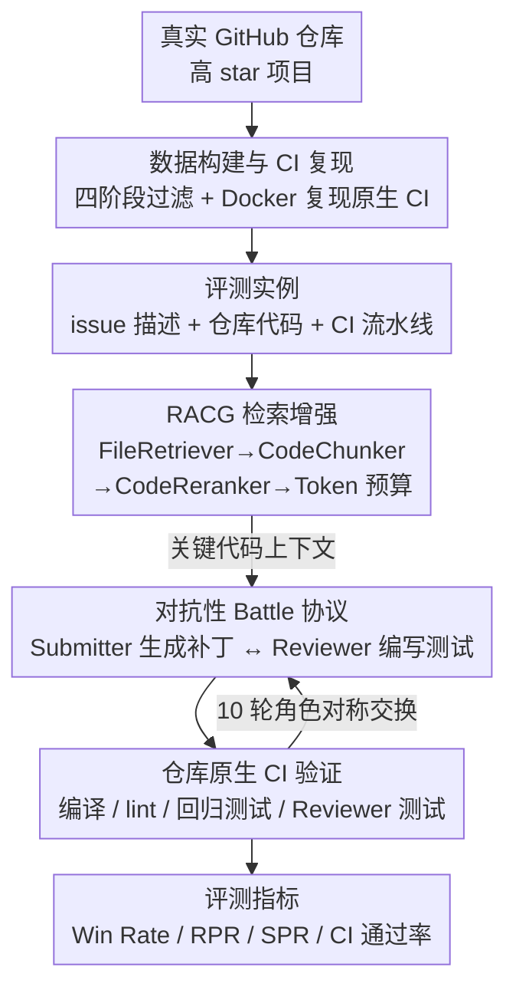

# SwingArena: Adversarial Programming Arena for Long-context GitHub Issue Solving

**Conference**: ICLR 2026 Oral  
**arXiv**: [2505.23932](https://arxiv.org/abs/2505.23932)  
**Code**: [GitHub](https://github.com/) / [HuggingFace Dataset](https://huggingface.co/)  
**Area**: LLM Efficiency  
**Keywords**: Adversarial Evaluation, CI Pipeline, Submitter-Reviewer, Retrieval-Augmented Code Generation (RACG), Multilingual Code Benchmark  

## TL;DR
Ours proposes SwingArena, an adversarial evaluation framework where two LLMs alternately play the roles of patch submitter and test reviewer on real GitHub issues. Verified end-to-end via repository-native CI pipelines (compilation/lint/regression testing), across 400 instances in C++, Python, Rust, and Go, it reveals a behavioral divergence between "aggressive patch generation" and "defensive quality assurance."

## Background & Motivation

**Background**: LLM code evaluation has evolved from function-level snippets in HumanEval/MBPP to repository-level issue solving in SWE-Bench. While SWE-Bench anchors evaluation on real GitHub issues, its core criterion remains whether a patch passes a predefined set of unit tests.

**Limitations of Prior Work**: Current benchmarks suffer from three blind spots. First, static benchmarks use fixed, predictable test cases, failing to simulate the dynamic process in real development where reviewers actively construct corner cases to challenge patch quality. Second, almost all benchmarks follow a single-agent paradigm—the model generates a patch and is scored by a test set, lacking the iterative game between submitter and reviewer. Third, benchmarks like SWE-Bench focus solely on Python, ignoring mainstream languages like C++, Rust, and Go, and fail to execute full CI pipelines (compilation, linting, style checks, security scans, regression tests), which is disconnected from industrial practice.

**Key Challenge**: Real software development is inherently adversarial—when a contributor submits a PR, reviewers not only examine logic but also write targeted tests to expose weaknesses. This dynamic game is a dimension that static evaluations cannot capture. Meanwhile, real repositories often contain tens of thousands of lines of code with information scattered across files, making efficient retrieval of key code context within limited token windows a core challenge.

**Goal**: (1) Design an adversarial dual-agent evaluation protocol to let models demonstrate both patch generation and test construction capabilities; (2) Build a real CI evaluation benchmark across four languages, upgrading the judging standard from "passing unit tests" to "passing a full CI pipeline"; (3) Provide a multilingual Retrieval-Augmented Code Generation (RACG) baseline to unify the handling of long-context challenges.

**Key Insight**: The authors observe that in real PR reviews, the reviewer's role is essentially an "adversarial test generator"—their goal is not to confirm correctness but to find flaws. This adversarial dynamic can be modeled using a dual-agent framework: one agent generates patches (submitter) and the other generates targeted tests (reviewer), alternating roles in an iterative game.

**Core Idea**: Upgrade LLM code evaluation from "static generation + fixed tests" to "dual-agent adversarial + full CI verification," capturing the dynamic collaborative nature of real software development through submitter-reviewer role exchange.

## Method

### Overall Architecture
SwingArena aims to solve the problem where existing code evaluations use "fixed test set scoring," which fails to capture the adversarial dynamics of real development where reviewers construct corner cases to challenge patches. The system follows a data flow—starting with **Data Construction and CI Reproduction** offline, extracting issues from real GitHub repositories and reproducing native CI in Docker to obtain "buggy programs + runnable CI" instances. During evaluation, each instance passes through an **RACG Retrieval Support Layer** to retrieve key context from thousands of lines into a limited token window. This is followed by the **Adversarial Evaluation Layer**, where two LLMs alternate as Submitter and Reviewer. Patches and new tests are sent to the native CI for verification, yielding metrics like Win Rate, CI pass rate, etc., after multiple rounds of games.

### Key Designs

**1. Data Construction and CI Reproduction: Multi-stage filtering for a high-quality CI-runnable dataset**

Evaluation credibility depends on data quality, yet real repository CI environments are difficult to reproduce. The authors use a four-stage filtering chain: extracting ~2300 PR-Issue pairs via GitHub API, filtering for instances where all CI checks pass, using LLM-as-Judge (Grok-3-beta) to evaluate clarity and difficulty, and finally conducting expert manual verification. Each repository's CI environment is reproduced in isolated Docker containers supporting GitHub Actions and Travis CI, preserving language-specific systems like Rust's cargo. Docker isolation and fixed seeds (temperature=0) ensure reproducible results.

**2. RACG (Retrieval-Augmented Code Generation): Unified long-context handling across four languages**

Real repositories often have tens of thousands of lines, exceeding model context windows. RACG uses a three-stage pipeline: FileRetriever performs coarse file-level ranking using BM25; CodeChunker performs syntax-aware chunking (functions/classes/blocks) for C++, Python, Rust, and Go; CodeReranker uses CodeBERT to encode questions and chunks into dense vectors for cosine similarity ranking. It adds biases for language-aware scoring (prioritizing definitions) and proximity (prioritizing chunks near selected ones). A Token Budget manager dynamically allocates space between coarse and fine-grained chunks.

**3. Adversarial Battle Protocol: Replacing static scoring with dynamic submitter-reviewer games**

Addressing the blind spot of static benchmarks, SwingArena assigns LLMs as Submitter and Reviewer. The Submitter generates a fix based on context, while the Reviewer writes targeted tests to detect edge cases and logic flaws in the patch. The scoring aligns incentives: the Submitter earns +1 if the patch passes all checks (including Reviewer's tests) and -1 otherwise. The Reviewer earns +1 if their test passes the golden patch but fails the Submitter's patch, and -1 if it fails the golden patch. Roles are swapped every 5 rounds in a 10-round battle. Quality gates on Reviewers (tests must pass golden patch, no production code changes, line limits) prevent exploitative behavior.

## Key Experimental Results

### Main Results: Closed-source Model Adversarial Battle

| Battle Config | Submitter | Reviewer | RPR | SPR | Win Rate |
|----------|-----------|----------|-----|-----|----------|
| GPT-4o vs GPT-4o | GPT-4o | GPT-4o | 0.71 | 0.68 | 0.97 |
| Claude vs Claude | Claude | Claude | 0.62 | 0.62 | 1.00 |
| Gemini vs Gemini | Gemini | Gemini | 0.72 | 0.63 | 0.91 |
| DeepSeek vs DeepSeek | DeepSeek | DeepSeek | 0.70 | 0.66 | 0.96 |
| GPT-4o vs Claude | GPT-4o | Claude | 0.65 | 0.55 | 0.90 |
| Claude vs GPT-4o | Claude | GPT-4o | 0.66 | 0.55 | 0.89 |
| Gemini vs DeepSeek | Gemini | DeepSeek | 0.64 | 0.64 | 1.00 |
| DeepSeek vs Gemini | DeepSeek | Gemini | 0.68 | 0.64 | 0.96 |

RPR=Reviewer test pass rate on golden patch, SPR=Submitter patch pass rate on CI. Win Rate is the proportion of submitters passing all checks.

### Ablation Study: Multilingual Best@3 and RACG

| Model/Config | Average | C++ | Go | Rust | Python |
|-----------|------|-----|-----|------|--------|
| DeepSeek-V3 | **0.59** | 0.64 | 0.61 | **0.58** | 0.52 |
| Gemini-2.0 | 0.57 | 0.64 | 0.58 | 0.51 | **0.57** |
| GPT-4o | 0.57 | 0.63 | 0.53 | 0.56 | 0.54 |
| Claude-3.5 | 0.55 | 0.63 | 0.55 | 0.52 | 0.50 |

| RACG Ablation | Best@3 | Win Rate |
|-------------|--------|----------|
| C++ w/ RACG | 0.42 | 0.84 |
| C++ w/o RACG | 0.38 | 0.77 |
| Python w/ RACG | 0.46 | 0.84 |
| Python w/o RACG | 0.44 | 0.71 |
| Rust w/ RACG | 0.58 | 0.75 |
| Rust w/o RACG | 0.49 | 0.72 |
| Go w/ RACG | 0.45 | 0.80 |
| Go w/o RACG | 0.37 | 0.71 |
| BM25-only | 0.38 | 0.62 |
| Top-20 Related + Rerank | 0.43 | 0.73 |

### Key Findings
- **GPT-4o is the most aggressive patch generator**: Its Win Rate as a submitter is consistently $\ge 0.90$, indicating high "aggressiveness." However, its SPR (0.55-0.68) is not the highest, suggesting that high Win Rates partly stem from less stringent opponent reviewers.
- **DeepSeek-V3 and Gemini lead in CI stability**: DeepSeek maintains high RPR/SPR (0.60-0.70/0.55-0.66), and Gemini reaches an RPR of 0.72 in self-play. These models are "defensive"—their patches are stable with high CI pass rates.
- **Performance is highest in C++, weakest in Python and Rust**: This may be due to standardized C++ CI pipelines, whereas Python's non-determinism and Rust's strict compiler increase challenge.
- **Reviewer identity slightly affects outcomes**: Comparisons like GPT-4o vs Claude (0.90) and Claude vs GPT-4o (0.89) suggest that reviewer "strictness" styles influence submitter performance.
- **RACG provides the largest gains in Go and Rust**: Best@3 improved from 0.37 to 0.45 in Go, highlighting the importance of retrieval for languages with dispersed context.
- **Granular analysis** shows that shifting from BM25 to class-level chunking improves Top-10 file hit rates from 20.7% to 48.7%, though block-level reranking offers the best balance for context window constraints.

## Highlights & Insights
- **Adversarial evaluation reveals hidden dimensions**: A model's performance as a submitter versus a reviewer can differ significantly (e.g., GPT-4o excels at generation but is average at validation). This behavioral differentiation is only exposed through dual-agent interaction.
- **Full CI Pipeline as the standard**: Moving from "passing unit tests" to "passing compilation, linting, style, and regression tests" reflects real-world quality requirements. 24% of failures were due to non-functional violations (style/security).
- **Adaptive Token Budgeting**: The RACG strategy of dynamically switching between coarse and fine granularity ensures fairness across models with different context window sizes.
- **Failure Mode Analysis**: 31% of failures stemmed from cross-file consistency issues (fixing a file but forgetting header/API updates), highlighting a fundamental weakness in "architectural-level reasoning."

## Limitations & Future Work
- **Retrieval Bottlenecks**: A fixed Top-5 file retrieval limit can hinder complex issues; 26% of errors were due to missing target files. Dynamic retrieval based on issue complexity is a future direction.
- **High Evaluation Cost**: Multiple CI executions (Docker builds + full test suites) are computationally expensive. Lightweight CI proxies or incremental verification could mitigate this.
- **Scale and Coverage**: Currently supports 4 languages with 100 instances each. Expanding to Java/TypeScript and increasing dataset size would improve statistical confidence.
- **Open-source Evaluation**: Primary focus was on closed-source models; a more systematic evaluation of open-source models (e.g., StarCoder2) is needed.
- **Reviewer Constraints**: Strict quality gates may filter out valuable but non-deterministic tests (e.g., concurrency).

## Related Work & Insights
- **vs SWE-Bench**: Ours extends SWE-Bench from Python-only static testing to multilingual, full-CI, and adversarial dual-agent evaluation, though SWE-Bench currently has a larger single-language dataset.
- **vs SWE-PolyBench**: While supporting multiple languages, these rely on manual configurations and static evaluation, lacking the adversarial dimension.
- **vs Agent-as-a-Judge**: This focuses on scoring consistency, whereas SwingArena uses interaction to expose capability differences.
- **vs Agentless**: SwingArena’s RACG improves upon Agentless (BM25+AST) by adding CodeBERT reranking and token budget management.

## Rating
- Novelty: ⭐⭐⭐⭐⭐ The adversarial CI framework is pioneering for code LLM benchmarking.
- Experimental Thoroughness: ⭐⭐⭐⭐ Coverage of multiple models and languages is strong, though open-source model evaluation and error bars could be improved.
- Writing Quality: ⭐⭐⭐⭐ The framework and battle protocols are clearly defined.
- Value: ⭐⭐⭐⭐ Provides a comprehensive shift from static to dynamic and unit tests to full CI for code evaluation.

<!-- RELATED:START -->

## Related Papers

- [\[ICML 2025\] Curse of High Dimensionality Issue in Transformer for Long-context Modeling](../../ICML2025/llm_efficiency/curse_of_high_dimensionality_issue_in_transformer_for_long-context_modeling.md)
- [\[ICLR 2026\] Long-Context Attention Benchmark: From Kernel Efficiency to Distributed Context Parallelism](long-context_attention_benchmark_from_kernel_efficiency_to_distributed_context_p.md)
- [\[ICLR 2026\] EntropyLong: Effective Long-Context Training via Predictive Uncertainty](entropylong_effective_long-context_training_via_predictive_uncertainty.md)
- [\[ICLR 2026\] Retrospective Sparse Attention for Efficient Long-Context Generation](retrospective_sparse_attention_for_efficient_long-context_generation.md)
- [\[ICLR 2026\] Let's (not) just put things in Context: Test-time Training for Long-context LLMs](lets_not_just_put_things_in_context_test-time_training_for_long-context_llms.md)

<!-- RELATED:END -->
