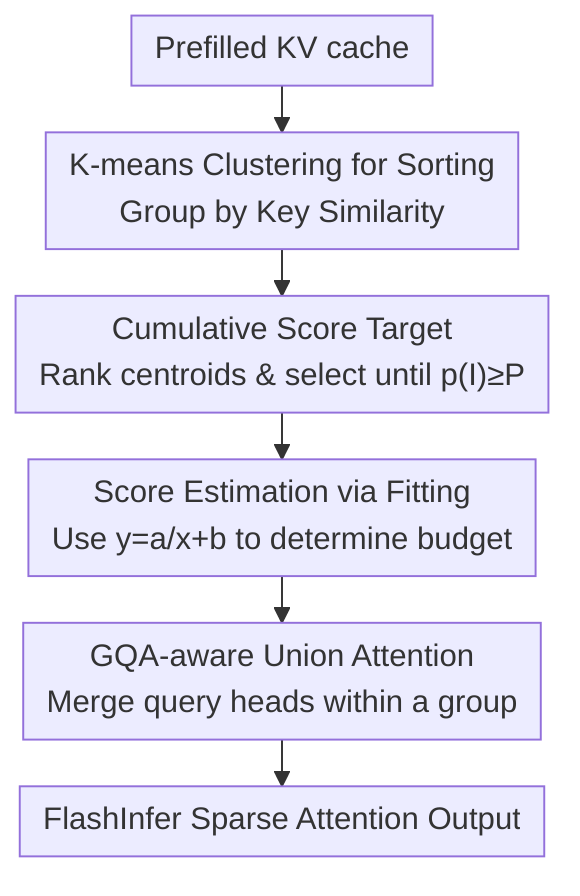

# Tactic: Adaptive Sparse Attention with Clustering and Distribution Fitting for Long-Context LLMs

**Conference**: ICLR 2026  
**OpenReview**: [https://openreview.net/forum?id=tJod11fK1A](https://openreview.net/forum?id=tJod11fK1A)  
**Code**: None  
**Area**: LLM Efficiency  
**Keywords**: Sparse Attention, Long Context, KV cache, Cumulative Attention Score, K-means Clustering

## TL;DR
Tactic replaces fixed token budgets in sparse attention with a "cumulative attention score" target $P$. It selects tokens in descending order of attention scores until the cumulative sum reaches $P$. To efficiently approximate this selection during decoding, it employs K-means clustering for similarity-based sorting and distribution fitting to estimate token scores. This approach achieves up to 7.29× speedup in decoding attention and 1.58× end-to-end speedup while maintaining accuracy close to full attention.

## Background & Motivation
**Background**: The primary bottleneck in long-context LLM inference is the KV cache. As the context length increases, reloading an ever-growing KV cache for each decoded token accounts for over 50% of the total autoregressive decoding latency. To mitigate this, mainstream sparse attention methods (e.g., Quest, StreamingLLM, H2O, PyramidKV, Ada-KV) typically select a small subset of Keys/Values under a **fixed token budget** to approximate full attention.

**Limitations of Prior Work**: Fixed budgets fail because attention sparsity is not constant. The authors demonstrate significant fluctuations across three levels (Fig. 2): ① **Between attention heads**—some "retrieval heads" have uniform score distributions requiring many tokens, while "streaming heads" are dominated by a few tokens; ② **Between layers**—layer 0, for instance, requires significantly more tokens than deeper layers to reach the same cumulative score; ③ **Within the same query**—when generating "The Answer is...", "Answer" focuses locally, whereas "is" requires broad context. Fixed budgets waste tokens on streaming heads and lose accuracy on retrieval heads.

**Key Challenge**: Prior attempts at improvement (PyramidKV, Ada-KV) rely on **static allocation** based on calibration data or preset rules, failing to adapt to real-time sparsity changes. While MagicPig employs dynamic selection, it **lacks theoretical guarantees** for approximation errors. Essentially, "budget" as a metric is not directly linked to the quality of approximating full attention.

**Goal**: To find a token selection criterion that is adaptive to sparsity, provides error guarantees, requires no calibration, and can be computed efficiently during decoding.

**Key Insight**: The authors observe a critical fact (Fig. 4)—the norms of Value vectors $\|v_i\|$ are highly concentrated and nearly identical across tokens, layers, and heads. This implies that if the **cumulative attention score** $p(I)=\sum_{i\in I}s_i$ of the selected tokens reaches a certain threshold, the gap between sparse and full attention outputs has a tight upper bound $\epsilon(I)\le 2(1-p(I))\max_i\|v_i\|$. Using "cumulative score" instead of "token count" as a target naturally adapts to sparsity with error guarantees.

**Core Idea**: Replace "fixed token budget" with a "cumulative attention score target $p(I)\ge P$," and use clustering combined with distribution fitting to efficiently approximate this minimal token set during decoding.

## Method

### Overall Architecture
Tactic is a **training-free, calibration-free post-processing** sparse attention mechanism. It takes a prefilled KV cache as input and outputs attention results for each decoding step. The token selection is split into three phases: In the prefill phase, all Key vectors are clustered by similarity once. In the decoding phase, Tactic first ranks clusters via the dot product of the current query and cluster centroids to form an approximately ordered token list. It then uses a lightweight curve to fit the score distribution of the ranked tokens, accumulating scores until the target $P$ is reached to determine the budget. Finally, it performs GQA-aware merging to feed the selected tokens into FlashInfer for the actual attention computation. The overhead is extremely low as it only loads centroids and approximately 2.5% of sampled tokens.

### Key Designs

**1. Cumulative Attention Score Target: From "How Many" to "How Much is Enough"**

This is the core of Tactic, directly addressing the limitations of fixed budgets. Instead of asking how many tokens to keep, it defines the cumulative attention score:

$$p(I)=\sum_{i\in I}s_i=\frac{\sum_{i\in I}\exp(qk_i^\top/\sqrt{d})}{\sum_{i=1}^{n}\exp(qk_i^\top/\sqrt{d})}$$

Tokens are selected in descending order of scores until $p(I)\ge P$ (where $P$ is typically near 1.0, e.g., 0.9). This provides two benefits: **Adaptivity**—heads/layers/queries with low sparsity naturally receive more tokens to satisfy $P$, while high-sparsity ones receive fewer, without needing calibration data; **Theoretical Guarantees**—since Value norms are concentrated, the attention error is bounded by $\epsilon(I)\le 2(1-p(I))\max_i\|v_i\|$. In contrast, fixed-budget methods like Quest show high variance in error $\epsilon(I)$ (Fig. 3).

**2. K-means Clustering for Approximate Sorting: Grouping by Key Similarity**

Selecting tokens by score requires sorting. To avoid the high cost of calculating all scores, Tactic uses grouping. Prior work (Quest) groups by **positional continuity**, assuming neighboring tokens have similar patterns. Tactic argues this is suboptimal, as attention relies on Query-Key interaction rather than position. Using Within-Cluster Sum of Squares (WCSS), Tactic shows (Tab. 1) that clustering is more compact than positional grouping across various lengths. Tactic performs a one-time K-means clustering of Key vectors (average cluster size 16) during prefill. During decoding, it ranks these clusters using the query-centroid dot product. Dot product is used instead of Euclidean distance because it directly corresponds to attention scores.

**3. Distribution Fitting for Score Estimation: Curve-based Tracking and Self-Correction**

Approximate sorting alone is insufficient; Tactic must track when the cumulative score reaches the target without calculating every individual score. Tactic observes that partially sorted attention scores consistently exhibit a long-tail distribution (Fig. 6), fitting the form $y=a/x+b$. It uses this lightweight inverse function to fit the distribution of $\exp(QK^\top/\sqrt{d})$ relative to the sorted position $x$. Parameters $a$ and $b$ are solved using averages from small segments of the distribution (e.g., at 10% and 60%). Since the top 1-2% of tokens are outliers with high scores, their scores are **calculated exactly**. This creates a **self-correcting feedback loop**: if clustering is poor, the score decay is flatter, and the fitting process automatically increases the token budget to compensate.

**4. GQA-aware Union Sparse Attention: Merging Loads for Efficiency**

Modern models use GQA, where multiple query heads share a single KV head. Existing methods often select tokens independently for each query head, leading to redundant KV cache loads. Tactic takes the **union of selected tokens** for all query heads in the same group and loads them only once. It then splits requests into sub-requests handled by FlashInfer's request-level load balancing to manage inter-head imbalance. This engineering optimization yields up to 1.65× attention speedup.

### Loss & Training
Tactic is a **completely training-free and calibration-free** inference-time method. Key hyperparameters include an average cluster size of 16 and K-means with 10 iterations and a single random initialization. Full attention is applied to newly generated tokens, and clustering is updated at fixed intervals (e.g., every 2048 steps) to balance accuracy and efficiency.

## Key Experimental Results

### Main Results
Comparison on the RULER benchmark using Llama-3.1-8B-Instruct (matching token budgets across baselines; accuracy shown, higher is better):

| Method | Config | 16K | 32K | 64K | 96K | Avg. |
|------|------|-----|-----|-----|-----|------|
| Full Attention | — | 91.3 | 86.0 | 85.2 | 85.0 | 86.8 |
| **Tactic** | 90% | 90.3 | 84.9 | 82.8 | 80.5 | **84.6** |
| Quest | 90% | 85.8 | 81.9 | 79.8 | 70.5 | 79.5 |
| MagicPig | 90% | 79.8 | 76.9 | 71.3 | 70.7 | 74.7 |
| PyramidKV | 90% | 73.1 | 76.2 | 74.2 | 68.6 | 73.0 |
| Ada-SnapKV | 90% | 72.7 | 76.4 | 74.3 | 68.7 | 73.0 |
| **Tactic** | 75% | 90.9 | 85.5 | 83.4 | 78.9 | **84.7** |
| MagicPig | 75% | 78.6 | 76.8 | 70.4 | 70.1 | 74.0 |
| Quest | 75% | 70.0 | 71.5 | 69.7 | 65.7 | 69.2 |

At the 90% threshold, Tactic averages 84.6, very close to full attention's 86.8, whereas baselines drop to the 73–80 range. Tactic also achieves the lowest KL divergence relative to full attention on PG19 (Fig. 7) and maintains a token acceptance rate of over 95% when used as a draft model for speculative decoding.

### Ablation Study

| Config | Observation | Explanation |
|------|------|------|
| Full Tactic | High accuracy + Few tokens | Complete model |
| Tactic-topK | Significant accuracy drop | Retains clustering but uses **uniform** budgets per head → Validates cumulative score adaptivity |
| Position-cluster | Similar accuracy but **significantly more tokens** | Replaces K-means with positional grouping → Validates efficiency of similarity clustering |
| w/o Union | Up to 1.65× slower attention | Validates memory access benefits of GQA union |

Data on token counts and success rates (Tab. 3) shows Tactic's token selection is close to a "clustering-optimal" oracle. At a 90% threshold, Tactic selects 1975 tokens compared to the oracle's 1723, achieving a true score of 91% with an 86% success rate.

### Key Findings
- **Cumulative score adaptivity is the main source of accuracy**: Tactic-topK (uniform budget) shows a sharp accuracy drop, proving that dynamically determining budgets per head based on cumulative scores is crucial.
- **Similarity clustering provides efficiency, not just accuracy**: Position-based clustering maintains accuracy but requires significantly more tokens to do so.
- **The inverse function $y=a/x+b$ is the most token-efficient fit**: While other functions (linear/exponential) maintain accuracy, the inverse function consistently selects the fewest tokens.
- **Controllable overhead**: Prefill clustering time remains below 7% of total prefill time up to 256K context. Decoding overhead is low, leading to 7.29× speedup in attention and 1.58× end-to-end.

## Highlights & Insights
- **Shifting the paradigm from "How many" to "How much"**: Replacing fixed budgets with a cumulative score goal is a fundamental metric shift. It makes the token count an output rather than an input, naturally handling sparsity fluctuations with a clean theoretical error bound.
- **The importance of Value norm concentration**: The consistency of $\|v_i\|$ is the theoretical pillar that allows cumulative scores to translate directly to output error bounds.
- **Synergy between clustering and fitting**: These steps are not just sequential but part of a feedback loop that automatically adjusts budgets and pushes estimation errors into low-value tail regions.
- **Plug-and-play GQA optimization**: The union loading strategy is decoupled from the algorithm and can be applied to any head-wise sparse attention method to reduce redundant memory access.

## Limitations & Future Work
- **Quadratic prefill costs for clustering**: While currently under 7%, clustering time scales quadratically with sequence length, which may become significant in ultra-long contexts. Decoding also requires periodic re-clustering.
- **Reliance on distribution assumptions**: The method assumes sorted scores fit a $y=a/x+b$ tail and Value norms are consistent. Performance might degrade on models or tasks that deviate significantly from these patterns.
- **Theoretical bound sensitivity**: The bound $\epsilon(I)\le 2(1-p(I))\max_i\|v_i\|$ may loosen if there are extreme outlier Value norms.
- **Future Directions**: Incremental cluster updates to avoid full re-clustering, expanding fitting to more adaptive function families, and combining with quantization or paged KV management.

## Related Work & Insights
- **vs Quest**: Quest uses positional paging, fixed budgets, and uniform treatment across heads. Tactic uses similarity clustering and adaptive cumulative score budgets. Tactic improves the average RULER score from 79.5 to 84.6 at the 90% config.
- **vs PyramidKV / Ada-KV**: These use static allocation based on calibration. Tactic is calibration-free and adapts to query-level sparsity at runtime.
- **vs MagicPig**: MagicPig uses LSH sampling for dynamic selection but lacks error guarantees. Tactic provides explicit bounds and achieves better KL divergence and acceptance rates.

## Rating
- Novelty: ⭐⭐⭐⭐⭐ Changing fixed budgets to cumulative score targets with error guarantees is a fundamental shift in sparse attention metrics.
- Experimental Thoroughness: ⭐⭐⭐⭐ Covers various benchmarks (PG19, LongBench, RULER), models, and lengths with oracle comparisons, though code is not yet public.
- Writing Quality: ⭐⭐⭐⭐⭐ Logic is well-developed, bridging observation and theory with strong visual support.
- Value: ⭐⭐⭐⭐⭐ Training-free, calibration-free, and plug-and-play with significant end-to-end speedups; highly practical for precision-sensitive long-context services.

<!-- RELATED:START -->

## Related Papers

- [\[ICLR 2026\] Sparse Attention Adaptation for Long Reasoning](sparse_attention_adaptation_for_long_reasoning.md)
- [\[ICLR 2026\] Retrospective Sparse Attention for Efficient Long-Context Generation](retrospective_sparse_attention_for_efficient_long-context_generation.md)
- [\[ICLR 2026\] vAttention: Verified Sparse Attention via Sampling](vattention_verified_sparse_attention_via_sampling.md)
- [\[ICLR 2026\] SparseD: Sparse Attention for Diffusion Language Models](sparsed_sparse_attention_for_diffusion_language_models.md)
- [\[ICLR 2026\] Let's (not) just put things in Context: Test-time Training for Long-context LLMs](lets_not_just_put_things_in_context_test-time_training_for_long-context_llms.md)

<!-- RELATED:END -->
## Related Papers

- [\[ICLR 2026\] Sparse Attention Adaptation for Long Reasoning](sparse_attention_adaptation_for_long_reasoning.md)
- [\[ICLR 2026\] Retrospective Sparse Attention for Efficient Long-Context Generation](retrospective_sparse_attention_for_efficient_long-context_generation.md)
- [\[ICLR 2026\] vAttention: Verified Sparse Attention via Sampling](vattention_verified_sparse_attention_via_sampling.md)
- [\[ICLR 2026\] Understanding and Improving Length Generalization in Hierarchical Sparse Attention Models](understanding_and_improving_length_generalization_in_hierarchical_sparse_attenti.md)
- [\[ICLR 2026\] Let's (not) just put things in Context: Test-time Training for Long-context LLMs](lets_not_just_put_things_in_context_test-time_training_for_long-context_llms.md)

<!-- RELATED:END -->
