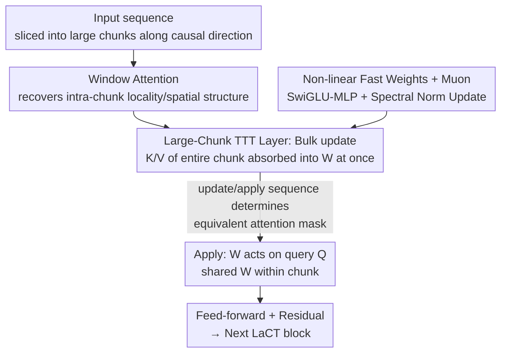

# Test-Time Training Done Right

**Conference**: ICLR 2026  
**OpenReview**: [https://openreview.net/forum?id=Tb9qAxT3xv](https://openreview.net/forum?id=Tb9qAxT3xv)  
**Code**: Open sourced (Project page: https://tianyuanzhang.com/projects/ttt-done-right/ )  
**Area**: LLM Efficiency / Long-Context Modeling / Test-Time Training  
**Keywords**: Test-Time Training, Large-Chunk Update, Fast Weights, Long Context, Linear Complexity

## TL;DR
This paper points out that existing Test-Time Training (TTT) approaches fail on long sequences because they adhere to tiny online mini-batches (updating fast weights every 16~64 tokens), causing modern GPU utilization to remain below 5%. The authors take the opposite approach and propose **LaCT (Large-Chunk Test-Time Training)**, which expands the update granularity to massive chunks of 2K~1M tokens. Combined with window attention to compensate for intra-chunk locality, LaCT achieves 70% GPU utilization with just a few dozen lines of pure PyTorch code. It demonstrates scalability up to 14B parameters and 56K~1M token contexts across three modalities: new view synthesis, language modeling, and autoregressive video diffusion.

## Background & Motivation
**Background**: While softmax attention is the de facto standard for sequence modeling, its computational complexity grows quadratically with sequence length, making long-context scenarios extremely costly. Test-Time Training is a recently emerged sub-quadratic alternative—it treats the recurrent states of an RNN as a small sub-network that is updated online via self-supervision during inference. These updated parameters are called "fast weights," used to compress previous token KV relationships into a fixed-size neural memory.

**Limitations of Prior Work**: Despite extensive exploration into online objectives, optimizers, and architectures for fast weights, TTT has failed to show its potential in long contexts. The root cause is the extremely low hardware utilization of TTT layers (often below 5% of peak FLOPS on modern GPUs). This stems from the conventional practice of using tiny mini-batches—updating fast weights every token or every 16~64 tokens—integrated under the assumption that it is "more effective for in-context learning." Small batches lead to poor parallelism and low arithmetic intensity; when fast weights involve large non-linear networks, achieving non-trivial (>10%) FLOPs utilization is nearly impossible without error-prone custom CUDA kernels.

**Key Challenge**: A small mini-batch also implies an assumption of fine-grained intra-chunk causal dependency, making it suitable only for 1D ordered sequences and inherently unfriendly to N-dimensional grid data like sets, images, or videos. Consequently, a deadlock exists between "wanting expressive large non-linear states" and "wanting high hardware utilization": the larger and more non-linear the state, the harder it is to fit into SRAM for independent SM evolution, leading to lower utilization.

**Goal**: Achieve (1) high GPU utilization, (2) scalable non-linear state capacity, and (3) generality across N-dimensional data without writing custom kernels.

**Key Insight**: The authors observe that the compute-to-memory ratio $r = \frac{2h^2 b}{2h^2 + 4hb} \le \min(h/2, b)$ (where $h$ is the fast weight dimension and $b$ is the chunk size). If the chunk size $b$ is too small, the operation is bottlenecked by memory bandwidth rather than compute. Since small chunks are the issue, the solution is to make them extremely large.

**Core Idea**: Replace tiny mini-batches with extremely large update chunks (2K~1M tokens). Instead of "updating every few tokens," the model "updates every thousands or millions of tokens," turning matrix multiplications into truly large operations. This allows pure PyTorch to maximize utilization, while lost intra-chunk local order is recovered via a window attention layer.

## Method

### Overall Architecture
LaCT segments sequences along the causal direction (e.g., time) into several **large chunks**. Each LaCT block consists of three types of layers: a **window attention layer** for local dependencies and spatial structure, a **large-chunk TTT layer** for compressing historical context into fast weights $W$ and applying the latest $W$ to current queries, and a **feed-forward layer** for channel mixing. All three have residual connections. Inside the TTT layer, operations are decoupled: first, an "update" is computed on the chunk's $\{k_i\}, \{v_i\}$ to absorb context into $W$, followed by an "apply" where all queries in the chunk share the updated $W$ to produce output. There are two information flows—solid lines for model depth and dashed lines for passing fast weights $W$ across time chunks.

### Key Designs

**1. Large-Chunk Updates: Scaling mini-batches from 16 to 1M tokens to saturate compute**

This is the core contribution. Traditional TTT updates fast weights every 16~64 tokens, corresponding to per-token gradient descent in Equation (1). LaCT changes this to a single gradient step on the summed loss of the entire chunk: $g = \nabla_W \sum_{i=1}^{b} \eta_i\, L(f_W(k_i), v_i)$, then $W \leftarrow \text{weight-update}(W, g)$. The chunk size $b$ ranges from 2048 to 1M depending on the task. As $b$ increases, the matrix multiplication of $h\times h$ fast weights by $b\times h$ inputs approaches large-scale GEMM, and the compute-to-memory ratio $r$ approaches its upper bound, overcoming the bandwidth bottleneck. Consequently, GPU utilization rises from <5% to 70% on A100 using only standard PyTorch. Crucially, the "state-to-parameter" ratio reaches $\ge 40\%$, an order of magnitude higher than the 0.1%~5% of previous methods, as large-chunk updates amortize the cost of expensive updates.

**2. Non-linear Fast Weights + Muon Optimizer: Stable and accurate large states**

In the small-chunk era, large non-linear states were avoided because they couldn't fit in SRAM. Large chunks remove this constraint, allowing the authors to implement fast weights as bias-free SwiGLU-MLPs (three matrices $W_1, W_2, W_3$): $f_W(x) = W_2[\,\text{SiLU}(W_1 x) \circ (W_3 x)\,]$. The loss is a simple dot product $L(f_W(k_i), v_i) = -f_W(k_i)^\top v_i$. To address weight explosion or memory decay from repeated gradient accumulation, two mechanisms are introduced: (1) **L2 fast weight normalization**, $\text{weight-update}(W, g) = \text{L2-Normalize}(W - g)$, which acts like post-LayerNorm when treating the sequence dimension as virtual depth, eliminating the need for explicit weight decay; (2) **Muon update rule**, where Muon uses Newton-Schulz iteration to spectrally normalize the gradient $\text{Muon}(g) \simeq UV^\top$ (from SVD $g = USV^\top$). Muon ensures per-token learning rates $\eta_i$ only reflect relative importance within a chunk rather than absolute scale, improving numerical stability.

**3. Window Attention: Recovering local order and freeing TTT capacity**

Large-chunk updates treat tokens in a chunk as an **unordered set**, losing sequential and spatial locality. Since video, images, and text have critical intra-chunk structures, the authors integrate local window attention (causal or bidirectional) to handle these structures. This creates a division of labor: quadratic window attention handles "locality," while linear TTT handles "non-local long-range context." This prevents the fixed-size TTT weights from being wasted on local dependencies, focusing them on long-range modeling. In language and video tasks, window attention can be "fused" with TTT by sharing QKV sets and summing outputs.

**4. Update/Apply Decoupling: Programmable masks for N-dimensional data**

Because update and apply are decoupled, their order and chunk size are adjustable, which is equivalent to switching different masks in self-attention. When chunk size equals the entire sequence and apply precedes update, it mimics full attention. Alternating update/apply creates a chunk-level causal mask. Reversing the order produces a "shifted chunk-level causal mask," ensuring no future information leakage within a chunk—key for language modeling. Updating on specific chunks and applying to all mimics a strided chunk-level causal mask. This "mask programmability" allows LaCT to align with different data structures: new view synthesis uses single-round strided causal masks; language modeling uses shifted causal masks + sliding window attention; and video diffusion uses strided causal masks to update weights only on clean frames.

### Loss & Training
The online self-supervised objective within TTT is the dot product loss $L(f_W(k_i), v_i) = -f_W(k_i)^\top v_i$, with per-token learning rates $\eta_i$ predicted from input tokens. In autoregressive video diffusion, teacher-forcing is used: noise and clean chunks are interleaved $S = [X_1^{noise}, X_1, X_2^{noise}, X_2, \dots]$, where noise chunks are generated as $X_i^{noise} = X_i(1 - t_i) + \epsilon t_i$. Strided causal masking ensures weight updates only happen on clean chunks. Long-sequence training employs **Context Parallelism (CP)**—slicing tokens within a chunk across multiple GPUs, logically equivalent to DDP where "parameters" are fast weights and "data" are tokens, implemented via all-reduce-sum with only 1%~3% throughput overhead.

## Key Experimental Results

### Main Results
LaCT is validated across three modalities. New View Synthesis (NVS) highlights its complexity advantage (A100, ~196K tokens from 48 images at 512×512):

| Method | State Size | Prefill Complexity | Decoding Complexity | Params | Prefill Time | Rendering FPS |
|------|---------|---------------|-----------|--------|-------------|----------|
| Full attention | $O(n)$ | $O(n^2)$ | $O(n)$ | 284M | 16.1 s | 2.3 |
| Perceiver Attention | $O(1)$ | $O(n^2)$ | $O(1)$ | 287M | 16.8 s | 34.4 |
| **Ours (LaCT)** | $O(1)$ | $O(n)$ | $O(1)$ | 312M | **1.4 s** | **38.7** |

LaCT matches the quality of full attention while being an order of magnitude faster in prefilling (16.1s → 1.4s) and outperforms LongLRM and 3D Gaussian Splatting in sparse-view settings, scaling up to 1M tokens (128 views).

Configuration scales for different tasks:

| Task | Data Structure | Chunk Size | State Size | Model Scale | Max Length |
|------|---------|--------|---------|---------|---------|
| New View Synthesis | Image Set | Entire Sequence | $6d^2$ | 0.3B | 1M |
| Video Diffusion | Image sequence | 3 frames | $3d^2 / 0.75d^2$ | 1.3B / 14B | 56,160 |
| Language Modeling | 1D sequence | 2K / 4K tokens | $0.75d^2$ | 0.7B / 3B | 32,768 |

### Ablation Study

| Config / Comparison | Key Findings |
|------|---------|
| Chunk Size (GPU Throughput) | Utilization jumps from <5% to 70%; large chunks are the only source of utilization gain. |
| Muon vs Momentum Update | Muon is consistently better, yielding lower validation loss and more accurate retrieval at 760M/3B scales. |
| LaCT vs GLA / DeltaNet (all w/ SWA) | Lower loss at large token indices, indicating superior long-context utilization and S-NIAH retrieval accuracy. |
| Video Window Size (4 vs 6 frames) | Consistently outperforms pure SWA across different window sizes and longer videos. |

### Key Findings
- **Large chunks are the key to utilization**: Expanding update granularity from 16~64 tokens to thousands or millions increases GPU utilization from <5% to 70% without custom kernels, proving the bottleneck was the engineering paradigm, not the algorithm.
- **State capacity scales performance**: High utilization allows for expanding non-linear fast weights (state-to-parameter ratio $\ge 40\%$), and larger states correlate strongly with lower validation loss.
- **Muon is valuable in large-chunk settings**: By normalizing absolute scale and focusing learning rates on relative intra-chunk importance, Muon provides stability and better results—integration made possible by the pure PyTorch large-chunk approach.
- **NVS is an excellent testbed**: It simultaneously tests spatial compression, dense retrieval, and physical reasoning while allowing fast, non-generative iteration.

## Highlights & Insights
- **"Anti-intuitive scale-up" is the core insight**: While the community assumed small mini-batches were better for in-context learning, this paper identifies small chunks as the culprit for low utilization and pushes the opposite direction to the extreme.
- **Pure PyTorch beating custom kernels**: By shifting complexity from kernel engineering back to algorithmic design, researchers gain the freedom to experiment with SwiGLU non-linear weights and Muon optimizers that were previously inaccessible due to kernel constraints.
- **Update/apply sequence = programmable attention masks**: A single decoupled mechanism unifies full attention, chunk-causal, shifted chunk-causal, and strided chunk-causal masks, bridging 1D sequences, sets, and N-dimensional grids.
- **NVS as a benchmark for memory/compression**: Repositioning New View Synthesis as a testbed for online memory and compression capacity is a clever perspective shift for evaluation.

## Limitations & Future Work
- **Intra-chunk disorder is a trade-off**: Large chunks treat tokens as unordered sets, necessitating external window attention to recover locality—essentially a "discard and compensate" approach. This may be insufficient for data with strong long-range local dependencies within a window.
- **Chunk size as a new hyperparameter**: For text, which lacks natural boundaries, chunk size (2048/4096) becomes a manual hyperparameter. The sensitivity and automatic selection across tasks remain to be explored.
- **Evaluation focus**: Video results primarily report denoising loss, with generation quality (VBench) in the appendix. A more systematic presentation of end-to-end generation quality is needed.
- **Future directions**: Can intra-chunk order be recovered with lightweight relative position encodings instead of full window attention? Can chunk sizes adapt to content (e.g., dynamic slicing based on scene complexity)?

## Related Work & Insights
- **vs. Original TTT (Sun et al., 2024)**: Original TTT relies on per-token/small-batch updates and custom kernels to keep weights in SRAM, leading to small states and low utilization. LaCT changes the engineering paradigm to large-chunk updates in pure PyTorch.
- **vs. InfiniAttention (Munkhdalai et al., 2024)**: InfiniAttention uses block-level recurrence and delta-rule updates, but its expressivity is limited. LaCT uses a more general TTT framework to derive stronger update rules and shows significant gains.
- **vs. Block-Recurrent Transformer**: That model uses memory tokens as recurrent states. LaCT's Perceiver-style register baseline is similar, but LaCT significantly outperforms it in both speed and quality.
- **vs. GLA / DeltaNet / Mamba2**: These linear attention models achieve sequence-dimension parallelism through associativity. LaCT notes that non-linear TTT parallelism only works within chunks, further justifying the "must use large chunks" philosophy; with SWA added, LaCT leads in long-context loss and retrieval.

## Rating
- Novelty: ⭐⭐⭐⭐⭐ Resolves the TTT trilemma (utilization/state capacity/multimodality) through the unique lens of anti-intuitive chunk scaling.
- Experimental Thoroughness: ⭐⭐⭐⭐⭐ Solid validation across NVS, language, and video, scaling from 0.3B to 14B parameters and 32K to 1M tokens.
- Writing Quality: ⭐⭐⭐⭐ Clear derivation of motivation and excellent mask visualization; generation quality metrics being in the appendix slightly impacts completeness.
- Value: ⭐⭐⭐⭐⭐ Makes scalable non-linear TTT accessible via simple PyTorch, significantly lowering the barrier for long-context architecture research.

<!-- RELATED:START -->

## Related Papers

- [\[ICLR 2026\] In-Place Test-Time Training](in-place_test-time_training.md)
- [\[ICLR 2026\] Let's (not) just put things in Context: Test-time Training for Long-context LLMs](lets_not_just_put_things_in_context_test-time_training_for_long-context_llms.md)
- [\[ICLR 2026\] MesaNet: Sequence Modeling by Locally Optimal Test-Time Training](mesanet_sequence_modeling_by_locally_optimal_test-time_training.md)
- [\[ICLR 2026\] TrimR: Validator-based, Training-free Thinking Trimming for Efficient Test-time Scaling](trimr_verifier-based_training-free_thinking_trimming_for_efficient_test-time_sca.md)
- [\[CVPR 2025\] Spatial-TTT: Streaming Visual-based Spatial Intelligence with Test-Time Training](../../CVPR2025/llm_efficiency/spatial-ttt_streaming_visual-based_spatial_intelligence_with_test-time_training.md)

<!-- RELATED:END -->
