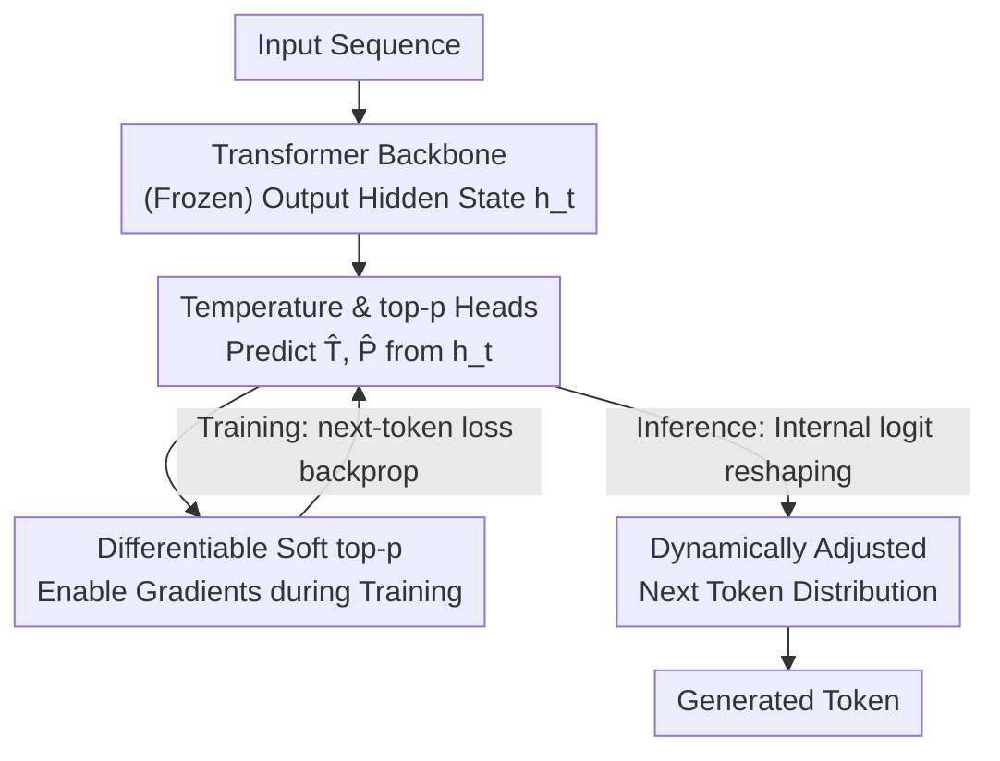

# The End of Manual Decoding: Towards Truly End-to-End Language Models

**Conference**: ICLR 2026  
**OpenReview**: [https://openreview.net/forum?id=cPTgQDMD5p](https://openreview.net/forum?id=cPTgQDMD5p)  
**Code**: https://github.com/Zacks917/AutoDeco  
**Area**: LLM Efficiency  
**Keywords**: Adaptive decoding, temperature prediction, top-p, end-to-end, differentiable sampling  

## TL;DR
This paper proposes AutoDeco, which attaches two lightweight prediction heads to a standard Transformer. It enables the model to predict the temperature and top-p for each decoding step, transforming the manually tuned decoding process into a differentiable, end-to-end trainable component. Across 8 benchmarks, it consistently outperforms default sampling and matches the "oracle" upper bound obtained by tuning parameters on the test set, with almost zero extra latency.

## Background & Motivation

**Background**: Today's LLMs are claimed to be "end-to-end," but the quality of generated text relies heavily on a manual step—the selection of decoding hyperparameters (temperature, top-p, top-k). These parameters must be manually scanned and filtered for each task; even commercial APIs like DeepSeek explicitly recommend different temperature settings for various application scenarios.

**Limitations of Prior Work**: This manual workflow presents two major issues. First, there is an obvious cost in human labor and computation—finding the optimal configuration requires extensive sweeps. Second, and more importantly, any **static** configuration is inherently suboptimal because the required randomness varies drastically within a single generation. For example, during reasoning, a model needs high creativity (high temperature) in the initial exploration phase but high precision (low temperature) when providing the final answer. Static parameters cannot switch mid-generation.

**Key Challenge**: Decoding is essentially a **token-by-token, context-dependent** dynamic decision process. However, the existing paradigm forces a "one-size-fits-all" fixed hyperparameter set, which inevitably fails to match the actual requirements of each position. Furthermore, the "hard truncation" in standard top-p sampling (keeping only the smallest set of tokens whose cumulative probability exceeds a threshold) is a **non-differentiable** operation. This severs the gradient path from the loss back to the decoding parameters, making it impossible to integrate decoding parameters into end-to-end training.

**Goal**: To enable the model to **learn to control** its own decoding strategy—predicting the appropriate temperature and top-p at each step rather than relying on fixed human-provided values. This requires solving two sub-problems: (1) Since there are no token-level ground-truth labels for "optimal temperature/top-p," how can these heads be trained? (2) How can these predictions be integrated into the inference pipeline without increasing latency?

**Key Insight**: The authors observe that since decoding parameters ultimately affect the next-token probability distribution, which in turn influences the cross-entropy loss, the model can indirectly learn "when to use high or low temperature" via backpropagation. This is possible as long as the "temperature scaling + top-p truncation" path is transformed into a **fully differentiable** chain.

**Core Idea**: Use two lightweight MLP heads to predict token-level temperature $\hat{T}$ and top-p $\hat{P}$ directly from hidden states. A differentiable "soft top-p" mechanism is invented to make the entire decoding pipeline end-to-end trainable, thereby internalizing hyperparameter selection into the model's forward pass.

## Method

### Overall Architecture

The goal of AutoDeco is to convert decoding from an external manual post-processing step into an internal parameterized process completed during the forward pass. It adds two lightweight prediction heads in parallel above the standard Transformer's last hidden state $h_t$: a temperature head predicting $\hat{T}_t$ and a top-p head predicting $\hat{P}_t$. Both are calculated in the same forward pass as the original `lm_head`. The predicted parameters are then used to instantly rescale and filter the logits to produce a dynamically adjusted final distribution. This process is nearly transparent to the user—the model can be replaced with the self-adjusting decoding version with just "one line of code."

The challenge on the training side is the lack of labels, solved by making the **entire decoding pipeline differentiable** to train the heads using next-token cross-entropy loss. The challenge on the inference side is latency, solved by implementing the heads as 2-layer MLPs integrated into the standard forward pass, incurring only 1-2% extra overhead.

### Key Designs

**1. Dual Heads with Micro-dependency: Token-level Self-reporting of Parameters**

To address the issue that static hyperparameters cannot fit every position, AutoDeco assigns a unique set of parameters to every generation step. Both heads are simple 2-layer MLPs taking the base model's current hidden state $h_t$ as input. The temperature head predicts directly: $\hat{T}_t = \text{temp\_head}(h_t)$. A key design choice is the top-p head—it takes not only the hidden state but also the **just-predicted temperature** as input: $\hat{P}_t = \text{top-p\_head}(h_t, \hat{T}_t)$. This "micro-dependency" (represented by the dashed arrow in Figure 1) allows for nuanced coupling between parameters: the model can decide the size of the candidate nucleus given the intended temperature, rather than the two parameters acting independently. Because the heads are lightweight and reuse the backbone's computed hidden states, the cost is negligible compared to massive Transformer layers.

**2. Differentiable "Soft top-p": Converting Hard Truncation into a Differentiable Path**

This is the core of the method. Traditional top-p sampling assigns zero probability to tokens outside the threshold, a hard truncation that is non-differentiable. The authors introduce **soft truncation**: tokens outside the threshold are not removed but are subjected to differentiable weight decay based on their distance from the threshold—further tokens decay more severely toward zero, but remains smooth and differentiable. The process follows three steps: first, calculate the initial distribution $p = \text{softmax}(l / \hat{T})$ using the predicted temperature; then, generate a soft mask $m^{(\text{sorted})} = \exp(-\alpha \cdot \text{ReLU}(c - \hat{P}))$ based on the sorted cumulative probabilities $c$, where $\alpha$ controls decay steepness. For tokens within the nucleus ($c < \hat{P}$), the ReLU is zero and the mask is 1; for tokens outside, it decays smoothly to zero. Finally, the mask is mapped back to the original vocabulary order, multiplied by $p$, and re-normalized:

$$\tilde{p} = \frac{p \odot m}{\sum (p \odot m) + \epsilon}$$

The resulting $\tilde{p}$ is a fully differentiable final distribution. This allows the standard cross-entropy loss gradient to backpropagate and update both the temperature and top-p heads, letting the model learn context-aware optimal decoding strategies by optimizing the final task objective. Note that soft top-p is **only used during training**; standard hard sampling is still used during inference.

**3. Data Debiasing: Easy-Token Masking + Dynamic Fine-Tuning**

Instead of pre-training from scratch, the authors freeze the backbone and train only these two heads. The training data consists of trajectories obtained via rejection sampling from various base models on DeepMath-103K. However, training directly on SFT data introduces two biases, addressed by two debiasing operations. First is **Easy-Token Masking**: for tokens where the base model's greedy prediction is already correct, these "easy tokens" would force the optimal $\hat{T}_t^*$ toward zero, making the temperature head overly conservative. Thus, the training loss for a large portion (e.g., 60%) of such positions is randomly masked. Second is **Dynamic Fine-Tuning (DFT)**: naive fine-tuning might lead the temperature head to predict abnormally large values for uncertain tokens. DFT introduces loss reweighting to focus on tokens where the model already has reasonable priors, teaching the heads to increase temperature cautiously only under **calibrated uncertainty**. The entire training process requires only about 400 steps of lightweight fine-tuning to adapt to multiple model families like Qwen, Llama, GPT, and DeepSeek.

### Loss & Training
The training objective is the standard cross-entropy loss of the generated tokens, without additional supervision for decoding parameters. This is the essence of "end-to-end": gradients flow through the differentiable soft top-p to both the temperature and top-p heads. Theoretically, these heads could be trained alongside the backbone during pre-training, but this work chooses to freeze the backbone and train only the heads, concluding in ~400 steps. Unlike the most similar work, Adaptive Decoding (which uses RL and only predicts temperature), AutoDeco controls both temperature and top-p using a fully differentiable pipeline directly from the next-token loss, avoiding RL.

## Key Experimental Results

### Main Results

Evaluated across 5 model families and 8 benchmarks, using Pass@1 (estimated from 128 samples per problem, max length 32768). Mathematical reasoning (in-domain) results:

| Model | Method | AIME | BRUMO25 | HMMT25 | BeyondAIME | Average |
|------|------|------|---------|---------|------------|------|
| Llama-Nemotron-8B | Greedy | 55.00 | 60.00 | 26.67 | 37.00 | 44.67 |
| Llama-Nemotron-8B | Default Sampling | 51.24 | 60.68 | 30.89 | 32.65 | 43.86 |
| Llama-Nemotron-8B | **Ours (AutoDeco)** | 56.07 | 63.23 | 34.37 | 34.51 | **47.05** |
| R1-Distill-Qwen-7B | Default Sampling | 43.62 | 51.38 | 22.50 | 24.87 | 35.59 |
| R1-Distill-Qwen-7B | **Ours (AutoDeco)** | 47.57 | 53.93 | 24.46 | 26.98 | **38.24** |
| Qwen3-235B-Thinking | Default Sampling | 80.76 | 82.40 | 63.41 | 50.05 | 69.16 |
| Qwen3-235B-Thinking | **Ours (AutoDeco)** | 82.79 | 84.14 | 66.07 | 51.88 | **71.22** |

General tasks (out-of-domain, model trained only on Math) also show comprehensive leads, demonstrating strong zero-shot generalization:

| Model | Method | GPQA-D | MMLU-Pro | LiveCodeBench | IFEval | Average |
|------|------|--------|----------|---------------|--------|------|
| R1-Distill-Qwen-7B | Default Sampling | 47.41 | 47.65 | 15.40 | 32.35 | 35.70 |
| R1-Distill-Qwen-7B | **Ours (AutoDeco)** | 48.91 | 50.75 | 15.46 | 33.90 | **37.26** |
| OpenAI-GPT-OSS-20B | Default Sampling | 65.67 | 68.00 | 70.15 | 30.68 | 58.63 |
| OpenAI-GPT-OSS-20B | **Ours (AutoDeco)** | 66.48 | 69.12 | 71.25 | 30.84 | **59.42** |

Critical comparison with **Expert-Guided Tuning (oracle)**: The authors performed fine-grained searches on the test set to determine the optimal static temperature and top-p, representing a "cheating" upper bound. AutoDeco's single-pass performance was nearly identical to this oracle, with differences < 1 point across all models and datasets. Since the oracle is unreachable in real-world scenarios, AutoDeco is considered superior to any feasible expert tuning.

### Ablation Study

Individual heads were evaluated on R1-Distill-Qwen-7B / AIME:

| Configuration | Gain relative to Default | Description |
|------|---------------------|------|
| Temperature Head Only | ~ +3-3.5 points | Single head significantly outperforms static decoding |
| top-p Head Only | ~ +3-3.5 points | Single head is equally effective |
| Full AutoDeco (Dual) | Highest | Heads are complementary, achieving joint optimality |

Efficiency Overhead (R1-Distill-Qwen-7B, 1k tokens): FLOPs are nearly identical to the baseline, VRAM increases by only ~4 MB, and latency increases stably by 0.29-0.6 s/k tokens across various prompt lengths, an average relative increase of only **1.7%**.

### Key Findings
- **Single Head Potency**: Using either temperature or top-p heads alone increases scores by ~3-3.5 points compared to default sampling, showing that major improvements do not require complex architectures. The dual-path setup achieves the global optimum.
- **Generalization as a "Meta-Skill"**: Despite being trained only on Math, the model achieves comparable gains (e.g., +2.8 points on general tasks for R1-Distill-Qwen-7B). This suggests the model learns a universal meta-skill of "how to generate" (balancing exploration and exploitation) rather than task-specific knowledge.
- **Pass@k Stability**: On GPT-OSS-20B, the absolute gain remains consistent from Pass@1 to Pass@64, with relative error reduction scaling from 3.2% to 30%. The relative benefit of the method increases for easier tasks without sacrificing diversity.
- **Adaptive Determinism/Randomness**: In tasks where Default is worse than Greedy, AutoDeco learns to predict lower temperatures to mimic Greedy; conversely, it increases temperature when randomness is beneficial. It learns to toggle between determinism and randomness as needed.

## Highlights & Insights
- **Differentiable Sampling Proxy**: Using $\exp(-\alpha \cdot \text{ReLU}(c-\hat{P}))$ to simultaneously handle thresholding and smooth decay is the key to end-to-end training. This "soft for training, hard for inference" approach is transferable to other non-differentiable modules involving truncation or sorting.
- **"1 Line of Code" Drop-in Deployment**: With two 2-layer MLPs, 1-2% latency, and 4 MB VRAM, adaptive decoding becomes a plug-and-play enhancement for existing models.
- **Emergent Natural Language Control**: Through end-to-end optimization, the model unexpectedly learns to understand meta-instructions like "reduce output diversity." Upon receiving such prompts, it immediately lowers the average predicted temperature and top-p by 0.11 and 0.09, respectively, opening a new paradigm for interactive decoding control.
- **Parameter Micro-dependency**: The top-p head uses the predicted temperature as input, ensuring the two parameters collaborate rather than act independently.

## Limitations & Future Work
- **Frozen Backbone Ceiling**: The authors acknowledge that training only the heads on a frozen backbone limits the precision of prompt control and introduces data bias. Joint training of the backbone and AutoDeco is planned.
- **Narrow Training Domain**: Training data is concentrated on Math (DeepMath-103K). While generalization is good, optimality in "high randomness" scenarios like creative writing or long open-ended generation remains less verified.
- **Reliance on Debiasing Tricks**: Parameters like the Easy-Token Masking ratio (60%) and Dynamic Fine-Tuning are empirical. Sensitive analysis of these hyperparameters is not fully detailed.
- **Soft top-p $\alpha$**: The decay steepness $\alpha=30$ is fixed. The impact of the train-test gap between soft distribution and hard sampling warrants further analysis.

## Related Work & Insights
- **vs Adaptive Decoding (Dhuliawala et al., 2024)**: That work also introduces learnable heads but only for temperature and uses RL. AutoDeco differentiates itself by controlling both temperature and top-p and using a fully differentiable pipeline from next-token loss, avoiding RL's instability and sample inefficiency.
- **vs Static Truncation (Top-K / Nucleus top-p)**: These methods fix hyperparameters as global constants. AutoDeco represents a paradigm shift from "fixed hyperparameters" to "dynamic self-regulation."
- **vs Model-based Decoding (Contrastive / Speculative)**: These use external/assistant models to correct distributions, but still operate within fixed algorithm frameworks where the "guiding model's parameters" become new hyperparameters. AutoDeco internalizes control without external models and is fully compatible with speculative decoding (e.g., MTP).

## Rating
- Novelty: ⭐⭐⭐⭐⭐ Redefines "manual decoding" as an end-to-end learning target; soft top-p and micro-dependency are clean, effective designs.
- Experimental Thoroughness: ⭐⭐⭐⭐⭐ Covers 5 model families, 8 benchmarks, in/out-of-domain comparison, Pass@k, efficiency, and oracle benchmarks.
- Writing Quality: ⭐⭐⭐⭐ Motivation is logically progressed; some debiasing trick details are slightly brief.
- Value: ⭐⭐⭐⭐⭐ Near-zero cost, plug-and-play, and matches oracle performance. Highly attractive for real-world deployment.

<!-- RELATED:START -->

## Related Papers

- [\[ACL 2025\] Sliding Windows Are Not the End: Exploring Full Ranking with Long-Context Large Language Models](../../ACL2025/llm_efficiency/sliding_windows_full_ranking.md)
- [\[ICLR 2026\] Diffusion Language Models Know the Answer Before Decoding](diffusion_language_model_knows_the_answer_before_it_decodes.md)
- [\[ICLR 2026\] Hierarchy Decoding: A Training-free Parallel Decoding Strategy for Diffusion Large Language Models](hierarchy_decoding_a_training-free_parallel_decoding_strategy_for_diffusion_larg.md)
- [\[ICLR 2026\] Equilibrium Language Models](equilibrium_language_models.md)
- [\[ICLR 2026\] Learning to Parallel: Accelerating Diffusion Large Language Models via Learnable Parallel Decoding](learning_to_parallel_accelerating_diffusion_large_language_models_via_learnable_.md)

<!-- RELATED:END -->
