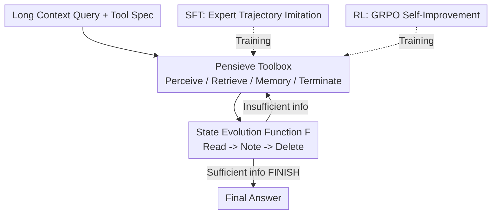

# The Pensieve Paradigm: Stateful Language Models Mastering Their Own Context

**Conference**: ICLR 2026  
**OpenReview**: [https://openreview.net/forum?id=GymjF88oGQ](https://openreview.net/forum?id=GymjF88oGQ)  
**Area**: LLM Efficiency  
**Keywords**: Long Context, Autonomous Context Engineering, Memory Management, Tool Use, Stateful Reasoning

## TL;DR
This paper proposes StateLM—a class of foundation models endowed with the ability to "edit their own context." By utilizing a set of memory tools (deleting context, indexing, note-taking), the model reads, records key points, and deletes original text during multi-turn reasoning. This maintains a "sawtooth" context length rather than monotonic accumulation, allowing StateLM to significantly outperform standard LLMs on long-document QA, dialogue memory, and deep retrieval tasks while using only 1/4 of the active context.

## Background & Motivation
**Background**: Current LLMs are essentially stateless, autoregressive "passive predictors" that perform sequence completion within an externally provided context window. To handle long tasks, researchers developed "Context Engineering"—using human-written scripts to retrieve, concatenate, and insert relevant information, such as RAG, MemGPT, MemAgent, Context-Folding, and ReSum.

**Limitations of Prior Work**: These methods keep the power of "managing memory" in the hands of humans (developers), while the model passively executes a **hard-coded** process. RAG forcibly inserts retrieved chunks into the prompt without model choice; MemAgent updates memory at fixed steps; Context-Folding/ReSum, even when trained with RL, only teach the model to **adapt** to human-designed "branch-fold" or "periodic summarization" patterns. The fundamental logic of context management is hard-coded into training objectives or tool definitions.

**Key Challenge**: Interaction states grow **monotonically**—$s_{t+1} = s_t \,\|\,(a_t, o_t)$, where every turn of thought and tool output is permanently retained and fed back to the model. In long tasks, this continuously consumes the fixed context budget, eventually leading to context exhaustion and performance collapse. While models have a "Pensieve" (i.e., mature databases and retrieval systems), they have never been given the "wand" to operate it.

**Goal**: To place the wand in the model's hands—allowing the model to decide which information is important, which is noise, and how to organize its own reasoning state, thereby escaping the "architectural cage" of fixed windows.

**Key Insight**: The authors use the Pensieve from *Harry Potter* as an analogy: Dumbledore uses a wand to extract, store, and organize memories with full agency. Correspondingly, the authors transform the interaction state from an "append-only log" into a "mutable object actively modified by the model," with the key introduction of a `deleteContext` action and a persistent external notebook.

**Core Idea**: Replace "human-scripted context engineering" with "self-context engineering"—equipping the model with a universal memory toolbox and training it to use it strategically, turning reasoning into a **stateful, manageable** process.

## Method

### Overall Architecture
StateLM extends the general "tool-augmented agent reasoning loop" into a stateful loop capable of **self-modifying interaction history**. Formally, while traditional interaction states can only be monotonically concatenated as $s_{t+1}=s_t\,\|\,(a_t,o_t)$, StateLM replaces this with a state evolution function:

$$s_{t+1} = F(s_t, a_t, o_t)$$

where $F$ can both append new interactions and **modify/delete historical elements** based on context management actions. In each turn, the model samples an action $a_t \sim \pi_\theta(\cdot \mid s_t)$, which consists of a natural language "thought" and a tool "act," and the environment returns an observation $o_t = E(s_t, a_t)$.

The core of this mechanism is the **Pensieve paradigm**: a persistent external memory plus explicit context pruning. It contains two components: (i) an **external notebook** for storing refined notes across the entire episode; (ii) a **delete action** to remove selected historical interactions from the context. A typical workflow involves reading a segment, writing key information into persistent notes, and immediately deleting the original text. Thus, the active context fluctuates in a "sawtooth" pattern rather than increasing linearly, remaining compact and noise-free.

### Key Designs

**1. Pensieve Toolbox (Spellbook): Decomposing context management into composable "spells"**

To address the model's inability to manipulate memory, the authors provide a **universal memory toolbox** categorized into four types: ① Context awareness—`analyzeText` (returns input length), `checkBudget` (reports remaining budget/turns); ② Information acquisition—`buildIndex` (creates searchable index), `searchEngine` (retrieves relevant fragments), `readChunk` (loads selected text blocks); ③ Memory management—`note`/`updateNote` (writes/updates knowledge in the external notebook), `readNote` (retrieves notes into context), `deleteContext` (removes specified messages from context); ④ Termination—`finish` (ends and outputs the answer).

The essence of this toolbox is that it is **general rather than task-specific**: the model is not taught fixed patterns like "fold then summarize" but instead decides when to perceive the budget, when to retrieve, and when to delete original text. Because these tools are orthogonal atomic operations, the same model can adaptively combine different usage patterns for long-document QA, dialogue memory, and deep retrieval without task-specific fine-tuning.

**2. deleteContext + External Notebook: Turning context from "append-only log" to "prunable state"**

This is the key implementation of changing monotonic accumulation $s_{t+1}=s_t\,\|\,(a_t,o_t)$ to $s_{t+1}=F(s_t,a_t,o_t)$. Besides standard reasoning and tool calls, StateLM can issue context management actions $a_t = \text{note}(\cdot)$ and $a_t = \text{deleteContext}(\text{msg})$, where $\text{msg}$ points to a historical assistant action $a_i$ or environment observation $o_i$. After deletion, the corresponding element is no longer visible to the model (replaced by a stub in the prompt), while information in the notebook is **persistently retained** and can be retrieved via `readNote` at any time.

This works because it physically separates "original noise" from "refined signals." Once long text is distilled into notes, it is discarded, freeing up the fixed context budget. This allows the model to continue reasoning on inputs of 1M or 2M tokens, far exceeding its window limit. A practical detail discovered by the authors: in pure scanning scenarios, deleting **only the tool-calling segment of assistant messages while keeping the thought** makes behavior more consistent with scanning toolsets and improves accuracy.

**3. Two-stage Training (SFT Imitation + RL Self-Improvement): From "able to use" to "using well"**

A toolbox alone is insufficient; small models fail to respect budgets even with system prompts. The authors use two-stage training to solidify these capabilities. **Stage 1 SFT**: Claude Opus 4.1 acts as the teacher, generating 3.3K expert trajectories in the StateLM environment. These are purified through a pipeline: outcome-based rejection sampling (keeping correct answers), process-based rejection sampling (discarding trajectories that failed to prune in time or read out of order), training sample construction (recursively expanding a trajectory into multiple samples using token-level masks to only calculate cross-entropy for the current assistant turn, as earlier turns might be modified/deleted), and action balancing (sub-sampling high-frequency, low-complexity actions like `deleteContext`/`readChunk`). This yields 35.7K training samples.

**Stage 2 RL** uses a GRPO-style objective for self-improvement with three adaptations for StateLM: **Trajectory Snapshots**—taking a state snapshot whenever a context editing action occurs, then applying masks as the context evolves; **Controlled Batching**—sampling a fixed number $k$ of snapshots per trajectory to balance variance and compute; and **Task-Aware Rewards**:

$$R(q,a,T_{\text{last}}) = \begin{cases} +1, & \text{Correct, valid format, normal finish} \\ -0.5, & \text{Incorrect, valid format, normal finish} \\ -1, & \text{Invalid format or incomplete} \end{cases}$$

Trajectories exceeding the maximum context window or turn limit are marked as "incomplete." A key discovery: continuing SFT epochs leads to performance degradation, whereas RL does not—indicating the model explores better strategies from its own trajectories.

### A Complete Example
For a "long document QA" task, the StateLM sawtooth cycle (Ref: Figure 2) proceeds as follows: Turn 1 `ANALYZE_TEXT()` checks input length; Turn 2 identifies the document is too long and calls `BUILD_INDEX()`; Turn 3 `SEARCH_ENGINE(keywords)` retrieves relevant fragments; Turn 4 `READ_CHUNK(chunk_id)` reads a specific segment; Turn 5 determines "this segment is important" and calls `UPDATE_NOTE(key, content, summary)`; Turn 6 `DELETE_CONTEXT(msg_id)` removes the original read text to a stub—at this point, context length drops from its peak (one "tooth" of the sawtooth). Interspersed are `CHECK_BUDGET()` and `READ_NOTE(key)` calls. This read-note-delete cycle repeats until Turn 10, where `FINISH(final_answer)` is called once information is sufficient. Throughout, the active context is kept below the window limit.

## Key Experimental Results

### Main Results
Three Qwen3 instruct variants (4B/8B/14B) served as backbones, labeled StateLM after SFT and StateLM-RL after RL. A core comparison: StateLM used only **32K** context, while Qwen3 baselines used YaRN to extend to 128K.

| Model | Context | NovelQA | ∞Bench | Chat Memory | BrowseComp+ |
|------|--------|---------|--------|-------------|-------------|
| Qwen3-4B | 128K | 65.17 | 59.97 | 39.53 | 2.89 |
| StateLM-4B | 32K | 79.57 | 67.25 | 59.33 | 35.33 |
| Qwen3-8B | 128K | 65.87 | 66.81 | 45.40 | 5.56 |
| StateLM-8B | 32K | 83.84 | 70.16 | 58.93 | 46.22 |
| StateLM-8B-RL | 32K | 84.15 | 73.07 | 59.73 | 46.44 |
| Qwen3-14B | 128K | 77.94 | 74.96 | 54.07 | 5.46 |
| StateLM-14B | 32K | 84.15 | 77.44 | 64.40 | 51.33 |
| StateLM-14B-RL | 32K | 84.85 | 78.46 | 64.47 | **52.67** |

The most dramatic result was on the deep retrieval task BrowseComp-Plus (avg. input 552K): standard Qwen3 scaled poorly (~5%), while StateLM reached 35%–52%, an average gain of **40+ points**. On NovelQA, StateLM-8B achieved a >10 point absolute gain over Qwen3-8B, and +13 points on Chat Memory, using only 1/4 the active context.

In Needle-in-a-Haystack (NIAH, without search tools), standard Qwen3 collapsed to near 0 beyond 128K (3.33% at 1M), while StateLM-14B maintained 83.89% at 2M context.

### Ablation Study

| Configuration | Key Finding |
|------|---------|
| SFT vs +RL | StateLM-8B-RL gained an additional 3 points on ∞Bench; RL improves upon SFT while excessive SFT cycles degrade performance. |
| Split by Evidence Position | In the 128–256K range, StateLM outperformed baselines by 23/24 points (4B/8B). The later the evidence, the larger the advantage. |
| Split by Question Type | Multi-Hop showed the largest gain; span/user-preference were weaker due to keyword retrieval limitations for implicit queries. |
| Qwen3-Agentic (Prompt + Tools only) | Even the 14B model only achieved ~30% accuracy, failing to manage budget, proving the necessity of "deliberate training." |

### Key Findings
- **Deleting original text is a performance gain, not a burden**: Compressing context into a sawtooth pattern not only saves budget but improves reasoning accuracy by removing noise, especially for late-occurring evidence.
- **Adaptive tool usage**: Statistics for StateLM-14B show that longer inputs primarily increase **search** frequency rather than memory updates. Memory operations remain low-frequency and efficient (4~5 times/question), unlike fixed workflows that update every step.
- **Autonomous paradigm > Pre-defined workflows**: At equivalent model scales and context budgets, StateLM consistently outperformed agentic memory methods like MemAgent and ReadAgent that rely on hard-coded processes.

## Highlights & Insights
- **`deleteContext` as a paradigm shift**: It transforms the "context" from a read-only log into a mutable state that the model can actively prune. By pairing it with an external notebook, it achieves "noise/signal separation."
- **The "Sawtooth Context" metaphor**: While traditional models hit a wall with monotonic accumulation, StateLM maintains compactness through periodic fluctuations.
- **Token-level masking for historical turns**: Since history is subsequently edited, masking previous turns ensures the model does not learn from invalidated context—a technique transferable to any agent that edits its own history.
- **Unified memory task handling**: StateLM addresses long-document QA, multi-turn dialogue memory, and deep retrieval with a single toolbox and universal training, offering strong generalization.

## Limitations & Future Work
- **Keyword retrieval blind spots**: The model is weaker on "span" and "user-preference" tasks where targets are implicit or non-direct, as `searchEngine` relies on keyword matching.
- **High training cost for small models**: Without deliberate training, small models struggle to manage context budgets, indicating that these capabilities are not "out-of-the-box."
- **Dependence on strong teacher models**: SFT trajectories depend on Claude Opus 4.1, and evaluation often relies on LLM-as-judge.
- **Future directions**: Upgrading keyword search to dense/semantic retrieval or exploring fine-grained process rewards for specific actions like deletion/note-taking.

## Related Work & Insights
- **vs RAG**: RAG uses human-designed pipelines to force chunks into the prompt; StateLM gives the model agency to decide what to retrieve, read, or delete.
- **vs MemGPT / MemOS**: These provide OS-like memory paging, but the scheduling logic is still human-designed. StateLM uses strategic tool calls without pre-set scheduling.
- **vs Context-Folding / ReSum**: These use RL to teach models to **adapt** to fixed patterns; StateLM provides a universal toolbox, allowing the model to architect its own reasoning cycle.
- **vs MemAgent / ReadAgent**: StateLM consistently outperforms these fixed-workflow methods at equivalent scales, demonstrating the advantage of the self-management paradigm.

## Rating
- Novelty: ⭐⭐⭐⭐⭐ Shifting context engineering to the model via `deleteContext` is a powerful new paradigm.
- Experimental Thoroughness: ⭐⭐⭐⭐⭐ Covers three scales, three task types, NIAH to 2M, and comprehensive tool usage statistics.
- Writing Quality: ⭐⭐⭐⭐⭐ The Pensieve metaphor is consistently applied; the logic from motivation to experiment is clear and visual.
- Value: ⭐⭐⭐⭐⭐ A unified approach to long-context memory tasks with direct implications for future agentic LLMs.

<!-- RELATED:START -->

## Related Papers

- [\[ICLR 2026\] Extending the Context of Pretrained LLMs by Dropping Their Positional Embedding](extending_the_context_of_pretrained_llms_by_dropping_their_positional_embedding.md)
- [\[ICLR 2026\] SinkTrack: Attention Sink based Context Anchoring for Large Language Models](sinktrack_attention_sink_based_context_anchoring_for_large_language_models.md)
- [\[ICLR 2026\] SparseD: Sparse Attention for Diffusion Language Models](sparsed_sparse_attention_for_diffusion_language_models.md)
- [\[ICLR 2026\] UltraLLaDA: Scaling the Context Length to 128K for Diffusion Large Language Models](ultrallada_scaling_the_context_length_to_128k_for_diffusion_large_language_model.md)
- [\[ICML 2026\] RePo: Language Models with Context Re-Positioning](../../ICML2026/llm_efficiency/repo_language_models_with_context_re-positioning.md)

<!-- RELATED:END -->
