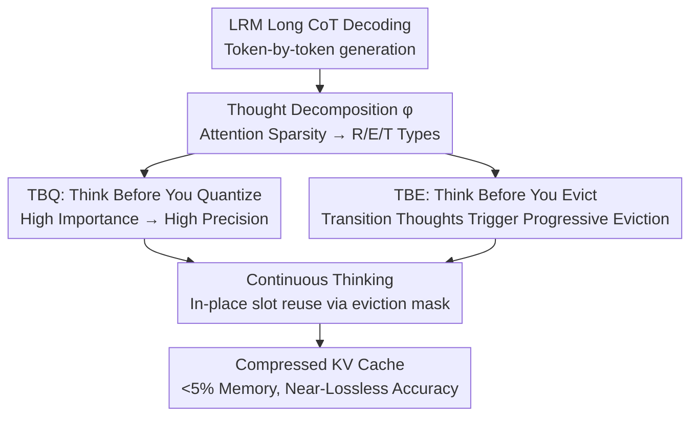

# ThinKV: Thought-Adaptive KV Cache Compression for Efficient Reasoning Models

**Conference**: ICLR 2026  
**OpenReview**: [https://openreview.net/forum?id=M3CeHnZKNC](https://openreview.net/forum?id=M3CeHnZKNC)  
**Code**: None  
**Area**: LLM Efficiency / LLM Inference  
**Keywords**: KV Cache Compression, Reasoning Models, Hybrid Quantization-Eviction, Attention Sparsity, PagedAttention

## TL;DR
ThinKV observes that attention sparsity in the long Chain-of-Thought (CoT) of reasoning models can categorize tokens into three types: "Reasoning, Execution, and Transition." It assigns quantization precision based on thought importance and progressively evicts low-value thought segments when the reasoning trajectory changes. By pairing this with an extended PagedAttention kernel that reuses evicted memory slots in-place, ThinKV achieves near-lossless accuracy with less than 5% of the KV cache, delivering up to 5.8x higher throughput than the SOTA.

## Background & Motivation

**Background**: Large Reasoning Models (LRMs, such as DeepSeek-R1, GPT-OSS) rely on generating thousands of CoT tokens to explore and verify solutions, shifting the competitive focus from "long input" to "long output." However, the decoding stage is memory-constrained. Long CoT causes the KV cache to expand rapidly—generating approximately 32K tokens for GPT-OSS-20B with a batch size of 32 requires 50GB for KV cache alone. Combined with 40GB for weights, this exceeds the 80GB capacity of an A100. Thus, KV cache compression has become critical.

**Limitations of Prior Work**: Most existing compression methods were designed for the prefill stage of long inputs (quantization, eviction, low-rank, hybrid) and perform poorly in the long-output scenarios of LRMs. A few methods targeting the decoding stage either use greedy "recency-first" eviction or apply uniform quantization to all tokens, both of which ignore reasoning dynamics and lead to significant accuracy drops in LRMs. Even recent works attempting to capture reasoning dynamics (RaaS, LazyEviction, R-KV, PM-KVQ) remain at the **token-level** for decision-making. They lack visibility into the global semantic structure of reasoning, making them prone to deleting critical reasoning tokens or failing to compress effectively due to overestimating unimportant tokens.

**Key Challenge**: There are two paths for compression—quantization (reducing bits per token) and eviction (discarding tokens)—but using either in isolation hits a ceiling. The paper characterizes memory as $\text{Mem}(KV) \propto (I + bL_{gen}) \times a\beta$, where $a$ and $b$ are memory coefficients from quantization and eviction, respectively. When pure quantization minimizes $a$, aggressive quantization conversely **inflates the generation length** $L_{gen}$, consuming the saved memory while losing accuracy. While pure eviction minimizes $b$ without inflating length, accuracy collapses as $b \to 0$.

**Goal**: Can we move beyond token-level heuristics to maintain critical reasoning information at high compression ratios while maximizing efficiency? This is broken into three steps: (1) How to identify thought types in a keyword-free and generalizable manner; (2) How to allocate bits/eviction according to thought importance; (3) How to handle memory fragmentation from non-contiguous eviction without expensive gather operations for compaction.

**Key Insight**: The authors discovered that the **sparsity** of attention scores follows a tri-modal distribution across decoding steps, exactly corresponding to three semantically distinct types of thoughts. This provides a generalizable thought classification signal independent of keyword tables.

**Core Idea**: Adaptively **hybridize** quantization and eviction based on thought types (hybrid quantization–eviction). High importance thoughts are preserved with high precision, while trajectory-shifting thoughts are progressively evicted. An algorithm-system co-design is used to eliminate system-side overhead.

## Method

### Overall Architecture

ThinKV is a "thought-adaptive" hybrid compression framework. During decoding, each token is first categorized into R/E/T thought types (Thought Decomposition) based on attention sparsity. Two engines then act in parallel: TBQ assigns quantization precision to new tokens based on thought importance, and TBE progressively evicts previous thought segments when "Transition" thoughts appear. Finally, the Continuous Thinking (CT) kernel, an extension of PagedAttention, reuses discarded memory slots in-place to avoid expensive gather-compaction. The three thought types are: **R (reasoning)** systematic thinking, **E (execution)** computation or code generation, and **T (transition)** uncertainty and backtracking. The importance hierarchy is $R > E > T$, while the sparsity hierarchy is the inverse $T > R > E$.

### Key Designs

**1. Thought Decomposition φ: Keyword-free CoT Segmentation into R/E/T via Attention Sparsity**

Prior token-level methods failed to see the semantic structure of reasoning because they lacked a reliable and universal "thought type" label. Existing works use keyword tables to approximate the classification function $\phi: \{y_0,\dots,y_{n-1}\} \to T$, but these fail when the model generates lexical variants or out-of-vocabulary tokens. ThinKV's key observation is that the sparsity of normalized attention scores $\text{softmax}(qK^\top)$ (calculated as the ratio of zeros using 1% of the row maximum as a threshold) follows a **tri-modal distribution** across decoding steps (Observation 1a). These three modes correspond to the three thought types, with T thoughts having the highest sparsity, followed by R, and then E (Observation 1b).

The implementation involves two phases: **offline calibration** uses Kernel Density Estimation (KDE) on 100 calibration prompts to estimate the sparsity distribution, selecting a subset of layers $L^*$ that exhibit exactly $|T|$ modes (empirically $|L^*|=4$). Local minima between adjacent modes are used as $|T|-1$ thresholds $\Theta=\{\theta_1,\dots\}$, which are averaged across prompts and layers. **During decoding**, the average sparsity of the current token across $L^*$ is compared against $\Theta$ for classification. Since a thought segment usually spans 100–300 tokens, the authors set a refresh period $\tau=128$ steps, updating the category only at intervals to keep classification overhead negligible (Table 5 shows Thought Refresh takes 3.8% time with a 0.7% call rate). This replaces fragile keyword matching with a model-intrinsic sparsity signal that tracks distribution drifts.

**2. TBQ (Think Before You Quantize): Allocating Bits by Thought Importance**

To address the limitation where uniform quantization treats all tokens as equally important, TBQ ranks thought types using counterfactual importance before assigning precision. Importance $\rho$ is derived by calculating the "KL divergence of the final answer distribution with and without thought segment $Y_i$" (averaged over 50 rollouts), yielding a clear hierarchy $R>E>T$. Thus, $\rho(R)=2,\rho(E)=1,\rho(T)=0$. Given a set of available bits $B=\{2,4,8\}$ (2-bit uses ternary, 4-bit uses NVFP4, 8-bit uses FP8), a mapping $\psi: T \to B$ is constructed such that higher importance gets higher precision, mapping R/E/T to 8/4/2-bit respectively.

In practice, a counter-intuitive optimization was found: R tokens maintain near-full accuracy even when quantized to 4-bit. Therefore, the formal experiments utilize **R4E4T2** (R and E at 4-bit, T at 2-bit), achieving an average precision of approximately 3.4 bits, which is more efficient than 8-bit schemes without sacrificing accuracy. Keys are quantized per-channel and values per-token, with groups of $g=16$ sharing an FP8 (E4M3) scaling factor. A full-precision buffer $B_{buf}$ of size $g$ caches tokens until a group is full for collective quantization. This ensures the precision budget is spent where it matters—on tokens carrying reasoning logic—while backtracking T tokens use lower precision.

**3. TBE (Think Before You Evict): Progressive Segment-level Eviction at Trajectory Changes**

TBE aims to prevent the accidental deletion of critical tokens at high compression ratios and reduce the overhead of frequent token-level eviction. The insight derived from Observation 3 is that every time a transition thought (T) appears, the influence of all prior thought segments systematically decreases—meaning **a T thought marks a change in the reasoning trajectory**, after which previous details are less necessary. TBE performs **proactive progressive eviction** at the thought segment level, maintaining a descending retention schedule $R=\{64,32,16,8,4\}$ (per 128-token segment).

The eviction policy $\pi$ follows two scenarios: **Scenario 1**, when a trajectory-changing thought $c_t$ is generated, every previous thought segment is demoted to the next retention rate in $R$: $|S^{\ell*}_i(c_j)| = \min(|S^\ell_i(c_j)|, R_n)$ (where $n$ is the number of times the segment has been selected for eviction). As transitions recur, old segments shrink greedily towards the minimum retention value. **Scenario 2**, if no $c_t$ is present but the cache exceeds budget $k$, the oldest and least important segment is demoted. Token selection for retention is performed using K-means clustering on post-RoPE key embeddings ($K=\min(|S^\ell_i(c_j)|, R)$), keeping cluster centroids. This "batch eviction upon opportunity" strategy keeps eviction frequency extremely low—Table 5 shows ThinKV performs eviction on only 4.59% of decoding steps, compared to 82.93% for R-KV.

**4. Continuous Thinking (CT): Extended PagedAttention for In-place Reuse without Gather Compaction**

Non-contiguous eviction leaves "memory holes" causing internal fragmentation. Standard practice uses gather operations for compaction, but the authors measured (§5.1) that this overhead is heavy: sequential gather slows TPOT by up to 37x, while overlapped gather competes for HBM bandwidth under large batches, slowing attention by ~35%. CT's approach is **to never compact**. It adds four fields to the PagedAttention block table: thought type, thought segment start index, segment mask (bit vector for segment positions), and eviction mask (bit vector for TBE-evicted positions).

When TBE selects tokens for eviction, they are not immediately removed but "soft-marked" in the eviction mask. When new tokens of the same type arrive, CT uses the eviction mask to find these recyclable slots for **in-place overwriting**, appending the new segment start index to the block table and updating the segment mask. Because attention is permutation-invariant (§C.3), tokens do not need reordering during computation. The PagedAttention kernel remains unchanged, allowing for seamless integration into existing serving frameworks. This is the source of ThinKV's throughput surge at large batches: Table 5 shows ThinKV's Gather Time is 0, whereas R-KV's gather consumes 22.45% of time.

### A Complete Example

Consider the walkthrough in Figure 6 (params $\tau=g=\text{block size}=4$, retention $R=\{2\}$): Tokens A–P are categorized by thought type and filled into logical blocks. The block table records the type, fill count, start index, segment mask (e.g., `1111` for a single segment), and eviction mask (initial 0s). TBQ stores R-segment tokens in $B_{buf}$ as 16-bit, quantizing the group once full (A–D transition from 16-bit to 4-bit). When a transition thought appears, TBE triggers, reducing an R-segment from 4 tokens to 2 (choosing centroids via K-means). The evicted slots switch from `0000` to `1100` in the mask. These slots are not cleared until new tokens of the same type arrive, at which point CT overwrites them directly. The block table appends the new index and the segment mask updates to `0101`. No token movement or gather occurs; physical blocks remain compact.

## Key Experimental Results

Models: DeepSeek-R1-Distill-Llama (8B/70B), R1-Distill-Qwen-14B, GPT-OSS (20B/120B), QwQ-32B, AceReason-14B, MobileLLM-R1. Datasets: Math (MATH-500, AIME, GSM8K) and Code (LiveCodeBench). Hardware: A100-80GB and GH200. Max generation length: 32K.

### Main Results

vs. Quantization Baselines (Table 1, k=1024):

| Model | Method | Bits | AIME | LiveCodeBench |
|------|------|------|------|---------------|
| R1-Qwen-14B | Baseline | 16-16 | 53.33 | 47.90 |
| R1-Qwen-14B | KIVI | 2-2 | 40.00 | 34.56 |
| R1-Qwen-14B | PM-KVQ | 3.2 | 43.33 | 41.97 |
| R1-Qwen-14B | **ThinKV** | 3.5 | **50.00** | **45.84** |
| QwQ-32B | Baseline | 16-16 | 73.33 | 55.45 |
| QwQ-32B | KIVI | 2-2 | 60.56 | 40.75 |
| QwQ-32B | PM-KVQ | 3.5 | 67.86 | 46.68 |
| QwQ-32B | **ThinKV** | 3.4 | **70.28** | **50.47** |

Throughput (Table 2, R1-Llama-8B, 32K continuous generation):

| Method | Budget | Memory % | A100 Tok/s | GH200 Tok/s |
|------|------|----------|-----------|-------------|
| FullKV | – | 100% | 297.5 | 453.9 |
| R-KV (seq) | 1024 | 5.48% | 1450.5 | 2425.8 |
| R-KV (ovl) | 1024 | 5.48% | 2320.9 | 4311.3 |
| **ThinKV** | 1024 | **2.51%** | **8412.2** | **10578.5** |

ThinKV achieves competitive accuracy on AIME/LiveCodeBench with a 1024 token budget (<3.67% FullKV memory), while other methods require >12% to match. R1-Llama-8B and AceReason-14B maintain performance drop within <4% on AIME using only ~1.3% KV cache. Throughput is 5.8x higher than R-KV(seq) and 3.6x higher than R-KV(ovl), primarily by supporting 3x larger batches.

### Ablation Study

ThinKV Components (Table 4, GPT-OSS-20B / LiveCodeBench, iso-batch=8):

| Config | Precision/Budget | Accuracy | Norm. Tput | Norm. Latency |
|------|--------------|--------|---------|---------|
| FullKV | – | 77.8 | 1.0× | 1.0× |
| TBQ only | 3.5 | 77.8 | 1.1× | 0.98× |
| TBE only | 512 | 62.5 | 1.78× | 0.36× |
| TBE only | 1024 | 76.9 | 1.48× | 0.38× |
| TBE only | 2048 | 77.8 | 1.27× | 0.44× |
| **ThinKV (TBQ+TBE)** | 3.8 / 1024 | 76.4 | **1.51×** | **0.42×** |

### Key Findings
- **TBQ alone is penalized by generation length inflation**: While TBQ preserves accuracy, pure quantization causes generation length to inflate up to 5.1x (Figure 10d), neutralizing compression gains. Hybridization with TBE regularizes this inflation.
- **Thought-level vs. Token-level**: ThinKV's recall of Top-10 attention tokens remains close to FullKV across budgets, whereas token-level heuristics like R-KV significantly drop (Figure 10a).
- **Vastly different eviction frequencies**: ThinKV only evicts on 4.59% of steps with 0 gather time; R-KV's "evict-per-token" approach leads to an 82.93% call rate and 22.45% gather time (Table 5).
- **Precision Config**: R4E4T2 is optimal; R tokens quantized to 4-bit without loss are a key enabler.

## Highlights & Insights
- **Elevating compression units from tokens to "thoughts"**: This provides a semantic perspective for compression, identifying thought types via free sparsity signals to make precise decisions.
- **Using transition thoughts as eviction triggers**: T thoughts naturally mark when old details can be forgotten, which is far more intuitive than physical cache limits.
- **Algorithm-system co-design**: CT bypasses gather compaction via "soft marking and delayed overwriting," a strategy transferable to any non-contiguous KV management.
- **Counter-intuitive discovery**: Aggressive quantization can inflate generation length. LRM compression must account for $L_{gen}$ changes in the total memory budget.

## Limitations & Future Work
- **Dependency on offline calibration**: Sparsity thresholds $\Theta$ come from 100 calibration prompts. Robustness across tasks/models without recalibration remains to be fully explored.
- **Assumption of $|T|=3$**: Some layers may have more blurred boundaries. Finer thought divisions might improve the compression-accuracy frontier.
- **Outlier T thoughts**: Exceptionally important T thoughts exist. Current retention schedules provide safety via minimum retention values, but an explicit outlier mechanism is missing.
- **Kernel engineering barrier**: CT depends on custom Triton/PagedAttention implementations, requiring effort to port to other frameworks.

## Related Work & Insights
- **vs. KIVI / PM-KVQ (Quantization)**: These apply uniform or progressive quantization to all tokens; ThinKV allocates precision by thought type (TBQ), yielding significantly higher accuracy (Table 1).
- **vs. H2O / R-KV / LazyEviction (Eviction)**: These use recency or attention-based token-level eviction and require gather compaction. ThinKV performs segment-level proactive eviction and in-place reuse (CT), drastically lowering overhead (Table 5).
- **vs. Single Strategies**: Quantization-only inflates length; eviction-only collapses at high ratios. ThinKV's hybrid approach tracks the Pareto frontier (Figure 2).

## Rating
- Novelty: ⭐⭐⭐⭐⭐ Using attention sparsity for thought classification and hybridizing quantization-eviction provides a rare semantic view of LRM KV compression.
- Experimental Thoroughness: ⭐⭐⭐⭐⭐ Covered 8 models across multiple math/code benchmarks and provided detailed component ablations.
- Writing Quality: ⭐⭐⭐⭐ Clear chain of motivation-observation-method, though high information density requires careful reading.
- Value: ⭐⭐⭐⭐⭐ <5% KV cache with near-lossless performance and up to 5.8x throughput has direct value for deploying long CoT reasoning models.

<!-- RELATED:START -->

## Related Papers

- [\[ICLR 2026\] IceCache: Memory-Efficient KV-cache Management for Long-Sequence LLMs](icecache_memory-efficient_kv-cache_management_for_long-sequence_llms.md)
- [\[ICLR 2026\] MoL: Adaptive Mixture-of-Length Reasoning for Efficient Question Answering with Context](mol_adaptive_mixture-of-length_reasoning_for_efficient_question_answering_with_c.md)
- [\[ICLR 2026\] FreeKV: Boosting KV Cache Retrieval for Efficient LLM Inference](freekv_boosting_kv_cache_retrieval_for_efficient_llm_inference.md)
- [\[ICLR 2026\] DiffAdapt: Difficulty-Adaptive Reasoning for Token-Efficient LLM Inference](diffadapt_difficulty-adaptive_reasoning_for_token-efficient_llm_inference.md)
- [\[ICLR 2026\] LouisKV: Efficient KV Cache Retrieval for Long Input-Output Sequences](louiskv_efficient_kv_cache_retrieval_for_long_input-output_sequences.md)

<!-- RELATED:END -->
