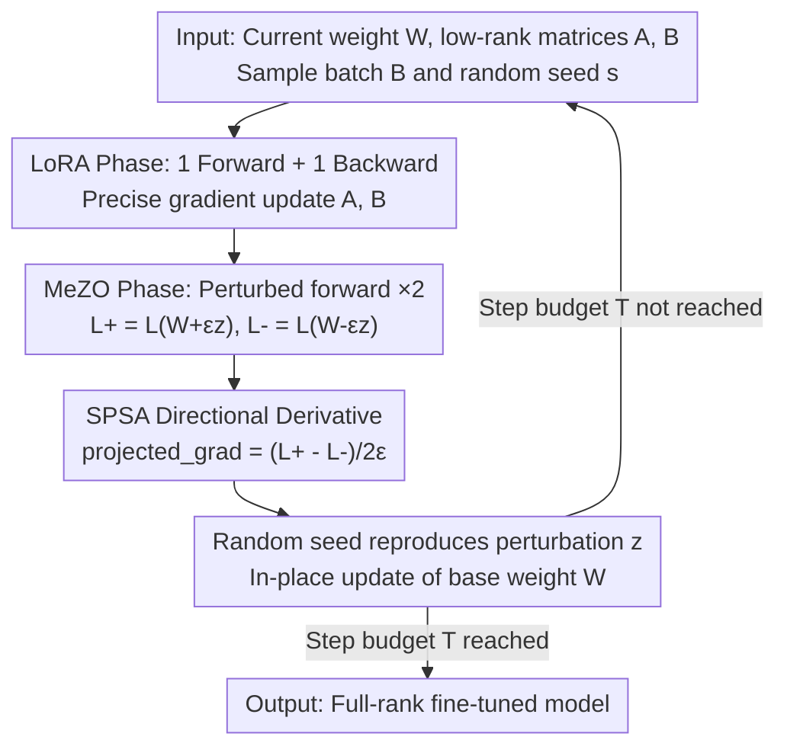

# Three Forward, One Backward: Memory-Efficient Full-Rank Fine-Tuning of Large Models via Extra Forward Passes

**Conference**: ICLR 2026  
**OpenReview**: [https://openreview.net/forum?id=373rsDQsq4](https://openreview.net/forum?id=373rsDQsq4)  
**Code**: https://github.com/workelaina/LMAO  
**Area**: LLM Efficiency  
**Keywords**: Memory-efficient fine-tuning, zeroth-order optimization, low-rank adaptation, full-rank update, alternating optimization

## TL;DR
Aiming at the inherent flaws of LoRA ("restricted expressiveness due to updates only in low-rank subspaces") and MeZO ("high variance and slow convergence of pure zeroth-order estimation"), this paper proposes LMAO. By alternating one forward+backward pass for LoRA (updating low-rank matrices $A, B$) and two perturbed forward passes for zeroth-order estimation (updating base weights $W$) in each iteration, the method constructs a **full-rank** update using "three forwards and one backward." This approaches the performance of full-parameter fine-tuning (FT) under memory footprints characteristic of LoRA / MeZO.

## Background & Motivation
**Background**: The memory bottleneck in fine-tuning large models is extremely prominent—gradients and optimizer states from backpropagation can consume over 12 times the memory required for inference. There are two primary research directions for memory efficiency: first, Parameter-Efficient Fine-Tuning (PEFT), represented by LoRA, which only trains low-rank matrices $W_0 + \frac{\alpha}{r}BA$ injected into the weights; second, zeroth-order optimization, represented by MeZO, which relies on Simultaneous Perturbation Stochastic Approximation (SPSA) through pure forward passes to estimate gradients, avoiding backpropagation entirely and keeping memory usage nearly identical to inference.

**Limitations of Prior Work**: Both approaches face unavoidable structural issues. LoRA limits updates to a subspace of rank $r \ll \min(m, n)$, making the update direction naturally low-rank, which restricts expressiveness and leaves a performance gap compared to full-parameter fine-tuning (feature loss). Although MeZO is extremely memory-efficient, SPSA estimates gradients using random perturbations, leading to high variance and bias, which results in slow convergence and significantly lower accuracy in many tasks.

**Key Challenge**: A trade-off exists between the "rank of the update (expressiveness)" and "memory/backpropagation requirements." Full-rank updates require computing gradients for all weights $W$ (expensive), while saving memory necessitates retreating to low-rank subspaces or pure zeroth-order noise estimation. No single approach has simultaneously achieved both "full-rank updates" and "inference-level memory."

**Goal**: Achieve **full-rank weight updates** under strict memory constraints, bringing performance close to FT while ensuring memory usage does not exceed that of LoRA / MeZO.

**Key Insight**: The authors observe that LoRA and MeZO have exactly complementary capabilities. LoRA's backpropped gradients are precise but locked in a low-rank subspace; MeZO's zeroth-order updates act on the **full parameters** $W$ and are full-rank, though noisy. By **alternating** their application so that they manage different parameters—low-rank matrices $A, B$ are updated by precise gradients and base weights $W$ by zeroth-order updates—the combined effective update spans the complete parameter space, achieving full-rank.

**Core Idea**: Use alternating iterations of "LoRA precise backward updates for low-rank components" + "MeZO zeroth-order forward updates for base weights" to assemble a full-rank update (LMAO) via three forwards and one backward.

## Method

### Overall Architecture
LMAO (Low-rank and Memory-efficient Zeroth-Order Alternating Optimization) decomposes a training iteration into two alternating phases acting on two non-overlapping sets of parameters: the low-rank adaptation matrices $A, B$ and the base weights $W$. The **LoRA phase** conducts a standard forward + backward pass, using first-order optimizers like AdamW/SGD to precisely update $A, B$. The **MeZO phase** then performs zeroth-order optimization on $W$, using two perturbed forward passes to calculate the SPSA directional derivative to update $W$ without any backpropagation through $W$. One iteration totals **three forward passes (1 LoRA + 2 perturbations) and one backward pass (LoRA only)**. Crucially, while the update to $A, B$ is low-rank, the zeroth-order update to $W$ is a full-rank update acting on all weights. Their combination ensures the global weight update remains full-rank, mitigating the feature loss of pure low-rank or pure zeroth-order methods.

### Key Designs

**1. Alternating Optimization Framework: Combining low-rank backward and full-rank zeroth-order into one full-rank update**

This design directly addresses the pain points of LoRA's limited subspace and MeZO's noise. LMAO does not let either side determine the entire update alone; instead, it partitions parameters: low-rank matrices $[B, A]$ are updated via precise first-order gradients

$$[B_{t+1}, A_{t+1}] = [B_t, A_t] - \eta_{BA}\nabla_{BA}\mathcal{L}(W_t; A_t, B_t),$$

and base weights $W$ are updated via zeroth-order estimation

$$W_{t+1} = W_t - \eta_W \hat{\nabla}_W \mathcal{L}(W_t; A_{t+1}, B_{t+1}; M).$$

This is effective because although $A, B$ updates are low-rank, the zeroth-order gradient for $W$ acts on **all $m \times n$ weights** and is inherently full-rank. Their alternating accumulation ensures the effective update spans the full parameter space, avoiding the feature loss of LoRA. Unlike two-stage methods (LoRA followed by zeroth-order), LMAO **alternates per iteration**—step $t$ uses the updated $A_{t+1}, B_{t+1}$ to calculate the zeroth-order gradient for $W$, allowing the two paths to co-calibrate at every step.

**2. Three-forward One-backward: Using SPSA to make the W update a "backward-free" full-rank term**

The MeZO phase is key to making $W$ full-rank and compressing memory. It avoids analytical gradients for $W$ by using SPSA: sampling a Gaussian direction $z \sim \mathcal{N}(0, I)$, performing two forward passes with positive and negative perturbations to obtain $\mathcal{L}^+ = \mathcal{L}(W + \varepsilon z)$ and $\mathcal{L}^- = \mathcal{L}(W - \varepsilon z)$, and then approximating the true gradient with the directional derivative:

$$\hat{\nabla}_W \mathcal{L} = \frac{\mathcal{L}(W + \varepsilon z) - \mathcal{L}(W - \varepsilon z)}{2\varepsilon} \, z \approx zz^{\top}\nabla_W\mathcal{L}.$$

Combined with the LoRA phase's "forward + backward," the total iteration requires three forwards and one backward. The benefit is that the most expensive update for the largest parameters $W$ is completed purely through forward passes, introducing no backward graph or optimizer states for $W$. $W$ carries the "fullness" of the full-rank update while preserving the "savings" in memory. The paper proves the unbiasedness of this estimator ($\mathbb{E}_z[\hat{\nabla}_W\mathcal{L}(W;A,B;M)] = \hat{\nabla}_W\mathcal{L}(W;A,B)$) and quantifies the variance cost relative to true gradients via the second moment expansion $\mathbb{E}_z[\|\hat{\nabla}_W\mathcal{L}\|_F^2] = \frac{mn+N-1}{N} \, \mathbb{E}[\|\hat{\nabla}_W\mathcal{L}\|_F^2]$.

**3. Random Seed Reproduction: Turning perturbation z from "stored" to "recomputed" for zero extra memory**

Naive zeroth-order methods require explicitly storing a perturbation $z$ of the same shape as the parameters (for adding perturbation and then restoring), which creates a tensor as large as the model—an unacceptable memory cost. LMAO adopts the random seed trick from MeZO: instead of storing perturbations, it stores a random seed $s$. Whenever $z$ is needed (adding positive/negative perturbations or finally updating $W$), the random number generator is reset with the same seed $s$ to **in-place** resample the identical $z$. Consequently, the entire zeroth-order phase modifies $W$ in-place without changing model structure or allocating extra perturbation buffers. This is why the peak memory remains consistent with pure LoRA / pure MeZO rather than combined—additional memory is traded for redundant computation via random seeds.

### Loss & Training
The optimization objective is to jointly minimize the loss for both weights and low-rank matrices: $\min_{W,A,B}\mathcal{L}(W;A,B)$, executed via the alternating phases described above (Algorithm 1). Theoretically, under Lipschitz smoothness (Assumption 4.1) and expected smoothness (Assumption 4.2) hypotheses, the descent lemma and convergence rate for the alternating scheme are provided. Using SGD, it satisfies:

$$\min_{0\le t\le T-1}\mathbb{E}\big[\|\nabla\mathcal{L}(W_t;A_{t+1},B_{t+1})\|_F^2\big]\le \frac{6\big(1+\tfrac{L_{BA}}{L_{\max}}\big)^2\big(\mathcal{L}(W_0;A_0,B_0)-\mathcal{L}^*\big)}{\eta_{\max}T},$$

achieving a convergence rate of $\mathcal{O}(1/T)$, where the upper bound for the step size depends on parameter scale $mn$, SPSA samples $N$, and smoothness constants. Two key hyperparameters are the low-rank rank $r$ and scaling factor $\alpha$. Experiments show the method is insensitive to these, allowing for small $r$ in practice.

## Key Experimental Results

### Main Results
Models evaluated include RoBERTa-large (350M, masked language model) and the OPT series (1.3B/2.7B/6.7B, autoregressive). Datasets are sourced from GLUE / SuperGLUE, with a uniform training budget of 1K steps.

RoBERTa-large (k=16 few-shot, accuracy %):

| Task | Zero-shot | MeZO | MeZO(LoRA) | FT | FT(LoRA) | LMAO |
|------|-----------|------|------------|------|----------|------|
| SST-2 | 79.0 | 90.5 | 91.4 | 91.9 | 91.4 | **92.8** |
| SST-5 | 35.5 | 45.5 | 43.0 | 47.5 | 46.7 | **48.4** |
| SNLI | 50.2 | 68.5 | 69.7 | 77.5 | 74.9 | **77.9** |
| MNLI | 48.8 | 58.7 | 64.0 | **70.0** | 67.7 | 69.7 |
| RTE | 51.4 | 64.0 | 64.9 | 66.4 | 66.1 | **67.3** |
| TREC | 32.0 | 76.9 | 73.1 | 85.0 | 82.7 | **87.0** |

At k=16, LMAO outperforms LoRA across all six tasks and even exceeds full-parameter FT in most. At k=512, the gap with FT further narrows to <1% (occasionally $\le$ 2%).

OPT-1.3B (SuperGLUE, 1000 samples):

| Method | SST-2 | RTE | CB | BoolQ | WSC | WIC | MultiRC | COPA | ReCoRD |
|------|-------|-----|----|----|-----|-----|---------|------|--------|
| MeZO | 58.1 | 53.2 | 46.4 | 55.6 | 49.0 | 57.9 | 49.0 | 74.0 | 71.4 |
| LoRA | 92.2 | **61.1** | 67.9 | 61.4 | 53.2 | 58.4 | 56.3 | 74.7 | 72.0 |
| LMAO | **92.4** | 59.4 | **69.0** | **62.0** | **54.8** | **58.9** | **56.7** | **76.7** | **72.1** |

LMAO outperforms LoRA in 8 out of 9 tasks, trailing slightly only on RTE.

### Ablation Study
Ablations performed on OPT-1.3B (monitoring both accuracy and memory):

| Configuration | Description | Conclusion |
|------|------|------|
| LMAO (Full) | Alternating LoRA and MeZO | Significantly highest accuracy across all tasks |
| w/o LoRA | Frozen low-rank blocks, zeroth-order update on $W$ only | Significant drop in accuracy |
| w/o MeZO | Frozen zeroth-order term, update $A, B$ only (LoRA-like) | Significant drop in accuracy |

Peak Memory (GB, OPT-1.3B):

| Method | SST-2 | CB | BoolQ | COPA |
|------|-------|------|-------|------|
| MeZO | 7.90 | 10.99 | 8.75 | 7.70 |
| LoRA | 12.62 | 65.05 | 38.48 | 8.31 |
| LMAO | 12.62 | 65.05 | **23.08** | 8.31 |

### Key Findings
- Both phases are indispensable: Accuracy for either the low-rank component or the zeroth-order component alone is significantly lower than the full LMAO, indicating that gains stem from the **alternating assembly of a full-rank update**, not just one specific path.
- "Integrating two mechanisms without adding memory" is the core selling point: LMAO's peak memory never exceeds that of LoRA or MeZO. On BoolQ, it is even more efficient (23.08 vs 38.48 GB for LoRA) because the zeroth-order phase uses random seeds for in-place updates, introducing no extra backward graphs or intermediate states.
- Insensitivity to hyperparameters $r$ and $\alpha$: In practice, a small $r$ can be used to minimize trainable parameters while maintaining performance.

## Highlights & Insights
- **Complementary assembly of "Parameter-specific Optimizers"**: Partitioning model parameters into low-rank blocks and base weights allows "precise but low-rank" backward passes and "full-rank but noisy" zeroth-order updates to cancel out each other's weaknesses. This "division of labor by parameter" rather than by stage is highly transferable.
- **Extreme compute-for-memory trade-off**: The random seed trick replaces "storing a model-sized perturbation" with "recomputing as needed," making the addition of zeroth-order mechanisms cost virtually zero memory. This is the fundamental engineering reason why peak memory matches single methods rather than the sum of both.
- **Full-rank $\neq$ Full-backward**: The most "Aha!" moment of this paper is revealing that achieving a full-rank update does not require backpropagation through all weights. Zeroth-order forward passes can provide a (noisy) full-rank direction in the entire parameter space, leaving backward passes only for a small set of low-rank parameters.
- Tight alignment between theory and algorithm: The alternating scheme is supported by a descent lemma and an $\mathcal{O}(1/T)$ convergence rate. The zeroth-order estimator also provides unbiasedness and variance amplification coefficients, moving beyond empirical assembly.

## Limitations & Future Work
- The authors acknowledge low training efficiency on **large datasets or long sequences** (requiring three forwards per step) and suggest component training as a potential mitigation for future work.
- Compared to LoRA's one forward and one backward, LMAO's "three forwards, one backward" has a **longer wall-clock time**. It trades compute for memory; the paper focuses on memory and accuracy, with less emphasis on total training throughput/duration.
- The variance of the zeroth-order term increases with parameter scale $mn$. Whether variance control remains robust on models significantly larger than OPT-6.7B is limited by the current experimental scale.
- Ablations are presented via charts without per-task exact values, making the specific magnitude of performance drops qualitative.

## Related Work & Insights
- **vs. LoRA**: LoRA updates strictly in the $r$-rank subspace with one forward/backward pass, capping expressiveness. LMAO adds a zeroth-order forward update to base weights $W$ on top of LoRA, elevating updates to full-rank and generally outperforming LoRA without increasing memory.
- **vs. MeZO**: MeZO relies entirely on zeroth-order forwards and avoids backpropping, but suffers from high variance and slow convergence. LMAO retains MeZO's efficiency and random seed mechanism but adds precise backward passes for low-rank matrices, effectively supplementing pure zeroth-order with a low-noise, precise update channel to improve convergence and accuracy.
- **vs. MeZO Improvements (Sparsification / Variance Reduction / Hessian info)**: These works typically modify the internal zeroth-order framework. LMAO takes a different path—instead of patching zeroth-order internally, it introduces a complementary first-order low-rank channel to alternate with it, relying on structural complementarity rather than estimator refinement.

## Rating
- Novelty: ⭐⭐⭐⭐ The combination of "LoRA backward + MeZO zeroth-order into full-rank" is elegant and addresses the core weaknesses of both.
- Experimental Thoroughness: ⭐⭐⭐⭐ Covers RoBERTa-large and OPT at multiple scales, including accuracy/memory/hyperparameter sensitivities, though ablations missing per-task numerical values is a slight drawback.
- Writing Quality: ⭐⭐⭐⭐ Algorithmic and theoretical descriptions are clear; Figure 1 intuitively compares forward/backward flows of LoRA and LMAO.
- Value: ⭐⭐⭐⭐ Approaches FT performance under strict memory constraints, offering practical value for fine-tuning large models in resource-limited scenarios.

<!-- RELATED:START -->

## Related Papers

- [\[ICLR 2026\] FLoRG: Federated Fine-tuning with Low-rank Gram Matrices and Procrustes Alignment](florg_federated_fine-tuning_with_low-rank_gram_matrices_and_procrustes_alignment.md)
- [\[ICLR 2026\] Difficulty–Diversity Collaborative Filtering for Data-Efficient LLM Fine-Tuning](difficultydiversity_collaborative_filtering_for_data-efficient_llm_fine-tuning.md)
- [\[ICML 2026\] TuneAhead: Predicting Fine-tuning Performance Before Full Training Begins](../../ICML2026/llm_efficiency/tuneahead_predicting_fine-tuning_performance_before_full_training_begins.md)
- [\[ICLR 2026\] On-the-Fly Adaptation to Quantization: Configuration-Aware LoRA for Efficient Fine-Tuning of Quantized LLMs](on-the-fly_adaptation_to_quantization_configuration-aware_lora_for_efficient_fin.md)
- [\[ICLR 2026\] Neuron-Aware Data Selection in Instruction Tuning for Large Language Models](neuron-aware_data_selection_in_instruction_tuning_for_large_language_models.md)

<!-- RELATED:END -->
