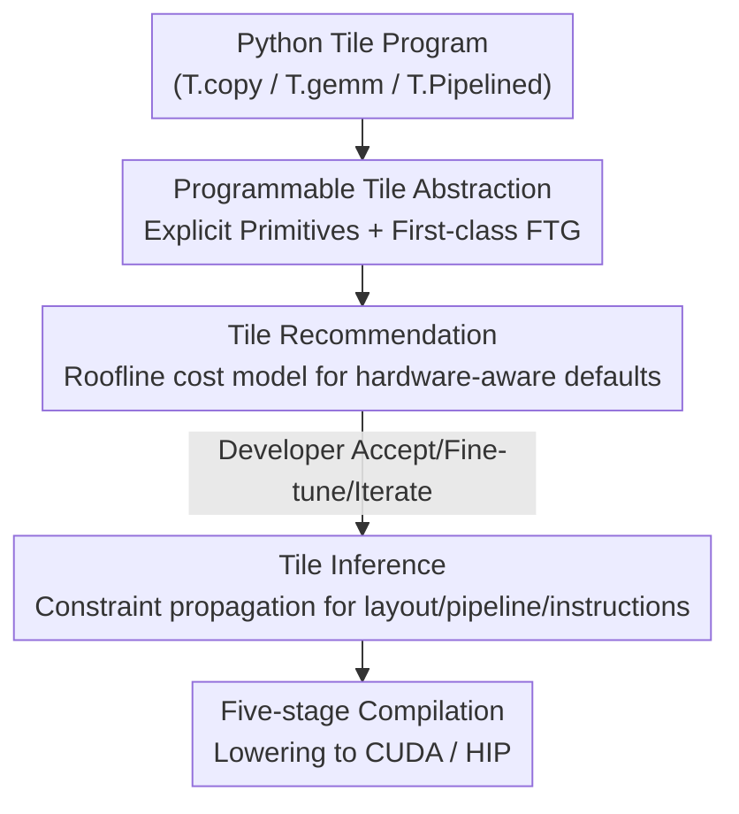

# TileLang: Bridging Programmability and Performance in Modern Neural Network Operators

**Conference**: ICLR 2026  
**OpenReview**: [https://openreview.net/forum?id=Jb1WkNSfUB](https://openreview.net/forum?id=Jb1WkNSfUB)  
**Code**: https://github.com/tile-ai/tilelang (Available)  
**Area**: LLM Efficiency  
**Keywords**: GPU Operators, Compiler DSL, Tile Abstraction, Dataflow Graph, Auto-scheduling

## TL;DR
TileLang proposes a programmable GPU operator language where the "tile" is a first-class citizen. It explicitly exposes low-level knobs such as memory placement, data movement, and parallel partitioning to developers. By utilizing a unified Fused Tile-level Dataflow Graph (FTG) combined with a two-stage auto-completion process—"tile recommendation + tile inference"—it enables writing operators in under 70 lines of Python that achieve performance near hand-written CUDA. Compared to Triton, it achieves an average speedup of 3.02× on H100 and 2.65× on AMD.

## Background & Motivation
**Background**: Modern neural networks (especially memory-bound attention variants like MHA, MLA, GQA, and Linear Attention) increasingly rely on high-performance operators co-designed with hardware. Currently, there are two main paths for operator development: using high-level Python DSLs like Triton for productivity, or writing hundreds of lines of CUDA to extract peak performance.

**Limitations of Prior Work**: These two paths represent a sharp trade-off. Triton hides critical performance knobs—such as pipeline scheduling, shared memory reuse, and tile reuse—within opaque optimization passes, depriving developers of direct control. For instance, the Triton implementation of MLA requires 130 lines but only achieves 14.2% of the performance of hand-written CUDA (approx. 500 lines). Conversely, while hand-written CUDA delivers performance, it suffers from high development costs, poor portability, and difficult maintenance.

**Key Challenge**: There is a structural conflict between productivity and peak hardware utilization. The root cause is that existing compilers either withhold low-level control or provide it while placing the burden of manual management on the developer, lacking an intermediate abstraction layer that allows both precise hardware resource control and efficient lowering of high-level programs to GPUs.

**Goal**: This work aims to solve two sub-problems: (1) the programming model must grant developers precise control over data movement and computation to interact directly with hardware resources; (2) the compiler must efficiently lower these high-level programs to GPUs, automatically completing the mapping without increasing programming complexity.

**Key Insight**: The authors observe that a "tile" (a hyper-rectangular slice of a tensor) is the sweet spot for granularity between performance and portability. It is fine-grained enough to express memory hierarchies, warp partitioning, and pipelining, yet coarse-grained enough to form stable, portable APIs. Consequently, the tile is elevated to a first-class IR construct rather than being treated merely as a "manually managed shared memory buffer" as in previous systems.

**Core Idea**: By combining "explicit tile primitives + a unified FTG dataflow graph," developers gain control over the hardware. Subsequently, "tile recommendation" provides hardware-aware default values and "tile inference" uses constraint propagation to auto-complete the remaining low-level configurations. This approach simultaneously achieves high productivity and near-peak performance.

## Method

### Overall Architecture
TileLang is a Pythonic DSL: developers describe computations using tile operators (`T.copy`, `T.gemm`, `T.reduce`) and scheduling primitives (`T.Parallel`, `T.Pipelined`, `T.annotate_layout`), with optional annotations for tile sizes, memory placement (`T.alloc_shared`, `T.alloc_fragment`), and warp partitioning. These programs are represented as a **Fused Tile-level Dataflow Graph (FTG)**, where nodes are tile operators and edges represent data dependencies. The FTG serves as the interface for the division of labor between "developer control" and "system automation": the developer composes operators and provides partial annotations, while the system performs two-stage optimization on the FTG to fill in the rest.

The pipeline consists of two stages: **Tile Recommendation** analyzes the FTG and partial annotations to provide hardware-aware defaults for tile shapes, memory placement, and warp partitioning (serving as a high-quality starting point that can be accepted or fine-tuned). **Tile Inference** then uses the recommended results as context to propagate shape and layout constraints along the FTG, automatically completing remaining configurations (memory layout, software pipelining, tensorization) while ensuring consistency in buffer shapes, layouts, and memory allocation. The completed IR passes through a five-stage compilation flow (Python AST → TileLang AST → FTG → TVM/FTG optimization passes → Lowering to CUDA/HIP) to generate the final operator.

### Key Designs

**1. Programmable Tile Abstraction and Unified FTG: Putting Low-level Knobs in Developers' Hands**

Addressing Triton's pain point where "optimization passes are opaque and critical performance paths cannot be controlled," TileLang elevates tiles to a first-class IR construct. Developers can explicitly map each tile buffer to a specific layer of the target accelerator's memory hierarchy: `T.alloc_shared` for low-latency, software-managed shared memory, and `T.alloc_fragment` for placing accumulator tiles into the register file (single-cycle latency, essential for performance-critical reductions). Beyond placement, developers can orchestrate data movement with `T.copy`, define custom memory layouts with `T.annotate_layout` / `T.use_swizzle`, and fine-tune parallelism and pipelining strategies with `T.Parallel` / `T.Pipelined`.

These primitives are effective because tiles carry explicit semantics for "indexing, movement, reuse, and pipelining" within the IR, making them visible to the compiler for systematic analysis and transformation. The combination of these tile operators forms an FTG—nodes representing operators and edges representing data dependencies—which clarifies memory movement and parallelism, serving as the unified target for subsequent recommendation and inference. This is the fundamental difference from Triton: it is not just a surface syntax difference; the underlying IR allows for principled optimization at the tile granularity.

**2. Tile Recommendation: Providing Interactive Hardware-aware Defaults via Roofline Cost Models**

Control alone is insufficient—given the massive search space across six dimensions (tile size, memory placement, warp partitioning, pipeline stages, tensorization, etc.), manually finding optimal configurations is difficult. Tile recommendation evaluates candidate configurations using a **static roofline cost model**: the FTG for each configuration is lowered into an IR that explicitly encodes tile computation/access patterns, then execution time is estimated statically:

$$\text{Time} = \max_{i,j}\left(\frac{\text{MemoryTraffic}_i}{\text{Bandwidth}_i},\ \frac{\text{Computation}_j}{\text{Performance}_j}\right) + t_{\text{intrinsic}}$$

where $i$ indexes memory levels (HBM / L2 / L1), $j$ indexes computation unit types (Tensor Core / CUDA Core / SFU), and $t_{\text{intrinsic}}$ accounts for inherent overheads like kernel launch latency and loop prologues/epilogues. The roofline model assumes perfect overlap between computation and memory access, providing a tight upper bound for fast evaluation without runtime profiling.

The model produces a **ranked list of candidates** for three types of knobs: tile shapes (enforced as multiples of device-native tensor-core fragments and constrained by register/shared memory limits, with each candidate annotated by arithmetic intensity, memory traffic, and roofline utilization), memory placement (enumerating legal bindings of operands to registers/shared memory, flagging over-capacity items and estimated pipeline stalls), and warp partitioning (uniformly covering the output tile to match SM topology, with estimated occupancy). Crucially, this is **human-in-the-loop**: developers can adopt top options, pin alternatives for later benchmarking, or manual override, saving extensive tuning while retaining design control.

**3. Tile Inference: Auto-completing Layouts, Pipelining, and Instructions via Constraint Propagation**

Once placement and partitioning are determined ("where tensors are" and "how computation is sliced"), details like "how multi-dimensional indices map to physical addresses, how to pipeline, and which instructions to choose" still need completion. Tile inference models this as a **constraint propagation algorithm** iterating along the FTG to refine the layout mapping $L$ until convergence, divided into three parts:

*Layout Inference* converts multi-dimensional indices into physical addresses, modeled as linear address expressions $\sum_i y_i s_i$ (where $y_i$ is the $i$-th dimension index and $s_i$ is the stride). It introduces composable Layout algebra based on `IterVar`, allowing transformations like transpositions to be written as mathematical mappings like `lambda i, j: (j, i)`. It uses a hierarchical greedy strategy for three scenarios: **Strict Inference** for hardware-sensitive operators like Tensor Core GEMM (using swizzled shared memory layouts + MMA-aligned register allocation), **General Inference** for structurally aligned operators like reduction (propagating layouts while ensuring consistent thread binding and register reuse), and **Free Inference** for remaining unconstrained layouts (partitioning subgraphs by connected components, selecting partitions with the lowest register usage for each subgraph, and using the cost model to determine thread binding and vectorization length to maximize coalesced access and minimize bank conflicts).

*Pipeline Inference* automatically derives pipeline schedules from serial programs to overlap `copy` and `gemm`, exposing only a `num_stages` parameter to the user. On Hopper, it applies warp specialization to utilize asynchronous copy instructions and inserts synchronization barriers where necessary. *Instruction Inference* utilizes a unified `T.call_extern` interface to link with tile libraries like NVIDIA cute or AMD ck (e.g., `tl::gemm_ss`), automatically selecting efficient instructions (e.g., `mma`, `dp4a`) based on input shapes and data types, ensuring cross-platform performance portability while simplifying development.

### A Complete Example: Two-stage Optimization of FlashMLA
Taking MLA as an example: **Stage 1 Recommendation**: The first `T.gemm` operator in the FTG exposes tunable parameters; the recommender places Q and KV tiles in shared memory and S in registers, applying `policy=FullCol` warp partitioning to S. The cost model analyzes the FTG to estimate memory traffic, guiding the search toward configurations that minimize data movement. **Stage 2 Inference**: Once the output S (position/shape/partitioning) of the first `T.gemm` and the input S_cast of the second `T.gemm` are fixed in the first step, inference automatically determines the tile placement and partitioning for the intermediate `T.copy` (e.g., all-gather or scatter), ensuring consistency without manual intervention. Subsequently, it derives memory layouts, automatically schedules the pipeline, and selects instructions. Ultimately, the developer only writes critical decisions (tile config, launch grid, buffer placement, swizzle layout, warp cooperation—approx. 70 lines), while all other low-level details are completed by the compiler.

## Key Experimental Results

### Main Results
Evaluations were conducted on NVIDIA H100 (80GB, CUDA 12.8) and AMD MI300X (192GB, ROCm 6.2.0) across 9 representative operators, comparing against PyTorch Inductor, Triton, ThunderKittens (TK), and highly optimized libraries (CUTLASS / Marlin / FlashAttention-V3 / AITER / BSA). Overall relative to Triton: speedups of 1.08×–10.58× (avg 3.02×) on H100 and 1.01×–11.56× (avg 2.65×) on AMD. Code volume was reduced by up to 85.5% compared to manual implementations.

| Operator (H100) | vs Triton | vs PyTorch | Remarks |
|--------|------|------|------|
| GEMM FP16 | 1.08–1.43× | 1.18–1.40× | vs TK 0.99–1.11×, 77% less code |
| WINT4AFP16 | up to 1.55× | 1.35–3.81× | Outperforms Marlin with simpler code |
| Conv2d | 1.10–1.97× | 1.24–1.79× | Mapped to TMA im2col via instruction inference |
| MHA | 1.08–1.58× | — | Matches FlashAttention-V3 (0.98×), 66 lines vs TK 185 lines |
| FlashMLA | 4.06–10.59× | — | Matches specialized FlashMLA, 6.86× less code |
| Chunk Gated Delta Net | 1.10–1.45× | 15.88–70.35× | 39% less code |
| Vertical Slash Sparse Attn | 1.16–1.97× | 108.55–280.41× | Fused into a single kernel, half the code |
| Attention Sinks | 1.13–1.30× | 14.21–25.57× | Only lines apart from standard MHA |

The performance-code trade-off on MLA is most representative: TileLang achieves 841× relative to PyTorch (H100), positioned between hand-written FlashMLA (1040×) and Triton (151×), but with significantly less code than both.

### Ablation Study
Using FlashMLA as an example, starting from a manual heuristic schedule (TL-Heuristic), three components were enabled progressively to measure speedup relative to the Triton baseline:

| Configuration | H100 Speedup | MI300X Speedup | Description |
|------|---------|-----------|------|
| TL-Heuristic | 1× Baseline | 1× Baseline | Pure manual scheduling |
| +Tile (Cost model guided tiling) | 1.31× | out of smem→Pass | Improved compute/access ratio and cache utilization |
| +Alloc (Cost model guided placement) | — | 6.56× (Main) | Efficient buffer locations, reduced reg-spill |
| +Partition (Warp partitioning) | +4.34× (Main) | — | Improved intra-warp load balancing |

### Key Findings
- **Dominant optimizations vary by architecture**: Warp partitioning (+Partition) contributes most on H100 (extra 4.34×), while memory placement (+Alloc) is the primary factor on MI300X (6.56×). This confirms that "hardware-aware defaults" cannot be copied across platforms, highlighting the necessity of TileLang's platform-specific cost model and inference.
- **High leverage of programmability**: Block-sparse MHA requires adding only two lines to standard MHA code; the attention-sink variant differs from standard MHA by only a few lines, proving the FTG abstraction allows various attention patterns to reuse the same logic.
- **Proximity to specialized libraries with minimal code**: In MHA, MLA, and GEMM, TileLang approaches the latency of hand-written libraries like FlashAttention-V3, FlashMLA, and CUTLASS, but with a fraction of the code.

## Highlights & Insights
- **Elevating tiles to a first-class IR construct instead of shared memory buffers** is the most critical "Aha!" moment: because tile movement, reuse, and pipelining semantics are visible to the compiler, it simultaneously supports both "explicit developer control" and "system-driven auto-completion via constraint propagation."
- **FTG as a "human-machine interface"** is a clean design: annotations are optional, and fully automatic and hint-guided usages share the same pipeline, allowing developers to be as detailed as they wish.
- **Static roofline cost model + human-in-the-loop recommendation** is a transferable paradigm: any compilation system needing to provide "ranked defaults" in a large tuning space while retaining expert overrides (e.g., other accelerator DSLs, sparse operator libraries) can benefit from this "cost model reduces space -> human confirms -> inference completes" triplet.

## Limitations & Future Work
- The authors acknowledge that extremely fine-grained hardware behaviors below the tile granularity cannot be captured through stable, portable APIs; these trade-offs remain below the tile layer, meaning a gap still exists relative to the most extreme manual optimizations.
- The system is built on the TVM backend (the core contribution lies in the tile abstraction/FTG/optimization passes on top of TVM), making portability and backend support range somewhat dependent on TVM.
- The evaluation focused on mainstream GPUs (H100/MI300X) and attention/GEMM-type operators; coverage of long-tail operators, older/newer architectures, and training (backward) scenarios is not fully expanded.
- The roofline model assumes perfect computation/memory overlap; it provides an upper-bound estimate, and rankings might deviate from actual measurements in workloads where overlap is suboptimal.

## Related Work & Insights
- **vs. Triton**: Triton provides a high-level Python DSL but hides critical performance paths (tile reuse, pipeline scheduling) in opaque passes. TileLang explicitly exposes these knobs with auto-inference, making it more controllable and typically faster with less code.
- **vs. ThunderKittens / CUTLASS**: These rely on manual or template-based designs, and TK is NVIDIA-only. TileLang covers both NVIDIA and AMD with a unified tile programming model, using a fraction of the code required by template methods (e.g., MHA in 66 lines vs. TK's 185).
- **vs. New DSLs (Gluon / Helion / Tilus / Mojo)**: These either expose low-level details on top of Triton or model at the thread-block granularity. TileLang differs by using tiles as the core IR construct combined with cost-model-driven recommendation and constraint propagation inference to perform principled end-to-end optimizations at the tile level.
- **vs. Compiler-centric approaches (PyTorch / MLIR / Welder / XLA)**: These follow whole-graph scheduling or polyhedral compilation routes. TileLang positions itself as a "programmable language" that automates layout and low-level configuration while still providing fine-grained control to the user.

## Rating
- Novelty: ⭐⭐⭐⭐⭐ Elevating tiles to first-class IR constructs with a two-stage recommendation/inference process on FTGs is a fresh solution to the "productivity vs. performance" problem.
- Experimental Thoroughness: ⭐⭐⭐⭐⭐ Cross-architecture (NVIDIA/AMD) tests on 9 operators, comparisons with Triton/PyTorch/TK and specialized libs, including component-wise ablations.
- Writing Quality: ⭐⭐⭐⭐ FlashMLA used effectively as a running example with clear diagrams; some diagrams (FTG inference) are slightly dense.
- Value: ⭐⭐⭐⭐⭐ Open-source, enables writing operators near hand-written CUDA performance in <70 lines; has direct productivity value for LLM inference/training operator development.

<!-- RELATED:START -->

## Related Papers

- [\[ICLR 2026\] Composer: A Search Framework for Hybrid Neural Architecture Design](composer_a_search_framework_for_hybrid_neural_architecture_design.md)
- [\[ICLR 2026\] Smooth Reading: Bridging the Gap of Recurrent LLM to Self-Attention LLM on Long-Context Understanding](smooth_reading_bridging_the_gap_of_recurrent_llm_to_self-attention_llm_on_long-c.md)
- [\[ICLR 2026\] xLSTM Scaling Laws: Competitive Performance with Linear Time-Complexity](xlstm_scaling_laws_competitive_performance_with_linear_time-complexity.md)
- [\[ICML 2026\] TuneAhead: Predicting Fine-tuning Performance Before Full Training Begins](../../ICML2026/llm_efficiency/tuneahead_predicting_fine-tuning_performance_before_full_training_begins.md)
- [\[NeurIPS 2025\] Jet-Nemotron: Efficient Language Model with Post Neural Architecture Search](../../NeurIPS2025/llm_efficiency/jet-nemotron_efficient_language_model_with_post_neural_architecture_search.md)

<!-- RELATED:END -->
