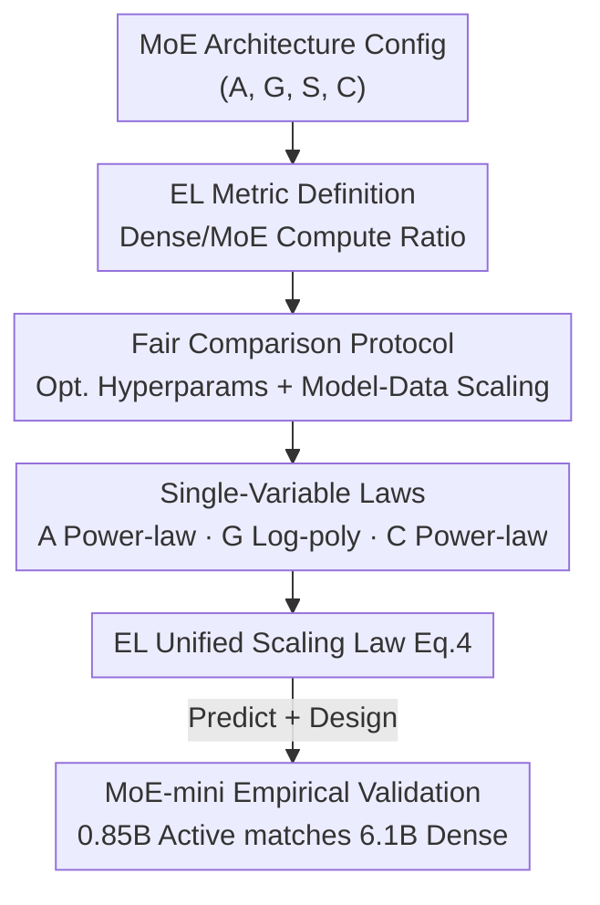

# Towards Greater Leverage: Scaling Laws for Efficient Mixture-of-Experts Language Models

**Conference**: ICLR 2026  
**OpenReview**: [https://openreview.net/forum?id=7r2lkhDGUj](https://openreview.net/forum?id=7r2lkhDGUj)  
**Area**: LLM Efficiency  
**Keywords**: MoE, Scaling Laws, Efficiency Leverage, Activation Rate, Expert Granularity  

## TL;DR
This paper introduces "Efficiency Leverage" (EL) to quantify the compute savings of MoE relative to dense models. By training 300+ MoE models up to 28B parameters, the authors fit a unified scaling law using activation rate, expert granularity, and compute budget as variables. Based on this, they design MoE-mini with only 0.85B active parameters, which matches a 6.1B dense model using 7x less compute.

## Background & Motivation

**Background**: MoE has become a mainstream architecture for efficient LLM scaling. It decouples "total parameters" from "computational cost (FLOPs)" through sparse activation. For example, DeepSeekMoE has 16B total parameters but activates only 2.8B per token, achieving performance comparable to a 7B dense model with approximately 2.5x parameter efficiency.

**Limitations of Prior Work**: This decoupling introduces a difficult problem—**given an MoE configuration (activation rate, granularity, etc.), it is impossible to predict its "effective capacity" before pre-training**. Neither total nor active parameter counts serve as reliable performance proxies; researchers cannot predict which dense model size an MoE configuration will match or set reasonable expectations before expensive training.

**Key Challenge**: While scaling laws are powerful for predicting language model performance, their application to MoE is fragmented. Prior work often isolates single architectural factors (sparsity *or* granularity) without answering **how these factors jointly determine the real compute advantage of MoE relative to dense models**. Traditional loss-centric scaling laws predict "what the loss will be," whereas practitioners want to know "how many times more efficient this MoE is compared to a dense model."

**Goal**: Establish a framework to predict the compute advantage of any MoE configuration before training and use it to guide efficient model design.

**Key Insight**: Instead of predicting absolute loss (which is dataset-dependent and hard to interpret), define a **ratio-based metric**—the multiple of compute a dense model requires to match the MoE. This perspective is direct, transferable, and naturally suited for architecture selection.

**Core Idea**: Define Efficiency Leverage $EL = \text{Compute}_{\text{Dense}} / \text{Compute}_{\text{MoE}}$. Decompose EL as a function of activation rate (power-law dominant term), granularity (log-polynomial modulation term), and compute budget (power-law amplification term) to fit a unified scaling law.

## Method

### Overall Architecture

The paper aims to predict the compute advantage of MoE configurations before training via a **three-stage** approach: establish **fair training conditions** (ensuring valid comparisons), **isolate dimensions** to determine the impact of activation rate/granularity/sharing on EL for single-variable laws, and finally **synthesize them into a unified scaling law (Eq. 4)** to predict EL for any configuration and design MoE-mini for empirical validation.

The core of this process is the EL "ruler": for an architecture $X$, its optimal loss relative to compute is modeled as a power law $L_X(C) = \alpha_X C^{\beta_X} + b_X$. Taking the loss achieved by an MoE under its budget $C_{\text{MoE}}$ as the target loss $L^\star$, the equivalent dense compute $C_{\text{Dense}}$ is solved to find:

$$\text{EL}(X_{\text{MoE}} \mid X_{\text{Dense}}; C_{\text{MoE}}) = \frac{C_{\text{Dense}}}{C_{\text{MoE}}}.$$

An EL=5 means the MoE is equivalent to a dense model trained with 5x the compute.

### Key Designs

**1. Efficiency Leverage (EL): Making "Compute Savings" a Comparable Scalar**

To address the inability to predict MoE's effective capacity, the paper avoids absolute loss prediction in favor of EL. Formally, it is the **ratio of compute budgets required by a dense model and an MoE to reach the same target loss**. To keep EL dependent only on the architecture, the target loss is set as the MoE's own loss at its budget $L^\star = L_{X_{\text{MoE}}}(C_{\text{MoE}})$, simplifying EL to $C_{\text{Dense}}/C_{\text{MoE}}$. This provides two benefits: first, EL is a dimensionless multiple that is naturally comparable across datasets; second, when $A=1$ (dense), EL=1, providing a physical anchor point.

**2. Fair Comparison Protocol: Calibrating Hyperparameters and Data Allocation**

Comparisons are only valid if architectures use optimal hyperparameters. The authors fit two preliminary scaling laws. **Optimal Hyperparameter Scaling Law**: Large-scale searches revealed that MoE prefers **significantly larger batch sizes** and **slightly lower learning rates** as compute increases, due to sparse backpropagation. **Optimal Model-Data Allocation Law**: For a fixed FLOPs budget $C = M \cdot D$, MoE follows an exponent near 0.5 (consistent with Chinchilla), but **optimal MoEs are smaller and consume more data than optimal dense models** at the same budget. Every test architecture is set near its optimal point and trained for 3x the optimal tokens (simulating an overtrained state) to ensure fairness.

**3. Three Single-Variable Scaling Laws: Isolating A, G, and C**

**Activation Rate $A$ (Dominant Term, Power-law)**: Reducing the activation rate (increasing sparsity) consistently yields efficiency gains without an observed floor (tested down to 1/128 ≈ 0.8%). The fit is:
$$\log \text{EL}_{C,G}(\hat A) = a_A \log \hat A, \qquad \frac{1}{\hat A} = \frac{1}{A + (1/A_{\text{start}} - 1/A_{\text{max}})^{-1}} + \frac{1}{A_{\text{max}}},$$
where the exponent $a_A$ increases as $A$ decreases and as compute $C$ increases. **Expert Granularity $G$ (Modulation Term, Log-poly)**: $G = 2d_{\text{model}}/d_{\text{expert}}$. Loss follows a U-shape relative to $G$, with an optimum around 8–12 under standard load-balancing. It is modeled as:
$$\log \text{EL}_{C,A}(G) = a_G + b_G\big(\log G\,(\log G + c_G)\big).$$
Crucially, this curve is consistent across compute budgets. **Compute Budget $C$ (Amplification Term, Power-law)**: EL increases with compute for fixed $A$ and $G$, following $\log \text{EL}_{A,G}(C) = a_C \log C + c_C$, meaning MoE's advantage amplifies at larger scales.

**4. EL Unified Scaling Law: A Single Formula for Three Effects**

The variables are synthesized into a unified formula:
$$\text{EL}(A, G, C) = \hat A^{\,\alpha + \gamma(\log G)^2 + \beta \log G}, \qquad \alpha = a + d\log C.$$
Here, $\alpha$ captures the "activation power-law × compute amplification," while $\beta$ and $\gamma$ model the non-linear modulation of granularity. Fitted using Huber loss + BFGS on points with EL<6, the model achieved $R^2 = 0.9858$ and demonstrated strong **extrapolation** to high-leverage points. At 1e22 FLOPs, a configuration with 3.1% activation and granularity 12 is predicted to exceed 7x EL.

## Key Experimental Results

### Main Results: MoE-mini vs. Dense-6.1B
MoE-mini was designed via the scaling law (Total 17.5B, Active 0.85B, $G=12$, $A=3.4\%$) and compared to Dense-6.1B on **1T high-quality tokens**. MoE-mini uses only 13% of the active parameters and is 7x more efficient in training/inference.

| Model | General/Reasoning | Professional | Language | Code | Math | Avg |
|------|------|------|------|------|------|------|
| Dense-6.1B | 55.8 | 44.0 | 69.2 | 36.9 | 32.9 | 44.0 |
| Ours (MoE-mini) | 56.2 | 44.7 | 71.6 | 39.8 | 34.7 | **45.5** |

MoE-mini outperformed Dense-6.1B with an average of 45.5 vs 44.0, with notable gains in Code and Math, validating the predicted >7x Efficiency Leverage.

### Ablation Study

| Architecture Dimension | Relationship to Loss/EL | Finding |
|------|------|------|
| Activation Rate $A$ | Power law, EL increases as $A$ drops | Primary driver; no Pareto floor observed down to 0.8% |
| Granularity $G$ | U-shape (Log-poly) | Sweet spot around 8–12, consistent across scales |
| Shared Ratio $S$ | U-shape | "One shared expert" is most efficient at scale |
| Compute $C$ | Power law | MoE advantage amplifies as budget increases |

## Highlights & Insights
- **EL as a Predictable Scalar**: Shifting from loss-centric to ratio-centric scaling laws makes architecture selection a direct comparison of multiples, which is highly practical for engineering.
- **Extrapolation Verification**: Training on EL<6 and validating on EL≥6 rigorously tests the law's predictive power for high-leverage configurations.
- **Protocol Discipline**: Fitting preliminary laws for hyperparameters and data allocation ensures that architectural comparisons are made at near-optimal points, avoiding the "tuning bias" trap.
- **"Small yet Strong" Paradigm**: Achieving 6.1B-dense performance with 0.85B active parameters provides a recipe for teams with limited compute but abundant data.

## Limitations & Future Work
- **Theoretical FLOPs focus**: The study ignores wall-clock overheads like communication, memory, and kernel efficiency, providing a theoretical upper bound.
- **Independence Assumption**: The model assumes factors are independent for analytical simplicity, potentially missing complex interactions.
- **Unified Hyperparameter Law**: Future work could involve "sparsity-aware" hyperparameter laws to further optimize efficiency.
- **Observation**: The finding that activation has "no floor" is relative to the 0.8% limit tested; extreme sparsity might behave differently under different routing quality.

## Related Work & Insights
- **vs. Isolated Studies (Clark et al. 2022; Ludziejewski et al. 2024)**: This work unifies factors into a joint law and updates granularity definitions to align with modern models like DeepSeek.
- **vs. Loss-centric Laws (Kaplan et al. 2020; Chinchilla)**: While traditional laws predict "what," EL predicts "how much better," though an MoE version of the Chinchilla model-data tradeoff is still needed.
- **vs. DeepSeekMoE**: While DeepSeek provides excellent single-point configurations, this work provides a continuous, predictable design map (EL contours at various FLOPs).

## Rating
- Novelty: ⭐⭐⭐⭐⭐ Reframing efficiency as a predictable EL metric is both novel and practical.
- Experimental Thoroughness: ⭐⭐⭐⭐⭐ 300+ models, 680k H800-hours, and end-to-end validation.
- Writing Quality: ⭐⭐⭐⭐ Clear three-stage methodology and effective visualizations.
- Value: ⭐⭐⭐⭐⭐ Provides a concrete formula and design recipe for efficient MoE.

<!-- RELATED:START -->

## Related Papers

- [\[ICLR 2026\] Scaling Laws Meet Model Architecture: Toward Inference-Efficient LLMs](scaling_laws_meet_model_architecture_toward_inference-efficient_llms.md)
- [\[ICLR 2026\] UltraLLaDA: Scaling the Context Length to 128K for Diffusion Large Language Models](ultrallada_scaling_the_context_length_to_128k_for_diffusion_large_language_model.md)
- [\[ICLR 2026\] xLSTM Scaling Laws: Competitive Performance with Linear Time-Complexity](xlstm_scaling_laws_competitive_performance_with_linear_time-complexity.md)
- [\[ICLR 2026\] Fast Catch-Up, Late Switching: Optimal Batch Size Scheduling via Functional Scaling Laws](fast_catch-up_late_switching_optimal_batch_size_scheduling_via_functional_scalin.md)
- [\[ICLR 2026\] Mixture-of-Experts Can Surpass Dense LLMs Under Strictly Equal Resource](mixture-of-experts_can_surpass_dense_llms_under_strictly_equal_resource.md)

<!-- RELATED:END -->
