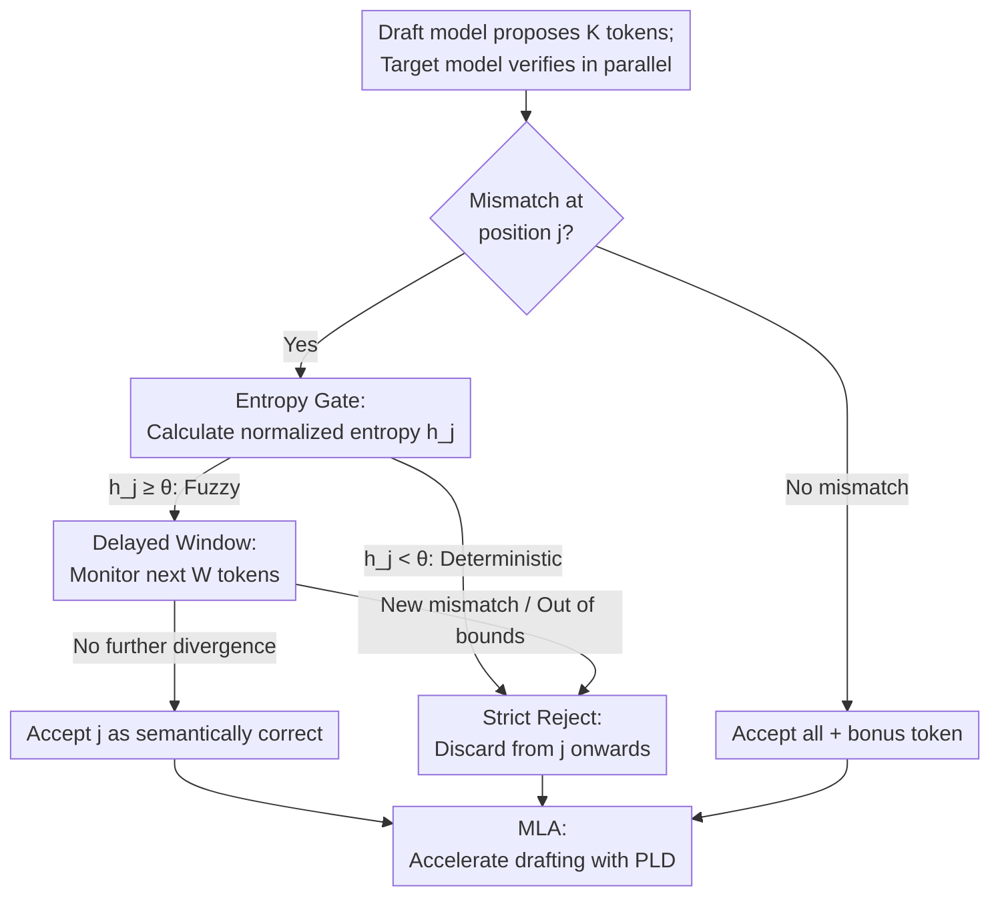

# Training-Free Loosely Speculative Decoding: Accepting Semantically Correct Drafts Beyond Exact Match

**Conference**: ICLR 2026  
**OpenReview**: [https://openreview.net/forum?id=JjoTg34YiU](https://openreview.net/forum?id=JjoTg34YiU)  
**Code**: https://github.com/AMD-AGI/FLy  
**Area**: LLM Efficiency  
**Keywords**: Speculative Decoding, Loose Verification, Entropy Gating, Self-Correction, Training-Free

## TL;DR
Addressing the issue where standard Speculative Decoding (SPD) "exact match" rules prematurely reject semantically correct drafts, FLy utilizes the target model's own entropy and "self-correction" behavior to accept tokens that differ in phrasing but are semantically equivalent without any training. While maintaining $\ge 99\%$ accuracy, it accelerates Llama-3.1-70B by 2.81× and 405B by 5.07× on average, outperforming the training-based EAGLE-3 by 1.62× on out-of-distribution (OOD) tasks.

## Background & Motivation

**Background**: Speculative Decoding (SPD) is a mainstream method for accelerating LLM inference. It involves a lightweight draft model proposing multiple candidate tokens sequentially, which are then verified in parallel by a large target model to accept those consistent with its own predictions. It mathematically guarantees no change to the output distribution while significantly improving throughput.

**Limitations of Prior Work**: The verification rule in standard SPD is "exact match"—a draft token is accepted only if it matches the target model's argmax at that position; otherwise, all subsequent tokens are discarded. This rigid rule falsely rejects many continuations that are "differently phrased but semantically correct." Research (Bachmann et al., 2025) has found that even high-quality drafts (such as human-written text) have low acceptance rates under these rules. As draft models become stronger, the "word-for-word" bottleneck becomes more pronounced.

**Key Challenge**: To relax verification, one must distinguish whether a "draft-target mismatch" is a genuine error or just an alternative phrasing. Representative loose schemes like JudgeDecoding train an auxiliary classifier to judge token validity, which works well but requires carefully labeled training data and generalizes poorly to OOD tasks—often failing when the task distribution shifts. Thus, a conflict exists between "looseness" and "robustness/low cost."

**Goal**: To enable the verifier to accept semantically correct but inconsistent drafts without training any extra modules or collecting data, while remaining naturally robust to distribution shifts.

**Key Insight**: The authors observe a critical property: when an LLM is fed a **truly incorrect** token, it exhibits "self-corrective" behavior in subsequent generation to rectify the context. Conversely, when facing a **different but semantically equivalent** token, it continues smoothly without divergence. This property originates from the target model itself, requiring no external judge.

**Core Idea**: Replacing external classifiers with the target model's own "entropy + subsequent self-correction," a two-stage decision process is used: entropy gating first identifies positions where multiple reasonable candidates are possible, and a delayed window then observes if the target model continues to diverge in following steps to accept semantically correct drafts without training.

## Method

### Overall Architecture

FLy only modifies the **verification strategy** of SPD without altering the draft/target models, making it plug-and-play and model-agnostic. In one SPD round, the draft model proposes $K$ tokens, validated in parallel by the target model. While standard SPD truncates at the first mismatch, FLy uses **entropy gating** at each mismatch position $j$ to determine if the position is inherently "fuzzy." For deterministic positions (e.g., specific digits in arithmetic), it follows strict rejection; for fuzzy positions, it enters a **delayed window** to monitor divergence for the next $W$ tokens. Since more semantically correct tokens are accepted, the average acceptance length $\tau$ increases significantly, making the drafting phase the new bottleneck. FLy addresses this with **Multi-Level Acceleration (MLA)** using parameter-free PLD to speed up drafting.

The decision process follows a serial-filter pipeline across mismatch positions, taking the earliest rejected position:

### Key Designs

**1. Entropy Gate: Filtering "Black and White" Positions via Target Uncertainty**

Relaxing verification across all mismatches is dangerous—positions like digits in arithmetic have only one correct answer. Entropy gating blocks such positions. For each mismatch $j$, FLy calculates a normalized entropy using the target model's existing logits $p_{M_T,j}$:

$$h_j = \frac{-\sum_{v\in V} p_{M_T,j}(v)\log p_{M_T,j}(v)}{\log |V|} \in [0,1]$$

A high $h_j$ indicates multiple tokens are nearly interchangeable (e.g., synonymous pronouns), while a low $h_j$ indicates a strong preference for the top-1 (e.g., math constants). The gate uses a threshold $\theta$: if $h_j < \theta$, it is `Strict` (reject from $j$ onwards); if $h_j \ge \theta$, it is `Defer` (delaying the decision). This step is computationally negligible (approx. 0.45–0.57ms per round) as it only reads pre-calculated logits.

**2. Delayed Window: Judging Semantic Correctness via Self-Correction**

High entropy only suggests multiple candidates are possible; actual semantic correctness still needs validation. FLy monitors a window of length $W$ after a `Defer` mismatch $j$, counting subsequent mismatches $N_W(j)=\sum_{i=j+1}^{j+W}(1-\Delta_i)$. The rule is:

$$\text{DeferDecide}(j)=\begin{cases}\text{Accept}, & h_j\ge\theta,\; N_W(j)=0,\; j+W\le K\\ \text{Reject}, & \text{otherwise}\end{cases}$$

If no further divergence occurs within $W$ tokens ($N_W(j)=0$), the target model is deemed to have accepted the continuation, and the first mismatch is accepted. If a new mismatch appears, the model is "correcting" itself, and position $j$ is rejected. If $j+W>K$, it conservatively rejects.

**3. Multi-Level Acceleration (MLA): Reducing Drafting Overhead**

As $\tau$ increases significantly, $K$ must increase, making draft generation a bottleneck. Standard SPD cannot address this. MLA applies **another layer of speculative acceleration** to the drafting phase. To maintain the "training-free" niche, FLy uses Prompt Lookup Decoding (PLD), a parameter-free n-gram retrieval method, to speed up the draft model without introducing model bias.

## Key Experimental Results

Models: Llama-3.1-8B-Instruct (Draft), Llama-3.1-70B / 405B-Instruct (Target). Baselines: EAGLE-2/3 (training-based), SpS, REST, TokenRecycling (training-free). $W=6$, $\theta=0.3$, $K$ up to $25$. Hardware: AMD MI355X.

### Main Results (OOD Speedup, T=0)

| Target Model | Method | Training | ACP-prog | NIAH-multi | MGSM (Avg) | Mean Speedup | Mean τ |
| :--- | :--- | :--- | :--- | :--- | :--- | :--- | :--- |
| Llama-3.3-70B | EAGLE-3 | ✓ | 1.52× | 2.15× | ~1.5× | 1.56× | 2.50 |
| Llama-3.3-70B | **FLy** | ✗ | 1.88× | 3.34× | ~2.5× | **2.53×** | **11.35** |
| Llama-3.1-70B | SpS | ✗ | 1.69× | 3.33× | ~1.7× | 2.04× | 10.91 |
| Llama-3.1-70B | **FLy** | ✗ | 2.02× | 3.57× | ~2.7× | **2.74×** | **12.41** |
| Llama-3.1-405B | **FLy** | ✗ | 2.72× | 4.07× | ~5× | **4.80×** | 17.13 |

On OOD tasks, EAGLE-3 degrades significantly. FLy outperforms EAGLE-3 by 1.62× (T=0) using Llama-3.3-70B. The advantage scales with model size, reaching 4.80× on 405B.

### Main Results (ID Speedup, T=0)

| Target Model | Method | Training | GSM8K | HumanEval | MBPP | Mean Speedup | Mean τ |
| :--- | :--- | :--- | :--- | :--- | :--- | :--- | :--- |
| Llama-3-70B | EAGLE-2 | ✓ | 2.54× | 2.56× | 2.61× | 2.57× | 3.96 |
| Llama-3-70B | **FLy** | ✗ | 2.94× | 2.60× | 2.53× | **2.69×** | **11.87** |
| Llama-3.3-70B | EAGLE-3 | ✓ | 3.72× | 3.97× | 3.80× | 3.83× | 5.61 |
| Llama-3.1-405B | **FLy** | ✗ | 4.61× | 5.15× | 6.26× | **5.34×** | 17.14 |

FLy 70B outperforms EAGLE-2 in ID tasks. While slightly behind the highly optimized EAGLE-3, it reaches 5.34× on 405B where training-based methods are often unavailable due to cost. Recovery remains $>99\%$.

### Ablation Study

| Configuration | Speedup | τ | Recovery (%) | Note |
| :--- | :--- | :--- | :--- | :--- |
| W=0 (Window disabled) | 3.42× | 15.59 | 93.7 | Aggressive, low accuracy |
| W=4 | 2.91× | 13.27 | 97.9 | Fast, slight accuracy loss |
| **W=6 (Default)** | 2.86× | 12.61 | 100 | Perfect recovery |
| θ=0 (Gate disabled) | 2.98× | 12.76 | 97.7 | Accuracy drop in deterministic contexts |
| **θ=0.3 (Default)** | 2.86× | 12.61 | 100 | Optimal balance |
| w/o MLA | 2.69× | — | — | Target only acceleration |
| **w/ MLA** | 2.86× | — | — | Full pipeline acceleration |

### Key Findings
- **Window vs. Gate Balance**: $W$ controls the "aggressiveness" of acceptance, while $\theta$ controls "which positions" are allowed to be loose. Both are essential for maintaining 100% recovery.
- **K Sweet Spot**: $\tau$ increases with $K$, but speedup peaks and then drops due to the cost of unaccepted draft tokens; $K=15$ is optimal for 70B, while $K=25$ is better for 405B.
- **Cross-Model Portability**: Combinations like Qwen2.5-Coder and Mistral-Large achieve 1.85×–3.54× speedup with $>99\%$ recovery without retraining.

## Highlights & Insights
- **Internalizing the "Judge"**: By moving the judgment logic into the target model via "entropy + self-correction," FLy removes the need for external models and labeled data, gaining natural OOD robustness.
- **Zero-overhead logic**: Gating logic uses existing logits, and the decision logic adds $<0.6$ms per round.
- **Fixing the Loose-Verification Side Effect**: Recognizing that higher $\tau$ creates a draft-side bottleneck, the authors mitigate this with parameter-free MLA.
- **Generalizable Signal**: The idea of using a model's subsequent self-correction to validate previous outputs could be applied to hallucination detection or self-consistency checks.

## Limitations & Future Work
- **Conservative Boundary Rules**: The constraint $j+W \le K$ means the last few draft tokens cannot benefit from loose verification, limiting gains for very long sequences.
- **Self-Correction Assumption**: If a model is so misled by a wrong token that it continues "smoothly" (e.g., in highly ambiguous contexts), the window might misjudge the error.
- **Empirical Hyperparameters**: While $W=6$ and $\theta=0.3$ work across experiments, their optimality lacks a rigorous theoretical proof.
- **Near-Lossless, Not Lossless**: Since outputs are not word-for-word identical to the target model, it is not suitable for applications requiring strict distribution identity.

## Related Work & Insights
- **Standard SPD**: Guaranteed lossless but limited by $\tau$. FLy trades strict losslessness for much higher $\tau$ and speedup.
- **JudgeDecoding**: Requires training and is fragile in OOD. FLy is training-free and OOD-robust.
- **EAGLE-2/3**: Strong in ID but degrades in OOD and is costly to train for 405B+ models. FLy provides a scalable and robust alternative.

## Rating
- Novelty: ⭐⭐⭐⭐⭐ 
- Experimental Thoroughness: ⭐⭐⭐⭐⭐ 
- Writing Quality: ⭐⭐⭐⭐ 
- Value: ⭐⭐⭐⭐⭐ 

<!-- RELATED:START -->

## Related Papers

- [\[ICLR 2026\] Hierarchy Decoding: A Training-free Parallel Decoding Strategy for Diffusion Large Language Models](hierarchy_decoding_a_training-free_parallel_decoding_strategy_for_diffusion_larg.md)
- [\[ICLR 2026\] Speculative Speculative Decoding](speculative_speculative_decoding.md)
- [\[ICLR 2026\] Beyond Fixed: Training-Free Variable-Length Denoising for Diffusion Large Language Models](beyond_fixed_training-free_variable-length_denoising_for_diffusion_large_languag.md)
- [\[ICLR 2026\] RepSpec: Structural Re-parameterized Draft Model Training for Speculative Decoding](repspec_structural_re-parameterized_draft_model_training_for_speculative_decodin.md)
- [\[ICLR 2026\] Fast-dLLM: Training-free Acceleration of Diffusion LLM by Enabling KV Cache and Parallel Decoding](fast-dllm_training-free_acceleration_of_diffusion_llm_by_enabling_kv_cache_and_p.md)

<!-- RELATED:END -->
## Related Papers

- [\[ICLR 2026\] Beyond Fixed: Training-Free Variable-Length Denoising for Diffusion Large Language Models](beyond_fixed_training-free_variable-length_denoising_for_diffusion_large_languag.md)
- [\[ICLR 2026\] Hierarchy Decoding: A Training-free Parallel Decoding Strategy for Diffusion Large Language Models](hierarchy_decoding_a_training-free_parallel_decoding_strategy_for_diffusion_larg.md)
- [\[ICLR 2026\] RepSpec: Structural Re-parameterized Draft Model Training for Speculative Decoding](repspec_structural_re-parameterized_draft_model_training_for_speculative_decodin.md)
- [\[ICLR 2026\] SpecBranch: Speculative Decoding via Hybrid Drafting and Rollback-Aware Branch Parallelism](specbranch_speculative_decoding_via_hybrid_drafting_and_rollback-aware_branch_pa.md)
- [\[ICLR 2026\] Command-V: Training-Free Representation Finetuning Transfer](command-v_training-free_representation_finetuning_transfer.md)

<!-- RELATED:END -->
