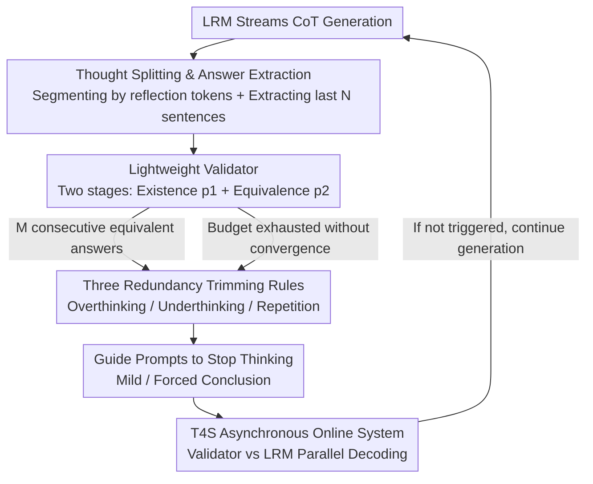

# TrimR: Validator-based, Training-free Thinking Trimming for Efficient Test-time Scaling

**Conference**: ICLR 2026  
**OpenReview**: [https://openreview.net/forum?id=ofEkphaqg7](https://openreview.net/forum?id=ofEkphaqg7)  
**Code**: None  
**Area**: LLM Efficiency  
**Keywords**: Large Reasoning Models, Test-time Scaling, Thinking Trimming, Overthinking, Online Inference Systems

## TL;DR
TrimR utilizes a finetuning-free 7B small validator to real-time detect three types of redundancies—"overthinking / underthinking / repetition"—during the Chain-of-Thought (CoT) generation of Large Reasoning Models (LRMs). By injecting guide prompts to **mildly or forcibly** conclude the reasoning, TrimR reduces the runtime of QwQ-32B, R1-Distill-Qwen-32B, and Pangu-R-38B by up to 70% on MATH500, AIME24/25, and GPQA, while maintaining near-identical accuracy (maximum drop of 1.7%).

## Background & Motivation

**Background**: Large Reasoning Models (LRMs) like OpenAI o1, DeepSeek-R1, and QwQ achieve expert-level performance in math and science by lengthening the Chain-of-Thought (CoT) for step-by-step analysis, self-correction, and exploration. Test-time scaling further approaches the accuracy upper bound through token-level exploration during decoding, but at the cost of massive computational overhead—runtime grows **super-linearly** with sequence length, making deployment expensive.

**Limitations of Prior Work**: The authors observed two structural inefficiencies in LRMs on AIME24 and MATH500. First, **overthinking**: models often reach the correct answer using only 30-50% of the tokens but continue with repetitive verification and redundant re-derivations (e.g., using "Wait" or "Alternatively"), increasing length without improving accuracy. Second, **underthinking**: on difficult problems, models oscillate between multiple incomplete reasoning chains without converging, producing long yet incorrect answers (QwQ can output up to 140 segments of redundant, erroneous thinking). Additionally, token-level **repetitive loops** occur and cannot be suppressed even by increasing temperature.

**Key Challenge**: existing token-saving solutions have significant drawbacks. Training-based methods (RL with length rewards, SFT compression, latent reasoning) require retraining large models, which is computationally expensive, prone to task-specific overfitting, and may damage general capabilities. Training-free methods (TokenBudget for dynamic budgeting, Chain of Draft for concise instructions) are often **intrusive** to reasoning behavior. Approaches relying on PRM/ORM reward models to score entire long sequences suffer from instability and high overhead due to processing 8K–128K tokens. In short: a solution that is efficient, training-free, non-intrusive, and suitable for industrial-scale batch online services has been missing.

**Goal**: Design a **training-free, non-intrusive, and batch-deployable** thinking trimming framework to address both overthinking and underthinking, enabling fast test-time scaling without accuracy loss.

**Key Insight**: LRM reasoning can be viewed as "numerical optimization in language space"—humans stop once an answer is found for simple problems or give up after multiple failures for hard ones; numerical optimizers stop upon convergence or when marginal gains fall below a threshold. Thus, a "validator" can determine if reasoning has converged to provide a safe stopping moment $t'$, minimizing inference cost $\text{Infer\_Cost}(y_{<t'})$ under the constraint $\text{Perf}(X, y_{<t'}\mid\Pi)\ge\text{Perf}(X, y_{<t}\mid\Pi)$.

**Core Idea**: Use a **finetuning-free lightweight instruction model as a validator** to simplify the hard task of "redundancy detection" into two simple binary classifications: "Presence of Answer" and "Equivalence between Adjacent Answers." Once convergence or divergence is identified, prompts are used to stop the LRM early—requiring no retraining of either the LRM or the validator.

## Method

### Overall Architecture
TrimR runs a trimming system in parallel with the LRM's online CoT generation. Whenever the LRM outputs a reflection token, the system splits current thinking into sub-thoughts and extracts "intermediate answers" for a 7B small validator. The validator answers two questions: does this segment provide an answer, and are adjacent answers equivalent? Based on this, three trimming decisions are triggered (overthinking early stop, underthinking forced conclusion, repetition truncation). Finally, the LRM is guided to stop or summarize via "guide prompts." The detection and intervention are executed in an asynchronous online system (T4S), ensuring no blockage of LRM decoding.

### Key Designs

**1. Thought Splitting and Intermediate Answer Extraction: Breaking long CoT into verifiable units**

To allow a small model to frequently judge whether to stop, it must avoid reading the entire 8K–128K token sequence. The authors leverage the structural patterns of LRM CoTs: thoughts are almost always separated by reflection tokens (e.g., `\n\nWait`, `\n\nBut`, `\n\nAlternatively`), and models typically provide an answer at the end of a thought segment. The system splits the CoT into sub-thoughts $\text{Think\_Seg}(y_{<t})=[r_1, r_2, \dots, r_k]$ and takes only the **last $N_{\text{sent}}$ sentences** of each segment as the intermediate answer $s_l=\text{Last\_sentences}(r_l, N_{\text{sent}})$. This step is **asynchronous**; since reflection tokens represent only about 0.5% of the total output and thought segments are fewer than tokens, the validator is called sparsely, allowing it to serve multiple LRMs without throttling throughput.

**2. Two-stage Verification: 7B Instruction Model as a Binary Classifier for Existence and Equivalence**

This is the core of TrimR’s training-free nature. Instead of complex PRM/ORM models, detection is split into two binary tasks. Stage 1 (**Answer Existence Check**): prompts $p_1$ are used to judge if a segment $s_i$ contains a solution, retaining a set of concluded thoughts $S^* = \{ s_i \mid F_v(p_1(s_i)) \}$. Stage 2 (**Equivalence Check**): prompts $p_2$ judge if adjacent answers in $S^*$ are mathematically/logically equivalent, $r(s^*_i, s^*_{i+1}) = F_v\big(p_2(s^*_i, s^*_{i+1})\big)$. The validator only calculates probabilities for "Yes/No" tokens (prefill only), avoiding decoding overhead. Combined with KV cache reuse for system prompts/questions and batching of answer triplets, input is compressed to 200–400 tokens, significantly reducing memory and compute compared to PRM/ORM.

**3. Trimming Rules for Overthinking / Underthinking / Repetition: Unified Signal, Three Conditions**

**Overthinking Trimming** (Algorithm 1) mimics optimizer convergence: a counter increments when a new answer is equivalent to the previous one and resets otherwise. When the count reaches threshold $M$ (e.g., $M=2$, meaning $M+1$ consistent solutions), convergence is declared. **Underthinking Trimming** (Algorithm 2) targets hard problems: if $R_{\text{thres}}\%$ of the token budget is used or $N_{\text{thres}}$ segments are generated without yielding at least three consistent answers, the model is forced to stop and summarize. **Repetition Truncation** uses rolling hashes to detect repetitive token-ID sub-sequences in real-time.

**4. Non-intrusive Guide Prompts + T4S Asynchronous Online System: Gentle/Forced ending without blocking decoder**

Intervention is achieved via **guide prompts** rather than weight modification. **Mild Prompts** guide the model toward `**Final Answer**\n` for overthinking; **Forced Prompts** interrupt before `</think>` for underthinking and loops. These are hosted on **T4S (Test-Time Thinking Trimming System)**, built on vLLM, consisting of a Reasoning Verifier, Message Controller, and Sampling Controller. Verification and LRM decoding run in **parallel**, making the overhead negligible under large-batch online loads on Ascend NPUs.

### Loss & Training
TrimR is completely **training-free**. It does not finetune the LRM or the validator (defaults to Pangu-7B or Qwen2.5-7B-Instruct using few-shot prompts). Key hyperparameters: $M=2$ (equivalence threshold), $N_{\text{send}}=50$ (communication interval), and fixed I/O lengths (2K/30K tokens).

## Key Experimental Results

### Main Results
On 8×Ascend 910B-64GB NPUs with vLLM, total runtime and per-request latency were recorded. Metrics include Runtime (total wall-clock), TPR (average time per request), #Tokens (millions), and Acc. (accuracy).

| Model / Dataset | Runtime | TPR | Acc. | #Tokens |
|--------|------|------|------|------|
| R1Q-32B / MATH500 | 7602s → 2511s (**-67.0%**) | -56.9% | 92.4% (+2.0%) | -40.1% |
| R1Q-32B / GPQA Diamond | 11366s → 3411s (**-70.0%**) | -74.7% | 58.6% (**+13.2%**) | -46.1% |
| R1Q-32B / AIME25 | 13055s → 6169s (-52.7%) | -65.3% | 56.3% (+8.4%) | -38.1% |
| QwQ-32B / MATH500 | 4413s → 3118s (-29.3%) | -15.7% | 96.8% (+1.2%) | -14.3% |
| QwQ-32B / AIME24 | 6992s → 4255s (-39.1%) | -35.5% | 76.6% (±0%) | -23.3% |
| Pangu-R-38B / MATH500 | 3665s → 2426s (-33.8%) | -17.8% | 94.4% (-1.2%) | -18.9% |

All models across four benchmarks achieved stable efficiency gains (up to -70% runtime) with minimal accuracy impact (mostly parity or improvement). R1Q-32B benefited most due to its frequent self-verification.

Comparison with concurrent baselines (Relative accuracy change / token reduction):

| Model / Method | MATH500 Acc. | MATH500 #Tok. | AIME24 Acc. | AIME24 #Tok. |
|------|------|------|------|------|
| R1Q-32B / Certaindex | -4.0% | -19.0% | -4.0% | -15.0% |
| R1Q-32B / CoThink | -2.0% | -36.6% | **-13.3%** | -12.5% |
| R1Q-32B / SpeedAdapt | +0.7% | -7.3% | +1.5% | -12.7% |
| R1Q-32B / **TrimR** | **+2.4%** | **-40.1%** | **+3.3%** | **-35.6%** |

TrimR achieves the best balance between token savings and accuracy preservation.

### Ablation Study

| Configuration (R1Q-32B / MATH500) | TPR | #Tokens | Accuracy |
|------|---------|------|------|
| baseline | - | - | 90.4% |
| w/ Overthinking Trimming only | -43.5% | -28.1% | 91.6% |
| w/ Underthinking Trimming only | -41.4% | -25.0% | 92.8% |
| w/ both (Full) | **-56.9%** | **-40.1%** | 92.4% |

### Key Findings
- **Complementary trimming rules**: Overthinking and underthinking rules each provide ~41-44% TPR reduction; together they reach -56.9%, proving they target distinct redundancies.
- **Higher redundancy yields higher gain**: R1Q-32B, which employs heavy self-verification, showed the highest gains (GPQA -70% runtime).
- **Trimming can improve accuracy**: On GPQA, R1Q-32B's accuracy rose from 45.4% to 58.6% (+13.2%), indicating that cutting divergent "underthinking" chains prevents the model from "thinking itself into an error."
- **Robustness to validator selection**: Performance remains consistent across different 7B validators (Pangu vs. Qwen).
- **Distribution shift**: On QwQ-32B, samples in the 0-5K token range increased, while the 20-32K heavy-tail samples significantly decreased.

## Highlights & Insights
- **Simplifying redundancy detection into two binary classifications** is the most ingenious step: using "existence + equivalence" instead of continuous PRM/ORM scores allows small 7B models to handle the task stably.
- **Prefill-only verification + Prefix Caching + Batching** allows verification overhead to be nearly zeroed out, which is critical for industrial-scale deployment.
- **Unified view of over/underthinking**: Using the same signals with opposing stopping conditions (convergence vs. persistent divergence) treats reasoning as an optimization problem.
- **Non-intrusive**: Since intervention only activates upon redundancy detection via prompts, the original model's reasoning capabilities are preserved.

## Limitations & Future Work
- The method heavily relies on LRM CoT structure (reflection tokens and "answer-at-end" segments); it may fail for models without these patterns.
- Evaluation is biased toward math and science; effectiveness on open-domain dialogue or tasks where "equivalence" is hard to define remains unknown.
- Thresholds for $M$, $R_{\text{thres}}$, and $N_{\text{thres}}$ require calibration per model/task.
- Introducing an external validator adds system complexity compared to pure prompt-based methods, and gains depend on the underlying hardware's asynchronous capabilities.

## Related Work & Insights
- **vs. Training-based Efficient Inference**: TrimR is training-free and non-intrusive, avoiding the risk of damaging general capabilities at the cost of running a small external validator.
- **vs. PRM/ORM Early Stopping**: TrimR replaces continuous scoring with stable binary classifications, reducing sensitive budget dependencies.
- **vs. Self-evaluation (SelfThink, etc.)**: These increase latency by adding steps to the LRM's main chain; TrimR uses an external validator asynchronously to maintain LRM throughput.

## Rating
- Novelty: ⭐⭐⭐⭐
- Experimental Thoroughness: ⭐⭐⭐⭐
- Writing Quality: ⭐⭐⭐⭐
- Value: ⭐⭐⭐⭐⭐

<!-- RELATED:START -->

## Related Papers

- [\[ICLR 2026\] Scaling Up, Speeding Up: A Benchmark of Speculative Decoding for Efficient LLM Test-Time Scaling](scaling_up_speeding_up_a_benchmark_of_speculative_decoding_for_efficient_llm_tes.md)
- [\[ICLR 2026\] Understanding and Improving Length Generalization in Hierarchical Sparse Attention Models](understanding_and_improving_length_generalization_in_hierarchical_sparse_attenti.md)
- [\[ICLR 2026\] FlashDLM: Accelerating Diffusion Language Model Inference via Efficient KV Caching and Guided Diffusion](flashdlm_accelerating_diffusion_language_model_inference_via_efficient_kv_cachin.md)
- [\[ICLR 2026\] On-the-Fly Adaptation to Quantization: Configuration-Aware LoRA for Efficient Fine-Tuning of Quantized LLMs](on-the-fly_adaptation_to_quantization_configuration-aware_lora_for_efficient_fin.md)
- [\[ICLR 2026\] Semantic Parallelism: Redefining Efficient MoE Inference via Model-Data Co-Scheduling](semantic_parallelism_redefining_efficient_moe_inference_via_model-data_co-schedu.md)

<!-- RELATED:END -->
