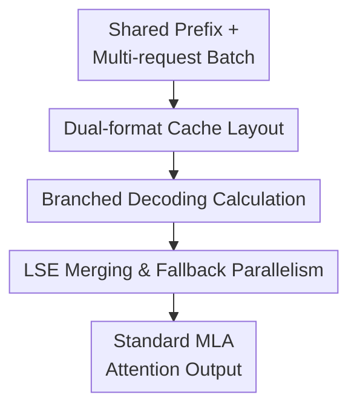

# TyphoonMLA: A Mixed Naive-Absorb MLA Kernel For Shared Prefix

**Conference**: ICLR2026  
**OpenReview**: [https://openreview.net/forum?id=ZfCCwJ4Wcs](https://openreview.net/forum?id=ZfCCwJ4Wcs)  
**Code**: https://github.com/huawei-csl/TyphoonMLA-community  
**Area**: LLM Efficiency  
**Keywords**: MLA Inference, shared prefix, attention kernel, KV-cache, decoding acceleration  

## TL;DR
TyphoonMLA identifies that in shared prefix scenarios, the shared segment of Multi-Head Latent Attention (MLA) decoding is better suited for naive computation, while the non-shared segment remains suitable for absorb computation. By splitting a single attention operation into two kernel paths and merging them via Log-Sum-Exp (LSE), the method achieves up to a $3.24\times$ increase in MLA attention throughput and a $1.48\times$ improvement in end-to-end token generation rate without modifying model precision or requiring retraining.

## Background & Motivation
**Background**: Models such as DeepSeek-v2/v3 and Kimi K2 utilize Multi-Head Latent Attention (MLA) to mitigate the storage and bandwidth pressures of KV-cache. MLA compresses K/V into a low-rank latent space, which is later restored through up-projection. Due to the mathematically reorderable nature of matrix multiplications, an MLA attention operation can be implemented in two equivalent forms: the naive form (commonly used in prefill and training) and the absorb form (commonly used in decoding).

**Limitations of Prior Work**: The naive implementation expands the KV-cache into multi-head K/V, making the attention operator similar to standard MHA. While this approach has low computational complexity and can easily leverage optimizations like FlashAttention, its HBM read/write overhead is high. Conversely, the absorb form incorporates the up-projection into the query and output sides, allowing the KV-cache to remain compressed for low HBM pressure, but it significantly increases calculation load on the query side. Existing MLA decoding kernels primarily opt for the absorb implementation because decoding is typically bottlenecked by HBM bandwidth in single-request or short-context scenarios.

**Key Challenge**: Shared prefixes fundamentally alter the hardware bottleneck. Scenarios involving system prompts, Tree-of-Thought, or multi-candidate speculative decoding result in multiple requests simultaneously attending to the same KV-cache segment. For this shared segment, HBM reads are amortized across multiple queries, meaning the bandwidth cost of the naive form—previously its greatest disadvantage—no longer grows linearly with the batch size. In contrast, the absorb form still requires heavy Multiply-Accumulate (MAC) operations for every query on the shared segment, failing to benefit from data reuse once the process becomes compute-bound.

**Goal**: This paper does not focus on whether MLA saves more cache than MHA, but rather on the granular kernel selection problem. Within a single layer of MLA decoding, the hardware bottlenecks for the shared prefix and the non-shared user context differ. The goal is to select the most appropriate implementation for each segment to exploit the data reuse of shared prefixes without sacrificing the low-bandwidth advantages of MLA in non-shared segments.

**Key Insight**: The authors perform roofline and complexity analysis by partitioning attention into shared prefix and non-shared context segments. The analysis demonstrates that when the batch size is sufficiently large, the naive form requires fewer MACs for the shared segment, while the absorb form maintains much lower HBM read/write for the non-shared segment. Consequently, neither a purely naive nor a purely absorb approach is optimal; instead, both should be hybridized within a single MLA kernel.

**Core Idea**: TyphoonMLA utilizes a dual-format KV-cache layout: the shared prefix is expanded into uncompressed K/V for a naive branch, while the non-shared context retains the latent PE/noPE cache for an absorb branch. The softmax results from both paths are then aligned and merged using log-sum-exp.

## Method
### Overall Architecture
TyphoonMLA is designed for MLA inference services featuring shared prefixes. Input consists of a batch of requests sharing a common system prompt or reasoning tree prefix; the output remains the standard MLA attention result, mathematically equivalent to pure naive or absorb implementations. No retraining or changes to logits are required.

The workflow is divided into prefill and decoding phases. During prefill, the system uses a prefix-aware naive kernel to process shared prefixes and user prompts while simultaneously up-projecting the shared latent cache into uncompressed K/V. During decoding, a single query is dispatched to two paths: the naive branch for the shared prefix and the absorb branch for the non-shared context. Finally, partial outputs are merged via LSE.

**Dual-format Cache Layout** ensures that after prefill, KV-cache is no longer stored in a single format: shared prefixes are stored as expanded $C_K, C_V$, while non-shared segments are stored in latent forms $C_N, C_R$. This step enables the subsequent decoder to choose kernels based on context regions rather than being restricted to a global implementation.

**Branched Decoding Calculation** is the core kernel: queries undergo standard MLA decoding steps (projection, RMSNorm, RoPE, etc.), followed by naive attention for the shared segment and absorb attention for the non-shared segment. These branches calculate the attention contribution of the same query across different context slices.

**LSE Merging and Fallback Parallelism** normalizes the two softmax outputs to the same space and allows the system to fallback to absorb-only mode when the batch size is too small. This prevents TyphoonMLA from incurring extra HBM costs for the naive branch of the shared segment when data reuse is insufficient.

### Key Designs
**1. Dual-format Cache Layout: Expanding shared prefixes and compressing non-shared contexts**

Conventional MLA decoding using the absorb path stores all KV-cache in the latent space, achieving low read volume, but computation for the shared prefix still occurs redundantly for every query. TyphoonMLA alters this layout: since up-projection is already performed during prefill, the authors save the cache for the shared prefix as uncompressed $C_K, C_V$. However, subsequent tokens for each individual request are still saved as compressed noPE/RoPE latent caches $C_N, C_R$.

The key to this design is "only expanding what is worth reusing." Expanding all KV-cache would revert TyphoonMLA to naive MLA with excessive non-shared HBM overhead; keeping all compressed would prevent the shared segment from benefiting from naive's low MAC count. The dual-format cache introduces approx. $3\%$ extra HBM overhead because shared prefixes represent a small fraction of the total KV-cache in large-batch, long-context deployments, while gaining the freedom to choose lower-complexity kernels for shared segments.

**2. Branched Decoding Calculation: Reducing MACs in shared segments and saving bandwidth in non-shared segments**

The TyphoonMLA decoding kernel inputs include the query $Q$, expanded shared caches $C_K, C_V$, non-shared latent caches $C_N, C_R$, and MLA up-projection matrices $W_{KVb1}, W_{KVb2}$. It splits $Q$ into noPE and RoPE components; after RoPE is applied and $Q_K$ is reconstructed, the shared branch calculates $\mathrm{softmax}(Q_K C_K^\top) C_V$. Simultaneously, the non-shared branch follows the absorb format: projecting the query into latent space via $W_{KVb1}$, calculating $\mathrm{softmax}(Q_A C_N^\top + Q_R C_R^\top) C_N$, and finally projecting back to the value dimension through $W_{KVb2}$.

Complexity analysis explains why this partition is effective. Using DeepSeek-v3 parameters, the naive implementation requires approx. $(40\times B L_s + 40\times B L_n)\times1024$ MACs for both segments but suffers from high HBM reads. The absorb form has low HBM reads of $(0.56\times L_s + 0.56\times B L_n)\times1024$ but its MAC count is $(136\times B L_s + 136\times B L_n)\times1024$. TyphoonMLA's hybrid approach results in a shared-segment MAC count of $(40\times B L_s + 136\times B L_n)\times1024$ and HBM reads of $(40\times L_s + 0.56\times B L_n)\times1024$. Effectively, it reduces calculations by ~3.4x in the compute-bound shared segment while retaining the low-bandwidth characteristics of the absorb form in the memory-bound non-shared segment.

**3. LSE Merging and Fallback Parallelism: Ensuring equivalence and avoiding small-batch penalties**

Attention outputs cannot be simply summed because the softmax denominator must cover the entire context. TyphoonMLA generates partial outputs and their corresponding log-sum-exp statistics $l_N$ and $l_A$ from the naive and absorb branches, respectively. It then uses a CombineLSE operation (similar to the FlashAttention epilogue) to align the softmax denominators to a common scale before merging. This merge operation depends only on query/output dimensions and does not scale with KV sequence length, making overhead minimal for long contexts.

A batch-size threshold $B_\theta$ determines when to enable the mixed kernel. The naive advantage for shared segments holds if the time to read shared K/V is less than the time to perform absorb calculations on the shared segment, leading to $B_\theta = \frac{D_{qk}+D_v}{S_q(2D_l+D_r)}\frac{T}{M}$, where $T$ is compute power and $M$ is HBM bandwidth. For DeepSeek-v3 on Ascend NPUs, this threshold is approx. $61$; TyphoonMLA falls back to absorb-only below this value. Regarding parallelism, it maintains tensor parallelism for expanded K/V heads and sequence parallelism for both cache types, allowing integration into serving frameworks such as vLLM and SGLang.

### Mechanism Exemplified
Consider an inference service with a 4096-length system prompt, a batch of 128 requests, and 512 non-shared tokens per request. Standard absorb-only MLA would process the entire $4096+512$ context in latent cache. Despite the potential for a single high-volume read of the shared prefix, the absorb branch still performs heavy MAC operations on the shared segment for all 128 queries.

In TyphoonMLA, the prefill phase expands the 4096 shared tokens into $C_K, C_V$ while retaining individual 512-token latent caches. During a decoding step, the query first undergoes common projection. For the 4096 shared tokens, it utilizes the naive branch to read expanded K/V, leveraging reuse across the batch and lower calculation requirements. For the 512 non-shared tokens, it uses the absorb branch to read latent cache, prioritizing low HBM reads since no cross-request reuse is possible. The scores from both segments are merged via LSE into the final attention output.

### Loss & Training
TyphoonMLA does not involve new loss functions, retraining, or fine-tuning. It is an inference kernel and execution strategy modification aimed at reordering cache formats and attention paths while maintaining mathematical equivalence with MLA.

## Key Experimental Results
### Main Results
TyphoonMLA was implemented on both Ascend NPUs and GPUs. Benchmarks utilized DeepSeek-v3 and Kimi K2 with various system prompt lengths and datasets (MMLU, GSM8K, SimpleQA).

| Platform / Setup | Baseline | Model & Data | Main Metric | TyphoonMLA Results | Gain |
|--------|------|------|------|------|------|
| Ascend NPU, batch 64-1024 | TorchNPU PagedAttentionMLA / CATLASS Absorb | DeepSeek-v3, Kimi K2 + MMLU/GSM8K/SimpleQA | Token throughput per layer | Higher than baseline across all prompts/batches | $\approx 1.2\times$ to $3.0\times$ |
| GPU, batch 64-1024 | FlashMLA / FlashInfer absorb | DeepSeek-v3, Kimi K2 + 3 Prompt types | kToken/s per layer | Highest on Prompt A and Kimi K2 | Up to $3.24\times$ |
| 128 GPU Est. End-to-End, DS-v3, MMLU, batch 128/GPU | FlashMLA | Prompt A, B, C | Token generation rate | Prompt A: 1.48 kToken/s; B: 2.37; C: 2.56 | Up to $1.48\times$ |

End-to-end data confirms the translation of attention kernel gains to system throughput. For DeepSeek-v3 with batch 128/GPU, Prompt A's attention time dropped from $99.1$ ms (FlashMLA) to $58.1$ ms (Ours), increasing TGR from $1.01$ kToken/s to $1.48$ kToken/s.

### Ablation Study
The study verified design components through latency breakdown and HBM footprint analysis rather than model precision ablations.

| Config / Object | Key Metric | Description |
|------|---------|------|
| CATLASS absorb-only (Kimi K2) | $6.43$ ms attn. time | Shared segment still uses absorb recomputation; compute-bound bottleneck |
| TyphoonMLA naive branch | $1.63$ ms | Using naive for shared prefix is $\approx 3.3\times$ faster than absorb for that segment |
| TyphoonMLA absorb branch | $1.06$ ms | Non-shared segment uses absorb, avoiding high HBM reads where reuse is absent |
| CombineLSE | Negligible overhead | Data volume is $2BS_qHD_v$; independent of sequence length; not a bottleneck |
| HBM footprint (DS-v3 FP8) | $\approx +0.25$ GB / device | Shared prefix expansion adds $\approx 3\%$ overhead, minimal compared to total weights/cache |

### Key Findings
- **Prompt Length Influence**: Longer prompts (e.g., Prompt A at 26,472 tokens) increase the proportion of the shared segment, allowing TyphoonMLA to achieve maximum speedup.
- **Model Variation**: Gains for Kimi K2 are generally higher than DeepSeek-v3. This is attributed to Kimi K2 having half the attention heads (64), making its performance more sensitive to shared prefix data reuse.
- **Batch Size Threshold**: Benefits are not universal. Profiling indicates naive shared segments only significantly outperform absorb above a batch size of $\approx 64$. TyphoonMLA falls back to absorb-only at low batches to avoid negative gains.

## Highlights & Insights
- TyphoonMLA avoids a binary choice between naive and absorb implementations, instead partitioning them by context region. Shared prefixes shift the roofline operational intensity, making the bandwidth-heavy naive form the optimal choice for shared segments.
- The kernel design is tightly coupled with serving scenarios. System prompts and multi-candidate generation naturally produce shared prefixes, making this optimization relevant for real-world LLM serving rather than just synthetic benchmarks.
- Mathematical equivalence lowers deployment barriers. It requires no parameter changes or sensitivity testing, posing risks primarily in engineering correctness rather than model capability.

## Limitations & Future Work
- **Shared Prefix Dependency**: If a service primarily handles short prompts or low batch sizes without shared context, the system frequently falls back to absorb-only, yielding limited gains.
- **System Integration**: While compatible with PagedAttention and tensor parallelism, full integration into frameworks like vLLM/SGLang requires comprehensive evaluation of scheduling overhead and cache lifecycle management.
- **Dynamic Contexts**: For tasks with complex tree-based sharing or dynamic prompts, determining which nodes to expand and when to release expanded cache remains a challenge for actual memory efficiency.
- **Static Thresholding**: The threshold $B_\theta$ is currently static. Future work could implement adaptive runtime profiling to handle fluctuating batch shapes and sequence lengths.

## Related Work & Insights
- **vs. FlashMLA / ThunderMLA**: These optimize absorb-only decoding for low HBM reads. TyphoonMLA differs by explicitly exploiting shared prefixes and substituting absorb with naive in compute-bound regions.
- **vs. FlashAttention / FlashInfer**: These provide high-performance tiling for standard attention. TyphoonMLA treats these as building blocks for its naive shared branch while selecting kernel forms based on MLA-specific equivalence.
- **vs. Hydragen / SGLang / RadixAttention**: These systems manage shared prefix KV-cache and batching for MHA/GQA. TyphoonMLA is complementary, providing an optimized MLA attention kernel for use within such frameworks.

## Rating
- **Novelty**: ⭐⭐⭐⭐⭐ High. Combining MLA's structural equivalence with shared-prefix roofline analysis is a clean and effective insight.
- **Experimental Thoroughness**: ⭐⭐⭐⭐ Solid coverage across hardware, models, and prompts, though deep integration into serving frameworks is pending.
- **Writing Quality**: ⭐⭐⭐⭐ Clear motivation and analysis that aligns well with profiling data.
- **Value**: ⭐⭐⭐⭐⭐ Highly practical for long-context MLA serves (e.g., DeepSeek-v3) without requiring training or precision loss.

<!-- RELATED:START -->

- DeepSeek-V3 Technical Report
- FlashMLA: Efficient MLA Decoding for DeepSeek-V3
- Multi-Head Latent Attention: A Deep Dive

<!-- RELATED:END -->

## Related Papers

- [\[ICLR 2026\] PrefixMemory-Tuning: Modernizing Prefix-Tuning by Decoupling the Prefix from Attention](prefixmemory-tuning_modernizing_prefix-tuning_by_decoupling_the_prefix_from_atte.md)
- [\[ICLR 2026\] Sequential Parallel Duality in Prefix Scannable Models](sequential_parallel_duality_in_prefix_scannable_models.md)
- [\[ICLR 2026\] FSA: An Alternative Efficient Implementation of Native Sparse Attention Kernel](fsa_an_alternative_efficient_implementation_of_native_sparse_attention_kernel.md)
- [\[ICLR 2026\] Understanding the Mixture-of-Experts with Nadaraya-Watson Kernel](understanding_the_mixture-of-experts_with_nadaraya-watson_kernel.md)
- [\[ICLR 2026\] Long-Context Attention Benchmark: From Kernel Efficiency to Distributed Context Parallelism](long-context_attention_benchmark_from_kernel_efficiency_to_distributed_context_p.md)

<!-- RELATED:END -->
