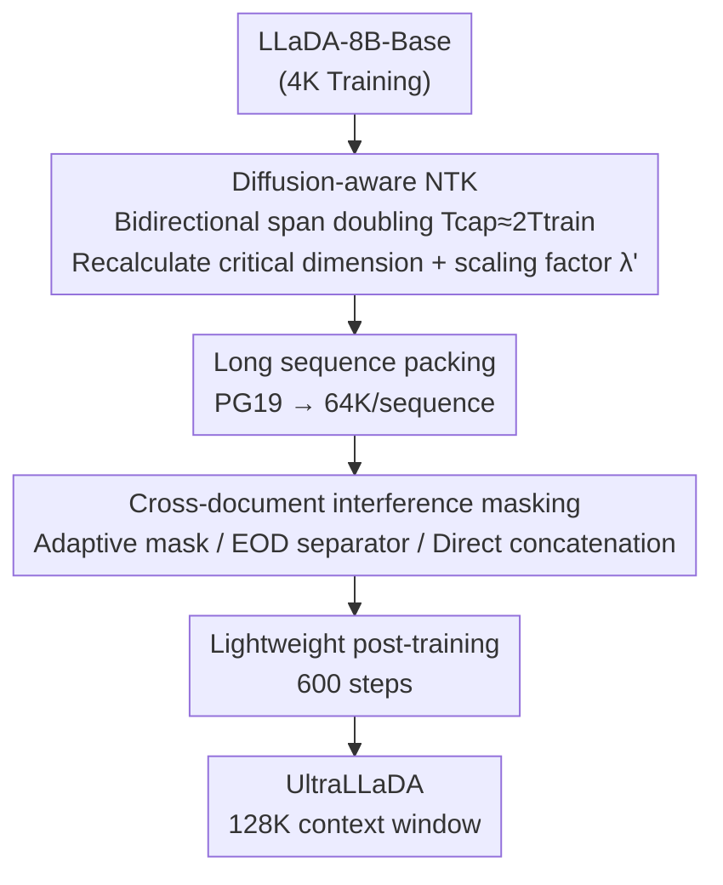

# UltraLLaDA: Scaling the Context Length to 128K for Diffusion Large Language Models

**Conference**: ICLR 2026  
**OpenReview**: [https://openreview.net/forum?id=68DGlhlvD9](https://openreview.net/forum?id=68DGlhlvD9)  
**Code**: None  
**Area**: LLM Efficiency / Diffusion Language Models / Long Context  
**Keywords**: Diffusion Language Models, Long Context Scaling, RoPE, NTK, Post-training

## TL;DR
Addressing the long context scaling problem of diffusion large language models (diffusion LLMs), this paper proposes a Diffusion-aware NTK positional encoding scaling method that considers the bidirectional attention characteristics of diffusion. Combined with masked post-training to suppress cross-document interference, the context window of LLaDA-8B is extended from 4K to 128K with lightweight training (only 600 steps), significantly outperforming the training-free baseline LongLLaDA on NIAH, PPL, LongBench, and RULER.

## Background & Motivation

**Background**: Diffusion LLMs replace autoregressive token-by-token generation with iterative denoising of entire sequences, offering potential advantages such as bidirectional global context awareness and flexible conditional control. Open-source models like LLaDA and Dream have demonstrated performance competitive with LLaMA3-8B and Qwen2.5-7B. However, a critical question remains largely unexplored: **how to extend the context window of diffusion LLMs to lengths far exceeding their training context (e.g., 128K)?**

**Limitations of Prior Work**: Established methods for long-context scaling in autoregressive LLMs, such as PI, NTK-aware, and YaRN, are designed for unidirectional causal attention. The only attempt in the diffusion domain is LongLLaDA, which directly applies training-free NTK RoPE extrapolation from autoregressive models to diffusion LLMs. Consequently, while diffusion LLMs do not suffer from immediate PPL explosions like autoregressive models, they exhibit a "local perception" bias: when presented with context exceeding the training length, they only utilize information from the most recent segment (e.g., the last 4K) and ignore all preceding content. In experiments, LongLLaDA fails completely beyond 32K.

**Key Challenge**: LongLLaDA inherits the key assumption of autoregressive models—using the same training length $T_\text{train}$ to estimate the "critical dimension" and scaling factor for NTK scaling. However, diffusion LLMs use **bidirectional attention**: each token observes both left and right during training, meaning the effective learned relative position range is $[-(T_\text{train}-1),\, T_\text{train}-1]$, spanning approximately twice that of autoregressive models. Directly applying autoregressive formulas **underestimates both the critical dimension and the scaling factor**, failing to release the long-context potential of diffusion models.

**Goal**: (Q1) How to adapt existing autoregressive methods to create a context extension method truly suited for diffusion LLMs; (Q2) To determine the performance gain brought by post-training compared to the training-free LongLLaDA.

**Core Idea**: Double the "effective relative span" in NTK scaling based on diffusion bidirectional attention ($T_\text{cap}\approx 2T_\text{train}$) to derive a more conservative RoPE scaling factor with longer wavelengths; then, utilize masked post-training to suppress cross-document interference, enabling the model to adapt to long sequences.

## Method

### Overall Architecture
The goal of UltraLLaDA is to extend the effective context window of a diffusion LLM pre-trained on 4K context (LLaDA-8B-Base) to 128K through **lightweight post-training** rather than training from scratch. The pipeline consists of two complementary pillars: the first is **Diffusion-aware NTK** at the positional encoding level, which rescales RoPE to cover the target length; the second is a **masking strategy** at the data/attention level to resolve interference between different documents when packing long sequences. After applying both, UltraLLaDA is obtained through 600 steps of post-training on PG19 long-form text.

### Key Designs

**1. Diffusion-aware NTK: Doubling the relative span for bidirectional attention**

This is the core lever of the paper, addressing the erroneous assumption in LongLLaDA. Standard NTK-aware scaling multiplies the RoPE base by a global factor, where the critical dimension $d_\text{crit}$ is determined by the training length: $d_\text{crit}=2\lceil \frac{d}{2}\log_b \frac{T_\text{train}}{2\pi}\rceil$, and the scaling factor is $\lambda_\text{baseline}=b^{-1}\cdot(\frac{T_\text{target}}{2\pi})^{d/d_\text{crit}}$. The issue lies in the implicit "unidirectional attention" assumption of $T_\text{train}$.

The authors' insight is that diffusion LLM bidirectional attention allows each token to see both sides, effectively covering a relative position span of $2T_\text{train}$. Thus, they introduce two new quantities—$T_\text{cap}$ (maximum relative span learned during pre-training) and $T_\text{Ecap}$ (required relative span after expansion)—setting $T_\text{cap}\approx 2T_\text{train}$ and $T_\text{Ecap}\approx 2T_\text{target}$ (whereas autoregressive models use $T_\text{cap}\approx T_\text{train}$). Critical dimensions and scaling factors are redefined accordingly:

$$\lambda' = b^{-1}\cdot\left(\frac{T_\text{Ecap}}{2\pi}\right)^{d/d'_\text{crit}},\qquad d'_\text{crit}=2\left\lceil \frac{d}{2}\log_b \frac{T_\text{cap}}{2\pi}\right\rceil$$

The intuitive effect is a reduction in angular frequency and an extension of RoPE periods across all dimensions, allowing the originally "well-trained" critical dimensions to cover the expanded relative spans. Compared to the baseline, the diffusion-aware version yields a **larger critical dimension and a more conservative (smaller) $\lambda'$**—for instance, for 8B LLaDA ($T_\text{train}=4$K), the baseline $d_\text{crit}\approx 64$ (period ~4K), while this method yields $d'_\text{crit}\approx 70$ (period ~8K). Training-free ablations demonstrate that this change alone reduces PPL and improves NIAH/LongBench scores.

**2. Cross-document Interference Masking: Preventing "crosstalk" in packed long sequences**

After extending positional encodings, post-training on long-context data is required. Using an NTK packing strategy, the authors construct sequences from PG19—short documents are packed to 64K, and long documents are sliced into consecutive 64K segments. However, diffusion LLMs face a specific challenge: while autoregressive causal attention naturally limits interactions between unrelated segments, diffusion uses **global bidirectional attention**. Any token can interact with any other token, causing unrelated documents in a packed sequence to contaminate each other across boundaries, leading to incoherent generations that mix content from different documents.

The authors compared three packing/attention strategies: (i) **Adaptive attention mask**—constructing a document-aware mask for each packed sequence to allow full attention only within the same original document, setting cross-document attention to 0; (ii) **EOD concatenation**—inserting special end-of-document tokens between documents while maintaining full bidirectional attention without hard masks, relying on the learned boundary token to separate information; (iii) **Direct concatenation** (baseline)—back-to-back concatenation without boundary tokens, maximizing cross-document interference. Experiments show that adaptive masking and EOD significantly suppress crosstalk, with adaptive masking performing slightly better. Direct concatenation often produced incoherent results. UltraLLaDA finalized the combination of Diffusion-aware NTK + Adaptive masking (or EOD).

### Loss & Training
The model follows the standard objective for masked diffusion language models: for a noise level $t\in[0,1]$, the forward process replaces each token with a mask token with probability $t$. Training minimizes the negative log-likelihood upper bound of masked positions: $-\mathbb{E}_{t,x_0,x_t}\big[\sum_{\{i\mid x_t^i=m\}}\log p_\theta(x_0^i\mid x_t)\big]$. Post-training is extremely lightweight: only **600 steps** on long-context data with a packing length of 64K, initialized from LLaDA-8B base. Evaluation uses deterministic decoding to eliminate sampling variance.

## Key Experimental Results

The models were evaluated on four long-context stress tests (up to 128K): PPL-128K (denoising likelihood perplexity on PG19), NIAH-128K (Needle In A Haystack retrieval), LongBench-16K, and RULER-32K. All methods were initialized with 8B LLaDA; UltraLLaDA was post-trained for 600 steps, while LongLLaDA used training-free RoPE extrapolation.

### Main Results

| Benchmark | Metric | LLaDA-8B-Base | LongLLaDA | UltraLLaDA |
|------|------|------|------|------|
| PPL @128K | Perplexity↓ | 343.88 | N/A (Fails >32K) | **10.45** |
| PPL @4K | Perplexity↓ | 12.00 | 13.39 | **11.27** |
| NIAH 4K–128K | Retrieval Acc↑ | — | 8K/16K >80%, 32K≈20%, Fails >32K | **100% all lengths** |
| LongBench-16K | AVG↑ | 31.56 | 36.07 | **39.98** |
| RULER @32K | AVG↑ | Failed (–) | 5.69 (Collapses) | **73.63** |
| RULER @8K | AVG↑ | 41.69 | 65.20 | **86.22** |

On NIAH, UltraLLaDA achieved 100% accuracy across segments 8–32× longer than the baseline's capabilities. PPL remained stable at 10–12 from 4K to 128K, whereas the LLaDA baseline spiked to 344 at 128K. On RULER, the gap widened with length: at 32K, the baseline VT (variable tracking) dropped to 2.6 and the total score collapsed to 5.69, while UltraLLaDA maintained a VT of 98.4 and an overall score of 73.63.

### Ablation Study

Diffusion-aware NTK vs. Baseline NTK (other settings identical, using EOD concatenation), and three cross-document masking strategies (using Diffu-NTK):

| Configuration | LongBench AVG↑ | RULER@32K AVG↑ | Description |
|------|------|------|------|
| Base-NTK + EOD | 39.44 | 65.85 | Autoregressive-style NTK |
| Diffu-NTK + EOD | 39.80 | 70.78 | Replaced with Diffusion-aware NTK |
| Diffu-NTK + Adaptive Mask | **39.98** | **73.63** | Full model |
| Diffu-NTK + Direct Join | 38.77 | — | No boundary handling, worst |

The advantage of Diffusion-aware NTK on RULER increased with length: at 4K, the baseline was slightly higher (90.00 vs 87.86), but UltraLLaDA gradually overtook it at 8K (86.30 vs 85.30), 16K (82.99 vs 79.54), and 32K (70.78 vs 65.85). This indicates that UltraLLaDA's gains come not only from extra training data but significantly from the **positional encoding adaptation itself**.

### Key Findings
- **Positional encoding adaptation is the primary lever**: Simply switching to Diffusion-aware NTK without training improves NIAH/PPL/LongBench, proving the validity of the "bidirectional attention doubles relative span" hypothesis.
- **Diffusion LLMs excel at retrieval and tracking but are weaker at aggregate reasoning**: At extreme lengths, NIAH (retrieval) and VT (variable tracking) remain at 90–100%, but improvements in AGG (aggregation) and complex QA are limited. Precise localization is strong, but multi-segment combined reasoning remains a challenge.
- **Cross-document masking is essential**: Direct concatenation leads to incoherent text due to bidirectional cross-boundary crosstalk. Adaptive masking > EOD > Direct concatenation.
- **Short-vs-long context trade-off exists**: Similar to autoregressive models, extending the context window can lead to some degradation in short-context performance (analyzed in Appendix I).

## Highlights & Insights
- **Correcting an overlooked assumption leverages the whole pipeline**: The core innovation is not the addition of new modules but recognizing that "bidirectional attention doubles effective relative span," replacing $T_\text{train}$ with $2T_\text{train}$ in the NTK formula. This approach of "identifying the model's nature then modifying one assumption" is elegant and transferable.
- **Systematic migration of autoregressive long-context tools to the diffusion paradigm**: The mature autoregressive workflow of position extrapolation (NTK) + data packing + cross-document masking was systematically re-examined for validity under bidirectional attention. This "migration + adaptation" is a valuable engineering paradigm.
- **Extreme Efficiency**: Extending from 4K to 128K in just 600 post-training steps is highly practical, demonstrating that the long-context potential of diffusion LLMs can be released at low cost.

## Limitations & Future Work
- Improvement in aggregation (AGG) and complex multi-hop QA is limited; diffusion LLMs still struggle with multi-segment combined reasoning—long context does not equate to long reasoning.
- Extending the context window introduces regression in short-context performance (noted in Appendix I), requiring a trade-off in deployment.
- $T_\text{cap}\approx 2T_\text{train}$ is an approximate setting (theoretical analysis in Appendix C); whether "doubling" remains accurate across different models or attention sparsities remains to be verified.
- PPL is estimated via Monte Carlo denoising likelihood, which is not strictly equivalent to next-token PPL in autoregressive models; caution is needed for cross-paradigm PPL comparisons.
- Only validated on LLaDA-8B; generalizability to diffusion LLMs obtained via "autoregressive post-training" (like Dream) is unknown.

## Related Work & Insights
- **vs. LongLLaDA**: Both use NTK RoPE extrapolation, but LongLLaDA is training-free and follows the autoregressive $T_\text{train}$ assumption, failing beyond 32K; this work uses diffusion-aware $2T_\text{train}$ scaling + lightweight post-training, remaining stable up to 128K, providing an apple-to-apple "training-free vs. post-training" comparison.
- **vs. Autoregressive Long-context Methods (PI / NTK-aware / YaRN)**: Designed for unidirectional causal attention, these methods misestimate both critical dimensions and scaling factors when applied directly to diffusion; the relative span must be corrected for bidirectional attention.
- **vs. Autoregressive Long-context Packing**: While causality naturally limits cross-segment interaction in autoregressive models, the global bidirectional attention of diffusion makes cross-document crosstalk more severe, making cross-document masking a "necessity" rather than an "option."

## Rating
- Novelty: ⭐⭐⭐⭐ First systematic study of diffusion LLM long-context post-training; the "bidirectional doubling" assumption correction is insightful.
- Experimental Thoroughness: ⭐⭐⭐⭐ Four benchmarks + dual ablation on position encoding/masking, though limited to a single model.
- Writing Quality: ⭐⭐⭐⭐ Clear motivation with well-supported formulas and charts.
- Value: ⭐⭐⭐⭐ Provides a practical and reproducible paradigm for extending diffusion LLMs from 4K to 128K context.

<!-- RELATED:START -->

## Related Papers

- [\[ICLR 2026\] Accelerating Diffusion Large Language Models with SlowFast Sampling: The Three Golden Principles](accelerating_diffusion_large_language_models_with_slowfast_sampling_the_three_go.md)
- [\[ICLR 2026\] Beyond Fixed: Training-Free Variable-Length Denoising for Diffusion Large Language Models](beyond_fixed_training-free_variable-length_denoising_for_diffusion_large_languag.md)
- [\[ICLR 2026\] SparseD: Sparse Attention for Diffusion Language Models](sparsed_sparse_attention_for_diffusion_language_models.md)
- [\[ICLR 2026\] Diffusion Language Models Know the Answer Before Decoding](diffusion_language_model_knows_the_answer_before_it_decodes.md)
- [\[ICLR 2026\] Learning to Parallel: Accelerating Diffusion Large Language Models via Learnable Parallel Decoding](learning_to_parallel_accelerating_diffusion_large_language_models_via_learnable_.md)

<!-- RELATED:END -->
