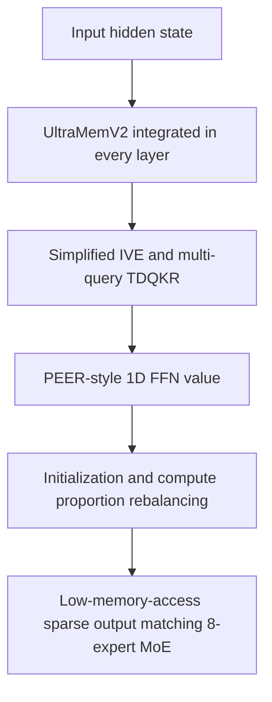

# UltraMemV2: Memory Networks Scaling to 120B Parameters with Superior Long-Context Learning

**Conference**: ICLR2026  
**OpenReview**: [https://openreview.net/forum?id=QWuXU0qNX0](https://openreview.net/forum?id=QWuXU0qNX0)  
**Code**: To be confirmed  
**Area**: LLM Efficiency  
**Keywords**: Sparse models, memory layers, long-context learning, MoE alternative architecture, inference efficiency  

## TL;DR
UltraMemV2 redesigns the memory-layer sparse architecture by integrating memory layers into every Transformer block and utilizing more efficient retrieval, value processing, initialization, and computational proportions. This allows the memory network to approach the performance of an 8-expert MoE under the same active computation while demonstrating stronger long-context memory and in-context learning with lower inference memory access.

## Background & Motivation
**Background**: The most common efficient path for scaling large models is Mixture of Experts (MoE), which activates only a few experts per token to leverage massive parameter scales with limited FLOPs. Recent findings from fine-grained MoE and OLMoE suggest that 8 activated experts often hit the sweet spot for performance and efficiency, leading industry models to increasingly adopt sparse FFNs with multiple active experts.

**Limitations of Prior Work**: The issues with MoE go beyond FLOPs to memory access and routing during inference. Each token must access parameters from multiple FFN experts; when the batch size is small or the sequence is long, the computational savings from sparse activation are offset by parameter reading, expert dispatch, and memory bandwidth consumption. Especially in long-context scenarios, the cost of repeated memory access becomes a hard bottleneck.

**Key Challenge**: Memory layers provide an alternative sparse scaling path. Instead of activating full FFN experts, they retrieve a small number of embeddings/values from a large key-value table. This naturally requires less memory access, and its access cost scales gently with parameter growth. However, previous methods like PKM, Memory+, and the original UltraMem typically only matched 1-expert or 2-expert MoE, leaving a significant performance gap compared to 8-expert MoE. In other words, while the inference profile of memory layers is attractive, their model capability has lagged.

**Goal**: The authors aim to address an engineering question: can a memory-layer architecture be designed to be strong enough to reach the level of an 8-expert MoE under the same activated parameters and compute budget, while retaining the advantages of low memory access and low inference latency? The paper simultaneously tackles four sub-problems: the frequency of memory layer insertion, simplification of retrieval and value expansion, effective value representation, and stable initialization and compute allocation for large-scale training.

**Key Insight**: The observation is that the weaknesses of the original UltraMem were not due to a single failing module but a combination of designs that limited sparse parameter participation and activation efficiency. For instance, placing memory layers only in a few layers prevented the large parameter table from consistently participating in representation updates. In IVE, independent linear projectors for each virtual head introduced extra non-computational overhead. Furthermore, standard value embeddings lacked the ability to perform dynamic transformations on input, unlike MoE experts.

**Core Idea**: UltraMemV2 replaces traditional MoE expert activation with a "lightweight memory layer per block + FFN-like value processing + stable initialization and compute balancing." This transforms sparse memory from a low-access component into a primary scaling module that directly competes with 8-expert MoE.

## Method

### Overall Architecture
The basic unit of UltraMemV2 remains integrated within the Transformer block. However, instead of treating the memory layer as an occasional external capacity module, every block now contains both a standard FFN and an UltraMemV2 layer. The input hidden state undergoes query projection and Tucker-decomposed query-key retrieval (TDQKR) to find a small number of high-scoring memory entries. A PEER-style pre-value/value structure then generates the output, which is mapped back to the hidden dimension via a single value projector, providing both dense computation and sparse memory alongside the FFN.

The pipeline comprises four steps: increasing memory layer frequency in deep networks; utilizing TDQKR and simplified IVE for large-scale sparse retrieval; upgrading retrieved values from static embeddings to 1D internal FFNs; and rebalancing training stability, FFN capability, and memory retrieval via initialization variance and compute proportions.

### Key Designs
**1. Per-layer UltraMemV2: Engaging sparse memory in every block**

Older memory-layer methods often inserted layers sparsely, preventing the parameter table from participating in every representation update. UltraMemV2 places an UltraMemV2 layer in every block alongside the FFN, similar to how MoE places experts in every layer. This ensures sparse memory has sufficient interaction points along the network depth, allowing continued training (CT) to better capture gains from high-quality data. Ablations on 430M/5B scales show that while validation loss targets might converge, Open-Benchmark scores continue to benefit from more layers.

**2. Simplified IVE and Multi-query TDQKR: Strategic retrieval with reduced overhead**

UltraMemV2 uses Tucker Decomposed Query-Key Retrieval. Given input $x$, queries $q_{row}(x)$ and $q_{col}(x)$ are generated to calculate scores with row/column keys, combined via a Tucker core into a grid score: $S_{grid}=\sigma_{TopM}(S_{row}^{\top} C S_{col})$, where $\sigma_{TopM}$ selects the top $m$ addresses. This factorizes the massive value table to avoid maintaining unmanageable full key matrices. The authors simplified the Implicit Value Expansion (IVE) by removing per-virtual-block projectors in favor of a shared projection $o=W^{\top}(V^{\top}\hat{s})$ after weighted pooling of activated values, improving parameter efficiency and retrieval precision.

**3. PEER-style 1D FFN Value: Dynamic memory vs. static embeddings**

Standard memory layers retrieve static value embeddings. UltraMemV2 adopts the PEER approach, treating each value as a micro-FFN with an inner dimension of 1. A pre-value matrix $P$ interacts with the input before combining with scores $\hat{s}$ and the value matrix $V$: $o=W^{\top}(V^{\top}((Px) \otimes \hat{s}))$. This moves memory entries from "static knowledge slots" to "input-modulated sparse computations."

**4. Initialization and Compute Rebalancing: Stability at scale**

Integrating memory into every block requires precise initialization to prevent variance explosion. The authors align the memory layer's output variance $\sigma^2_{mem}$ with the FFN output variance $\sigma^2_{ffn}$. Compute proportions were also optimized; memory key dimension $D_k$ is balanced against FFN compute budgets. The paper finds that a memory computational proportion of approximately 17% is optimal, using $D_k=h/2$ as a scalable rule.

### Mechanism
Consider a token in a long document needing to retrieve a character relationship. In a Transformer block, the hidden state passes through a standard FFN for local non-linear transformation while simultaneously entering the UltraMemV2 layer. TDQKR scores the potential memory addresses. The candidates are vast, but only $m$ values are accessed, keeping memory traffic lower than MoE. The selected entries act as 1D FFNs modulated by the current hidden state, allowing information to be repeatedly retrieved, modulated, and rewritten across the depth of the network.

### Loss & Training
The model uses standard next-token prediction loss. Private models were pretrained on 1.6T tokens followed by 250B high-quality tokens for Continued Training (CT). For open-source comparisons, 1T tokens from OLMoE were used. Notably, auxiliary losses (Tucker core penalty, balance loss) were found unnecessary or even harmful at higher $TopM$ values and were thus excluded. The value learning rate was simplified to a constant 1x, which outperformed decay schedules in long-duration training.

## Key Experimental Results

### Main Results
UltraMemV2 matches 8-expert MoE with the same activated parameters and similar total parameters, while significantly outperforming it in long-context tasks. 

| Model | Stage | OpenBench All | HardBench All | Conclusion |
|-------|-------|---------------|---------------|------------|
| SeedMoE-2.5B/30B | 3.9T PT + 500B CT | 70.7 | 30.3 | Strong MoE Baseline |
| UltraMemV2-2.5B/60B-top768 | 3.9T PT + 500B CT | 70.7 | 31.7 | Equal OpenBench, Higher HardBench |
| SeedMoE-2.5B/60B | 1.6T PT + 250B CT | 68.1 | 29.2 | Comparable Total Params MoE |
| UltraMemV2-2.5B/60B-top768 | 1.6T PT + 250B CT | 69.1 | 30.0 | Outperforms MoE after CT |

**Long-Context Performance**: UltraMemV2 excels in memorization and retrieval but lags in multi-hop reasoning.

| Model | Memorization | ICL | Find Needle | KV Retrieval | Multi-hop Reasoning | All |
|-------|--------------|-----|-------------|--------------|---------------------|-----|
| SeedMoE-2.5B/30B | 21.9 | 21.6 | 96.5 | 41.3 | 34.8 | 35.4 |
| UltraMemV2-2.5B/60B-top768 | 23.5 | 29.5 | 97.0 | 57.1 | 17.7 | 37.7 |
| Gain | +1.6 | +7.9 | +0.5 | +15.8 | -17.1 | +2.3 |

### Ablation Study
Ablations confirmed that per-layer integration, PEER values, and simplified projectors were essential for matching MoE performance.

- **PEER vs. Baseline**: PEER improved Open-Benchmark accuracy by ~0.03.
- **Projectors**: Single projector + multi-rank queries improved efficiency and precision.
- **Compute Proportion**: 17% was found to be the sweet spot between FFN and memory.

### Key Findings
- **Activation Density > Total Parameters**: Top-768 activation generally outperforms Top-256 even with smaller total parameter counts.
- **CT Sensitivity**: UltraMemV2 capabilities (Math, Code, Reasoning) often catch up or surpass MoE primarily during the Continued Training phase.
- **Inference Efficiency**: At the 10B/200B scale, UltraMemV2 offers lower memory access and up to 2x speedup in latency for common batch sizes compared to MoE.

## Highlights & Insights
- UltraMemV2 elevates memory layers to be competitive with 8-expert MoE by solving structural, dynamical, and initialization issues.
- It demonstrates that increasing activation density is more effective for performance than simply scaling the total sparse parameter count.
- The use of PEER-style values transforms memory from a lookup table into a modulated sparse computation.

## Limitations & Future Work
- **Early Training Stability**: UltraMemV2 often lags behind MoE during early pretraining and requires high-quality CT to reach peak performance.
- **Reasoning Gap**: While excellent at retrieval and ICL, the notable deficit in multi-hop reasoning suggests the architecture is better at "holding" information than "composing" it logically across contexts.
- **Hardware Dependency**: Advantages depend on memory bandwidth; efficiency gains might shift with different hardware architectures.

## Related Work & Insights
- **vs. MoE**: UltraMemV2 offers lower memory access and better long-context retrieval, though MoE remains more robust in early training and complex reasoning.
- **vs. UltraMem v1**: The V2 improvements (every-layer access, PEER values) bridge the gap from matching 2-expert MoE to matching 8-expert MoE.
- **Insight**: Memory layers may serve as low-bandwidth parameter carriers that complement or replace heavy MoE experts in bandwidth-constrained inference environments.

## Rating
- **Novelty**: ⭐⭐⭐⭐☆ Combines several architectural corrections to challenge the dominant MoE paradigm.
- **Experimental Thoroughness**: ⭐⭐⭐⭐☆ Strong results across private/open benchmarks and long-context suites.
- **Writing Quality**: ⭐⭐⭐⭐☆ Clear methodology, though some reasoning for early-stage lagging could be deeper.
- **Value**: ⭐⭐⭐⭐⭐ Highly relevant for researchers focused on MoE bottlenecks and scaling sparse memory.

<!-- RELATED:START -->

## Related Papers

- [\[ICLR 2026\] Deep Hierarchical Learning with Nested Subspace Networks for Large Language Models](deep_hierarchical_learning_with_nested_subspace_networks_for_large_language_mode.md)
- [\[ACL 2025\] Scaling Context, Not Parameters: Training a Compact 7B Language Model for Efficient Long-Context Processing](../../ACL2025/llm_efficiency/scaling_context_not_parameters_training_a_compact_7b_language_model_for_efficien.md)
- [\[ICLR 2026\] xLSTM Scaling Laws: Competitive Performance with Linear Time-Complexity](xlstm_scaling_laws_competitive_performance_with_linear_time-complexity.md)
- [\[ICLR 2026\] RMAAT: Astrocyte-Inspired Memory Compression and Replay for Efficient Long-Context Transformers](rmaat_astrocyte-inspired_memory_compression_and_replay_for_efficient_long-contex.md)
- [\[ICLR 2026\] MemAgent: Reshaping Long-Context LLM with Multi-Conv RL-based Memory Agent](memagent_reshaping_long-context_llm_with_multi-conv_rl-based_memory_agent.md)

<!-- RELATED:END -->
