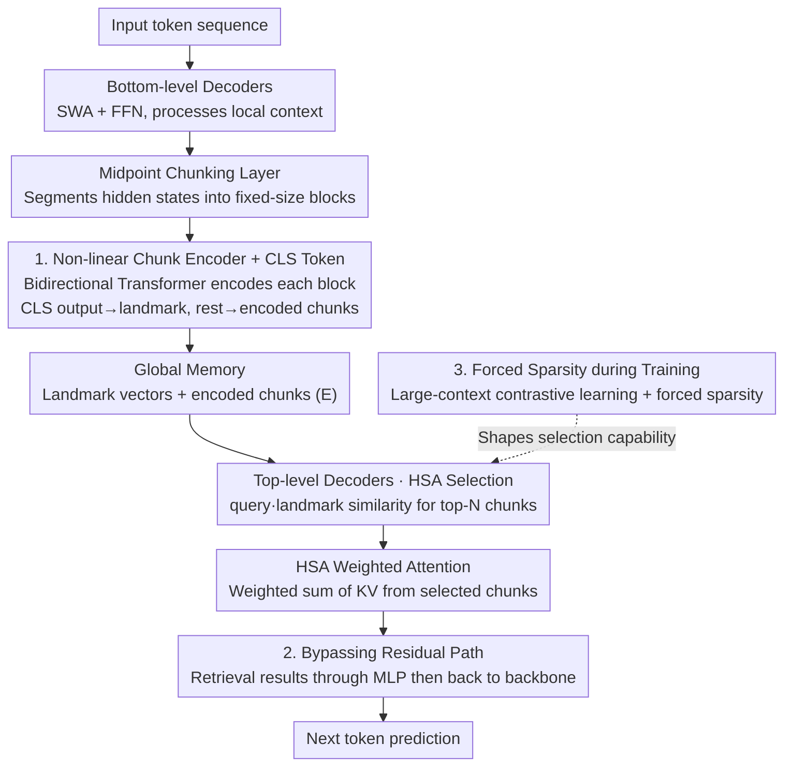

# Understanding and Improving Length Generalization in Hierarchical Sparse Attention Models

**Conference**: ICLR 2026  
**arXiv**: [2510.17196](https://arxiv.org/abs/2510.17196)  
**Code**: [https://github.com/jacky-leng/length-generalizable-sparse-attention](https://github.com/jacky-leng/length-generalizable-sparse-attention)  
**Area**: LLM Efficiency  
**Keywords**: Long Context, Sparse Attention, Length Generalization, Chunk-based Attention, Hierarchical Sparse Attention

## TL;DR
This paper systematically dissects chunk-based sparse attention architectures and identifies three critical design principles (Non-linear Chunk Encoder + CLS token, Bypassing Residual Path, and Forced Sparsity during training). These principles enable a model trained on a 4K context to successfully extrapolate to 32 million tokens.

## Background & Motivation

**Background**: The demand for LLMs to process long contexts is growing, yet the $O(n^2)$ complexity of standard Transformers and the failure of length extrapolation remain core bottlenecks. Sliding window attention and State Space Models (SSMs) address efficiency via fixed-size memory but sacrifice the ability to access global information.

**Limitations of Prior Work**: (a) Sliding windows only access local context; (b) SSMs compress history into a fixed state, creating an information bottleneck; (c) Existing chunk-based sparse attention (e.g., Landmark Attention, NSA) possess extrapolation capabilities but still show significant accuracy drops on complex retrieval tasks as length increases, and they **lack a systematic analysis to clarify which design factors are critical for success**.

**Key Challenge**: Ideal length extrapolation requires two properties: (1) maintaining stable perplexity over longer sequences, and (2) effectively utilizing the entire context—attributes that are difficult for existing methods to satisfy simultaneously.

**Goal**: Systematically identify which architectural components in chunk-based sparse attention drive extreme length generalization and establish a new SOTA based on these findings.

**Key Insight**: Existing methods are unified into a single framework to decompose the contribution of each component through large-scale ablation studies.

**Core Idea**: A non-linear encoder learns robust chunk representations for retrieval, a bypassing residual path prevents global information from being overwhelmed by local residual flows, and forced sparsity during training bridges the train-test distribution gap—all three are indispensable.

## Method

### Overall Architecture
The paper addresses the question: Why can some chunk-based sparse attentions extrapolate models trained on short context to extremely long sequences while others cannot? It unifies existing methods into an SWA+HSA (Sliding Window Attention + Hierarchical Sparse Attention) framework and removes components one by one to observe their impact.

The data flow consists of three stages. The bottom stage comprises several Sliding Window Attention (SWA) decoder layers, where each layer performs SWA + FFN to process local context and ensure precise local information. At the network's midpoint, a chunking layer is inserted, which segments the hidden representations $\mathbf{H}^{L/2}$ into fixed-size blocks. Each block is fed into a **Non-linear Chunk Encoder + CLS Token** to produce a global memory unit: a landmark vector $\mathbf{lmk}_{[i]}$ (for retrieval) and a set of encoded chunks $\mathbf{E}$ (for content reading). The top stage consists of several upper decoder layers, each incorporating an HSA module alongside local self-attention: first, the similarity $s_{t,i}=\mathbf{q}_t\cdot\mathbf{lmk}_{[i]}$ between the current query $\mathbf{q}_t$ and all landmarks is calculated to select the top-N most relevant chunks; then, weighted attention is performed on the KV pairs of these chunks; finally, the retrieval results are merged back into the backbone via a **Bypassing Residual Path**. The paper's three core findings correspond to this pipeline: how to encode chunks for searchability (Design 1), how to merge retrieval results without interference (Design 2), and how to force the model to learn selection across massive chunks during training (Design 3, **Forced Sparsity during Training**).

### Key Designs

**1. Non-linear Chunk Encoder + CLS Token: Making landmarks truly reflect chunk retrieval value**

The limitation is that the ideal weight determining whether a chunk should be selected should be proportional to the sum of attention quality within that chunk—which is a highly non-linear function of the keys within the chunk. Simple MeanPool averages a block of keys into a single vector, which lacks the expressivity to fit this relationship, leading to distorted retrieval signals. The paper employs a bidirectional Transformer encoder for each chunk to learn this complex mapping via multi-layer non-linear transformations and introduces a learnable CLS token to produce the landmark vector. This also resolves another conflict: the intermediate hidden states $h_t^{L/2}$ originally served both "next token prediction" and "future retrieval," which have divergent requirements. The CLS token decouples the retrieval representation from the content representation, allowing landmarks to focus solely on "retrievability."

**2. Bypassing Residual Path: Preventing low-level retrieval from contaminating high-level residual flows**

Information retrieved by HSA consists of relatively low-level, literal, and local representations, whereas the top-level backbone it is injected into is already more abstract. The standard residual form:

$$x_{\text{out}} = x_{\text{in}} + \mathcal{M}(x') + \mathcal{H}(x_{\text{in}})$$

directly adds this low-level retrieval information $\mathcal{H}(x_{\text{in}})$ into the high-level residual flow, where the mixing of abstract and literal granularities causes interference. The paper proposes a bypassing form:

$$x_{\text{out}} = x_{\text{in}} + \mathcal{M}(x')$$

where retrieval results pass through an MLP $\mathcal{M}$ before merging into the backbone. The MLP learns to reconcile the cross-layer granularity differences rather than performing a crude addition. This change shows minimal difference on short sequences but becomes critical for extreme extrapolation, indicating that cross-layer information fusion is a hidden bottleneck for length generalization.

**3. Forced Sparsity during Training: Feeding "irrelevant chunk skipping" into the training distribution**

The root cause is the train-test distribution gap: at test time, sequences are much longer than in training, and the number of chunks explodes, requiring the model to filter out most irrelevant chunks. However, if the training context is too short and all chunks are selected by top-N, the model never learns "selectivity" and fails to pick correctly on long sequences. The paper uses sufficiently large contexts for contrastive learning during pre-training and enforces sparse chunk selection. This ensures the training distribution contains many samples requiring the skipping of irrelevant chunks, activating selective retrieval during the training phase.

These three are interdependent: the encoder makes chunks searchable, the bypassing residual merges results cleanly, and forced sparsity trains the model to select—any missing link causes extreme length extrapolation to fail.

### Loss & Training
Standard autoregressive language modeling loss is used, with pre-training on a 4K context length. Key hyperparameters include chunk size, top-N selection count, and the number of encoder layers.

## Key Experimental Results

### Main Results

**RULER benchmark (Train 4K → Test various lengths)**:

| Model | 4K | 32K | 128K | 1M | 32M |
|------|-----|------|------|----|----|
| Full Attention | High | Low | ~0 | - | - |
| Mamba2 | 65.4 | 1.1 | - | - | - |
| Landmark Attention | Mid | Mid | Low | - | - |
| **SWA+HSA (Ours)** | **High** | **High** | **High** | **High** | **High** |

**BABILong**: The model maintains high accuracy at 8M tokens, while Full Attention collapses shortly after its training length.

### Ablation Study

| Configuration | RULER 128K Avg |
|------|---------------|
| Full model (Enc+CLS+Bypass) | Highest |
| w/o Encoder (MeanPool) | Significant drop |
| w/o CLS token | Drop |
| w/o Bypassing Residual | Drop |
| w/o Training Sparsity | Extrapolation fails on long sequences |

### Key Findings
- The three components are **indispensable**: removing any single one leads to a significant decline in length generalization.
- 4K Training → 32M Extrapolation = **8000× extrapolation ratio**, significantly surpassing previous SOTA (~1000×).
- The CLS token improves landmark quality and decouples retrieval from content, preventing information crosstalk.
- The Bypassing Residual Path shows little difference on short sequences but is decisive for long-sequence extrapolation, suggesting cross-layer fusion is a bottleneck in extreme scenarios.
- Training context must be large enough to include "distractor chunks"; otherwise, the model fails to learn selective retrieval.

## Highlights & Insights
- **Theory + Empirical Dual-Drive**: Beyond ablations, the paper provides a theoretical motivation for the non-linear encoder (chunk weights as a non-linear function of keys), grounding design choices in solid logic.
- **Extreme Extrapolation**: The 8000× extrapolation ratio (4K to 32M) is remarkable and demonstrates that proper architectural design can unlock the full potential of sparse attention.
- **Bypassing Residual Path Insight**: The failure mode of direct residual addition in cross-layer fusion is non-obvious; this finding provides guidance for any architecture involving cross-layer attention.

## Limitations & Future Work
- Validation was only performed at the 1.3B scale; performance on larger models remains to be confirmed.
- Fixed chunk sizes were used; adaptive chunking might further improve retrieval precision.
- Extrapolation capabilities on complex reasoning tasks (requiring multi-hop retrieval) have not been fully verified.
- The encoder increases parameter count and computation, which may be unacceptable for ultra-low latency scenarios.

## Related Work & Insights
- **vs Landmark Attention**: Extends the chunk-based approach of Landmark but introduces a non-linear encoder and better fusion, improving extrapolation from ~64× to 8000×.
- **vs NSA (Native Sparse Attention)**: NSA uses simple MeanPool for landmarks with limited extrapolation; this paper proves a non-linear encoder is necessary.
- **vs DRT/RAMba**: Belongs to the same family of chunk-based sparse attention; this paper validates the universality of its key design principles through a unified framework.

## Rating
- Novelty: ⭐⭐⭐⭐ Systematic analysis is a major contribution; the three design principles provide meaningful guidance.
- Experimental Thoroughness: ⭐⭐⭐⭐⭐ Comprehensive evaluation across RULER, BABILong, and extensive ablations.
- Writing Quality: ⭐⭐⭐⭐⭐ The unified framework, theoretical motivation, and systematic ablations serve as a model for research methodology.
- Value: ⭐⭐⭐⭐⭐ Provides a clear guidebook for long-context model design; 8000× extrapolation is a breakthrough result.

<!-- RELATED:START -->

## Related Papers

- [\[ICLR 2026\] SparseD: Sparse Attention for Diffusion Language Models](sparsed_sparse_attention_for_diffusion_language_models.md)
- [\[NeurIPS 2025\] Hardware-aligned Hierarchical Sparse Attention for Efficient Long-term Memory Access](../../NeurIPS2025/llm_efficiency/hardware-aligned_hierarchical_sparse_attention_for_efficient_long-term_memory_ac.md)
- [\[ICLR 2026\] Tactic: Adaptive Sparse Attention with Clustering and Distribution Fitting for Long-Context LLMs](tactic_adaptive_sparse_attention_with_clustering_and_distribution_fitting_for_lo.md)
- [\[ICLR 2026\] Sparse Attention Adaptation for Long Reasoning](sparse_attention_adaptation_for_long_reasoning.md)
- [\[ICLR 2026\] vAttention: Verified Sparse Attention via Sampling](vattention_verified_sparse_attention_via_sampling.md)

<!-- RELATED:END -->
