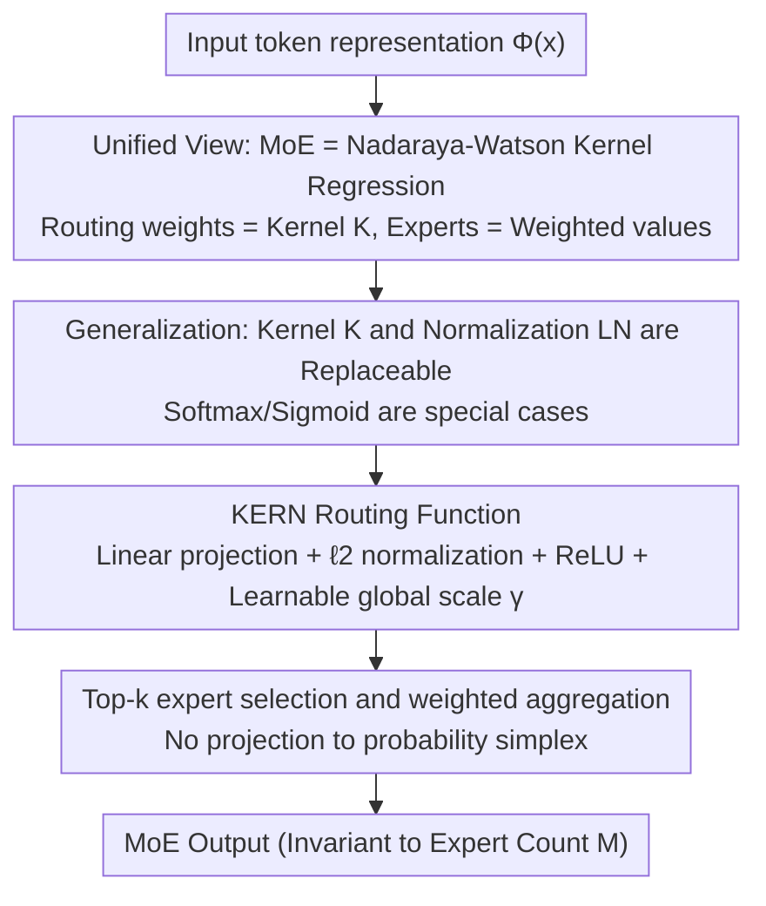

# Understanding the Mixture-of-Experts with Nadaraya-Watson Kernel

**Conference**: ICLR 2026  
**OpenReview**: [https://openreview.net/forum?id=NdDlqHV1md](https://openreview.net/forum?id=NdDlqHV1md)  
**Area**: LLM Efficiency  
**Keywords**: Mixture-of-Experts, Routing Function, Nadaraya-Watson Regression, Kernel Methods, Softmax Alternative

## TL;DR
This paper reinterprets MoE routing using classical Nadaraya-Watson kernel regression (routing weights = kernel function, expert outputs = weighted "labels"). Based on this, MoE is viewed as a "large FFN," leading to the proposal of KERN—a zero-additional-overhead FFN-style routing function (ReLU activation + $\ell_2$ normalization). KERN consistently outperforms Softmax/Sigmoid routing across various model scales, sequence lengths, and sparsity levels.

## Background & Motivation

**Background**: MoE has become a standard configuration for modern large models (Mixtral, DeepSeek, Switch Transformer, etc.), expanding parameter scales via sparse activation without significantly increasing computation. From early MoE to today's LLMs, routers almost exclusively use **Softmax** to calculate expert weights for each token. Softmax projects routing scores onto a probability simplex (non-negative, summing to 1), which has been widely accepted as an axiomatic design.

**Limitations of Prior Work**: Constraining routing weights to a probability distribution, while seemingly natural, has never been rigorously proven as "necessary." Softmax, being an exponential activation, faces two practical issues: first, **gradient saturation/vanishing**—once an expert's routing weight is pushed near 0, its gradient also approaches 0, "trapping" the expert in a low-activation state and leading to unbalanced utilization; second, exponential functions are highly sensitive to input values, prone to numerical explosions. Recent works (e.g., DeepSeek) found that replacing Softmax with **Sigmoid** yields better results, suggesting that Softmax's dominance is not unshakeable.

**Key Challenge**: The "probability simplex constraint" of Softmax is neither a necessary condition for MoE effectiveness nor free from issues like gradient saturation and scaling. However, a unified theoretical framework explaining "what a router should look like" is lacking, leaving alternatives like Sigmoid or Tanh as empirical trial-and-error.

**Goal**: (1) Provide a principled statistical interpretation for MoE routing; (2) Design a routing function under this interpretation that aligns better with deep learning common practices than Softmax, with zero additional overhead.

**Key Insight**: The authors observe that the MoE aggregation formula $\text{MoE}(x)=\sum_m g_m(x)E_m(x)$ corresponds almost item-by-item with classical **Nadaraya-Watson kernel regression**—the routing weight $g_m(x)$ corresponds to the kernel function $K(x, w_m)$, and the expert output $E_m(x)$ corresponds to the weighted "observed value $y_m$." Furthermore, the FFN output layer can be written in the same "adaptive kernel weights × value vectors" form, implying that MoE, FFN, and Nadaraya-Watson are mathematically isomorphic.

**Core Idea**: Since MoE routing is essentially a "kernel function + normalization," one can **use the FFN-style configuration (ReLU activation + $\ell_2$ normalization) as the kernel function**, replacing the "exponential activation + $\ell_1$ normalization" of Softmax to create the KERN routing function.

## Method

### Overall Architecture

The proposed method follows a "explain first, design later" chain. First, it **reduces** MoE routing to Nadaraya-Watson kernel regression from a statistical perspective, noting that the FFN output layer fits the same template. Second, it **generalizes** this template—allowing the kernel function $K$ and normalization $\text{LN}$ to be replaced. Third, it **instantiates** a new routing function, KERN, within this generalized template, deliberately choosing ReLU + $\ell_2$ normalization over Softmax's exponential + $\ell_1$. Fourth, it uses scale analysis to explain why KERN ensures more stable training.

### Key Designs

**1. Unifying MoE / FFN as Parameterized Nadaraya-Watson Kernel Regression: A Statistical Interpretation for Routers**

This step addresses why Softmax is used and whether it can be replaced. A Nadaraya-Watson estimator predicts the value for an input $x$ by weighting training samples based on similarity: $f_{NW}(x)=\sum_{i=1}^N \frac{K(x,x_i)}{\sum_j K(x,x_j)} y_i$, where $K$ is the kernel function and the denominator provides normalization. By turning the bandwidth $\sigma$ into a learnable parameter, a parameterized kernel $K(u,v;w)=\exp(-w\|u-v\|^2/2)$ is obtained.

The key observation: the **FFN output layer** can be written as $\text{FFN}(x)=\sum_{i=1}^h \phi(\text{LN}(\langle w_i,\Phi(x)\rangle))\cdot v_i$—where the "normalized score after activation" acts as adaptive kernel weights, and $v_i$ acts as "labels $y_i$". Thus, FFN implicitly defines an FFN-style kernel $K(x,\{w_i\})=\phi(\langle w_i,\Phi(x)\rangle)$, and the normalization in Nadaraya-Watson corresponds to $\ell_1$ normalization $\text{LN}(x)=x/\|x\|_1$. **MoE routing follows the exact same template**: in $\text{MoE}(x)=\sum_m g_m(x)E_m(x)$, the weight $g_m(x)=K(x,w_m)$ is the kernel and the expert output $E_m(x)$ is the aggregated observation. With this link, the router is no longer a "mandatory probability allocator" but a "regression weight with flexible kernel and normalization design."

**2. KERN Routing Function: Using ReLU + $\ell_2$ Normalization as the Kernel**

Using the unified perspective, the authors argue that Softmax routing is an outlier: it uses **exponential activation + $\ell_1$ normalization**, whereas modern FFNs rarely use exponential activation (due to sensitivity and vanishing/exploding gradients) and prefer $\ell_2$ normalization. KERN adopts the mainstream FFN configuration. Given an representation $\Phi(x)\in\mathbb{R}^d$, KERN performs: linear projection $s(x)=W_s\Phi(x)+b_s$, followed by $\ell_2$ normalization $\bar s(x)=\frac{s(x)}{\|s(x)\|_2+\varepsilon}$, followed by ReLU $r(x)=\text{ReLU}(\bar s(x))$, and finally multiplied by a **learnable global scalar** $\gamma$ (initialized to 1) to get $\hat g(x)=\gamma\cdot r(x)$. Only top-$k$ experts are kept for inference and training: $g_m(x)=\hat g_m(x)\,\mathbb{1}[m\in T_k(x)]$, resulting in $\text{MoE}_{\text{KERN}}(x)=\sum_m g_m(x)E_m(x)$.

The difference from traditional routing: **it does not project outputs onto the probability simplex**, thus avoiding extra $\ell_1$ rescaling. Weights are controlled by $\gamma$ and the $\ell_2$ constraint. This preserves the sparsity of ReLU (naturally providing many zeros) while avoiding gradient saturation. It is a **true generalization**: Softmax routing corresponds to "$\ell_1$ norm + exponential activation," Sigmoid to "no LN + Sigmoid activation," both covered by this FFN-style framework. KERN **introduces no additional parameters or significant overhead** (besides the scalar $\gamma$), making it a zero-additional-cost plug-and-play replacement.

**3. $\ell_2$ Normalization Ensures Invariant MoE Output Scale vs. Expert Count $M$**

The choice of $\ell_2$ normalization is justified by scale analysis. Assuming experts are independent and properly initialized ($\|E_m(x)\|_2=O(1)$), during initialization, the second moment of KERN’s MoE output is:

$$\mathbb{E}\big[\|\text{MoE}_{\text{KERN}}(x)\|_2^2\big]=\sum_{m=1}^M (g_m(x))^2\,\mathbb{E}\big[\|E_m(x)\|_2^2\big]=O(1)\cdot\sum_{m=1}^M (g_m(x))^2=O(1).$$

This holds for FFN-style kernels with common activations like ReLU, Tanh, or GeLU. Regardless of whether the total number of experts $M$ is 32 or 256, the output variance remains at a constant scale. **Increasing experts does not cause signal fluctuations**, aligning with the scale consistency principles of Kaiming initialization. This leads to more stable training and balanced expert participation, which Softmax/Sigmoid fail to guarantee due to their exponential nature pushing small weights and their gradients toward zero.

### Loss & Training
KERN does not change the training objective, using standard language modeling (next-token prediction) loss. It acts as a plug-and-play router. The only new learnable parameter is the global scalar $\gamma$ (initially 1). Experiments use decoder-only Transformers, maintain an expert parameter ratio of 8 (e.g., 64 total, 8 active), and are compared against Dense baselines with aligned active parameters.

## Key Experimental Results

Experiments cover LM validation loss (Arxiv/Books3, lengths 512/1024/2048), model scales (125M to 1.3B active parameters), expert granularity, and downstream zero-shot evaluation after pre-training on FineWeb-Edu.

### Main Results

FineWeb-Edu Pre-training + Downstream Zero-shot Average Accuracy (Higher is better):

| Model Scale (Active) | Dense | Softmax | Tanh | Sigmoid | KERN |
|--------|------|------|------|------|------|
| 520M (125M) | 48.51 | 49.88 | 51.53 | 51.80 | **52.14** |
| 1.7B (350M) | 51.05 | 52.46 | 54.18 | 54.72 | **55.13** |
| 6.9B (1.3B) | 56.11 | 56.49 | 58.04 | 58.55 | **58.88** |

Language Modeling Validation Loss (Lower is better, at 50K steps):

| Setting | Dense | Softmax | Sigmoid | Tanh | KERN |
|------|------|------|------|------|------|
| Arxiv 512 | 1.0925* | 1.8781 | — | — | **1.8291** |
| Books3 1024 | 3.2454 | 3.1714 | 3.1031 | 3.1224 | **3.0914** |
| Books3 2048 | 3.1249 | 3.0442 | 2.9635 | 2.9868 | **2.9535** |

(*The Dense value for Arxiv 512 is taken from the original text, though it appears inconsistent with the overall curve trend; please refer to the original paper. In all other settings, KERN achieved the lowest loss/highest accuracy.)

### Ablation Study

| Dimension | Range of Configuration | Conclusion |
|------|---------|------|
| Expert Granularity | 4–32 active experts, fixed active params | KERN outperforms Softmax at every granularity. |
| Sparsity (Total Experts) | 32 / 64 / 128 / 256 (8 active) | KERN loss improved 3.3487→3.2672 on Books3, consistently lower than Softmax 3.3981→3.3761. |
| Extreme Sparsity | 256 total, 8 active, 384 inter. dim | KERN (3.2672 loss) beats Softmax (3.3761), Sigmoid (3.2760), and Tanh (3.2972). |
| Model Scale | 125M→350M→1.3B active | KERN is optimal at every scale; lead increases with model size. |

### Key Findings
- **KERN is robust to sparsity and granularity**: Whether the total number of experts varies from 32 to 256 or active experts from 4 to 32, KERN consistently outperforms Softmax.
- **Gain magnitude is comparable to the MoE benefit itself**: At the 520M scale, the accuracy gap between KERN and Softmax (2.26) is larger than the gap between Softmax and Dense (1.37). Switching Softmax to KERN provides a boost equivalent to upgrading from Dense to MoE, at zero additional cost.
- **Larger models yield larger advantages**: From 125M to 1.3B active parameters, KERN’s lead widens, suggesting its value for large-scale MoE training.

## Highlights & Insights
- **Unified view for separate concepts**: Using the 1964 Nadaraya-Watson kernel regression to unify MoE routing, FFN output layers, and kernel regression explains why "Softmax is just one kernel among many" and opens a new design space.
- **Zero-cost plug-and-play**: KERN adds no parameters (only one scalar $\gamma$) and requires no changes to training objectives while providing stable improvements, posing minimal barriers for engineering adoption.
- **Transferable insight on scale invariance**: Using $\ell_2$ normalization to keep the second moment invariant to $M$ brings Kaiming-style variance-preserving initialization to routers, an idea applicable to other component aggregation modules.

## Limitations & Future Work
- Primarily examined on decoder-only LMs; performance in Vision MoE or multi-modal scenarios remains to be verified.
- Lacks direct quantitative analysis of **expert load balancing metrics** or utilization rates, despite theoretical arguments regarding gradient saturation.
- Removing the probability simplex constraint means routing weights are no longer directly interpretable as "probabilities," potentially affecting downstream interpretability or routing audits.
- Some experimental figures (e.g., Dense on Arxiv 512) show inconsistencies with overall trends; replication should follow the paper's curves.

## Related Work & Insights
- **vs. Softmax Routing**: Softmax uses exponential activation + $\ell_1$ norm to force weights into a probability distribution, prone to saturation and "dead" experts. KERN uses ReLU + $\ell_2$ norm without the simplex constraint, alleviating saturation while maintaining scale invariance at zero cost.
- **vs. Sigmoid Routing (DeepSeek, etc.)**: Sigmoid routing is a special case (no LN + Sigmoid activation) within this paper's framework. KERN further generalizes this to an FFN-style kernel and marginally outperforms Sigmoid in most settings.
- **vs. "FFN as Key-Value Memory" (Geva et al.)**: While that work views FFN as static memory, this paper treats "FFN output layer = adaptive kernel weights × values," linking it to MoE and Nadaraya-Watson for a unified routing design template.

## Rating
- Novelty: ⭐⭐⭐⭐⭐ High; the Nadaraya-Watson unification provides strong explanatory power and a new design path.
- Experimental Thoroughness: ⭐⭐⭐⭐ Broad coverage of scale and sparsity, though lacking direct expert balance metrics.
- Writing Quality: ⭐⭐⭐⭐ Clear derivation and logical progression from interpretation to design.
- Value: ⭐⭐⭐⭐⭐ High; zero-cost, plug-and-play, and increasingly effective at scale—likely a new standard MoE routing baseline.

<!-- RELATED:START -->

## Related Papers

- [\[ICLR 2026\] DirMoE: Dirichlet-Routed Mixture of Experts](dirmoe_dirichlet-routed_mixture_of_experts.md)
- [\[ICLR 2026\] Mixture-of-Experts Can Surpass Dense LLMs Under Strictly Equal Resource](mixture-of-experts_can_surpass_dense_llms_under_strictly_equal_resource.md)
- [\[ICML 2026\] RepetitionCurse: Measuring and Understanding Router Imbalance in Mixture-of-Experts LLMs under DoS Stress](../../ICML2026/llm_efficiency/repetitioncurse_measuring_and_understanding_router_imbalance_in_mixture-of-exper.md)
- [\[ICLR 2026\] Expert Merging in Sparse Mixture of Experts with Nash Bargaining](expert_merging_in_sparse_mixture_of_experts_with_nash_bargaining.md)
- [\[ICLR 2026\] Routing Manifold Alignment Improves Generalization of Mixture-of-Experts LLMs](routing_manifold_alignment_improves_generalization_of_mixture-of-experts_llms.md)

<!-- RELATED:END -->
