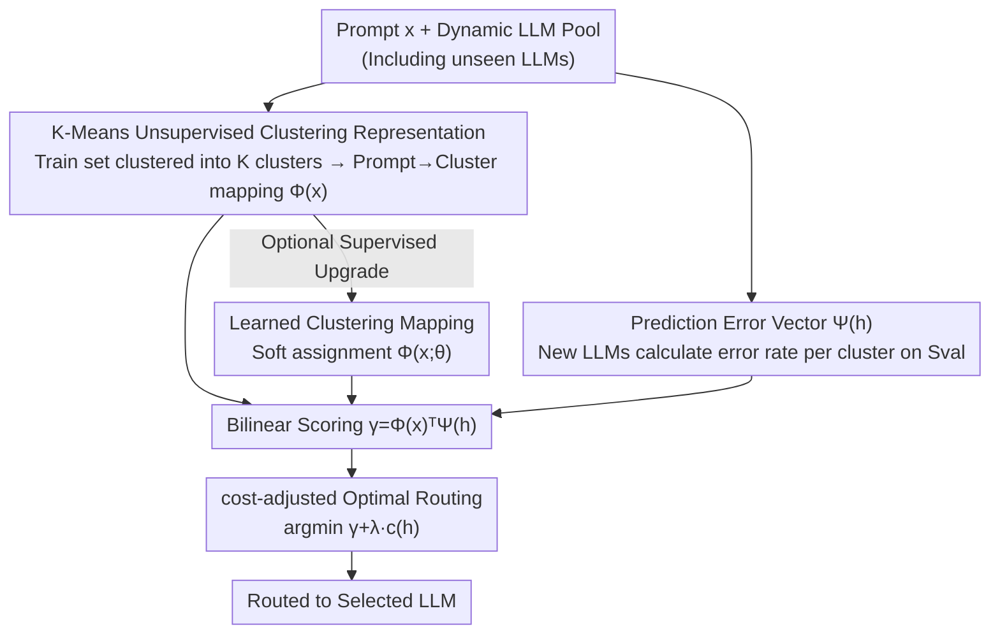

# Universal Model Routing for Efficient LLM Inference

**Conference**: ICLR 2026  
**OpenReview**: [https://openreview.net/forum?id=ka82fvJ5f1](https://openreview.net/forum?id=ka82fvJ5f1)  
**Code**: None  
**Area**: LLM Efficiency  
**Keywords**: Model Routing, Dynamic LLM Pool, Inference Cost, Zero-shot Generalization, Clustering Representation

## TL;DR
This paper proposes UniRoute, which encodes each LLM into a "prediction error vector on a small batch of representative prompts." Paired with a bilinear scorer, it allows the trained router to route to new LLMs appearing only at test time **without retraining**, achieving a better cost-quality trade-off across 30+ unseen models.

## Background & Motivation
**Background**: Model routing is a simple and effective means to reduce LLM inference costs—maintaining a pool of candidate LLMs with different scales/capabilities and predicting the "minimum cost model capable of handling it" for each prompt, thereby reserving expensive large models for a minority of "hard" inputs. Existing routers almost exclusively learn a scoring function $\gamma^{(m)}(x)$ on a **fixed** LLM pool and route according to $r(x)=\arg\min_m[\gamma^{(m)}(x)+\lambda\cdot c^{(m)}]$.

**Limitations of Prior Work**: In practical deployment, LLM pools are **dynamic**—new models are frequently released, old models are deprecated, and even the same set of models available at test time may change due to GPU supply, licensing, or task adaptation. The structure of fixed-pool routers (linear layers $w_m^\top\phi(x)+b_m$, matrix factorization, BERT heads) maps each output to a specific model, resulting in a **mismatch** when new models arrive.

**Key Challenge**: There are only two naive ways to handle dynamic pools—reusing the old router or retraining upon every change. Reusing wastes new models (especially small models, which are crucial for low-cost intervals); retraining requires re-labeling, re-training, and re-deploying on annotated samples for every new model, which is expensive and **prone to overfitting on small samples**.

**Goal**: To design a router capable of accepting arbitrary new LLMs at **test time** (including those completely unseen during training) without any gradient retraining, while maintaining a near-optimal cost-quality trade-off.

**Key Insight**: The authors observe that the essence of routing is predicting "whether a certain model will fail on a certain prompt." If each LLM can be given a **pool-independent, cheaply computable** feature representation, routing can generalize to new models like zero-shot classification. Two LLMs being "similar" should mean they have "similar error patterns" on the same batch of validation prompts.

**Core Idea**: Replace the one-hot representation of model identity with a **prediction error vector** of the LLM on a set of representative prompts—characterizing a model by "which prompts it fails on." This allows the router to be formulated as a bilinear inner product of prompt features and model features, naturally supporting arbitrary new models.

## Method

### Overall Architecture
UniRoute addresses "dynamic pool routing": training on a set of models $H_{tr}$ but selecting the optimal from another set $H_{te}$ (potentially completely disjoint from $H_{tr}$) at test time. Its key shift is parameterizing the scorer as the **inner product of prompt features $\Phi(x)\in\mathbb{R}^K$ and model features $\Psi(h)\in\mathbb{R}^K$**:

$$\gamma_{uni}(x,h)=\Phi(x)^\top\Psi(h).$$

As long as $\Psi(\cdot)$ can be cheaply calculated for any model, routing can seamlessly accept new models. The entire pipeline consists of three steps: ① Fit the parameters of $\Phi,\Psi$ on the training set $S_{tr}$ (training the base router); ② For each test LLM $h_{te}$, calculate its feature vector $\Psi(h_{te})$ on a small validation set $S_{val}$ ("embedding" the new model); ③ For a new prompt $x$, route according to $r(x,H_{te})=\arg\min_n[\gamma(x,h_{te}^{(n)})+\lambda\cdot c(h_{te}^{(n)})]$. The second step is a one-time process without gradient updates; thus, subsequent changes to the model pool do not affect pre-calculated vectors.

### Key Designs

**1. Encoding each LLM as a "prediction error vector," turning the router into bilinear scoring**

The fundamental limitation of fixed-pool routers is that model representations are tied to the pool: linear routing $(3)$ is equivalent to giving the model a one-hot representation $\Psi_{oh}(h)=[\mathbf{1}(h=h_{tr}^{(m)})]_m$, which lacks corresponding dimensions for new models. UniRoute replaces this with a **pool-independent** representation—given a small annotated validation set $S_{val}=\{(x^{(j)},y^{(j)})\}_{j=1}^{N_{val}}$, any model $h$ (including those unseen during training) is represented as the result of projecting its 0/1 error vector on these prompts through $F$:

$$\Psi(h)=F\big([\mathbf{1}(y^{(j)}\neq h(x^{(j)}))]_{j\in[N_{val}]}\big)\in\mathbb{R}^K.$$

With $\gamma_{uni}(x,h)=\Phi(x)^\top\Psi(h)$, as long as the new model can run through $S_{val}$ (requiring only black-box API access, not model weights), its features can be obtained instantly for routing. This is akin to "semantic output encoding" in zero-shot classification: a larger inner product indicates more similar error patterns between two models. K-NN routing by Hu et al. (2024b) is a special case of this formula (where $\gamma_{uni}$ precisely degrades into the K-NN $\gamma$ when $F$ is identity and $\Phi$ is the neighborhood indicator vector of validation samples), but K-NN only uses $S_{val}$ and fails to leverage larger training set information, resulting in poorer generalization.

**2. Unsupervised instantiation based on per-cluster errors (K-Means)**

Directly clustering or building tables on a small validation set is prone to overfitting. Instead, this paper clusters on the **large training set** $S_{tr}$ and transfers this cluster structure to the validation set to calculate per-cluster errors. Specifically, given text embeddings $\phi$: K-Means is first performed on training set embeddings to obtain $K$ non-overlapping clusters, defining a hard assignment mapping $\Phi_{clust}(x)\in\{0,1\}^K$. Validation samples are then partitioned into $C_k$ by cluster; finally, the features of any model $h$ are taken as its average error per cluster:

$$\Psi_{clust,k}(h)=\frac{1}{|C_k|}\sum_{(x,y)\in C_k}\mathbf{1}(y\neq h(x)).$$

Thus, the meaning of $\gamma_{clust}(x,h)=\Phi_{clust}(x)^\top\Psi_{clust}(h)$ is intuitive: use the "average error of the model on the cluster where the prompt resides" to estimate if it will fail on this prompt. Accepting a new model only requires calculating per-cluster errors on the validation set once—gradient-free and one-time. When $K=1$, it degrades to ZeroRouter; experiments show robustness to the choice of $K$.

**3. Learned cluster mapping: upgrading hard assignment to soft assignment using training labels**

The unsupervised $\Phi_{clust}$ only considers embedding distances and ignores the correctness labels of training models in $S_{tr}$. This paper further learns a **soft assignment** mapping $\Phi_{clust,k}(x;\theta)\propto\exp(\theta_k^\top\phi(x))$ on the same set of clusters, mapping prompts to a distribution over clusters rather than a single hard cluster, thereby characterizing "which clusters this prompt is more similar to" more finely. Parameters $\theta\in\mathbb{R}^{K\times D_P}$ are obtained by minimizing log loss on the correctness labels of training models $H_{tr}$ over $S_{tr}$:

$$-\sum_{(x,y)\in S_{tr}}\sum_{h\in H_{tr}}\Big[\mathbf{1}(y\neq h(x))\log\gamma_{clust}(x,h;\theta)+\mathbf{1}(y=h(x))\log(1-\gamma_{clust}(x,h;\theta))\Big].$$

Model features $\Psi_{clust}(h)$ are still provided by the per-cluster errors of the validation set and remain pool-independent, so the learned $\theta$ can likewise be applied to new models. This version (LearnedMap) further improves quality on most datasets.

**4. cost-adjusted Bayes optimal routing and excess risk bounds**

Why is the "error scoring + cost adjustment" formula correct? The authors prove (Proposition 1): under the dynamic pool setting $(5)$, the optimal router decomposes **model-by-model** into

$$r^*(x,H)=\arg\min_{m}\Big[\,\mathbb{E}_{y|x}[\ell(x,y,h^{(m)})]+\lambda_H\cdot c(h^{(m)})\,\Big],$$

which routes to the model with the "minimum expected loss after cost penalty $\lambda_H c$," where $\lambda_H$ regulates the quality-cost trade-off. UniRoute's $(8)$ uses $\gamma$ as the plug-in estimate for $\gamma^*(x,h)=P[y\neq h(x)\mid x]$. Addressing the bias introduced by cluster approximation, Proposition 2 provides an excess risk bound: viewing the data as a mixture of $K$ latent components, the 0-1 risk difference between the cluster router $(13)$ and the optimal rule $(7)$ is upper-bounded by the **maximum deviation between "per-prompt error vs. cluster-average error."** This quantifies the cost of using cluster-average error to approximate single-point error—the more homogeneous the clusters, the tighter the bound.

### A Walkthrough Example
Suppose a small model $h_{new}$ unseen during training arrives at test time, along with a new prompt $x$. The process is: ① $K$ clusters have been pre-clustered on the training set offline, and $\Phi$ (or a learned $\Phi(\cdot;\theta)$) is fixed; ② Run $h_{new}$ on ~400 validation prompts and calculate its average error rate for each cluster according to Eq. $(12)$, obtaining a $K$-dimensional vector $\Psi(h_{new})$ (e.g., error 0.6 on the "math cluster" and 0.1 on the "common sense cluster"); ③ For the new prompt $x$, first use $\Phi(x)$ to determine its cluster (e.g., common sense), so $\gamma(x,h_{new})=\Phi(x)^\top\Psi(h_{new})\approx 0.1$, predicting a high probability of success; ④ For each model in the pool, calculate $\gamma+\lambda c$ and pick the minimum—if $h_{new}$ is both cheap and sufficiently accurate in that cluster, it will be selected. There is no retraining involved; the new model only contributes one validation set forward pass.

## Key Experimental Results

### Main Results
Dynamic pool routing was evaluated on EmbedLLM (112 LLMs), SPROUT o3-mini (15), Headlines (12), and RouterBench (11). The model set was split 2/3 for training and 1/3 for testing (meaning test models are new to the router). Prompt embeddings consistently used frozen Gecko 1B (768 dimensions). Metrics: **QNC** (Quality-Neutral Cost, the minimum relative cost required to achieve the same quality as the most accurate test model, lower is better) and **Area** (Area Under the deferral curve, higher is better).

| Method | EmbedLLM QNC↓ | EmbedLLM Area↑ | SPROUT QNC↓ | SPROUT Area↑ | Headlines QNC↓ | Headlines Area↑ |
|------|------|------|------|------|------|------|
| ZeroRouter | 87.5% | .607 | 100.0% | .820 | 88.0% | .819 |
| K-NN | 45.9% | .636 | 29.6% | .844 | 43.7% | .830 |
| Retrained MLP | 35.9% | .641 | 80.9% | .829 | 74.2% | .823 |
| Retrained MatFac | 36.6% | .640 | 84.2% | .825 | 80.9% | .821 |
| **UniRoute (K-Means)** | 33.7% | .649 | **19.6%** | **.850** | 56.9% | .828 |
| **UniRoute (LearnedMap)** | **33.1%** | **.652** | 23.4% | .846 | **34.9%** | **.832** |

Both UniRoute versions outperform all baselines on EmbedLLM, SPROUT, and Headlines, with the gap relative to LearnedMap being statistically significant at $\alpha=0.01$ (marked with $*$ in the original table). On RouterBench with only 11 models, where QNC for all methods is near 99% (small differences between models), UniRoute (K-Means) still leads slightly with an Area of .712.

### Ablation Study

| Configuration / Variable | Phenomenon | Explanation |
|------|------|------|
| Val samples 100→500 | UniRoute (K-Means) Area is generally higher and more stable | Large-set clustering + pool-independent representation remains stable even with small validation sets |
| Retrained MLP (Small Val) | Significant performance drop on EmbedLLM/SPROUT | **Overfitting** to hundreds of validation samples when retraining for new models |
| K-NN | Consistently weaker than UniRoute | Only uses validation set, misses large training set information, non-linear but not strong enough |
| Cluster count $K$ | Results are robust to $K$ (Appx. G.2) | $K=1$ degrades to ZeroRouter |
| LearnedMap vs K-Means | Headlines QNC 56.9%→34.9% | Using training labels for soft assignment yields maximum gain on this dataset |

### Key Findings
- **"Retraining a new router" is actually worse**: Retrained MLP/MatFac seem straightforward but overfit on small validatation sets of $O(10^3)$, where UniRoute outperforms them on most datasets—confirming that using pool-independent features for zero-shot acceptance of new models is more stable than per-model retraining.
- **ZeroRouter is a notoriously strong baseline** (as noted by Hu et al. 2024b), but UniRoute consistently surpasses it across all datasets.
- **Both instantiations have merits**: K-Means achieves the lowest QNC (19.6%) on SPROUT, while LearnedMap slashes Headlines QNC from 56.9% to 34.9%—whether supervised learning is worth it depends on whether training labels provide additional discriminative power.

## Highlights & Insights
- **Using "error vectors" as model fingerprints**: Using "which prompts a model fails on" as a feature is a lightweight but accurate representation—it only requires one black-box API forward pass, is independent of pool size, and naturally decouples "model identity" from "router structure," which is key for zero-shot acceptance.
- **The observation that K-NN is a special case is elegant**: By incorporating strong existing baselines as degraded cases of their own framework, the authors justify their method while explaining why it performs better (K-NN wastes the training set).
- **Theory and engineering loop**: Proposition 1 shows that cost-adjusted argmin is the Bayes optimal plug-in, and Proposition 2 quantifies the "cluster-average vs. single-point" error as an interpretable bias upper bound—this paradigm of "proving optimal rules, then estimating, then controlling error" is transferable to other routing/selection problems requiring generalization to new actions or arms.
- **Transferable trick**: Clustering on a large set and transferring the structure to a small set to calculate statistics effectively avoids small-sample overfitting, applicable to any scenario where "labeled samples are expensive but unlabeled samples are plentiful."

## Limitations & Future Work
- **Strong dependence on validation set distribution**: The quality of $\Psi(h)$ depends on whether $S_{val}$ accurately reflects the deployment distribution; if validation prompts deviate from the live distribution, error vectors will be distorted. The authors primarily used random subsets of the training set; actual deployment requires careful construction or domain customization.
- **Requires a validation pass for every new model**: While one-time and gradient-free, this forward inference cost still exists when the validation set is large or new models are launched extremely frequently; the paper controls this by keeping the validation set size moderate ($O(10^3)$).
- **Reliance on binary correct/incorrect loss**: All datasets used binary accuracy; more complex scenarios like continuous quality scores, generation quality, or multi-objective (latency+cost+quality) are not fully validated. Eq. $(6)$ claims adaptability to other losses but empirical evidence is limited.
- **Lack of direct reproduction comparison with LLMBandit (Li, 2025)**: Due to the lack of public implementation, comparisons were only made against reported values, leaving some uncertainty regarding relative advantages under strong baselines.

## Related Work & Insights
- **vs K-NN Routing (Hu et al., 2024b)**: K-NN can also accept new models without retraining and is a special case of UniRoute; however, K-NN only checks validation set neighbors, cannot use the large training set, and has weak generalization on small samples. UniRoute compresses training set information into representations via clustering + learned projection, making it more stable and powerful.
- **vs Retrained MLP / MatFac (Ong et al., 2025; Zhuang et al., 2024)**: Their output dimensions are tied to the number of models; new models require adding output heads and retraining, which overfits on small validation sets and incurs high engineering overhead. UniRoute's structure is pool-independent with zero retraining.
- **vs LLMBandit (Li, 2025)**: Also introduces LLM embeddings, but Li uses RL policy gradients + replay buffers, leading to unstable training and dependence on prompt difficulty estimation. Their embeddings also depend on other models in the pool and the order of addition; UniRoute uses standard statistical learning + ordinary gradient descent, with pool-independent, directly interpretable "per-cluster error" embeddings.

## Rating
- Novelty: ⭐⭐⭐⭐ Generalizes model routing from "fixed pools" to "dynamic pools" and provides a pool-independent representation via prediction error vectors, which is a novel and self-consistent perspective.
- Experimental Thoroughness: ⭐⭐⭐⭐ Four public benchmarks, 30+ unseen models, 400 independent trials + statistical significance, quite solid; however, limited to binary correctness and lacks direct reproduction of LLMBandit.
- Writing Quality: ⭐⭐⭐⭐ Problem setting, method, and theory progress logically; Figure 1 is intuitive; notations are somewhat dense.
- Value: ⭐⭐⭐⭐ Directly addresses the real-world pain point of "frequent LLM pool changes," with a lightweight method suitable for black-box deployment and high practicality.

<!-- RELATED:START -->

## Related Papers

- [\[ICLR 2026\] Scaling Laws Meet Model Architecture: Toward Inference-Efficient LLMs](scaling_laws_meet_model_architecture_toward_inference-efficient_llms.md)
- [\[ICLR 2026\] ICaRus: Identical Cache Reuse for Efficient Multi-Model Inference](icarus_identical_cache_reuse_for_efficient_multi-model_inference.md)
- [\[ICLR 2026\] PARD: Accelerating LLM Inference with Low-Cost Parallel Draft Model Adaptation](pard_accelerating_llm_inference_with_lowcost_parallel_draft_model_adaptation.md)
- [\[ICLR 2026\] FreeKV: Boosting KV Cache Retrieval for Efficient LLM Inference](freekv_boosting_kv_cache_retrieval_for_efficient_llm_inference.md)
- [\[ICLR 2026\] Semantic Parallelism: Redefining Efficient MoE Inference via Model-Data Co-Scheduling](semantic_parallelism_redefining_efficient_moe_inference_via_model-data_co-schedu.md)

<!-- RELATED:END -->
