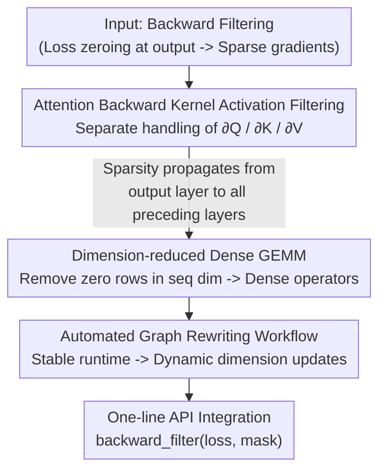

# Unlocking Full Efficiency of Token Filtering in Large Language Model Training

**Conference**: ICLR 2026  
**OpenReview**: [https://openreview.net/forum?id=eshXwEnENV](https://openreview.net/forum?id=eshXwEnENV)  
**Code**: To be confirmed (Paper claims it is encapsulated as a one-line `centrifuge.ops.backward_filter` API)  
**Area**: LLM Efficiency / Training Systems / Algorithm-System Co-design  
**Keywords**: Token Filtering, Backward Sparsity, FlashAttention, Dimension-reduced GEMM, Computational Graph Rewriting

## TL;DR
Addressing the paradox where "token filtering improves model performance but saves almost no training time," this paper proposes CENTRIFUGE. It further filters activations of discarded tokens within the attention backward kernel, propagating sparsity from the output layer through all preceding layers. By replacing inefficient sparse GEMMs with "dimension-reduced dense GEMMs," it enables real speedups at "intermediate" sparsity levels (30%–50%). It achieves up to 49.9% backward speedup and 34.7% end-to-end speedup when filtering 50% of tokens, fully preserving the accuracy gains of token filtering (up to +26.6%).

## Background & Motivation
**Background**: Token filtering is a recently proposed training paradigm where a reference model evaluates the importance of each token to discard noisy tokens that contribute little to training. Among these, **backward filtering** performs best—forward passes proceed normally, but during loss calculation at the output layer, only the top-k% important tokens are kept while the loss for others is zeroed. This implicitly improves data quality, yielding up to a 30% absolute accuracy improvement across various tasks.

**Limitations of Prior Work**: Ideally, "fewer tokens = less computation = faster training." However, empirical tests show that integrating token filtering into existing training systems yields a meager **1.2%** end-to-end speedup even when dropping 40% of tokens. The promised computational savings fail to materialize.

**Key Challenge**: The problem lies in two areas. First, **sparsity fails to propagate**: existing methods only zero out the loss at the output layer, creating sparse gradients, but activations in preceding layers remain dense. Once sparse gradients multiply with dense activations, the signal becomes dense again after the first attention block. Thus, only the last layer's backward pass saves time. For TinyLlama, this results in a maximum 1.8% backward and 1.2% end-to-end saving. Second, **the sparsity range is unsuitable**: token filtering typically yields 30%–50% sparsity, while sparse GEMMs in existing ML libraries (e.g., `torch.sparse`) only become efficient at >95% sparsity. In the 40% range, sparse GEMMs can be 10$\times$ slower than dense GEMMs.

**Failure of Naive Solutions**: One intuitive fix is "filtering activations as well"—zeroing out parts of the softmax activations corresponding to dropped tokens. However, mainstream training systems use memory-efficient attention (e.g., FlashAttention), which **does not explicitly store softmax outputs**, making direct filtering impossible. If one filters Q/K/V activations instead, the backward recomputation of softmax causes **interference** between different gradient outputs, particularly harming $\partial Q$, leading to non-convergence.

**Goal**: Truly release training efficiency gains without losing the accuracy benefits of token filtering.

**Core Idea**: At the algorithm level, "realize" sparsity by filtering only the necessary $\partial K/\partial V$ activations while sparing $\partial Q$, ensuring sparsity propagates through all layers while remaining compatible with FlashAttention. At the system level, replace "sparse GEMM" with "dimension-reduced dense GEMM," continuing to leverage highly optimized dense operators.

## Method

### Overall Architecture
CENTRIFUGE solves the deployment hurdle of token filtering being "nominally sparse but practically expensive" through **algorithm-system co-design**. The algorithm level decomposes the backward process into inter-token (attention blocks) and intra-token (FFN, Q/K/V projection, head merging) computations. Recognizing that the required sequence-dimension sparsity is generated only by attention blocks, it modifies only the attention backward kernel—handling the three gradient outputs separately, filtering $\partial K/\partial V$ activations while keeping $\partial Q$ activations intact to amplify sparsity without interference. Once sparsity is "realized" in the sequence dimension, the system level takes over: after analyzing the backward computational graph, it finds that "downstream gradients naturally inherit sparsity, and the sequence dimension disappears in parameter gradients." It then **removes zero rows** in the sequence dimension, reducing sparse GEMMs to lower-dimensional dense GEMMs. Since PyTorch dynamic graphs cannot be rewritten with static rules, an **automated workflow** uses "runtime stability" to dynamically identify and update nodes requiring dimension changes before each backward pass. Ultimately, for systems already using token filtering, full acceleration is achieved with a single line of code.

### Key Designs

**1. Separate handling of gradients in the attention backward kernel to preserve sparsity via $\partial K/\partial V$ filtering**

This addresses the "propagation failure" and "naive filtering harm to $\partial Q$." The authors decompose the decoder backward pass into inter-token (attention) and intra-token (FFN, projection, head merging) computations, noting that sequence-dimension sparsity is **only generated by attention blocks**. Thus, only the attention backward kernel needs modification. Analysis of the three outputs of the FlashAttention backward kernel shows: the row-sparsity of $\partial Q$ follows the attention forward output $\mathrm{Attn}=\mathrm{softmax}(QK^T/\sqrt{d})V$; **as long as the input gradient is sparse, $\partial Q$ is naturally zero at dropped token positions**. However, row-sparsity for $\partial K$ and $\partial V$ follows the dense matrix $Q$, remaining non-zero at dropped positions, which **must be filtered** to maintain sparsity.

The conflict is that calculating $\partial K/\partial V$ requires only the filtered K/V activations, while calculating $\partial Q$ requires **complete** K/V activations. CENTRIFUGE reorders the FlashAttention backward flow into two paths using different activations: one uses **filtered** token activations for $\partial K, \partial V$, and the other uses **all** token activations (including dropped ones) for $\partial Q$. Let the kept and dropped activations be $\hat A\in\mathbb{R}^{b\times s_1\times h}$ and $\check A\in\mathbb{R}^{b\times s_2\times h}$ ($s=s_1+s_2$):

$$\partial K=\partial\hat S^{T}\hat Q,\quad \partial V=\hat P^{T}\partial\hat O,\quad \partial Q=\partial\hat S\,\hat K+\partial\check S\,\check K$$

Where $\hat P=\exp(\hat S-\widehat{LSE})$ and $\partial\hat S=\hat P\circ(\partial\hat P-\hat D)$, following FlashAttention notation. The three outputs are unified to $\mathbb{R}^{b\times s_1\times h}$, keeping only $s_1$ tokens. This ensures compatibility with memory-efficient attention, propagates sparsity, and maintains gradient correctness.

**2. Converting sparse GEMM to dimension-reduced dense GEMM**

After "realizing" sparsity at the algorithm level, the system level still faces the bottleneck that sparse GEMMs are slower at 30%–50% sparsity. Instead of optimizing sparse operators, the authors analyzed common structures in backward computational graphs: nodes receive sparse gradients $G\in\mathbb{R}^{b\times s\times h_1}$ (where dropped token rows are zero). Outputs are two-fold: ① Downstream gradients $G_X=G\cdot W$ or $G\circ g$, which **inherit the row-sparsity** of the input; ② Parameter gradients $G_W=X^T\cdot G$, where the sequence dimension **disappears from the result**. Both conclusions suggest **simply removing zero rows** in the sequence dimension.

Consequently, sparse GEMMs are rewritten as "sequence dimension contraction followed by dense GEMM." This is more efficient because dense GEMMs are extremely optimized. Dimension reduction also reduces communication volume, which is why CENTRIFUGE shows the most significant gains in Tensor Parallelism (TP) scenarios.

**3. Automated dynamic graph rewriting via "Runtime Stability"**

Dimension reduction is difficult in PyTorch because dynamic graphs change based on implementation and input. The authors observed **runtime stability**: for a given model and input type, the computational graph remains stable throughout training. An automated workflow first uses a dummy input to traverse the graph and identify node properties, then uses **special markers** (like prime numbers) to track dimensions needing updates. This allows dynamic identification and dimension reduction of nodes and variables before each backward pass with negligible offline overhead.

### Loss & Training
The training objective follows the backward token filtering of Lin et al. (2024): backpropagate loss only for the kept $k\%$ tokens,

$$\mathcal{L}_{\text{filter}}=-\frac{1}{N\times k\%}\sum_{i=1}^{N} I_{k\%}(x_i)\log P_\theta(x_i\mid x_{<i};\theta)$$

where $I_{k\%}(x_i)=1$ iff $x_i$ is in the top-k% of $(L_\theta(x_i)-L_{\text{ref}}(x_i))$. CENTRIFUGE only changes the backward computation method; thus, **accuracy gains are identical to the original token filtering**, with the difference being efficiency.

## Key Experimental Results

### Main Results
Setup: 8$\times$RTX 3090 (24GB) / 8$\times$H20-96GB, PyTorch 2.8.0, CUDA 12.8, BF16. Tasks focused on mathematical reasoning; target models fine-tuned on open-web-math (OWM) with reference models trained on high-quality math data. Models: 1.1B to 40B.

Accuracy (TinyLlama-1.1B base, average of 9 tasks):

| Method | Training Data | GSM8K | MAWPS | Average |
|------|----------|-------|-------|------|
| No Finetuning | — | 2.3 | 20.2 | 13.7 |
| Regular Finetuning | OWM (Full) | 3.6 | 36.2 | 17.8 |
| CENTRIFUGE | OWM (50% Filtered) | 11.8 | 62.8 | 27.3 |

Compared to regular training, single-task gains reached up to +26.6% (MAWPS), validating that "calculating only half the tokens is better."

Efficiency (50% tokens filtered, time to process 1M tokens, selected):

| Model | Training Type | Backward | End-to-End |
|------|----------|------|--------|
| TinyLlama-1.1B (4K) | DP=4 | ↓40.0% | ↓24.2% |
| Llama3.2-3B (2K) | LoRA Single Card | ↓43.1% | ↓17.9% |
| Llama3.1-8B (2K) | TP=8 | ↓49.0% | ↓31.7% |
| Qwen3-14B (2K) | TP=8 | ↓49.9% | ↓34.7% |
| ALIA-40B (4K) | TP=8 | ↓43.4% | ↓24.7% |

Backward acceleration: 40.0%–49.9%; End-to-end: 17.9%–34.7%. Acceleration is highest in TP because communication decreases linearly with activation filtering.

### Ablation Study

| Configuration | Phenomenon | Explanation |
|------|------|------|
| Loss filtering only (Lin et al. 2024) | Normal convergence, but only +1.2% E2E | Sparsity doesn't propagate, saves no time |
| Strawman (Directly filter softmax activation) | Training loss **diverges** | Harms $\partial Q$, conflicts with FlashAttention |
| CENTRIFUGE | Convergence curve identical to "Loss filtering only" | Preserves accuracy while truly accelerating |

### Key Findings
- **"Realizing" sparsity is the core contribution**: Naive loss filtering only yields 1.2% speedup; CENTRIFUGE converts the same sparsity into up to 34.7% speedup by propagating it to preceding layers.
- **Compute-heavy/Communication-heavy scenarios gain most**: Throughput advantage grows from 1.12$\times$ to 1.40$\times$ as context increases from 1K to 4K; long context, large models, and TP scenarios benefit most.
- **Graph rewriting overhead is manageable**: While the filter operator overhead grows with model size, it remains much smaller than the time saved and can be hidden by overlapping with forward passes.

## Highlights & Insights
- **The diagnosis "Sparsity exists but doesn't propagate" is crucial**: By splitting backward into inter/intra token tasks and modifying only the attention backward kernel, the authors avoided a massive overhaul of the entire backward pass.
- **Converting to dense instead of optimizing sparse**: Since sparse GEMMs cannot outperform dense ones at 30%–50% sparsity, "dropping zero rows + dense GEMM" allows the system to ride the optimization wave of existing libraries. This "bypass rather than brute-force" engineering choice is noteworthy.
- **Insight into $\partial Q$ vs $\partial K/\partial V$ separation**: Recognizing that $\partial Q$ depends on attention output while $\partial K/\partial V$ depends on dense $Q$ is the watershed between the failed strawman and the success of CENTRIFUGE.
- **One-line integration**: Hiding complexity in a `backward_filter` API makes it zero-cost for systems already using token filtering.

## Limitations & Future Work
- **Dependency on "Runtime Stability"**: If the graph changes during training (e.g., dynamic control flow, frequent changes in variable-length batch structures), the deterministic premise of the workflow may fail.
- **Linear scaling of filter operator overhead**: Graph updates for each layer in massive models may become non-negligible, despite being hidable.
- **MoE Load Balancing**: The impact of token filtering on MoE load balancing is unclear and requires specific handling to maximize efficiency.
- **Focus on backward filtering + SFT**: Experiments focused on math fine-tuning; the combined effect of forward filtering and long-sequence (128K) compression is left for future work.

## Related Work & Insights
- **vs. Loss-only Token Filtering (Lin et al. 2024)**: They offer the same accuracy gains but E2E speedup is only 1.2%; CENTRIFUGE is the "efficiency-complete" version.
- **vs. Strawman (Softmax/QKV filtering)**: Naive filtering conflicts with memory-efficient attention and harms $\partial Q$; CENTRIFUGE's separation of triple gradient outputs is the key differentiator for working with FlashAttention.
- **vs. Data Selection**: Data selection occurs at the sample level before training, potentially introducing bias; CENTRIFUGE is a token-level, model-adaptive fine-grained selection.
- **vs. Parameter-Efficient Fine-Tuning (LoRA)**: These are complementary (data dimension vs. parameter dimension sparsity); CENTRIFUGE still yields 43.1% backward acceleration when stacked with LoRA.

## Rating
- Novelty: ⭐⭐⭐⭐⭐ Diagnoses the root cause as sparsity propagation failure and provides non-trivial solutions at both algorithm and system levels.
- Experimental Thoroughness: ⭐⭐⭐⭐ Covers 1.1B to 40B models across DP/TP/LoRA; accuracy and efficiency both validated. However, tasks are concentrated on math SFT; pre-training scenarios not fully covered.
- Writing Quality: ⭐⭐⭐⭐⭐ Observation-driven with clear strawman comparisons; equations and diagrams are well-integrated.
- Value: ⭐⭐⭐⭐⭐ Plug-and-play one-line API offers direct value to existing token filtering training systems.

<!-- RELATED:START -->

## Related Papers

- [\[ICLR 2026\] ParaRNN: Unlocking Parallel Training of Nonlinear RNNs for Large Language Models](pararnn_unlocking_parallel_training_of_nonlinear_rnns_for_large_language_models.md)
- [\[ICLR 2026\] Demystifying and Enhancing the Efficiency of Large Language Model Based Search Agents](demystifying_and_enhancing_the_efficiency_of_large_language_model_based_search_a.md)
- [\[ICLR 2026\] Scaling Large Vision-Language Model RL Training via Efficient Load Balancing](scaling_large_vision-language_model_rl_training_via_efficient_load_balancing.md)
- [\[ICLR 2026\] Explainable Token-level Noise Filtering for LLM Fine-tuning Datasets](explainable_token-level_noise_filtering_for_llm_fine-tuning_datasets.md)
- [\[ICLR 2026\] ReFusion: A Diffusion Large Language Model with Parallel Autoregressive Decoding](refusion_a_diffusion_large_language_model_with_parallel_autoregressive_decoding.md)

<!-- RELATED:END -->
