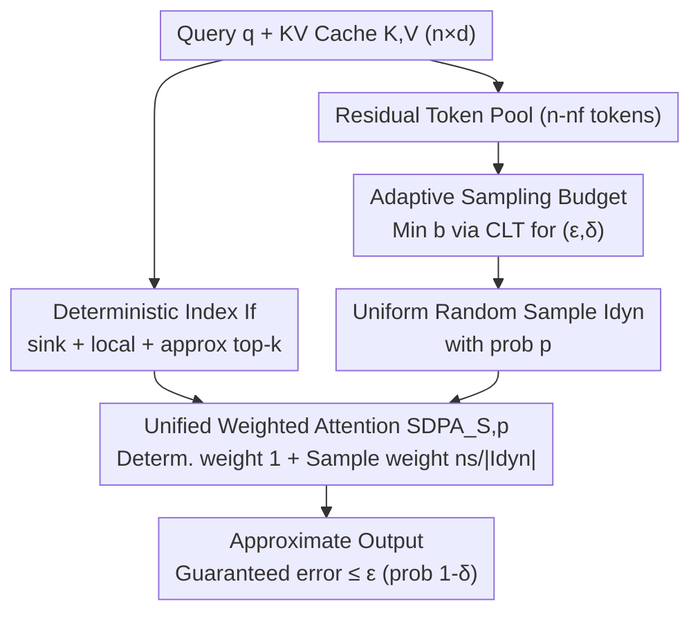

# vAttention: Verified Sparse Attention via Sampling

**Conference**: ICLR 2026  
**OpenReview**: [https://openreview.net/forum?id=zzTDulLys0](https://openreview.net/forum?id=zzTDulLys0)  
**Code**: To be confirmed  
**Area**: LLM Efficiency / Sparse Attention  
**Keywords**: Sparse Attention, KV Cache, Sampling Estimation, Approximation Guarantees, Long Context Decoding

## TL;DR
vAttention unifies "deterministic top-k selection of key tokens" and "random sampling of the long tail" into a single attention calculation framework. By using the Central Limit Theorem to adaptively determine the sampling budget, it provides the first user-specified $(\epsilon, \delta)$ approximation guarantee for each attention head. On RULER-HARD at 10% sparsity, it outperforms HashAttention by approximately 4.5 percentage points.

## Background & Motivation
**Background**: During the LLM decoding stage, the entire KV Cache must be repeatedly read for each new token. As context length grows, this becomes a memory bandwidth bottleneck, often exceeding KV Cache capacity and requiring slow offloading to CPU memory. The primary acceleration method is sparse attention, which only computes attention for a subset of the KV Cache. Current approaches fall into two categories: approximate top-k (and its variants like top-p) and recent sampling-based estimation (e.g., MagicPig).

**Limitations of Prior Work**: Top-k methods assume that the semantics of the current token are determined by only a few tokens in the context, treating information as discrete units. However, attention scores are not always sharply distributed—especially in shallower layers or when semantics are dispersed across many tokens, leading to near-uniform scores where top-k selection causes severe distortion. Top-p attempts to adaptively select tokens based on cumulative scores but becomes inefficient when scores are uniform. Most critically, neither top-k, top-p, nor MagicPig provides any **approximation quality guarantees**, preventing users from controlling the trade-off between precision and speed.

**Key Challenge**: Attention output is essentially the sum of $n$ quantities (normalized by a scalar sum). When the sum is dominated by a few large terms, selecting those heavy-hitters is the best approximation. When terms are similar in value, random sampling can approximate the sum with a small sample size. Top-k excels in the former, while sampling excels in the latter. Real attention distributions switch between these scenarios across different heads and queries. Ablations on GSM-Infinite verify that the performance ranking of oracle-top, random-sample, and MagicPig is **inconsistent across heads within the same query and across queries within the same head**.

**Goal**: (1) Integrate top-k and sampling into a single mechanism that performs well under both distributions; (2) Provide user-specified approximation guarantees for every head.

**Key Insight**: The authors found that top-k and random sampling are naturally complementary. Deterministic indexing captures heavy-hitters, while uniform sampling estimates the "long-tail residual" sum remaining after the heavy-hitters are removed. Once large outliers are excluded, the sampling converges quickly, and the statistical convergence of sampling can provide the required error guarantees.

**Core Idea**: Replace pure top-k with "deterministic selection of heavy-hitters + uniform sampling of the tail, with the minimum sampling budget $b$ determined by the CLT to satisfy $(\epsilon, \delta)$." This results in the first "verified" sparse attention.

## Method

### Overall Architecture
vAttention performs the same operation at each head and layer: it splits the attention token indices into a **deterministic part** and a **random part**, then calculates attention using a unified (probability-weighted) formula. The deterministic part includes three types of "important tokens": attention sinks (initial tokens), the local window (recent tokens), and high-scoring tokens predicted by an existing approximate top-k method (e.g., HashAttention). Together, these are denoted as $I_f$, consisting of $n_f$ tokens. The remaining $n_s = n - n_f$ tokens form the "long-tail residual," from which vAttention **uniformly and randomly samples** $b$ indices $I_{dyn}$ to estimate the residual contribution to the numerator and denominator.

Crucially, $b$ is not fixed. vAttention uses a small set of pilot samples to estimate residual statistics (variance/trace) and calculates the minimum sampling budget required for both the numerator and denominator to meet the $(\epsilon, \delta)$ precision. Index selection and budget calculation are performed on the GPU, while the final attention calculation can fetch KV values from either GPU or CPU, supporting KV Cache offloading.

### Key Designs

**1. Unifying top-k and Sampling: Deterministic Heavy-hitters + Unbiased Tail Estimation**

This directly addresses the contradiction where top-k fails in uniform distributions and sampling is wasteful in sharp ones. vAttention defines the index set as $S = I_f \cup I_{dyn}$, with each index carrying a sampling probability $P_i$. For deterministic indices $i \in I_f$, $P_i = 1$; for residual sampled indices $i \in I_{dyn}$, $P_i = |I_{dyn}|/n_s$. The numerator and denominator are calculated as an **importance-weighted sum**:

$$N = \underbrace{\sum_{i \in I_f} \exp\langle K[i],q\rangle V[i]}_{\text{Deterministic } N_f} + \underbrace{\frac{n_s}{|I_{dyn}|}\sum_{j \in I_{dyn}} \exp\langle K[j],q\rangle V[j]}_{\text{Sampled Residual } N_{dyn}}$$

The denominator $D$ is calculated similarly. The coefficient $\frac{n_s}{|I_{dyn}|}$ is critical: it scales the sample sum back to the residual total, making the sampled sum an **unbiased estimator** of the true residual sum. This formula (Equation 3 in the paper) naturally covers both pure deterministic selection and mixed strategies. Unlike top-k, which simply discards the tail, this method preserves the long-tail contribution unbiasedly, which is why vAttention remains robust when distributions are near-uniform.

**2. Adaptive Sampling Budget: Translating Error Tolerance to Minimum Sample Size via CLT**

Sampling alone is insufficient for "guarantees." vAttention's theoretical core is a lemma for estimating vector sums: to estimate the sum $s$ of $n_s$ vectors $r_i$ using a sample of size $b$, the estimate $\hat{s}_b = \frac{n_s}{b}\sum_{i \in I_b} r_i$ satisfies:

$$b \ge \left(\Phi^{-1}\!\left(1-\tfrac{\delta}{2}\right)\frac{n_s\sqrt{\mathrm{Tr}(\Sigma)}}{\tau}\right)^2 \quad\Rightarrow\quad \Pr(\|\hat{s}-s\|_2 > \tau) \le \delta$$

where $\Sigma$ is the covariance matrix of the residual population and $\Phi$ is the normal CDF. By setting $\tau$ to $\epsilon\|N\|_2$ (numerator) and $\epsilon D$ (denominator), the budgets $b_N$ and $b_D$ are obtained. Intuitively, more samples are needed if the residuals are more dispersed ($\mathrm{Tr}(\Sigma)$ is large) or if requirements are stricter (small $\epsilon$ or $\delta$). Since $\Sigma$, $\|N\|_2$, and $D$ are unknown a priori, the algorithm uses a small fraction $f_b$ as pilot samples to estimate them (Algorithm 2 in the paper).

**3. verified-SDPA: Synthesizing Component Guarantees for Attention Output**

Guarantees for the numerator and denominator do not automatically guarantee the ratio (attention output). The paper uses Lemma 4.2 to bridge this: if the numerator satisfies $(\epsilon_1, \delta_1)$ and the denominator satisfies $(\epsilon_2, \delta_2)$ with $\epsilon_2 < 0.5$, then setting $b = \max(b_D, b_N)$ ensures:

$$\Pr\!\left(\left\|\tfrac{N}{D}-\tfrac{\hat{N}}{\hat{D}}\right\|_2 > 2(\epsilon_1+\epsilon_2)\left\|\tfrac{N}{D}\right\|_2\right) < \delta_1+\delta_2$$

Theorem 4.3 further optimizes the budget allocation over $(\epsilon', \delta')$ to satisfy the user-given $(\epsilon, \delta)$ for the final output. This is the source of the "verified" tag: it translates the abstract "relative error $\le \epsilon$ with confidence $1-\delta$" into an executable sampling budget. Experiments show a near-perfect linear correlation between the user-set $\epsilon$ and observed error.

### Loss & Training
vAttention is a pure inference-time method that requires no training or fine-tuning. It can be applied directly to existing models. Hyperparameters include proportions for deterministic tokens $f_s, f_l, f_t$ (sink/local/top-k), pilot sample rate $f_b$, and the user-defined $(\epsilon, \delta)$. Consistent with prior work, full attention is used during context processing, while sparse attention is applied during question answering and generation.

## Key Experimental Results

### Main Results
RULER32K-HARD (7 sub-tasks from RULER where top-k methods struggle), average performance at 10% sparsity:

| Model | SDPA (Full) | oracle-top-k | vAttention (oracle-top-k) | HAT | vAttention (HAT) |
|------|------|------|------|------|------|
| Llama-3.1-8B-Inst | 88.74 | 87.18 | **88.61** | 81.94 | **86.56** |
| Deepseek-R1-Distill-Llama-8B | 65.41 | 64.87 | **65.15** | 60.70 | **65.06** |
| Mistral-7B-Inst-v0.3 | 64.05 | 64.37 | 64.12 | 54.66 | **56.90** |

vAttention (HAT) improves over vanilla HashAttention by ~4.6 points on Llama-3.1-8B and ~4.3 points on Deepseek-R1. vAttention (oracle-top-k) nearly matches full attention. Pareto curves show that vAttention outperforms all baselines, including oracle top-p, in quality-density and error-density trade-offs, matching full model quality at up to 20× sparsity across datasets.

### Long Generation & Reasoning
AIME2024 (DeepSeek-R1-Distill-Llama-8B, up to 32K tokens, $\epsilon=\delta=0.05$, un-tuned):

| Configuration | avg@4 |
|------|------|
| Dense (Full Attention) | 36.66 |
| vAttention (oracle-top-k) | 36.67 |
| vAttention (HashAttention) | 35.00 |

At ~10–15% density for 32K token generation, vAttention maintains full model accuracy, demonstrating that low approximation error prevents error accumulation in long-chain reasoning.

### Key Findings
- **Top-k accuracy still matters**: vAttention (oracle-top-k) consistently outperforms vAttention (HAT), suggesting vAttention complements rather than replaces top-k.
- **The $\epsilon$ knob is effective**: There is a near-linear correlation between user-specified $\epsilon$ and actual layer-wise attention error, offering unique controllability.
- **Efficiency scales linearly with density**: When KV Cache is on CPU (making decoding bandwidth-bound), latency depends on the amount of KV data read. vAttention achieves near-linear speedup even with a naive PyTorch implementation.
- **MagicPig underperforms in this setting**: Pure LSH sampling is unstable when context processing uses full attention while generation uses sparse attention.

## Highlights & Insights
- **Error guarantees as a user knob**: Unlike previous methods where quality is unpredictable for a given sparsity, vAttention allows users to define error tolerance $\epsilon$ and automatically computes the required tokens.
- **Complementarity insight**: The intuition "select heavy-hitters if they exist, otherwise sample" is a clean and powerful way to approximate sums in SDPA.
- **High Composability**: Any approximate top-k method (HashAttention, DoubleSparsity) can be used for the deterministic part.
- **Unbiased re-weighting** is a transferable technique for any "heavy-hitter + estimated tail" sparse computation scenario.

## Limitations & Future Work
- **Local vs. End-to-end guarantees**: Guarantees apply to head outputs, not directly to final model predictions or downstream accuracy, though they are strongly correlated.
- **Dependency on statistical estimation**: Budgets depend on pilot samples; CLT approximations may be inaccurate for very small samples.
- **CPU-hosted focus**: Efficiency is primarily demonstrated for CPU-offloaded KV Cache; dedicated CUDA kernels for GPU scenarios are left for future work.
- **Overhead**: Maintaining sampling caches and computing budgets adds overhead that may offer diminishing returns in very sharp distributions.

## Related Work & Insights
- **vs. Top-k/Top-p (Quest, InfLLM, HashAttention, Tactic)**: These lack approximation guarantees. vAttention shows that even exact top-k is insufficient; the tail must be recovered unbiasedly.
- **vs. MagicPig (LSH Sampling)**: vAttention is inspired by it but uses uniform sampling for the tail after removing heavy-hitters, rather than data-independent LSH, providing explicit $(\epsilon, \delta)$ links to the budget.
- **vs. kNN-Attention/Linformer**: Those require training or architectural changes, whereas vAttention is a plug-and-play inference-time method.

## Rating
- Novelty: ⭐⭐⭐⭐⭐ First practical sparse attention with user-controllable $(\epsilon, \delta)$ guarantees.
- Experimental Thoroughness: ⭐⭐⭐⭐ Covered 3 models and 4 benchmarks, though efficiency results rely on naive implementations.
- Writing Quality: ⭐⭐⭐⭐ Clear progression from motivation to theory and algorithm.
- Value: ⭐⭐⭐⭐⭐ Transforming error into a calibratable engineering knob is significant for reliable deployment.

<!-- RELATED:START -->

## Related Papers

- [\[ICLR 2026\] Sparse Attention Adaptation for Long Reasoning](sparse_attention_adaptation_for_long_reasoning.md)
- [\[ICLR 2026\] RESA: Bringing Back What Sparse Attention Ignores with Residual Estimation](resa_bringing_back_what_sparse_attention_ignores_with_residual_estimation.md)
- [\[ICLR 2026\] Tactic: Adaptive Sparse Attention with Clustering and Distribution Fitting for Long-Context LLMs](tactic_adaptive_sparse_attention_with_clustering_and_distribution_fitting_for_lo.md)
- [\[ICLR 2026\] Understanding and Improving Length Generalization in Hierarchical Sparse Attention Models](understanding_and_improving_length_generalization_in_hierarchical_sparse_attenti.md)
- [\[ICLR 2026\] Retrospective Sparse Attention for Efficient Long-Context Generation](retrospective_sparse_attention_for_efficient_long-context_generation.md)

<!-- RELATED:END -->
