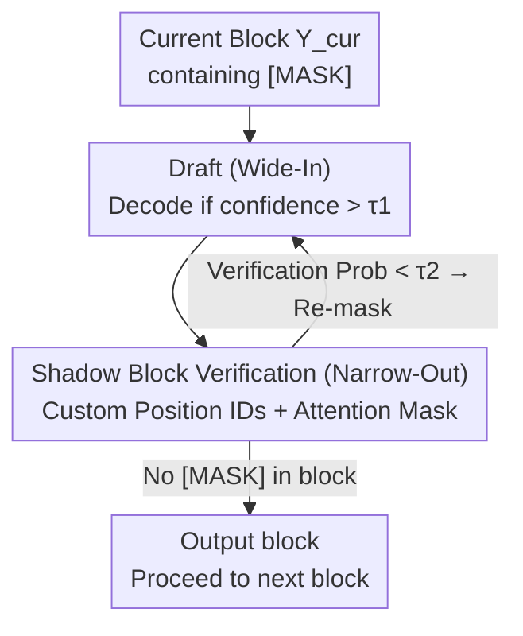

# Wide-In, Narrow-Out: Revokable Decoding for Efficient and Effective DLLMs

**Conference**: ICLR 2026  
**Paper**: [OpenReview / ICLR 2026 Conference Version](https://github.com/Feng-Hong/WINO-DLLM)  
**Code**: https://github.com/Feng-Hong/WINO-DLLM (Available)  
**Area**: Diffusion Language Models / LLM Efficiency  
**Keywords**: Diffusion Large Language Models, Parallel Decoding, Revokable Decoding, Draft-and-verify, Inference Acceleration

## TL;DR
Addressing the "quality-speed dilemma" in Diffusion Large Language Models (DLLMs) where parallel decoding inevitably leads to performance degradation, this paper proposes WINO, a training-free decoding algorithm. By employing a parallel draft-and-verify mechanism—consisting of a low-threshold "aggressive drafting (Wide-In)" and a high-threshold "strict verification and re-masking of suspicious tokens (Narrow-Out)"—early errors can be revoked and rewritten with richer subsequent context. This achieves a $6\times\sim10\times$ speedup on LLaDA / MMaDA while even improving accuracy.

## Background & Motivation
**Background**: Autoregressive (AR) LLMs generate tokens one by one, which is inherently serial, high-latency, and prone to error propagation along the generation direction. Diffusion Large Language Models (DLLMs, such as LLaDA and MMaDA) offer a non-autoregressive alternative: starting from a sequence of all `[MASK]` tokens, they predict multiple positions simultaneously using bidirectional attention. Theoretically, this allows for massive parallel acceleration; closed-source systems (e.g., Mercury Coder, Gemini Diffusion) have already demonstrated speeds of thousands of tokens per second.

**Limitations of Prior Work**: Open-source DLLMs are trapped in a severe "quality-speed trade-off." To obtain high-quality output, models are often forced to degenerate into decoding only 1 token per step ($K=L$), effectively abandoning their main selling point of parallelism. Switching to naive parallel sampling (decoding multiple tokens per step) causes a significant drop in accuracy—for instance, on GSM8K, decoding 4 tokens per step causes accuracy to plummet from $73.24\%$ to $64.67\%$.

**Key Challenge**: The authors attribute the root cause to the **irreversibility** of standard DLLM decoding. In the standard process, once a greedy decision is made to fill a `[MASK]` with a token, the decision is final; it cannot be modified even when more context becomes available in later steps. During parallel decoding, the earliest tokens are determined when the context is most sparse and information is minimal, leading to the highest probability of error. Once these early errors are "locked in," they accumulate and propagate, contaminating the entire output. Consequently, DLLMs fail to leverage their greatest advantage—bidirectional attention—which could have corrected early mistakes as context enriched.

**Goal**: To break the cycle of "early decoding leading to irreversible errors" without retraining, enabling DLLMs to be both aggressively parallel and high-quality in a plug-and-play manner.

**Key Insight**: Since the problem lies in the "irreversibility of decisions," the decoding process should be endowed with **revocation** capabilities—allowing the model to "look back" during decoding and revert suspicious tokens back to `[MASK]`, leaving them to be rewritten in later steps when the context is more sufficient.

**Core Idea**: Replace the standard one-shot greedy decoding with a "draft-and-verify" mechanism that uses "aggressive drafting + strict verification/re-masking," specifically Wide-In (low threshold for multiple solutions) + Narrow-Out (high threshold for strict verification).

## Method

### Overall Architecture
WINO operates on a standard semi-autoregressive paradigm (splitting the sequence into blocks and decoding block-by-block from left to right). The sequence is denoted as $Y=[Y_{left}, Y_{cur}, Y_{right}]$, where $Y_{left}$ contains the prompt and already-decoded blocks, $Y_{cur}$ is the current block being decoded, and $Y_{right}$ consists of tokens yet to be decoded. The core modification is changing "per-step decoding" from simply filling masks to performing two tasks in parallel within the **same forward pass**: **Drafting (Wide-In)**, which decodes all `[MASK]` positions in the current block with confidence exceeding a low threshold $\tau_1$; and **Verification (Narrow-Out)**, which re-evaluates **all** decoded tokens using the richer global context and reverts those failing a high threshold $\tau_2$ back to `[MASK]`. These two steps refresh $Y_{cur}$ iteratively until no `[MASK]` remains in the block before moving to the next.

Verification is achieved in the same forward pass using an auxiliary **shadow block** $Y_{shad}$. A full block of `[MASK]` is appended to the sequence to form $\tilde Y=[Y_{left},Y_{cur},Y_{right},Y_{shad}]$. Its position IDs and attention masks are carefully designed so that shadow positions provide predictions without "seeing" the corresponding decoded tokens in $Y_{cur}$, acting as an unbiased double-check.

### Key Designs

**1. Revokable Decoding: Changing DLLM "Final Decisions" to "Recyclable Rewriting"**

This directly addresses the root cause of irreversibility. In standard DLLM decoding, a token is permanently fixed once decoded (per the greedy unmasking in Eq. 1); errors made under sparse early context are destined to be locked and propagated. WINO abandons this irreversibility assumption, allowing decoded tokens to be "recalled" as `[MASK]` for the model to re-decide as context grows. This maintains parallel efficiency while reintroducing "context-driven error correction." The entire draft-and-verify framework is designed to implement this principle—Drafting for "aggressive multi-decoding" and Verification for "revoking the unreliable."

**2. Draft (Wide-In): Aggressive Decoding with Low Thresholds to Open Speed Gains**

To address the slowness of decoding only 1 token per step, the Draft module at step $k$ performs parallel judgment on all `[MASK]` positions in the current block: if the max probability for a position exceeds a **relatively low** threshold $\tau_1$, it is decoded immediately:

$$y^{(k)}_{cur,l}=\arg\max_{v\in V}p_\theta(\hat y_{cur,l}=v\mid Y),\quad \text{if } \max_{v\in V}p_\theta(\hat y_{cur,l}=v\mid Y)>\tau_1 \text{ and } y^{(k-1)}_{cur,l}=\texttt{[MASK]}.$$

The threshold is kept low (tuned from $\{0.5, 0.6, 0.7\}$) intentionally: "Wide-In" means more candidate tokens are released per step, which is the primary source of acceleration. Any erroneous tokens introduced here are left to the verification module to revoke. Notably, while Drafting uses argmax by default, it seamlessly supports stochastic sampling by adding Gumbel noise (Gumbel-Max) before thresholding.

**3. Shadow Block Verification (Narrow-Out): High-Threshold Double-Check with Re-Masking**

This is the concrete implementation of the "revocation" capability. The verification module re-examines all decoded tokens at each step with expanded semantic information. The challenge is that if the model is directly asked "what token should be here," it can see its previously filled token, causing self-confirmation and information leakage. WINO solves this by appending a full-`[MASK]` shadow block $Y_{shad}=[\texttt{[MASK]}]\times L_b$ with two key designs:

- **Position ID**: Though physically at the end of the sequence, the shadow block is assigned **identical** position IDs to $Y_{cur}$. Thus, the output at shadow position $l$ aligns with the $l$-th position of $Y_{cur}$ for bitwise verification.
- **Attention Mask**: $Y_{left}, Y_{cur}, Y_{right}$ can attend to each other freely but **cannot** attend to $Y_{shad}$ (ensuring the addition of the shadow block doesn't change the original output, i.e., $p_\theta(\hat y_{cur,l}\mid Y)=p_\theta(\hat y_{cur,l}\mid \tilde Y)$). Conversely, each shadow token can attend to all tokens except "its corresponding token in $Y_{cur}$"—deliberately blocking this direct path to prevent the verification target from "spoiling" the answer.

Under this design, verification involves comparing the shadow position’s probability for the original decoded token against a high threshold $\tau_2$; if it is lower, the token is reverted to a mask:

$$y^{(k)}_{cur,l}=\texttt{[MASK]},\quad \text{if } p_\theta(\hat y_{shad,l}=y^{(k-1)}_{cur,l}\mid \tilde Y)<\tau_2 \text{ and } y^{(k-1)}_{cur,l}\neq\texttt{[MASK]}.$$

Ablations show that while indirect attention paths theoretically exist within $Y_{cur}$, blocking the direct path is sufficient to prevent leakage in practice.

**4. Asymmetric Thresholds $\tau_1 < \tau_2$: The Tension between Wide-In and Narrow-Out**

The first two modules only function effectively when paired with asymmetric thresholds $\tau_1 < \tau_2$, which is the essence of the "Wide-In, Narrow-Out" naming. These three cases are merged into a unified update (Eq. 4): `[MASK]` positions exceeding $\tau_1$ are drafted; decoded tokens falling below $\tau_2$ are revoked; others remain unchanged. A low $\tau_1$ lowers the barrier for "entry" to accelerate, while a high $\tau_2$ raises the barrier for "exit" (staying decoded) to ensure quality. This cycle of "bold hypothesis and strict testing" breaks the binary opposition between speed and quality.

### Loss & Training
WINO is a **training-free, plug-and-play** decoding algorithm. it introduces no new parameters and requires no fine-tuning. It is applied directly to existing open-source DLLMs (LLaDA-8B-Instruct, MMaDA-8B-MixCoT). The only required settings are the two thresholds: the verification threshold $\tau_2=0.9$ is fixed, while the drafting threshold $\tau_1$ is tuned per task within $\{0.5, 0.6, 0.7\}$. The extra overhead comes primarily from shadow block computation, which is included in the TPS statistics.

## Key Experimental Results

### Main Results
On language tasks, WINO was applied to LLaDA (Gen length 256, block length 128, single A100), compared against standard decoding (1 token per step):

| Benchmark | Task Type | Metric | LLaDA | WINO | Step Reduction | TPS Speedup |
|-----------|-----------|--------|-------|------|----------------|-------------|
| GSM8K | Math Reasoning | Acc | 73.24 | 75.82 (+2.58) | 6.10× | 5.66× |
| ARC-E | Commonsense | Acc | 59.13 | 81.19 (+22.06) | 6.37× | 5.89× |
| ARC-C | Commonsense | Acc | 51.87 | 73.89 (+22.02) | 5.40× | 5.00× |
| Countdown | Logic | Acc | 24.21 | 33.20 (+8.99) | 2.41× | 2.26× |
| HumanEval | Code Gen | Acc | 37.80 | 42.07 (+4.27) | 2.74× | 2.56× |
| MBPP | Code Gen | Acc | 36.40 | 36.40 (+0.00) | 2.65× | 2.45× |

On multimodal tasks using MMaDA (CIDEr for Flickr30k, Acc for others):

| Benchmark | Task Type | Metric | MMaDA | WINO | Step Reduction | TPS Speedup |
|-----------|-----------|--------|-------|------|----------------|-------------|
| Flickr30k | Image Cap | CIDEr | 53.67 | 53.83 (+0.16) | 10.05× | 8.60× |
| AI2D | Chart Underst. | Acc | 54.86 | 57.19 (+2.33) | 8.30× | 7.30× |
| MMMU-val | Multi-disc. | Acc | 18.56 | 24.00 (+5.44) | 6.65× | 6.00× |
| ScienceQA | Multi-disc. | Acc | 30.89 | 42.24 (+11.35) | 9.10× | 8.15× |
| MathVista | Math Reason | Acc | 31.10 | 31.40 (+0.30) | 7.65× | 6.76× |

The speedups for multimodal tasks are generally higher than for language tasks (max 10.05× step reduction), and accuracy improves across most tasks.

### Ablation Study
Necessity of the Verification module and attention mask (GSM8K / MMMU-val):

| Config | GSM8K Acc | GSM8K Step Red. | MMMU Acc | Explanation |
|--------|-----------|------------------|----------|-------------|
| WINO (Full) | 75.82 | 6.10× | 24.00 | Draft + Verify + Correct Mask |
| Only Draft (τ1=0.6) | 70.28 | 7.36× | 19.89 | Significant drop without verification |
| Only Draft (τ1=0.9) | 72.33 | 3.15× | 18.56 | Single high threshold sacrifices speed, still worse than WINO |
| WINO (w/ Full Leakage) | 72.25 | 5.71× | 18.22 | Verification fails without blocking direct path |

### Key Findings
- **The revocation mechanism is the breakthrough**: Removing verification (Only Draft) increases speed but causes accuracy to drop (70.28 vs 75.82 on GSM8K). Compared to dynamic samplers without revocation (e.g., Fast-dLLM-parallel at 72.33% on GSM8K, or EB samplers with ~3× speedup but performance loss), WINO's 5.66× speedup while reaching 75.82% accuracy confirms that "revocability" is the key to breaking the trade-off.
- **Attention mask design is essential**: The "Full Leakage" variant (allowing direct attention to the target token) drops accuracy to 72.25, demonstrating that strict bitwise "blind checking" is a prerequisite for effective verification.
- **Acceleration is inversely correlated with task difficulty**: On simpler tasks or those the model is proficient in, more tokens are decoded with high confidence per step, leading to greater speedups (Flickr30k 10.05× vs MATH-Vision 5.73×). Across MATH-500 difficulty tiers, lower difficulty consistently yielded higher step savings, exhibiting adaptive properties.
- **Gains are more dramatic in full diffusion settings**: When block length equals generation length (full diffusion), LLaDA's accuracy on GSM8K drops significantly to 34.34%. WINO maintains 58.22% (+23.88) with a massive reduction in steps, indicating that WINO's potential is maximized in the most aggressive parallel scenarios.

## Highlights & Insights
- **Training-free & Plug-and-play**: It improves both speed and quality for existing DLLMs by simply replacing the decoder, making it highly practical for deployment.
- **Shadow Block + Position ID Reuse + Masking Trilogy**: Compressing the "unbiased double-check of decoded tokens" into the **same forward pass** avoids extra overhead and prevents leakage through "blocked self-attention." This acts as a reusable engineering trick—essentially a side-channel review that sees the global context but stays blind to its own "answer."
- **Philosophy of Asymmetric Thresholds**: Decoupling "aggressive exploration" from "conservative confirmation" via low entry and high retention thresholds is an insightful strategy ("Wide-In, Narrow-Out"). This approach is transferable to any draft-and-verify acceleration framework (e.g., speculative decoding acceptance criteria).
- **Adaptivity**: Since acceleration correlates with difficulty, WINO naturally provides adaptive compute allocation: simple samples run faster, while hard samples receive more steps.

## Limitations & Future Work
- The paper focuses on sampling compression; KV cache acceleration for bidirectional attention is explicitly out of scope. While TPS accounts for shadow block overhead, how this scales with long sequences or block lengths remains to be explored.
- Subsequent work COVER (Xiang et al., 2026) points out that WINO’s verification can lead to "flip-flop" oscillations (tokens being repeatedly revoked and redrafted), causing redundancy.
- Threshold $\tau_1$ requires manual tuning in $\{0.5, 0.6, 0.7\}$ based on the task, lacking an adaptive mechanism; while $\tau_2$ is fixed at 0.9, its generalizability across architectures requires further validation. ⚠️ Refer to Figure 4 in the original paper for threshold scanning details.
- Experiments focused on 8B scale models (LLaDA/MMaDA); effectiveness on larger scales or different DLLM architectures (e.g., VQ-diffusion) remains to be tested.

## Related Work & Insights
- **vs Naive Parallel Sampling**: Naive sampling decodes $M$ tokens per step but is irreversible, causing a drop to 64.67% on GSM8K ($M=4$). WINO matches this aggressiveness but corrects errors via verification.
- **vs Fast-dLLM-parallel / EB (Entropy-Bounded) Sampler**: These also perform dynamic decoding based on confidence/entropy but lack a **revocation mechanism**. Consequently, they remain limited by the trade-off (GSM8K ~72.33%, ~3× speedup). WINO's explicit verification module is the reason for its superior accuracy.
- **vs KV-cache Methods (Block Diffusion / Fast-dLLM-cache)**: These optimize cache reuse in bidirectional attention and are orthogonal to WINO's sampling optimization; they could theoretically be combined.
- **vs COVER (Follow-up Work)**: COVER uses in-place KV cache overrides to mitigate the oscillation and redundancy in WINO’s verification stage, addressing its efficiency bottlenecks.

## Rating
- Novelty: ⭐⭐⭐⭐⭐ Identifying "irreversibility" as the root of the DLLM trade-off and solving it via training-free revokable decoding with shadow blocks is both clean and ingenious.
- Experimental Thoroughness: ⭐⭐⭐⭐ Broad coverage across 8 language and 6 multimodal tasks, including full diffusion and threshold sweeps. However, results are limited to 8B models.
- Writing Quality: ⭐⭐⭐⭐⭐ The "Wide-In, Narrow-Out" naming is catchy and representative. The mechanism and mask diagrams are clear.
- Value: ⭐⭐⭐⭐⭐ High practical value due to being plug-and-play and simultaneously improving quality and speed.

<!-- RELATED:START -->

## Related Papers

- [\[ICLR 2026\] dParallel: Learnable Parallel Decoding for dLLMs](dparallel_learnable_parallel_decoding_for_dllms.md)
- [\[ICLR 2026\] Hierarchy Decoding: A Training-free Parallel Decoding Strategy for Diffusion Large Language Models](hierarchy_decoding_a_training-free_parallel_decoding_strategy_for_diffusion_larg.md)
- [\[ICLR 2026\] Libra: Effective yet Efficient Load Balancing for Large-scale MoE Inference](libra_effective_yet_efficient_load_balancing_for_large-scale_moe_inference.md)
- [\[ICLR 2026\] Fast-dLLM: Training-free Acceleration of Diffusion LLM by Enabling KV Cache and Parallel Decoding](fast-dllm_training-free_acceleration_of_diffusion_llm_by_enabling_kv_cache_and_p.md)
- [\[ICLR 2026\] Out of the Memory Barrier: A Highly Memory-Efficient Training System for LLMs with Million-Token Contexts](out_of_the_memory_barrier_a_highly_memory-efficient_training_system_for_llms_wit.md)

<!-- RELATED:END -->
