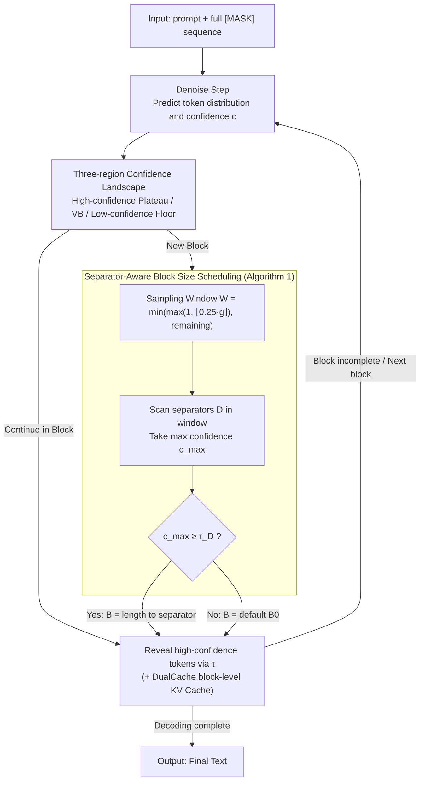

# AdaBlock-dLLM: Semantic-Aware Diffusion LLM Inference via Adaptive Block Size

**Conference**: ICLR 2026  
**arXiv**: [2509.26432](https://arxiv.org/abs/2509.26432)  
**Code**: [https://github.com/lgxi24/AdaBlock-dLLM](https://github.com/lgxi24/AdaBlock-dLLM)  
**Area**: Image Restoration  
**Keywords**: Diffusion Language Models, Semi-Autoregressive Decoding, Adaptive Block Size, Semantic-Aware Scheduling, Inference Acceleration

## TL;DR

By statistically analyzing the dynamic changes in token confidence during the denoising process of Diffusion Large Language Models (dLLMs), it was discovered that the "Volatility Band" (VB) region encodes the local semantic structure of the text. Consequently, AdaBlock-dLLM is proposed—a training-free, plug-and-play adaptive block size scheduler that naturally aligns the block boundaries of semi-autoregressive decoding with semantic steps, achieving up to a 5.3% accuracy improvement at the same throughput.

## Background & Motivation

**Background**: Diffusion Language Models (dLLMs) such as LLaDA and Dream gradually reveal a full [MASK] sequence into complete text through iterative denoising. Supporting parallel decoding inherently, they have matched the performance of autoregressive (AR) LLMs of similar scales on tasks like mathematical reasoning and code generation. In practical inference, block-level semi-autoregressive (semi-AR) decoding is the mainstream paradigm: the generated sequence is divided into fixed-size blocks, processed sequentially across blocks (supporting KV caching), while tokens within a block are revealed in parallel through multiple denoising steps, balancing speed and quality. Fast-dLLM further optimizes the speed-quality trade-off by introducing dynamic sampling based on a confidence threshold $\tau$, revealing only tokens with confidence higher than $\tau$.

**Limitations of Prior Work**: Through statistical analysis of LLaDA-8B on GSM8K, the authors quantified two systemic issues caused by fixed block sizes. Experiments show that at a block size of $B=32$, approximately 9.8% of sampling steps are affected by Late Decoding Overhead—where high-confidence tokens exist outside the current block but cannot be revealed, wasting denoising iterations. Simultaneously, approximately 7.7% of steps suffer from Premature Decoding Error—where low-confidence tokens within the current block are forced to commit, generating incorrect tokens that propagate through inter-block autoregressive dependencies. When the block size increases to $B=16$, the proportion of premature errors rises to 15.2% (HumanEval). The root cause of both issues is the mismatch between fixed block boundaries and the natural semantic boundaries of the text.

**Key Challenge**: The length of semantic units (phrases, clauses, reasoning steps) is variable, but fixed block sizes apply a "one-size-fits-all" approach to the decoding window. This leads to a dilemma: if the block is too small, confirmed tokens are delayed (loss of throughput); if the block is too large, uncertain tokens are forced to commit (loss of accuracy).

**Key Insight**: The authors performed a statistical analysis of the spatio-temporal distribution of token confidence during denoising, finding that the confidence landscape can be partitioned into three distinct regions: the high-confidence plateau (decoded tokens), the Volatility Band (VB, the active region being decoded), and the low-confidence floor (distant positions not yet reached). A key finding is that the width and position of the VB region are highly correlated with the local semantic structure of the text, while the decoding order within the VB is locally stochastic (unlike the global autoregressive trend in the plateau). This implies that the VB can serve as a proxy signal for semantic structure to guide the dynamic adjustment of block sizes.

**Core Idea**: At the beginning of each decoding block, the boundary of the current semantic step is located by detecting the confidence of separator tokens (e.g., newline `\n`), adaptively expanding or contracting the block size to align the block boundary with the semantic step.

## Method

### Overall Architecture

AdaBlock-dLLM addresses the misalignment between fixed block sizes and semantic boundaries in semi-AR decoding by embedding a lightweight scheduler into the existing decoding pipeline. For each new block, an appropriate block size is computed temporarily while maintaining the rest of the process. The input is a full [MASK] sequence with a prompt, and the output is the decoded complete text. The main loop is identical to Fast-dLLM—alternating between denoise (predicting token distributions and confidence) and sample (selecting tokens to reveal based on a threshold). Three key modifications correspond to specific designs: first, identifying the confidence landscape as three regions where the VB encodes local semantic structure (Design 1); second, inserting a block size determination process (Algorithm 1) at the start of each new block that dynamically sets $B$ based on separator token confidence (Design 2); and finally, revealing tokens within the block using threshold $\tau$ alongside block-level KV caching, where adaptive small blocks concurrently reduce cache approximation errors (Design 3). This method requires no model changes or training, merely adding a decision point within the decoding loop.

### Key Designs

**1. Three-region Partitioning of the Confidence Landscape: Identifying Semantic Signals**  
To implement adaptive block sizes, a signal reflecting semantic structure is required. The authors compiled statistics from 100 samples of LLaDA-8B-Base on GSM8K, plotting the position-confidence distribution at different decoding stages (after decoding 0/64/128/192/256 tokens). They found the landscape is stably divided into three parts. On the left is the **high-confidence plateau**: near decoded positions, confidence is stable near 1.0 and expands monotonically. Adjacent to the plateau is the **Volatility Band (VB)**: confidence fluctuates sharply between 0.1–0.8, with widths varying by sample; this is the active decoding region. To the right is the **low-confidence floor**: positions far from decoded areas where confidence approaches 0, and predictions are mostly non-content placeholders.  
The VB is critical because tokens predicted within it often belong to the same semantic unit (e.g., tokens within one reasoning step). Thus, the VB width and position naturally encode local semantic structures. However, VB width is too coarse to define the exact end of a semantic step. This necessitates a more precise signal to locate the semantic step finale.

**2. Separator-Aware Block Size Scheduling: Slicing Blocks via Separator Confidence**  
A finer signal comes from separator tokens. Characters like `\n`, commas, and periods naturally mark semantic boundaries and exhibit significant confidence drops within the VB. Using separator confidence to judge block boundaries is more precise than estimating VB width. Specifically, Algorithm 1 runs before each new block: a sampling window $W$ is defined starting from the current decoding position $g$, with width $\min(\max(1, \lfloor 0.25 \cdot g \rfloor), \text{remaining})$. Using one-fourth of $g$ avoids over-extending the window early on and misidentifying a distant EOS as a boundary. The algorithm scans window positions, selects those where predicted tokens are in the separator set $D$ (default $D=\{\textbackslash n\}$), and identifies the maximum confidence $\hat{y}_{\max}$. If $c_{\max} \ge \tau_D$ (separator threshold), it indicates the model has a reliable signal that the semantic step ends there. The block size is then set to the length from $g$ to that separator, aligning the boundary with the semantic end. If no separator exists or confidence is too low, it reverts to the default $B_0$.

**3. Synergy with KV Caching: Reducing Cache Approximation Errors**  
Semi-AR decoding allows for block-level KV caching (e.g., DualCache). AdaBlock amplifies these benefits because dLLM block-level caching is inherently approximate: unlike autoregressive models, key/value tensors in dLLMs change across denoising steps, and retrieval within blocks is non-sequential. Larger blocks increase intra-block semantic inconsistency and approximation error. AdaBlock mitigates this by reducing the actual block size when $B_0$ is large and aligning boundaries with semantic steps to enhance local consistency. Experimentally, the improvement from AdaBlock was larger when caching was enabled (from +3.0% to +5.3% on GSM8K), showing that adaptive block sizing and cache optimization are orthogonal and mutually reinforcing.

### Loss & Training
No training or fine-tuning is required. AdaBlock-dLLM is a pure inference-time scheduling optimization. Two key hyperparameters are selected:
- **Dynamic Sampling Threshold $\tau$**: 0.9 (following Fast-dLLM).
- **Separator Threshold $\tau_D$**: Tuned on a small subset of GSM8K. $\tau_D=0.3$ for LLaDA (trained from scratch, lower VB variance) and $\tau_D=0.5$ for Dream (adapted from AR, higher VB variance).

## Key Experimental Results

### Main Results
Evaluation was conducted on GSM8K, HumanEval, MATH, and MBPP across three models. Core results on GSM8K (Accuracy %, $B_0=32$):

| Method | LLaDA-Instruct | LLaDA-1.5 | Dream-Base |
|------|---------------|-----------|------------|
| Vanilla (top-1) | 76.7 | 82.3 | 76.4 |
| Dynamic | 77.6 | 82.2 | 75.5 |
| +Ada (Ours) | **80.6** (+3.0) | **82.4** (+0.2) | **75.7** (+0.2) |
| +Cache (DualCache) | 74.5 | 80.2 | 74.5 |
| +Ada+Cache (Ours) | **78.5** (+4.0) | **81.7** (+1.5) | **75.1** (+0.6) |

LLaDA-Instruct achieved the highest gain in the $B_0=64$+Cache setting: from 75.4% to 80.7% (+5.3%).

Across tasks (LLaDA-Instruct, $B_0=16$, +Ada+Cache vs +Cache):

| Benchmark | +Cache Baseline | +Ada+Cache | Gain |
|------|-----------|------------|------|
| GSM8K | 78.0 | 80.0 | +2.0 |
| HumanEval | 45.1 | 49.4 | +4.3 |
| MATH | 35.4 | 35.8 | +0.4 |
| MBPP | 35.6 | 39.4 | +3.8 |

### Ablation Study

**Choice of Separator Threshold $\tau_D$** (GSM8K, $B_0=32$):

| Model | $\tau_D=0.3$ | $\tau_D=0.5$ | $\tau_D=0.7$ |
|------|-------------|-------------|-------------|
| LLaDA-Instruct | **80.59** | 79.08 | 77.94 |
| Dream-Base | 75.66 | **75.74** | 75.74 |

**Choice of Separator Set $D$** (GSM8K, $B_0=32$, LLaDA-Instruct+Cache):

| Separator Set | Accuracy (%) |
|-----------|-----------|
| None (+Cache Baseline) | 74.5 |
| {`\n`} | **78.5** |
| {`,`} | 75.1 |
| {`.`} | 74.5 |
| {`\n`, `,`, `.`} | **78.7** |

### Key Findings
- **LLaDA Benefits More than Dream**: LLaDA, trained from scratch, exhibits higher local stochasticity during decoding (lower variance in VB but weaker positional preference), making adaptive block grouping more effective. Dream, adapted from AR models, retains a strong global autoregressive order, limiting the space for local adjustment.
- **Amplified Benefits with Caching**: Block-level KV caching is approximate. Fixed large blocks accumulate error. AdaBlock reduces the average block size (e.g., from $B_0=64$ to $\bar{B}=33.98$) and enhances intra-block consistency. On GSM8K, +Ada+Cache at $B_0=64$ (80.7%) outperformed +Cache at $B_0=32$ (74.5%) by 6.2 percentage points.
- **Newline `\n` is the Most Effective Separator**: Among all combinations, using only `\n` captured most gains (78.5% vs 74.5% baseline). Adding commas and periods provided marginal improvement (78.7%), consistent with newlines marking reasoning step boundaries.
- **Throughput Gains at Small Default Block Sizes**: For $B_0 \in \{4, 8\}$, AdaBlock tends to expand blocks, reducing Late Decoding Overhead and lowering NFE/increasing throughput. For $B_0 \ge 16$, it tends to shrink blocks for quality, slightly reducing throughput but significantly increasing accuracy.
- **Stability Across Budgets**: Consistent improvements were observed across generation budgets of $L \in \{256, 512, 1024\}$, indicating the method does not rely on specific sequence lengths.

## Highlights & Insights
- The **Three-region Partitioning of the Confidence Landscape** is an insightful analytical framework. Structuring the denoising process as a "plateau-VB-floor" provides a tool for understanding dLLM decoding and could generalize to other scenarios like training strategy design.
- The use of **Separator Detection as a Semantic Boundary Signal** is elegantly simple—requiring no extra models or analysis. Mining structural signals from the model's own predictions is a paradigm worth following.
- The **LLaDA vs Dream Comparison** reveals how training methods impact inference behavior. Models trained from scratch show more local stochasticity and weaker global AR tendencies, offering more optimization room for adaptive scheduling. This suggests future dLLM training could incorporate semantic step-aware objectives.

## Limitations & Future Work
- **Separator Choice Relies on Priors**: The current $D=\{\textbackslash n\}$ set works for reasoning and code but might fail in free-text gen, dialogue, or non-English languages. Automated separator discovery is needed.
- **Manual $\tau_D$ Tuning**: Different model families require different thresholds, and excessively high $\tau_D$ (e.g., 0.9) causes the scheduler to revert to fixed blocks. An adaptive threshold strategy is missing.
- **Optimization Restricted to Sampling**: AdaBlock improves sampling quality but cannot fix core prediction errors in the denoiser. If token distributions are unreliable (e.g., on hard problems), the advantage is limited.
- **Unverified at Scale**: Experiments were limited to 7-8B scales; performance on 70B+ models remains unverified.
- **Limited Benefit for Short Budgets**: Gains are smaller in short generation scenarios (like multiple-choice) where semi-AR decoding itself offers less advantage.
- **Integrating Insights into Training**: Feedback of semantic alignment into training targets could yield greater gains than pure inference optimization.

## Related Work & Insights
- **vs Fast-dLLM**: Fast-dLLM introduced the semi-AR + dynamic sampling + DualCache framework but uses fixed blocks. AdaBlock acts as an orthogonal scheduling layer that improves accuracy in all settings without modifying the core mechanism.
- **vs Block Diffusion**: Block Diffusion proposed semi-AR decoding but fixed block structures during training. AdaBlock suggests that incorporating adaptive sizes during training could improve block-boundary awareness.
- **vs Autoregressive Early Exit**: AR early exit adjusts computation based on token difficulty. AdaBlock achieves similar adaptive calculation in dLLMs by adjusting the number of tokens per step rather than calculation depth.

## Rating
- Novelty: ⭐⭐⭐⭐ First systematic analysis of the fixed block size issue in dLLMs; VB discovery is insightful, though the method (separator detection) is straightforward.
- Experimental Thoroughness: ⭐⭐⭐⭐ Comprehensive evaluation across three models and four benchmarks, though lacking 70B+ or non-English tests.
- Writing Quality: ⭐⭐⭐⭐⭐ Clear problem definition with quantitative analysis of error types; smooth logic from observation to method; excellent visualizations.
- Value: ⭐⭐⭐⭐ High practicality due to plug-and-play nature, though absolute gains are mostly 1-3%.

<!-- RELATED:START -->

## Related Papers

- [\[ICLR 2026\] Multi-LLM Adaptive Conformal Inference for Reliable LLM Responses](multi-llm_adaptive_conformal_inference_for_reliable_llm_response.md)
- [\[ICLR 2026\] Rethinking LLM-as-a-Judge: Representation-as-a-Judge with Small Language Models via Semantic Capacity Asymmetry](rethinking_llm-as-a-judge_representation-as-a-judge_with_small_language_models_v.md)
- [\[ICLR 2026\] ParallelBench: Understanding the Trade-offs of Parallel Decoding in Diffusion LLMs](parallelbench_understanding_the_trade-offs_of_parallel_decoding_in_diffusion_llm.md)
- [\[ICLR 2026\] Contamination Detection for VLMs Using Multi-Modal Semantic Perturbations](contamination_detection_for_vlms_using_multimodal_semantic_perturbations.md)
- [\[ICLR 2026\] In-Context Learning of Temporal Point Processes with Foundation Inference Models](in-context_learning_of_temporal_point_processes_with_foundation_inference_models.md)

<!-- RELATED:END -->
