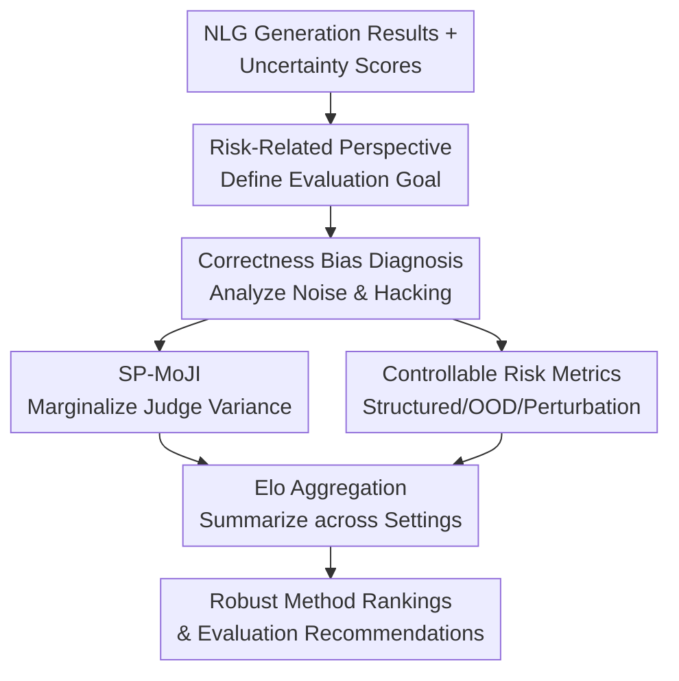

# Addressing Pitfalls in the Evaluation of Uncertainty Estimation Methods for Natural Language Generation

**Conference**: ICLR 2026  
**OpenReview**: [https://openreview.net/forum?id=OxWnOV5q8w](https://openreview.net/forum?id=OxWnOV5q8w)  
**Code**: Provided via OpenReview supplementary materials  
**Area**: LLM Evaluation / Uncertainty Estimation / Natural Language Generation  
**Keywords**: [Uncertainty Estimation, NLG Evaluation, LLM-as-a-judge, Risk-related, Elo Aggregation]

## TL;DR
This paper points out that the mainstream QA selective prediction evaluation for NLG uncertainty estimation is significantly biased by approximate correctness functions. It proposes using SP-MoJI, structured tasks, OOD/perturbation detection, and Elo aggregation to make evaluation conclusions more robust.

## Background & Motivation
**Background**: The hallucination problem in Large Language Models (LLMs) has become a core risk in practical deployment, where a category known as confabulation is considered closely related to the model's predictive uncertainty. To detect such risks, many works assign an uncertainty score to generated responses—such as predictive entropy, semantic entropy, perplexity, G-NLL, P(True), or Semantic Similarities (SAR) series—and assess whether these scores can rank incorrect responses higher than correct ones.

**Limitations of Prior Work**: The issue lies in the fact that uncertainty methods are typically not compared directly against real-world risk, but rather against labels provided by an "approximate correctness function." Reference answers in QA datasets are often short; automatic metrics like ROUGE and BLEU are influenced by n-gram length, thresholds, and implementation details. Meanwhile, LLM-as-a-judge is affected by model family, prompts, sampling, and judge bias. Consequently, for the same set of generated results, simply changing the correctness function can significantly alter the AUROC and ranking of uncertainty methods.

**Key Challenge**: Current evaluation protocols often treat "whether a biased correctness function identifies an error" as the risk itself, whereas uncertainty evaluation truly aims to ask "how much risk is associated with this prediction." If correctness labels contain random noise, the AUROC is compressed overall; if the labels have sample-correlated bias, different uncertainty methods are affected unevenly. Thus, papers might not be comparing which method estimates uncertainty better, but rather which method is more compatible with the bias of a specific evaluation function.

**Goal**: The authors aim to deconstruct this problem: first by formalizing a risk-related perspective in uncertainty evaluation, then diagnosing label noise, bias, and correctness hacking in QA selective prediction protocols, subsequently providing more reliable risk metrics, and finally summarizing extensive experimental results in a way that aggregates across datasets, models, and tasks.

**Key Insight**: This paper does not propose a new uncertainty estimation algorithm; instead, it focuses on "how to evaluate these algorithms." This perspective is crucial because if the evaluation protocol itself is unstable, subsequent methodological improvements will be driven by false signals—especially when different correctness metrics can push the same method into the Top-3.

**Core Idea**: Reorganize NLG uncertainty evaluation with risk-related experiments, replacing fragile single QA correctness labels with marginalizable, precisely verifiable, or controllably constructed risk metrics, and summarizing relative performance across settings using Elo ratings.

## Method
The method in this paper acts more like a diagnostic and reformative framework for evaluation rather than a training model. It first formalizes the utility of uncertainty estimation as the rank correlation between uncertainty scores and risk metrics, demonstrating empirically how approximate correctness functions distort this correlation. Based on this, the authors design several categories of more robust risk metrics and use Elo ratings to compress relative wins and losses—across multiple tasks, models, and sampling settings—into interpretable global rankings.

### Overall Architecture
The overall workflow can be understood as an "evaluation protocol audit pipeline." The input consists of a set of NLG uncertainty estimation methods, generation results from various LLMs on QA/structured/OOD/perturbation tasks, and candidate correctness or risk labels. The framework defines the target of evaluation from a risk-related perspective, diagnoses vulnerabilities in current QA selective prediction protocols, and finally delivers more credible horizontal comparisons using robust risk metrics and Elo aggregation.

In this diagram, the risk-related perspective serves as the coordinate system; the correctness bias diagnosis explains why original protocols lose fidelity; SP-MoJI and controllable risk metrics are two complementary repair paths; and Elo aggregation handles the conversion of scattered experiments into a summary less affected by presentation bias.

### Key Designs
**1. Risk-Related Perspective: Redefining "Good Uncertainty" as "Ranking Real Risk"**

The authors formalize NLG uncertainty estimation as a function $\hat{u}(x,w;\theta_u)$, which assigns a score to the generation risk under input $x$ and model parameters $w$. Evaluation does not require a linear correlation between uncertainty and risk; rather, it requires that high-risk samples are ranked higher, thus utilizing rank correlation metrics like AUROC. The unified notation is $\xi=Cor[(\hat{u}(x_i,w;\theta_u))_{i=1}^N,(r(x_i,y'_i))_{i=1}^N]$, where $r$ is the risk metric.

The advantage of this perspective is that it unifies different experimental protocols under the same question: selective prediction checks if incorrect answers are more uncertain, OOD detection checks if out-of-distribution inputs are more uncertain, and perturbation detection checks if more heavily perturbed inputs are more uncertain. Consequently, QA correctness is no longer the sole entry point but just one of many risk metrics; evaluation shifts from "high AUROC on a QA dataset" to "stable ranking across multiple interpretable risks."

**2. Correctness Bias Diagnosis: Proving that Correctness Functions Change Method Rankings**

Current QA selective prediction typically uses the correctness of a generated answer as a binary risk label, where risk is denoted as $\neg c(y'_i,y_i,x_i;\theta_c)$, followed by calculating the AUROC with uncertainty scores. This paper points out that $c$ is not a harmless auxiliary function: ROUGE/BLEU depend on thresholds and n-gram parameters, BERTScore/BLEURT rely on embedding similarity, and LLM-as-a-judge depends on the model, prompt, and sampling. Different $\theta_c$ create different "sets of errors," thereby altering the apparent performance of uncertainty methods.

The authors further derive two proofs showing why this distortion is not mere noise. If labels are perturbed by sample-independent Bernoulli noise, the AUROC approximately becomes $AUROC_{noisy}=AUROC_{orig}\cdot(1-2p)+p$, shrinking towards 0.5. If labels have sample-dependent bias, the change in AUROC depends on the proportion of distorted samples and the method's ranking quality on those samples; thus, different methods are rewarded or penalized to different degrees. Experiments show agreement between ROUGE, BLEU, and judges is significantly insufficient, and Spearman correlations of method rankings break down between judge and n-gram metrics. More directly, "adversarially selecting correctness functions" can significantly inflate the frequency of certain methods appearing in the Top-3.

**3. SP-MoJI: Marginalizing Judge Randomness and Bias when Approximate Correctness is Required**

For tasks like QA where exact verification is difficult, the authors do not simply advocate "switching to LLM-as-a-judge," as judges themselves have biases. Instead, they propose **Selective Prediction using Mixture of Judges and Instructions (SP-MoJI)**: for the same batch of generation results, correctness labels are obtained using multiple judge models, multiple prompts, or sampling settings. The selective prediction correlation is calculated for each, and these $\xi$ values are averaged. Formally: $\xi_{SP-MoJI}=\mathbb{E}_{\theta_c}[\xi_{SP-J}]\approx \frac{1}{K}\sum_{k=1}^{K}Cor[(\hat{u}_i),(\neg J_k(y'_i,y_i,x_i;\theta_k))]$.

The key detail here is "averaging correlations at the outer level" rather than averaging multiple judge labels into a soft correctness score before calculating AUROC once. The authors emphasize that these are algebraically non-equivalent: SP-MoJI marginalizes over correctness parameters at the evaluation result level, more directly reducing evaluation variance caused by specific judge models, prompts, and sampling. Bootstrap results show the standard deviation of performance estimates for a single judge can reach 0.04—a 95% interval comparable to the gaps between many methods. Using approximately 4 diverse judges significantly reduces variance, with diminishing returns after 10 calls.

**4. Controllable Risk Metrics and Elo Aggregation: Removing Presentation Bias from Single QA Tables**

While SP-MoJI fixes scenarios where QA must approximate correctness, the authors also introduce more controllable risk metrics. Structured tasks provide **exact correctness**; for example, code completion can be verified with unit tests, and constrained text generation can be checked with symbolic constraints. **OOD detection** uses labels indicating "data from different generation mechanisms or unanswerable questions" as risk. **Perturbation detection** treats input perturbation intensity $s_p$ as a continuous risk, aiming for $\hat{u}(p(x_i,s_p),w;\theta_u)$ to increase with perturbation. These tasks collectively reduce reliance on semantic similarity to a single QA reference answer.

As experimental settings proliferate, another problem arises: tables from different datasets, models, and tasks may provide contradictory local conclusions. Drawing inspiration from chess rankings and Chatbot Arena, this paper uses **Elo ratings** to aggregate pairwise wins and losses between uncertainty estimation methods. Each "dataset-model-risk metric" combination is treated as a match; the UE method with higher correlation wins, and ratings are updated iteratively. Compared to average rank, Elo scores offer a probabilistic interpretation: a ~400 point gap roughly means one side wins ~10:1 in random settings. It also handles indirect comparisons where some methods are only comparable on specific tasks.

### Loss & Training
This work does not train new models and has no loss function in the traditional sense. The "objective function" to remember is the evaluation target itself: calculating the rank correlation $\xi$ between uncertainty scores and risk metrics for each setting, and either using SP-MoJI to marginalize correctness parameters or replacing approximate correctness with exact/OOD/perturbation metrics.

The update of Elo ratings can also be viewed as the post-processing strategy of this work. All methods start with an initial score of 1000. In each iteration, an experimental setting and two methods are sampled; the one with higher correlation is marked as the winner, and scores are updated according to standard Elo rules. The authors use a small update step and iterate until convergence, finally reporting Elo scores across different task partitions, model partitions, and total tasks.

## Key Experimental Results

### Main Results
The experiments cover two types of questions: proving that legacy QA protocols are indeed unstable and verifying that the new risk metrics and aggregation methods provide clearer conclusions. Evaluated methods include Predictive Entropy, Semantic Entropy, SentenceSAR, TokenSAR, SAR, EigenScore, Perplexity, G-NLL, Min Token Log-Probability, P(True), and heuristic baselines like sequence length. Models include Llama-3, Phi-3.5, Qwen2.5, and Falcon Mamba in both pre-trained and instruction-tuned versions.

| Subject | Data / Setting | Metric | Key Result | Implication |
| :--- | :--- | :--- | :--- | :--- |
| Correctness Consistency | CoQA / TriviaQA / SQuAD, Llama-3 8B IT | mutual AUROC / Spearman | Significant inconsistency between ROUGE/BLEU and judges; method ranking correlation breaks. | The ranking of a single UE method is dictated by the choice of correctness function. |
| Correctness Hacking | QA benchmarks (selecting favorable correctness) | Top-3 Frequency | Min Token Log-Prob rises from 0.125 to 0.500; G-NLL rises from 0.375 to 0.688. | Apparent advantages can be inflated by cherry-picking metrics. |
| SP-MoJI Variance Analysis | Multi-judge bootstrap | AUROC Std Dev | Single judge std dev up to ~0.04; ~4 judges significantly reduce variance. | Marginalizing over judges/prompts is a necessary stabilization step. |
| Structured Tasks | BigCodeBench / COLLIE | Exact correctness agreement | Approximate correctness fails to match exact ranking on COLLIE; high prompt sensitivity. | Precisely verifiable tasks expose the limits of judge/similarity metrics. |

| Aggregation Perspective | Main Observation | Insight for UE Methods | Insight for Evaluation Protocols |
| :--- | :--- | :--- | :--- |
| ALL TASKS Elo | Different methods preferred by different tasks; no single dominant method. | Do not claim universal optimality based on a single QA dataset. | Need cross-task summarization over local tables. |
| QA Partition | Semantic Entropy LN and similar methods are stronger in some QA settings. | QA performance remains meaningful but is highly dependent on correctness choices. | QA should be reported using SP-MoJI or multiple correctness metrics. |
| CODE / Constrained Text | G-NLL, EigenScore, etc., are more competitive in long generation or structured tasks. | Uncertainty patterns in long-sequence tasks differ from short-answer QA. | Exact correctness should be a core supplementary evaluation. |
| PERT Partition | Length normalization can be helpful in perturbation detection; answer length is a strong baseline. | Some "bad habits" might be useful under specific risks. | Risk types must be clearly defined and not conflated. |
| PT vs IT Models | All methods are weaker on pre-trained models; random baseline Elo is higher. | Poor output structure in base models changes UE difficulty. | Base and instruct models should be analyzed separately. |

### Ablation Study
| Configuration | Key Metric | Description |
| :--- | :--- | :--- |
| Single ROUGE/BLEU Correctness | Ranking divergence from judge | n-gram metrics are biased by short answers, thresholds, and implementation artifacts. |
| Single LLM-as-a-judge | AUROC Std Dev | Randomness and bias of a single judge can mask the actual performance gap between methods. |
| SP-MoJI (~4 judges) | Performance variance | Marginalizing diverse judges provides a more stable evaluation for QA selective prediction. |
| QA Selective Prediction only | Conclusion bias | Easily influenced by correctness choice and answer length bias; needs OOD/Perturbation tasks. |
| Average Rank Aggregation | Ranking stability | Average rank is less stable than Elo when method task coverage is incomplete. |
| Elo Aggregation | Correlation consistency | Handles indirect comparisons and provides interpretable relative strengths. |

### Key Findings
- Correctness functions in QA are not neutral referees. ROUGE, BLEU, and LLM-as-a-judge provide different correctness labels, thereby altering AUROC and the rankings of uncertainty estimation methods.
- LLM-as-a-judge is more reliable than many n-gram metrics, but a single judge is still insufficient; SP-MoJI reduces evaluation variance by marginalizing over judge models, prompts, and sampling settings.
- Structured tasks provide a vital reference frame as they use exact correctness to verify if generation meets requirements; in these tasks, the deviation of approximate correctness from true ranking is more easily exposed.
- OOD and perturbation detection expand uncertainty evaluation from "does the answer match the reference" to "is the input more dangerous/abnormal," aligning more closely with traditional protocols in classification uncertainty.
- Elo aggregation suggests no "silver bullet" for NLG uncertainty estimation: task type, generation length, and whether the model is instruction-tuned all influence method superiority.

## Highlights & Insights
- The most significant highlight is framing the "evaluation correctness function" itself as part of the uncertainty evaluation problem rather than assuming it is a ground-truth label source. This transforms many perceived differences between methods into evaluation bias issues.
- The design of SP-MoJI is deliberate: it doesn't attempt to invent a perfect judge but acknowledges judge randomness and model bias, then marginalizes these parameters at the evaluation level. This is more robust than simply switching to a larger judge and easier to interpret.
- The introduction of structured tasks is highly enlightening. If NLG uncertainty methods are only compared on short-answer QA, they can easily exploit biases in answer length, n-gram artifacts, or reference aliases. Code and constrained generation transform "correctness" from a semantic similarity problem into a verifiable one.
- Elo aggregation solves a common problem in paper writing: when faced with massive tables, authors can guide readers toward different conclusions via highlighting and narrative choices. Pairwise win aggregation, though not without assumptions, is more transparent than cherry-picking tables.
- An interesting empirical insight is that simple heuristics are not always weak baselines. Answer length, G-NLL, and Perplexity are competitive in certain task or model partitions, reminding researchers that simple baselines must be reported rigorously.

## Limitations & Future Work
- This work proposes an evaluation framework rather than a new UE method; thus, it does not directly reduce model hallucinations but makes method comparisons more credible. Real-world deployment still requires mapping these uncertainty scores to rejection, retrieval, or human review strategies.
- SP-MoJI still relies on judge models. While marginalization reduces variance, it does not guarantee the elimination of all systemic biases. In complex reasoning, long chain-of-thought, or multi-agent scenarios, judge prompting and answer extraction remain difficult.
- Although robust, exact correctness tasks have limited coverage. Code completion and constrained text generation do not fully represent the risks found in open-ended Q&A, summarization, dialogue, or creative writing.
- Constructing OOD text datasets remains challenging. Collections like Known-Unknowns and SQuADv2 unanswerable are only partial approximations; more systematic definitions of "out-of-distribution in natural language" are needed.
- Elo aggregation provides a global score, but global scores can mask task-specific partition differences. Optimal reporting should simultaneously provide ALL TASKS, task partitions, model partitions, and generation length analyses.
- Future work could extend these evaluation principles to CoT, multi-turn dialogue, multi-agent systems, and tool-calling, where generation length, state dependency, and risk functions are more complex than in single-turn QA.

## Related Work & Insights
- **vs Semantic Entropy / Confabulation Detection**: Work like Farquhar et al. focuses on detecting hallucinations via semantic clustering. This paper asks how such methods can be evaluated fairly. Its value lies in providing a more stable experimental foundation for future UE methods.
- **vs LM-Polygraph / UE Benchmarks**: While LM-Polygraph provides extensive baseline implementations for UE methods and tasks, this paper focuses specifically on the failure modes of evaluation protocols, especially the impact of correctness functions on rankings.
- **vs Santilli et al. on QA Metric Bias**: Both point out spurious correlations between uncertainty scores and answer evaluation metrics in generative QA. This work goes further by proposing SP-MoJI, structured tasks, OOD/perturbation detection, and Elo aggregation as repair paths.
- **vs LLM-as-a-judge Research**: While MT-Bench and Chatbot Arena study whether judges can evaluate model responses, this paper places judges within uncertainty estimation evaluation, emphasizing that even if a judge aligns with humans, its bias can still alter method rankings.
- **Insights for Future Research**: When conducting NLG uncertainty estimation, one cannot simply report ROUGE or single-judge AUROC on a single QA dataset. At minimum, researchers should report multi-correctness stability, simple heuristic baselines, structured exact correctness, and aggregated results across diverse tasks.

## Rating
- Novelty: ⭐⭐⭐⭐☆ Not a new UE algorithm, but a systematic reconstruction of evaluation protocols; very innovative for an evaluation paper.
- Experimental Thoroughness: ⭐⭐⭐⭐⭐ Covers a wide range of UE methods, model families, and QA/structured/OOD/perturbation tasks, supported by theoretical derivations and bootstrap analysis.
- Writing Quality: ⭐⭐⭐⭐☆ Clear main thread with solid formulas and experimental evidence; the appendix is dense and requires some uncertainty evaluation background.
- Value: ⭐⭐⭐⭐⭐ Highly beneficial for calibrating the NLG uncertainty estimation field, preventing future methods from being misled by fragile evaluation metrics.

## Related Papers

- [\[ICLR 2026\] Pitfalls in Evaluating Language Model Forecasters](pitfalls_in_evaluating_language_model_forecasters.md)
- [\[ICLR 2026\] Reliable Fine-Grained Evaluation of Natural Language Math Proofs](reliable_fine-grained_evaluation_of_natural_language_math_proofs.md)
- [\[ICLR 2026\] TokUR: Token-Level Uncertainty Estimation for Large Language Model Reasoning](tokur_token-level_uncertainty_estimation_for_large_language_model_reasoning.md)
- [\[ACL 2025\] Benchmarking Uncertainty Quantification Methods for Large Language Models with LM-Polygraph](../../ACL2025/llm_evaluation/benchmarking_uncertainty_quantification_methods_for_large_language_models_with_l.md)
- [\[ICLR 2026\] ExpertLongBench: Benchmarking Language Models on Expert-Level Long-Form Generation Tasks with Structured Checklists](expertlongbench_benchmarking_language_models_on_expert-level_long-form_generatio.md)

<!-- RELATED:END -->

<!-- RELATED:START -->

## Related Papers

- [\[ICLR 2026\] Pitfalls in Evaluating Language Model Forecasters](pitfalls_in_evaluating_language_model_forecasters.md)
- [\[ICLR 2026\] TokUR: Token-Level Uncertainty Estimation for Large Language Model Reasoning](tokur_token-level_uncertainty_estimation_for_large_language_model_reasoning.md)
- [\[ICLR 2026\] Reliable Fine-Grained Evaluation of Natural Language Math Proofs](reliable_fine-grained_evaluation_of_natural_language_math_proofs.md)
- [\[ACL 2025\] Benchmarking Uncertainty Quantification Methods for Large Language Models with LM-Polygraph](../../ACL2025/llm_evaluation/benchmarking_uncertainty_quantification_methods_for_large_language_models_with_l.md)
- [\[ICLR 2026\] JQBench: A Benchmark for Reading and Writing JSON from Natural Language and/or Examples](jqbench_a_benchmark_for_reading_and_editing_json_from_natural_language_andor_exa.md)

<!-- RELATED:END -->
