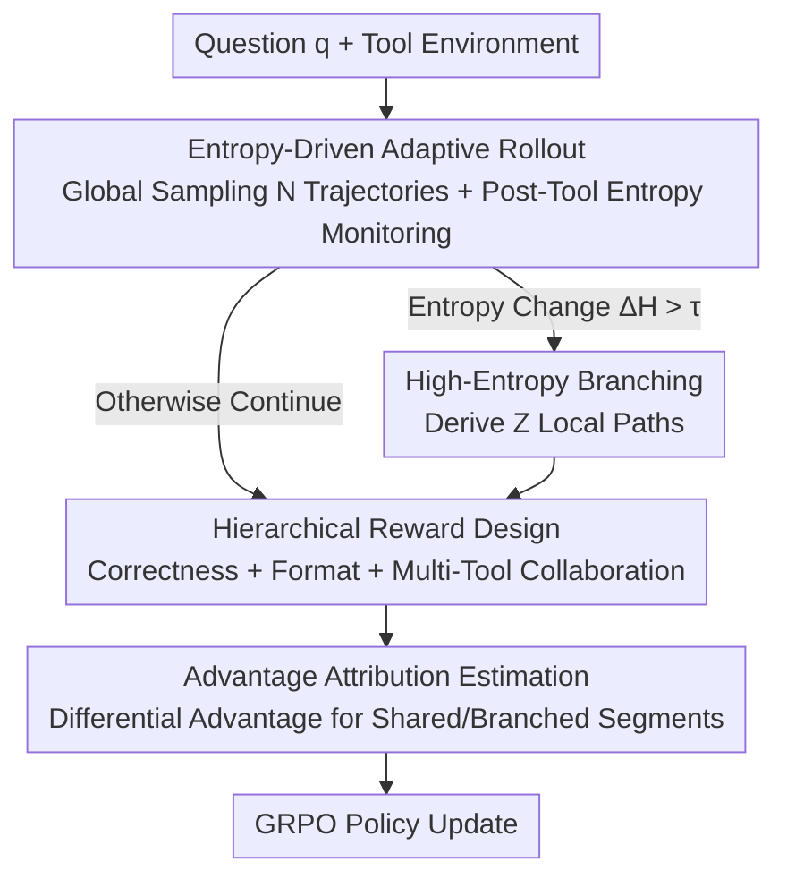

# Agentic Reinforced Policy Optimization

**Conference**: ICLR2026  
**OpenReview**: [https://openreview.net/forum?id=TX4k7BF6aO](https://openreview.net/forum?id=TX4k7BF6aO)  
**Code**: https://github.com/RUC-NLPIR/ARPO  
**Area**: Reinforcement Learning / Agentic RL  
**Keywords**: Agentic RL, Tool Calling, Token Entropy, Adaptive Rollout, Advantage Attribution

## TL;DR
ARPO is a reinforcement learning algorithm tailored for multi-turn tool-calling agents. It identifies that the token entropy of LLMs spikes after each tool return. Consequently, it adaptively "forks" sampling at these high-entropy steps and employs advantage attribution to propagate the performance differences of branched paths back for learning. This achieves superior performance across 13 reasoning/deep-search benchmarks compared to trajectory-level RL, while using only half the tool-calling budget.

## Background & Motivation
**Background**: Large-scale Reinforcement Learning with Verifiable Rewards (RLVR) has proven effective for single-turn reasoning tasks, significantly unlocking the capabilities of frontier LLMs. Extending this to Agentic RL—where LLMs autonomously invoke external tools like search engines, browsers, and code interpreters during training—shifts the training paradigm from "static problem solving" to a "dynamic agent-environment interaction."

**Limitations of Prior Work**: Current mainstream agentic RL algorithms (GRPO, DAPO, REINFORCE++, etc.) perform **trajectory-level sampling** during the rollout phase: they sample a complete tool-use trajectory at once, with rewards assigned only based on the final answer. Subsequent works mostly focus on reward function engineering (mitigating tool abuse or sparse rewards) but ignore a critical aspect—**the multi-turn interaction loop between the LLM and the tool environment itself**. Multi-turn tool calling injects real-time information feedback into the model, yet methods comparing only complete trajectories provide almost no fine-grained exploration of this step-by-step tool-use behavior.

**Key Challenge**: The authors quantified this contradiction through a pilot experiment. They measured the token generation entropy in deep search tasks and found that **token entropy spikes sharply for the first 10–50 tokens after each tool call returns a result**. While entropy also rises during early reasoning stages, it is significantly lower than after tool feedback; text feedback from search engines introduces greater uncertainty than Python numerical feedback. In other words, a distribution shift exists between external feedback and internal model reasoning. The moment after a tool call is exactly when the model is "most conflicted and has the highest exploratory value"—yet trajectory-level RL spreads the sampling budget evenly across the entire trajectory, missing these high-entropy steps.

**Goal**: Design an RL algorithm aligned with the characteristics of "agent-environment interaction" that concentrates the sampling budget on high-entropy steps following tool calls.

**Key Insight**: Since high entropy equals high uncertainty and under-explored potential tool-use behavior, **the change in entropy can be used as a signal to dynamically decide where to fork sampling**.

**Core Idea**: Replace "uniform trajectory-level rollout" with "entropy-driven adaptive rollout"—trigger additional local branch sampling at steps where entropy increases after tool calls, paired with an advantage attribution mechanism to internalize the differences between branched paths into the policy.

## Method

### Overall Architecture
ARPO addresses the problem of "where to spend the sampling budget." It splits the traditional rollout into two parts: a small amount of **global trajectory sampling** to provide a baseline, followed by **local branch sampling** using the remaining budget. Branching is determined by real-time entropy changes after tool calls. The pipeline is as follows: given a question $q$, the policy model reasons and calls tools within the environment while the system monitors token entropy after each return. If the entropy change exceeds a threshold, several local paths are derived from the current node to explore different tool usage. After all paths yield answers, a Reward Model scores them using a "hierarchical reward," and "advantage attribution estimation" distinguishes between shared and branched token segments to assign different advantage values. Finally, the policy is updated using the GRPO objective.

### Key Designs

**1. Entropy-driven Adaptive Rollout: Shifting Budget to High-Entropy Tool Steps**

This design specifically targets the failure of trajectory-level sampling to capture high-entropy tool steps. Given a global rollout size $M$, the model first generates $N$ complete trajectories (global sampling). The remaining $M-N$ budget is reserved for local sampling. Token-level generation entropy is defined as $H_t = -\sum_{j=1}^{V} p_{t,j}\log p_{t,j}$, where $p_t = \mathrm{Softmax}(z_t/\tau)$ and $V$ is the vocabulary size. The system records an initial entropy matrix $H_{initial}$ for the first $k$ tokens of each trajectory. Subsequently, as the model reasons and calls tools, it calculates the entropy $H_t$ for the $k$ tokens generated after each tool return and quantifies the normalized entropy change $\Delta H_t = \mathrm{Normalize}(H_t - H_{initial})$. $\Delta H_t > 0$ indicates increased uncertainty after the tool call.

Branching is determined by a sampling probability: $P_t = \alpha + \beta\cdot\Delta H_t$, where $\alpha$ is the base probability and $\beta$ is a stability coefficient. If $P_t > \tau$, $\mathrm{Branch}(Z)$ is triggered to derive $Z$ local reasoning paths. This continues until the total branches $\hat Z$ reach the local budget $M-N$. This focuses exploration on "high entropy = information rich" regions while maintaining computational complexity between $O(n\log n)$ and $O(n^2)$.

**2. Advantage Attribution Estimation: Distributing Credit to Shared Prefixes and Branches**

Adaptive rollout naturally creates a "shared prefix, branched suffix" structure. The authors propose two schemes for advantage attribution. **Hard Advantage Estimation** explicitly distinguishes segments: for branched tokens, advantage is $\hat A_{i,t} = \frac{r_i - \mathrm{mean}(\{R_i\})}{\mathrm{std}(\{R_i\})}$; for shared tokens, it is the average advantage of the $d$ trajectories containing that segment: $\hat A^{shared}_{i,t} = \frac{1}{d}\sum_{i=1}^{d}\hat A_{i,t}$.

**Soft Advantage Estimation** is more elegant: it does not modify the advantage explicitly but differentiates through the importance sampling ratio $r_{i,t}(\theta) = \frac{\pi_\theta(y_{i,t}\mid x,y_{i,<t})}{\pi_{old}(y_{i,t}\mid x,y_{i,<t})}$ in the GRPO update. Since trajectories $y_i, y_j$ share a prefix before token $t$, their importance weights are equal, automatically aligning the contribution of shared tokens to approximately $\hat A^{shared}$. ARPO uses soft estimation by default for its training stability.

**3. Hierarchical Reward Design: Incentivizing Multi-Tool Collaboration**

ARPO extends the Tool-Star design by adding a **multi-tool collaboration reward**. If the model produces a correct answer in the correct format and utilizes multiple tools (e.g., `<search>` and `<python>`), it receives an additional reward $r_M$. The total reward is:

$$
R=\begin{cases}\max(\text{Acc.}+r_M,\ \text{Acc.}) & \text{Format Correct and Acc.}>0\\ 0 & \text{Format Correct and Acc.}=0\\ -1 & \text{Otherwise}\end{cases},\qquad r_M=\begin{cases}0.1 & \exists(\texttt{<search>}\ \&\ \texttt{<python>})\\ 0 & \text{Otherwise}\end{cases}
$$

### Loss & Training
ARPO utilizes the GRPO objective:

$$
J_{GRPO}(\theta)=\mathbb{E}\Big[\tfrac{1}{G}\sum_{i=1}^{G}\tfrac{1}{|y_i|}\sum_{t=1}^{|y_i|}\min\big(r_{i,t}(\theta)\hat A_{i,t},\ \mathrm{clip}(r_{i,t}(\theta),1-\epsilon,1+\epsilon)\hat A_{i,t}\big)-\beta D_{KL}(\pi_\theta\|\pi_{ref})\Big]
$$

The authors also proved a **Generalized Policy Gradient (GPG) Theorem**: by partitioning the transformer output sequence into "macro-actions" $MA_i$ and "macro-states" $MS_i$, the gradient $\nabla_\theta J(\theta)=\mathbb{E}_{\tau\sim\pi_\theta}\{\sum_{T=1}^{K}[\nabla_\theta\log\pi_\theta(MA_T\mid MS_T)A_T(\tau)]\}$ holds for any differentiable Transformer policy, providing theoretical justification for optimizing with local rollout segments.

## Key Experimental Results

### Main Results
On 10 benchmarks for math and knowledge-intensive reasoning (using Llama3.1-8B / Qwen2.5-7B), ARPO outperforms trajectory-level RL:

| Backbone | Method | Avg. Score |
|------|------|------|
| Llama3.1-8B-Instruct | Direct Reasoning | 28.8 |
| Llama3.1-8B-Instruct | + GRPO | 51.1 |
| Llama3.1-8B-Instruct | + DAPO | 50.4 |
| Llama3.1-8B-Instruct | **+ ARPO** | **55.3** |
| Qwen2.5-7B-Instruct | + GRPO | 56.5 |
| Qwen2.5-7B-Instruct | + REINFORCE++ | 54.9 |
| Qwen2.5-7B-Instruct | **+ ARPO** | **58.3** |

On difficult deep search tasks (GAIA, HLE), ARPO (Qwen3-14B) significantly outperforms GPT-4o and DeepSeek-R1-671B despite having fewer parameters:

| Dataset | GPT-4o | DeepSeek-R1-671B | ARPO (Qwen3-14B) |
|--------|------|------|------|
| HLE Avg. | 2.6 | 8.6 | 10.0 |
| GAIA Avg. | 17.5 | 25.2 | 43.2 |

### Ablation Study

| Configuration | Key Observation |
|------|---------|
| Full ARPO (Soft) | Most stable training rewards; default setting. |
| Hard Advantage | Higher reward volatility; explicit differentiation is less stable than implicit. |
| Trajectory-level Rollout (≈GRPO) | Drops ~4% avg.; confirms necessity of step-level exploration. |

### Key Findings
- **Efficiency**: ARPO achieves or exceeds trajectory-level RL performance using only half the tool-calling budget by concentrating sampling on high-entropy steps.
- **Step-level Exploration**: ARPO outperforms GRPO by ~6% on GAIA/WebWalkerQA, showing that fine-grained tool behavior exploration via balanced global+local sampling is critical.
- **Sample Efficiency**: The model generalizes to GAIA/HLE after training on only 1k open-source web-search samples.

## Highlights & Insights
- **Turning "Token Entropy Spikes" into a Training Signal**: The pilot experiment quantifies entropy behavior post-tool return, providing a specific, observation-driven motivation for adaptive branching.
- **Advantage Alignment for Shared Prefixes**: Soft advantage estimation is a clever utilization of importance sampling properties, allowing shared tokens to receive average advantages without extra implementation cost.
- **GPG Theorem for Macro-actions**: Theoretical proof that traditional policy gradients are a special case of macro-action optimization justifies credit assignment at the segment level rather than just the token level.
- **Engineering Value**: Reducing tool budgets by half while improving accuracy provides significant cost savings for pipelines using paid tool APIs.

## Limitations & Future Work
- The algorithm involves several hyperparameters ($\tau, \alpha, \beta, Z$) whose sensitivity was not fully disclosed and may require tuning for new tasks.
- Entropy is a heuristic proxy; high entropy could stem from noise (e.g., irrelevant long-form search results), leading to wasted budget.
- Experiments focused on search, browser, and code tools; effectiveness in longer-horizon or more diverse environments (e.g., multi-modal or stateful environments) remains to be verified.
- Future direction: Combining entropy with value estimation to distinguish "valuable high entropy" from "noisy high entropy."

## Related Work & Insights
- **vs. Trajectory-level RL (GRPO/DAPO)**: These methods sample complete trajectories uniformly. ARPO refines exploration to the "step level" at high-entropy points, making it more efficient for multi-turn tasks.
- **vs. Tool-Star (Reward Improvement)**: ARPO reuses hierarchical rewards but innovates in the rollout and attribution mechanism. The two approaches are orthogonal and combinable.
- **vs. Workflow Agents (Search-o1/ReAct)**: These rely on prompt-driven orchestration without weight updates. ARPO trains the policy directly through RL, leading to much higher performance on GAIA/HLE.

## Rating
- Novelty: ⭐⭐⭐⭐⭐ Translating entropy observations into step-level adaptive rollout is novel and theoretically grounded.
- Experimental Thoroughness: ⭐⭐⭐⭐⭐ Comprehensive coverage across 13 benchmarks and multiple backbones.
- Writing Quality: ⭐⭐⭐⭐ Clear motivation, though hyperparameter details are dense.
- Value: ⭐⭐⭐⭐⭐ High engineering value for reducing costs in real-world tool agent training.

<!-- RELATED:START -->

## Related Papers

- [\[ICLR 2026\] ResiliBench: Evaluating Agentic Workflow Adaptation in Stochastic Environments](resilibench_evaluating_agentic_workflow_adaptation_in_stochastic_environments.md)
- [\[ICLR 2026\] Sci2Pol: Evaluating and Fine-tuning LLMs' "Science-to-Policy Brief" Generation Capabilities](sci2pol_evaluating_and_fine-tuning_llms_on_scientific-to-policy_brief_generation.md)
- [\[ICLR 2026\] Prompt and Parameter Co-Optimization for Large Language Models](prompt_and_parameter_co-optimization_for_large_language_models.md)
- [\[ACL 2026\] Inverting the Shield: Systematically Generating Safety Tests from Policy Specifications](../../ACL2026/llm_evaluation/inverting_the_shield_systematically_generating_safety_tests_from_policy_specific.md)
- [\[ACL 2026\] PolicyLLM: Towards Excellent Comprehension of Public Policy for Large Language Models](../../ACL2026/llm_evaluation/policyllm_towards_excellent_comprehension_of_public_policy_for_large_language_mo.md)

<!-- RELATED:END -->

## Related Papers

- [\[ICLR 2026\] ResiliBench: Evaluating Agentic Workflow Adaptation in Stochastic Environments](resilibench_evaluating_agentic_workflow_adaptation_in_stochastic_environments.md)
- [\[ICML 2026\] On Effectiveness and Efficiency of Agentic Tool-calling and RL Training](../../ICML2026/llm_evaluation/on_effectiveness_and_efficiency_of_agentic_tool-calling_and_rl_training.md)
- [\[ACL 2026\] Inverting the Shield: Systematically Generating Safety Tests from Policy Specifications](../../ACL2026/llm_evaluation/inverting_the_shield_systematically_generating_safety_tests_from_policy_specific.md)
- [\[ACL 2026\] PolicyLLM: Towards Excellent Comprehension of Public Policy for Large Language Models](../../ACL2026/llm_evaluation/policyllm_towards_excellent_comprehension_of_public_policy_for_large_language_mo.md)
- [\[ICLR 2026\] Prompt and Parameter Co-Optimization for Large Language Models](prompt_and_parameter_co-optimization_for_large_language_models.md)

<!-- RELATED:END -->
