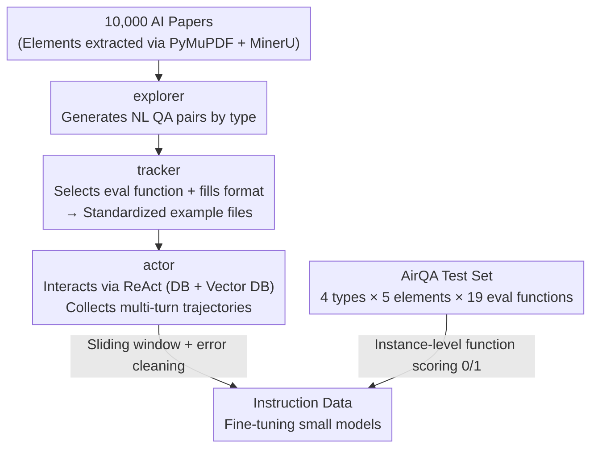

# AirQA: A Comprehensive QA Dataset for AI Research with Instance-Level Evaluation

**Conference**: ICLR2026  
**OpenReview**: [https://openreview.net/forum?id=RuUXnRyqcy](https://openreview.net/forum?id=RuUXnRyqcy)  
**Code**: https://github.com/OpenDFM/AirQA  
**Area**: LLM Evaluation / Research QA Benchmark / Agent / Instruction Data Synthesis  
**Keywords**: Research QA, Instance-Level Evaluation, Multimodality, Multi-task, Tool-use Agent, Trajectory Synthesis

## TL;DR
AirQA is a human-annotated AI research QA dataset (13,956 papers, 1,246 questions) covering four question types (single/multi-doc/retrieval/comprehensive) and five element types (text/table/image/formula/metadata). It introduces instance-level objective evaluation using 19 "customized per question" Python functions and proposes a three-agent framework, EXTRACTOR, to automatically synthesize QA pairs and interaction trajectories, enabling a 7B model to reach the tool-calling performance of a 14B model after fine-tuning.

## Background & Motivation
**Background**: With the explosion of AI papers, researchers often need to read entire long documents to locate specific information, which is highly inefficient. The reasoning and planning capabilities of LLMs enable automated "precise paper retrieval + QA," leading to research QA systems based on RAG or tool-use agents.

**Limitations of Prior Work**: The authors identify three structural flaws in previous research QA datasets. First, **narrow task scope**—most focus on a single type, such as technical details of a single paper (QASPER, SciDQA), rule-based two-hop cross-doc questions (M3SciQA), or paper retrieval (LitSearch, AutoScholarQuery), with evaluation functions tailored only for that specific type. Second, **over-cleaned inputs**—most benchmarks preprocess PDFs into plain text, losing "hypertext elements" like tables, images, formulas, and metadata that real users actually query. Third, **unreliable evaluation**—they typically rely on linguistic metrics like BLEU/ROUGE/F1 or LLM scoring with a fixed prompt, which favors semantic coherence over factual accuracy.

**Key Challenge**: The essence of research QA involves "multi-hop reasoning across massive documents, querying multimodal elements, and requiring factual precision." Existing datasets fail across three dimensions: **task coverage, element coverage, and evaluation precision**. Meanwhile, training an interactive QA agent capable of multi-turn tool calling is hindered by the extreme scarcity of high-quality interaction trajectories; human annotation of (action, observation) sequences is expensive and requires domain expertise, while pure LLM generation cannot guarantee internal causal dependencies and coherence.

**Goal**: (1) Create a multimodal multi-task QA dataset that systematically covers real-world research scenarios with objective evaluation. (2) Develop a framework that automatically synthesizes QA samples and interaction trajectories without human intervention to improve the multi-turn tool-calling capabilities of small models.

**Key Insight**: A key observation on the evaluation side is that while answers vary, they all possess a "scoring point"—the core information determining correctness (e.g., the number itself in a quantitative comparison). By leveraging LLM instruction-following, an **answer format can be attached to each question** (e.g., "The answer should be a Python list containing two floats, each to two decimal places"), forcing structured output that can be precisely scored by corresponding Python functions. For data synthesis, the observation is that the "annotation + interaction" workflow can be decomposed into three independent stages: exploration, tracking, and execution, assigned to three separate agents.

**Core Idea**: Replace "fixed-prompt LLM scoring" with "instance-customized function-level evaluation" to ensure objectivity, and replace "human annotation" with a "three-agent pipeline" to synthesize instruction data with trajectories at scale.

## Method

### Overall Architecture
AirQA produces two independent outputs: a **dataset** and a **data synthesis framework**.

The AirQA dataset itself is human-annotated: 26 AI students read papers, created questions according to four types, and packaged "question + evaluation function + necessary info" into example files, which were verified via an automated pipeline. Each question concludes as a triplet: "question + answer format + a parameterized Python evaluation function," producing a binary 0/1 score. The dataset covers 13,956 AI papers (full sets from ACL2023, ICLR2024, NeurIPS2024 plus 707 others), with an average of 1.63 papers per question.

The synthesis framework EXTRACTOR generates data for training agents by splitting the annotation process into a three-stage serial pipeline: the **explorer** generates natural language QA pairs from paper contexts; the **tracker** rewrites these into standardized example files with evaluation functions; and the **actor** performs Actual ReAct interactions in an environment with databases and vector stores to collect multi-turn trajectories. These trajectories are cleaned and segmented into instruction data for fine-tuning.

### Key Designs

**1. 4 Tasks × 5 Elements Multimodal Design: Fully Decomposing Research Retrieval**

Four categories cover real research scenarios: **Single-doc details (single)** for specific information including tables, images, and formulas; **Multi-doc analysis (multiple)** for cross-paper questions that compare aspects or dig into details cited elsewhere; **Paper retrieval (retrieval)** to find papers based on descriptions within specific conferences to ensure objective evaluation (240 questions adapted from LitSearch); and **Comprehensive QA (comprehensive)**, which simulates users having a vague memory of points across multiple papers, requiring retrieval before answering details. About half of the samples involve non-textual elements.

**2. Instance-Level Function Evaluation: 19 Parameterized Python Functions**

This is the core feature of AirQA. By attaching answer format constraints, model outputs are forced into machine-parsable scoring points. 19 parameterized Python functions (e.g., `evaluate_conjunction` for logic or list comparisons with `ignore_order`) handle the scoring. These are categorized into **objective** (no LLM) and **subjective** (using LLM as a backbone, e.g., GPT-4o-mini). Subjective functions use specific prompts (e.g., for LaTeX formulas) rather than a generic prompt. Proof of reliability: ① Fine-grained prompts are superior to fixed prompts. ② LLM evaluation is closer to human judgment than F1. ③ 83% agreement rate with humans over 66 samples.

**3. EXTRACTOR Three-Agent Pipeline: Automating Human Annotation**

The explorer uses three modes: *single* (randomly selects paper/elements for long-answer pairs), *retrieval* (generates pairs where the answer is a title), and *comprehensive* (combines single-doc queries with title/abstract descriptions). The tracker packages these by selecting functions and refining formats. For *multiple-doc* samples, single-doc components are combined using logic functions like `evaluate_conjunction` to handle cross-paper dependencies.

**4. Trajectory Collection: Sliding Windows + Failure Cleaning**

The actor uses the ReAct framework with three actions (RETRIEVE/QUERY/ANSWER). To handle long contexts, a **sliding window** of size 5 segments the message list into multiple instruction data points; during training, loss is calculated only on the last turn. **Failure cleaning** removes data ending in an incorrect action but **retains** intermediate errors and error messages to teach the model how to correct itself and maintain coherent reasoning.

## Key Experimental Results

### Main Results

**Comparison of Eight Baselines (Overall Score)**: The authors implemented 8 baselines to verify that "more interaction and more info sources lead to higher scores," while also proving the difficulty of the dataset.

| Baseline | Type | GPT-4o Overall AVG | Qwen2.5-72B Overall AVG |
|----------|------|------|------|
| Question Only | Naive | 4.41 | 4.65 |
| Title-Abstract | Naive | 5.78 | 8.43 |
| Full-Text w/ Cutoff | Naive | 13.16 | 14.13 |
| RAG | Retrieval | 18.30 | 20.22 |
| Text2SQL | Retrieval | 13.40 | 12.92 |
| Agentic RAG | Agent | 22.15 | 22.23 |
| Agentic Text2SQL | Agent | 27.77 | 34.27 |
| **Agentic Hybrid** | Agent | **35.96** | 35.07 |

Key conclusions: ① Naive baselines perform poorly (~5% for Question Only). ② Agentic methods consistently outperform retrieval baselines, with Agentic Text2SQL showing significant gains.

**Backbone Models (Agentic Hybrid baseline)**: Even Gemini-2.5-Pro only achieves **44.14%**. Reasoning models (o1-mini, DeepSeek-R1) performed worse, likely due to incompatibility with the fixed interaction format.

| Model | Overall AVG |
|------|------|
| Gemini-2.5-Pro | 44.14 |
| Claude-3.7-Sonnet | 36.52 |
| GPT-4o | 35.96 |
| Qwen2.5-72B-Instruct | 35.07 |
| DeepSeek-R1 | 29.29 |
| o1-mini | 29.61 |

### Ablation Study

**Fine-tuning Effects**: 3B/7B/14B models all improved, with the fine-tuned 7B model (24.07) approaching the 14B base model (25.52). 

| Size | Base AVG | Fine-tuned AVG | Error Action Rate |
|------|------|------|------|
| 3B | 7.38 | 20.22 | — |
| 7B | 15.24 | 24.07 | 38.69% → 6.85% |
| 14B | 25.52 | 26.81 | 31.63% → 6.64% |

**Component Ablation (7B)**:
Sliding windows provide the primary score boost, while failure cleaning specifically reduces the error action rate (from 20.32% to 6.85%).

### Key Findings
- **High Complexity**: Best performance is 44.14%, indicating research QA remains a significant challenge.
- **Failure cleaning targets "Action Legality"**: It reduces illegal actions significantly even if the overall score gain is marginal compared to the sliding window.
- **Scalability**: Performance increases consistently from 1K to 10K trajectories.
- **Small Model Benefits**: 3B models saw the highest proportional gain (nearly 3x), validating synthetic data for specialized tool-use capabilities.

## Highlights & Insights
- **Portable Evaluation Paradigm**: Forcing open-ended answers into structured scoring points for function-based evaluation is more reliable and cheaper than ROUGE or fixed LLM prompts.
- **Natural Pipeline**: The explorer/tracker/actor split mirrors the human workflow of "creating/standardizing/verifying," making the system more controllable and debuggable.
- **Learning from Mistakes**: Retaining intermediate errors while removing trajectories that *end* in failure allows models to learn error correction.
- **Realistic Multi-doc Relationships**: Forcing models to follow citation links to find details mimics true academic research behavior.

## Limitations & Future Work
- **Performance Ceiling**: The teacher model (Qwen2.5-32B at 31.94%) limits the potential of distillation; further gains may require Reinforcement Learning (RL).
- **Restricted Retrieval Scope**: Limiting retrieval to specific conferences ensures objectivity but deviates from the "infinite sea of papers" in real scenarios.
- **Subjective Noise**: The 83% agreement rate indicates some noise remains in subjective function scoring.
- **Compatibility**: The framework is not yet optimized for the specialized reasoning formats of models like o1 or DeepSeek-R1.

## Related Work & Insights
- **vs QASPER/SciDQA**: AirQA adds multi-doc and retrieval tasks and replaces F1/ROUGE with instance-level function evaluation.
- **vs M3SciQA**: AirQA uses more authentic cross-paper relationships (citation mining) rather than rule-based multi-hop templates.
- **vs LitSearch/LitQA2**: AirQA integrates retrieval as a sub-task within a comprehensive QA framework.
- **vs Data Synthesis (Zeng et al.)**: EXTRACTOR automates the entire "question + trajectory" generation process rather than just extracting from existing logs.

## Rating
- Novelty: ⭐⭐⭐⭐ 
- Experimental Thoroughness: ⭐⭐⭐⭐ 
- Writing Quality: ⭐⭐⭐⭐ 
- Value: ⭐⭐⭐⭐ 

<!-- RELATED:START -->

## Related Papers

- [\[ICLR 2026\] AnesSuite: A Comprehensive Benchmark and Dataset Suite for Anesthesiology Reasoning](anessuite_a_comprehensive_benchmark_and_dataset_suite_for_anesthesiology_reasoni.md)
- [\[ICML 2026\] From Human-Level AI Tales to AI Leveling Human Scales](../../ICML2026/llm_evaluation/from_human-level_ai_tales_to_ai_leveling_human_scales.md)
- [\[ICLR 2026\] DeepResearch Bench: A Comprehensive Benchmark for Deep Research Agents](deepresearch_bench_a_comprehensive_benchmark_for_deep_research_agents.md)
- [\[ICLR 2026\] LFQA-E: Carefully Benchmarking Long-form QA Evaluation](lfqa-e_carefully_benchmarking_long-form_qa_evaluation.md)
- [\[ICLR 2026\] DeepTRACE: Auditing Deep Research AI Systems for Tracking Reliability Across Citations and Evidence](deeptrace_auditing_deep_research_ai_systems_for_tracking_reliability_across_cita.md)

<!-- RELATED:END -->
