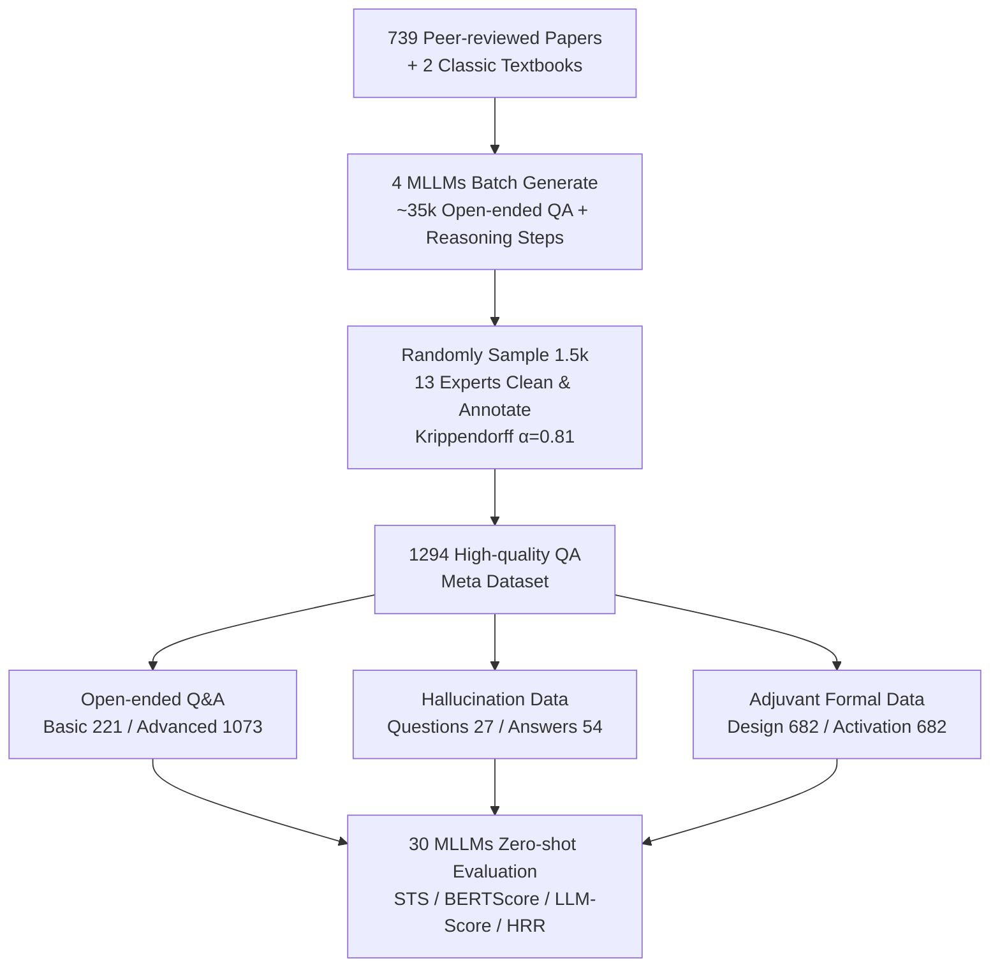

# An Open-Ended Benchmark and Formal Framework for Adjuvant Research with MLLM

**Conference**: ICLR 2026  
**OpenReview**: [https://openreview.net/forum?id=moeOrHkDg2](https://openreview.net/forum?id=moeOrHkDg2)  
**Code**: [https://github.com/banjiuyufen/Adjuvant-Benchmark](https://github.com/banjiuyufen/Adjuvant-Benchmark)  
**Area**: LLM Evaluation / Science MLLM / Biomedicine Benchmark  
**Keywords**: Adjuvant research, Open-ended QA, Hallucination rejection, Formal description, MLLM evaluation  

## TL;DR
Addressing the "vaccine adjuvant" field long neglected by AI, this work constructs the first expert-annotated open-ended QA benchmark (1294 QA pairs + 1364 formal descriptions). It systematically evaluates 11 closed-source and 19 open-source MLLMs and proposes a formal framework that encodes adjuvant design principles and immune mechanisms into structured variables and functions.

## Background & Motivation

**Background**: AI has deeply transformed scientific directions such as drug discovery, protein structure prediction, genomics, catalysts, and battery materials—all of which possess large-scale datasets, standardized benchmarks, and mature methodologies. However, adjuvants—core components that determine whether a vaccine can stimulate a sufficient immune response and are critical to the success of emerging infectious diseases and cancer immunotherapy—remain a blank. The authors use a cross-domain comparison table (Table 1) to intuitively show that adjuvants are marked with ✗ across Datasets, Methods, and Principles, making it the only field lacking all three.

**Limitations of Prior Work**: Adjuvant research is hindered by three barriers: (i) lack of systematically organized data; (ii) lack of AI methods tailored for adjuvant knowledge; and (iii) high heterogeneity in adjuvant definitions and mechanisms (ranging from synthetic small molecules and natural extracts to particulate materials). Multi-scale immune mechanisms make systematic modeling difficult. Existing biomedical benchmarks (PubMedQA, ChemBench, etc.) evaluate molecular properties, literature abstracts, or general biomedical knowledge, which cannot be directly transferred to "mechanism reasoning + safety assessment + design-oriented" adjuvant scenarios.

**Key Challenge**: Knowledge in the adjuvant field is inherently **open-ended, mechanistic, and multimodal**. A question regarding "how a certain adjuvant regulates innate immunity to subsequently affect adaptive immunity" cannot be squeezed into a multiple-choice framework. Currently, no benchmark can measure how much an MLLM truly understands in such an open context or whether it generates plausible-sounding hallucinations.

**Goal**: To build the first evaluation infrastructure for the adjuvant field—capable of both horizontally comparing the capabilities and shortcomings of existing general MLLMs in adjuvant knowledge and providing a data and symbolic foundation for training future domain-specific models.

**Key Insight**: **(1) Open-ended QA instead of multiple-choice**—using expert-annotated free-form QA to capture mechanistic reasoning, design considerations, and safety issues; **(2) Treating hallucination data as a resource rather than waste**—retaining QA pairs judged as incorrect by experts specifically to test the model's ability to "identify and reject erroneous content"; **(3) Formalization framework**—translating complex biological mechanisms into structured variables and functions (e.g., `Form(Struc, Ag)`, `Load(A, B, Surface)`), serving as a computable abstraction for combining statistical learning with symbolic reasoning.

## Method

### Overall Architecture
The work follows two parallel paths: a **benchmark construction pipeline** (from literature → MLLM batch generation of candidate QA → expert cleaning and annotation → split into three data categories) and an **evaluation protocol** (30 MLLMs running zero-shot on open-ended QA, hallucination rejection, and generation quality tasks, measured by automatic metrics + LLM scoring + expert subjective scoring). The benchmark finally consists of three complementary components: Open-ended Q&A, Hallucination Data, and Adjuvant Formal Data.

### Key Designs

**1. Multi-model Generation + Expert Review "De-biased" Annotation Pipeline:** To avoid self-evaluation bias where the same model generates and answers questions, the authors used four long-context multimodal models (GPT-4o, Claude 3.5 Sonnet, Ernie 4.0 Turbo, DeepSeek-R1) to generate ~35k open-ended QA pairs with explicit reasoning steps from 739 papers and 2 textbooks. 1.5k samples were randomly selected for review by 13 experts across infectious diseases, oncology, and bacterial vaccines. Each "Question-Reasoning-Answer" triplet was strictly checked against the source text and labeled as valid or hallucinated (the latter requiring a reason), resulting in 1294 high-quality QA pairs. Inter-annotator agreement reached Krippendorff's $\alpha = 0.8119$, indicating high reliability. Open-ended QA is further divided into Basic Knowledge (221) and Advanced Knowledge (1073), with Advanced split into Biological Principles (846) and Design & Safety (227). Notably, 12.3% of entries include image inputs to support multimodal reasoning evaluation.

**2. Utilizing Hallucinations as Rejection Task Resources:** Unlike most benchmarks that discard erroneous samples, this work retains expert-identified incorrect QA pairs to form Hallucination Data (27 question hallucinations, 54 answer hallucinations, 12 overlapping, 69 total), formatted identically to normal QA. This creates a controlled environment to measure the **Hallucination Rejection Ratio (HRR)**—the capability of a model to identify and refuse incorrect content. This is a critical ability in scientific scenarios where a model fabricating immune mechanisms in adjuvant design is dangerous.

**3. Adjuvant Formalization Framework:** This is the core differentiator from standard benchmarks. Authors collaborated with adjuvant experts to define a set of formal variables and functions, translating adjuvant design principles and immune activation processes into structured abstractions. For example, `Form(Struc, Ag)` represents the relationship between a structure and an antigen formulation, and `Load(A, B, Surface)` represents the loading relationship of A onto the surface of B. These templates were embedded into GPT-4o prompts to generate 1364 formal entries, equally split into "Adjuvant Design" and "Adjuvant Activation & Immune Process" (682 each). The significance lies in converting implicit, fragmented mechanisms found in literature into computable symbolic representations that can serve as building blocks for future "statistical learning + symbolic reasoning" domain-specific MLLMs (though not applied to downstream training in this paper).

**4. Three-tier Metrics Evaluation Protocol:** The evaluation uses three types of metrics to avoid bias: (a) Automatic metrics: Semantic Textual Similarity (STS) and BERTScore; (b) LLM Scoring: GPT-4o and DeepSeek-R1 act as dual judges scoring 0–10 across Similarity Score (SS), Scientific Rationality Score (RS), and Inclusiveness Score (IS); (c) Expert Subjective Scoring: Evaluating generation quality across dimensions such as questioning ability, answering ability, reasoning ability, knowledge reserve, image/chart analysis, context utilization, and instruction following. For comparability, all models (multimodal or not) were evaluated using the same OCR engine to convert images to text, appended to the original prompt under zero-shot conditions.

## Key Experimental Results

### Main Results: Open-ended QA Evaluation (Partial)

| Model | Category | STS | BERTScore | LLM Score Avg |
|-------|----------|-----|-----------|---------------|
| OpenAI-o1 | Closed · Think | **0.7495** | **0.6195** | 7.7 |
| GPT-4o | Closed · Inference | 0.7178 | 0.5420 | **7.8** |
| Claude 3.7 | Closed · Inference | 0.7396 | 0.5650 | 7.4 |
| Gemini 2.5 Pro | Closed · Inference | 0.7316 | 0.5664 | 7.5 |
| DeepSeek-V3 | Open · Inference | 0.7289 | 0.5276 | **7.8** |
| DeepSeek-R1 | Open · Think | 0.7415 | — | 7.7 |
| Qwen3-235B | Open · Think | 0.7331 | — | 7.6 |
| Qwen3-32B | Open · Think | 0.7259 | — | 7.6 |
| LLaVA 1.5-7B | Open · Inference | 0.7134 | 0.5823 | 5.7 |
| InstructBlip-13B | Open · Inference | 0.5960 | 0.5551 | ~4.x |

- Closed-source average: LLM Score 7.3 / STS 0.7263 / BERTScore 0.5656; Open-source average: 6.4 / 0.6922 / 0.5504.
- Best closed-source: **OpenAI-o1** (STS 0.7495, LLM Score 7.7); Best open-source: **DeepSeek-R1** (STS 0.7415, LLM Score 7.7).

### Key Findings
- **Closed-source models lead overall, but the gap stems from domain knowledge rather than accessibility**: Strong open-source models like DeepSeek-R1/V3 and Qwen3 are comparable to the best closed-source models in scientific rationality and completeness. However, they still lag in terminology consistency (BERTScore), indicating that alignment with domain-specific vocabulary remains a weakness.
- **Think Models > Inference Models**: Models with explicit reasoning chains (Think models) generally score higher on RS, IS, and STS. Multi-step causal decomposition and logical verification lead to more coherent and comprehensive answers, though at the cost of higher decoding complexity and reduced efficiency in resource-constrained scenarios.
- **Generation Quality**: In expert subjective scoring, GPT-4o and DeepSeek-R1 are the strongest overall. GPT-4o excels in questioning ability, instruction following, and broad knowledge coverage, while DeepSeek-R1 shows balanced questioning and answering capabilities. Ernie 4.0 and Claude 3.5 scored lower in several dimensions when handling complex adjuvant literature.

## Highlights & Insights
- **Filling a Real Vacancy**: This is not just another "re-skinned" benchmark. It brings a long-neglected but clinically vital field (adjuvants) to the MLLM evaluation stage for the first time with solid motivation.
- **Repurposing Hallucination Data**: Turning "erroneous samples" from waste into a goldmine for measuring rejection capabilities is a clever design choice that aligns with the stringent reliability requirements of scientific scenarios.
- **Visionary Formalization Framework**: Symbolic abstractions such as `Form(·)` and `Load(·)` attempt to build a "computable language" for immune mechanisms, pointing toward the integration of statistical learning and symbolic reasoning.
- **Rigorous Evaluation**: 30 models, zero-shot, unified OCR, three-tier metrics, dual LLM judges, and 13-expert annotation ($\alpha=0.81$) ensure high credibility.

## Limitations & Future Work
- **Lack of Practical Implementation for Formal Framework**: The 1364 formal data entries currently act as "building blocks"; the paper admits they haven't been used for downstream model training or inference yet, so their real-world value remains to be verified.
- **Small Scale**: 1294 QA pairs is relatively limited compared to general benchmarks. Furthermore, 87.7% is pure text, meaning multimodal evaluation coverage is thin.
- **MLLM-generated Data**: Candidate QA pairs originated from four commercial MLLMs. Despite expert cleaning, they may inherit knowledge blind spots or stylistic biases from the generative models.
- **Opacity of Closed-source Models**: Performance differences in closed-source models can only be observed, not explained (due to opaque training data/processes), making the conclusions descriptive.
- **Future Work**: Truly integrating the formal framework into the training of domain-specific MLLMs, expanding multimodal and mechanistic coverage, and introducing more transparent and collaborative evaluation practices.

## Related Work & Insights
- **Scientific Benchmarks**: Comparison with ChemBench (chemistry multiple-choice), DataSciBench (data science), SciMT-Safety (scientific safety red-teaming), and PubMedQA (biomedical QA). This work points out that none touch the heterogeneity and mechanistic reasoning specific to adjuvants.
- **Biomedical MLLMs**: General biomedical foundations like LLaVA-Med, BiomedGPT, and BioGPT can serve as starting points for future adjuvant-specific models.
- **Insight**: For any "scientific niche yet to be entered by AI," this paper provides a replicable path: define formal language with experts → generate with multiple models + expert annotation for a benchmark → retain hallucinations for rejection testing → execute horizontal evaluation with three-tier metrics → use formal data as a bridge toward domain-specific models.

## Rating
- **Novelty**: ⭐⭐⭐⭐ First adjuvant MLLM benchmark; formal framework and hallucination rejection designs are original, though the benchmark construction paradigm is mature.
- **Experimental Thoroughness**: ⭐⭐⭐⭐ Solid horizontal evaluation of 30 models with three-tier metrics and high-consistency expert annotation; however, the formal framework lacks downstream validation, and multimodal samples are few.
- **Writing Quality**: ⭐⭐⭐⭐ Clear motivation using cross-domain comparisons to highlight gaps; three data categories and evaluation protocols are well-articulated; structure is complete.
- **Value**: ⭐⭐⭐⭐ Establishes an evaluation and symbolic foundation for the niche but clinically critical adjuvant field, providing practical impetus for scientific MLLM development.

<!-- RELATED:START -->

## Related Papers

- [\[ICLR 2026\] Characterizing Deep Research: A Benchmark and Formal Definition](characterizing_deep_research_a_benchmark_and_formal_definition.md)
- [\[ICLR 2026\] AutoLibra: Agent Metric Induction from Open-Ended Human Feedback](autolibra_agent_metric_induction_from_open-ended_human_feedback.md)
- [\[ICLR 2026\] FormalML: A Benchmark for Evaluating Formal Subgoal Completion in Machine Learning Theory](formalml_a_benchmark_for_evaluating_formal_subgoal_completion_in_machine_learnin.md)
- [\[ACL 2026\] Automated Creativity Evaluation of Language Models Across Open-Ended Tasks](../../ACL2026/llm_evaluation/automated_creativity_evaluation_of_language_models_across_open-ended_tasks.md)
- [\[ICLR 2026\] DRBench: A Realistic Benchmark for Enterprise Deep Research](drbench_a_realistic_benchmark_for_enterprise_deep_research.md)

<!-- RELATED:END -->
