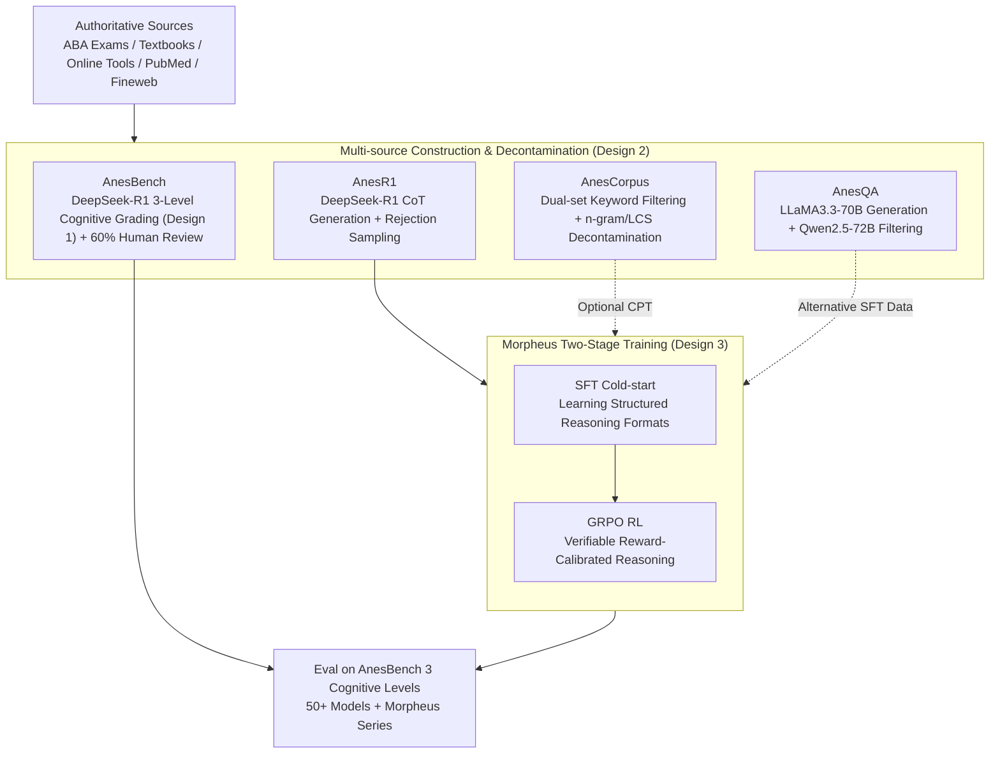

# AnesSuite: A Comprehensive Benchmark and Dataset Suite for Anesthesiology Reasoning

**Conference**: ICLR 2026  
**arXiv**: [2504.02404](https://arxiv.org/abs/2504.02404)  
**Code**: [MiliLab/AnesSuite](https://github.com/MiliLab/AnesSuite)  
**Area**: LLM Evaluation  
**Keywords**: Anesthesiology Reasoning, Medical Benchmark, Bilingual Evaluation, Cognitive Demand Grading, GRPO Reinforcement Learning

## TL;DR

The authors construct AnesSuite, the first comprehensive dataset suite for anesthesiology reasoning. It includes the benchmark AnesBench (7,972 bilingual multiple-choice questions across three cognitive levels) and three training datasets (AnesCorpus/AnesQA/AnesR1). The Morpheus model, trained using SFT+GRPO, allows a 7B model to match the 14B baseline performance while revealing significant bottlenecks in complex clinical reasoning (System 2) for currently leading LLMs.

## Background & Motivation

**Background**: LLMs have made significant progress in medical AI, but their reasoning capabilities in highly specialized disciplines like anesthesiology remain insufficient. Anesthesiology involves the simultaneous management of multiple systems—including airway and respiratory function, cardiovascular stability, electrolyte balance, and sedation levels—requiring a full spectrum of reasoning from rapid fact recall (System 1) to complex multi-factorial clinical decision-making (System 2).

**Limitations of Prior Work**: Existing medical benchmarks such as MedQA and PubMedQA, while broad, suffer from three key issues: (1) Anesthesiology is often implicitly categorized under surgery or dentistry, lacking independent specialized evaluation; (2) existing anesthesiology assessments like CAB focus primarily on factual memory, failing to test clinical reasoning and decision-making; (3) limited language coverage prevents evaluating performance differences between English and Chinese clinical scenarios.

**Key Challenge**: The primary challenge for LLMs in anesthesiology is not a lack of knowledge, but an inability to apply that knowledge to complex reasoning problems. Existing benchmarks fail to effectively distinguish between "knowing what" and "can reason what," making it impossible to precisely locate model bottlenecks. Furthermore, the effectiveness of training strategies like SFT, CPT, and RLVR in specialized medical domains lacks systematic comparison.

**Goal**: (1) Construct the first anesthesiology dataset suite covering the entire pipeline from evaluation to training; (2) establish a three-level cognitive demand classification system to precisely diagnose model capability boundaries; (3) explore efficient domain-adaptation training strategies.

**Key Insight**: Borrowing from Kahneman’s System 1/2 theory in cognitive psychology, the authors introduce a three-level cognitive grading for the first time in medical benchmarks: System 1 (Fact Recall) → System 1.x (Mixed Reasoning) → System 2 (Complex Decision-making). This enables fine-grained evaluation to reveal performance disparities across different reasoning levels.

**Core Idea**: To systematically advance LLM capabilities in complex anesthesiology reasoning and analyze their bottlenecks by building a cognitively graded specialized benchmark and paired training datasets.

## Method

### Overall Architecture

AnesSuite is an integrated "evaluation + training" dataset suite consisting of four complementary components, covering the full model development lifecycle from continued pre-training to reinforcement learning. The input consists of raw data from authoritative medical sources (ABA exams, textbooks, PubMed literature, large-scale web text), and the output includes a structured benchmark and alignment data ready for various training stages.

| Component | Data Type | English Scale | Chinese Scale | Function |
|-----------|-----------|---------------|---------------|----------|
| AnesBench | MCQs | 4,418 Qs | 3,554 Qs | Evaluation benchmark (3-level cognitive grading) |
| AnesCorpus | Plain text | 1.8M docs | 0.6M docs | Continued Pre-training (CPT) |
| AnesQA | QA pairs | 20,713 | — | Supervised Fine-tuning (SFT) |
| AnesR1 | MCQs + CoT | 3,200 | 7,000 | SFT Cold-start + RLVR (GRPO) |

Based on this data, the authors trained the Morpheus series—using Qwen2.5-7B/14B/32B as base models. Through a two-stage process of SFT+GRPO on AnesR1, they developed the first set of anesthesiology reasoning baseline models. The pipeline is summarized as: Authoritative sources → Construction of four data components (eval set + three training sets, with full decontamination) → Two-stage adaptation → Evaluation on AnesBench categorized by three cognitive levels.

### Key Designs

**1. Three-level Cognitive Demand System (System 1 / 1.x / 2): Separating "Memory" from "Reasoning"**

Traditional medical benchmarks report an overall accuracy by mixing all questions, where many simple memory-based questions can inflate scores and mask weaknesses in actual reasoning. AnesBench uses the dual-system theory from cognitive science to divide 7,972 questions into three levels: System 1 for pure fact recall (e.g., "What is the mechanism of propofol?"), System 1.x for mixed reasoning (integrating 2-3 knowledge points), and System 2 for complex clinical decision-making (multi-step reasoning, conditional judgment, cross-domain synthesis). The classification is automated by DeepSeek-R1 using detailed annotation guidelines and few-shot examples, followed by 60% human expert review. System 1.x and System 2 together account for 20-30% of the set, highlighting the dramatic drop in model accuracy from System 1 to System 2—the true bottleneck hidden by aggregate scores.

**2. Multi-source Data Construction & Decontamination Pipeline**

Data leakage is particularly problematic in medicine, as exam questions may have been included in LLM pre-training data. Each of the four components follows a controlled construction path: AnesBench is sourced from ABA exams, standardized textbooks, and validated online tools; AnesCorpus uses dual-level keyword filtering to extract documents from Fineweb and Chinese Fineweb; AnesQA employs a dual-model pipeline (LLaMA3.3-70B for generation, Qwen2.5-72B for filtering/answering); AnesR1 CoT trajectories are generated by DeepSeek-R1 and refined via rejection sampling (discarding items where the model fails 3 times). For decontamination, AnesCorpus underwent two-stage comparison—fast n-gram screening and fine-grained Longest Common Substring (LCS > 64 chars) checks—reducing overlap between evaluation and training sets to a minimum.

**3. Morpheus Two-stage Training Flow (SFT → GRPO): Teaching Format then Enforcing Reasoning via Verifiable Rewards**

SFT alone often has an awkward side effect: English accuracy rises slightly, but Chinese accuracy drops significantly (e.g., Morpheus-14B SFT-only Chinese performance fell from 0.72 to 0.55), likely due to unbalanced data ratios leading to catastrophic forgetting of the language. Morpheus treats SFT only as a cold-start: the first stage uses CoT data from AnesR1 for limited steps to teach the model a structured output format; the second stage applies Group Relative Policy Optimization (GRPO) on verifiable MCQs from AnesR1. It uses "answer correctness" as a verifiable reward, sampling multiple responses for the same question and calculating the advantage function based on relative intra-group rankings, without requiring an external reward model. GRPO retains English gains while re-calibrating and even improving Chinese performance beyond the baseline. Notably, with only ~10k anesthesiology samples, reasoning gains generalized to general medical and even general benchmarks (MMLU, MedQA).

### Loss & Training

The SFT stage uses standard next-token prediction loss. The GRPO stage utilizes group relative policy optimization, where multiple candidate responses are sampled for the same problem. Correct answer matching serves as the reward signal, and the advantage function is calculated based on relative ranking within the group to optimize the policy. Unlike traditional RL, GRPO requires no additional reward model, directly leveraging the verifiability of MCQs. Training was conducted on Qwen2.5-7B/14B/32B scales with limited SFT steps and standard GRPO hyperparameters.

## Key Experimental Results

### Main Results: Evaluation of 50+ Models on AnesBench

The paper evaluates over 50 LLMs, including closed-source models (GPT-4o, Gemini-2.5-Pro/Flash, Claude-3.7-Sonnet), general open-source models (Qwen3 series, Llama-4, DeepSeek-R1/V3), and medically specialized models (HuatuoGPT-o1, BioMistral).

| Model | EN-Sys1 | EN-Sys1.x | EN-Sys2 | EN-Total | CH-Sys1 | CH-Sys1.x | CH-Sys2 | CH-Total | Avg. |
|-------|---------|-----------|---------|----------|---------|-----------|---------|----------|------|
| Gemini-2.5-Pro | 0.89 | 0.82 | **0.77** | **0.86** | 0.88 | 0.75 | **0.60** | **0.85** | **0.85** |
| DeepSeek-R1 | 0.85 | 0.78 | 0.70 | 0.82 | 0.86 | 0.77 | 0.61 | 0.83 | 0.82 |
| Llama-4-Maverick | 0.83 | 0.73 | 0.64 | 0.79 | 0.86 | 0.72 | 0.59 | 0.83 | 0.81 |
| Gemini-2.5-Flash | 0.84 | 0.76 | 0.68 | 0.81 | 0.84 | 0.72 | 0.59 | 0.81 | 0.81 |
| GPT-4o | 0.81 | 0.72 | 0.59 | 0.77 | 0.79 | 0.64 | 0.52 | 0.76 | 0.76 |
| Claude-3.7-Sonnet | 0.80 | 0.73 | 0.63 | 0.77 | 0.82 | 0.65 | 0.55 | 0.78 | 0.77 |
| Qwen3-32B | 0.72 | 0.64 | 0.48 | 0.68 | 0.81 | 0.64 | 0.57 | 0.78 | 0.70 |
| HuatuoGPT-o1-72B | 0.71 | 0.61 | 0.48 | 0.67 | 0.79 | 0.67 | 0.61 | 0.76 | 0.71 |
| Qwen2.5-7B-Instruct | 0.56 | 0.44 | 0.36 | 0.51 | 0.69 | 0.55 | 0.55 | 0.66 | 0.59 |
| BioMistral-7B | 0.43 | 0.30 | 0.32 | 0.39 | 0.24 | 0.25 | 0.16 | 0.24 | 0.31 |

### Main Results: Morpheus Models

| Model | SFT | GRPO | EN-Total | CH-Total | Avg. |
|-------|-----|------|----------|----------|------|
| Qwen2.5-7B-Instruct | — | — | 0.51 | 0.66 | 0.59 |
| Morpheus-7B (SFT only) | ✓ | ✗ | 0.54 | 0.56 | 0.54 |
| **Morpheus-7B** | **✓** | **✓** | **0.56** | **0.70** | **0.63** |
| Qwen2.5-14B-Instruct | — | — | 0.57 | 0.72 | 0.64 |
| Morpheus-14B (SFT only) | ✓ | ✗ | 0.60 | 0.55 | 0.57 |
| **Morpheus-14B** | **✓** | **✓** | **0.63** | **0.75** | **0.69** |
| Qwen2.5-32B-Instruct | — | — | 0.61 | 0.76 | 0.68 |
| Morpheus-32B (SFT only) | ✓ | ✗ | 0.67 | 0.64 | 0.65 |
| **Morpheus-32B** | **✓** | **✓** | **0.68** | **0.77** | **0.72** |

Core Conclusion: **Morpheus-7B matches Qwen2.5-14B-Instruct, Morpheus-14B matches Qwen2.5-32B-Instruct, and Morpheus-32B matches Qwen2.5-72B-Instruct**—each model level reaches the next scale's baseline via SFT+GRPO.

### Ablation Study: Training Strategies & Data

| Model | SFT Data | EN Acc | CH Acc |
|-------|----------|--------|--------|
| Qwen2.5-7B-Base + AnesQA | Anesthesiology | 49.3 | 64.9 |
| Qwen2.5-7B-Base + Medical-o1 | Gen. Medical | 49.1 | 63.0 |
| Qwen2.5-7B-Base + Mixture | Mixed | **49.7** | **65.9** |
| Qwen2.5-7B-Base-CPT + AnesQA | Anesthesiology | 49.7 | 50.7 |
| Qwen2.5-7B-Base-CPT + Medical-o1 | Gen. Medical | 50.7 | 59.4 |
| Qwen2.5-7B-Base-CPT + Mixture | Mixed | **51.2** | **60.0** |

### Key Findings

- **System 2 is the bottleneck for all models**: Performance decay from System 1 to System 2 is staggering—even Gemini-2.5-Pro scores only 0.77 on EN-System 2 (vs 0.89 on System 1), and most open-source models score below 0.5. This indicates the primary challenge is knowledge application rather than knowledge missing.
- **GRPO is critical for reasoning gains**: Pure SFT marginally improves English but severely damages Chinese performance. GRPO restores and then improves performance across both languages by using reward signals to re-calibrate linguistic balance.
- **The double-edged sword of CPT**: Continued pre-training on AnesCorpus improves English performance (+1.5%) but causes a catastrophic 14.2% drop in Chinese accuracy, likely due to the 3:1 English-centric document ratio.
- **CoT length correlates with quality in System 2**: On System 2 tasks, models generating longer CoT chains perform significantly better, whereas CoT length has little impact on System 1 tasks.
- **Complementary value of general medical data**: Mixing AnesQA (specialized) with Medical-o1 (general) performs better than either alone, suggesting general medical knowledge supports specialized anesthesiology reasoning.
- **No significant advantage for medical-specific models**: Models like HuatuoGPT-o1 do not significantly outperform general reasoning models (e.g., DeepSeek-R1) of the same scale on AnesBench.

## Highlights & Insights

- **Transferable Cognitive Grading**: The System 1/1.x/2 framework is content-agnostic and can be applied to other Specialized benchmarks (ICU, Emergency, etc.) requiring clinical decision-making analysis.
- **SFT as a Cold-start for GRPO**: This provides a practical solution to "language-specific catastrophic forgetting" during specialized adaptation.
- **High Return on Small Data**: Using only ~10k high-quality samples to achieve cross-scale performance gains demonstrates the significant transfer value of specialized reasoning data.
- **Horizontal Landscape**: Evaluating 50+ models provides a comprehensive map of LLM capabilities in clinical reasoning, serving as a direct reference for deployment decisions.

## Limitations & Future Work

- **System 2 questions reflect abstract scenarios, not real cases**: Tasks are constructed from exams/textbooks rather than raw EMR data, potentially missing the ambiguity of real-world clinical environments.
- **Lack of Multi-modal Data**: Real anesthesiology involves waveform monitoring, imaging, and video; text MCQs alone cannot evaluate multi-modal decision-making.
- **Insufficient CPT Exploration**: The catastrophic forgetting in the Chinese language during CPT was observed but not fully explored via alternative learning rates or language-balanced sampling.
- **Verifiable Reward Dependency**: The RLVR method relies on verifiable signals from MCQs; extending this to free-form clinical advice remains an open challenge.

## Related Work & Insights

- **vs HuatuoGPT-o1**: Demonstrates that even advanced general medical reasoning models have blind spots in specialized anesthesiology reasoning.
- **vs CAB**: Improves upon previous benchmarks by adding bilingual support, reasoning-focused questions, and full training resources.
- **Cognitive Science Inspiration**: Demonstrates a paradigm where cognitive psychology theories can be systematically used to design AI benchmark structures.

## Rating

- Novelty: ⭐⭐⭐⭐ (First specialized suite, cognitive grading is innovative, though data collection is standard)
- Experimental Thoroughness: ⭐⭐⭐⭐⭐ (50+ models, multi-strategy ablation, cross-lingual analysis)
- Writing Quality: ⭐⭐⭐⭐ (Clear structure, though CPT analysis depth could be higher)
- Value: ⭐⭐⭐⭐ (Strong reference for medical LLM adaptation and specialized reasoning)

<!-- RELATED:START -->

## Related Papers

- [\[ICLR 2026\] AirQA: A Comprehensive QA Dataset for AI Research with Instance-Level Evaluation](airqa_a_comprehensive_qa_dataset_for_ai_research_with_instance-level_evaluation.md)
- [\[ICLR 2026\] DeepResearch Bench: A Comprehensive Benchmark for Deep Research Agents](deepresearch_bench_a_comprehensive_benchmark_for_deep_research_agents.md)
- [\[ACL 2025\] PhysReason: A Comprehensive Benchmark towards Physics-Based Reasoning](../../ACL2025/llm_evaluation/physreason_a_comprehensive_benchmark_towards_physics-based_reasoning.md)
- [\[ICCV 2025\] 3DSRBench: A Comprehensive 3D Spatial Reasoning Benchmark](../../ICCV2025/llm_evaluation/3dsrbench_a_comprehensive_3d_spatial_reasoning_benchmark.md)
- [\[ICLR 2026\] AstaBench: Rigorous Benchmarking of AI Agents with a Scientific Research Suite](astabench_benchmarking_ai_agents.md)

<!-- RELATED:END -->
