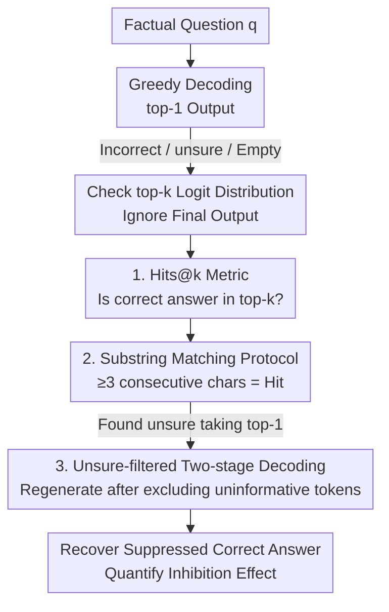

# Are LLMs Really Not Knowledgeable? Mining the Submerged Knowledge in LLMs' Memory

**Conference**: ICLR 2026  
**OpenReview**: [https://openreview.net/forum?id=gvUufgeJvV](https://openreview.net/forum?id=gvUufgeJvV)  
**Code**: https://github.com/taoxj2001/Hits_at_k  
**Area**: LLM Evaluation / Knowledge Probing / Factual QA  
**Keywords**: Parametric Knowledge, Storage-Expression Gap, Hits@k, Decoding Inhibition, Hallucination

## TL;DR
This paper argues that when LLMs fail QA tasks or respond with "unsure," it is often not because the knowledge is missing from the parameters, but because it is "submerged" and not expressed. It proposes the Hits@k metric to demonstrate that correct answers frequently reside within the top-k logits but are not selected (e.g., LLaMA3-8B achieves only 17.2% Hits@1 on DBpedia but 57.9% Hits@5). It further reveals that the prevalent "allow unsure" prompting paradigm actively suppresses low-confidence correct answers.

## Background & Motivation

**Background**: LLMs are increasingly treated as "parametric knowledge bases," where massive amounts of factual data are compressed into weights during pre-training and retrieved during QA. Mainstream remedies for failures in knowledge-intensive tasks (hallucinations, incorrect answers, inconsistency) focus on three categories: domain fine-tuning, prompt engineering, and architectural changes.

**Limitations of Prior Work**: These approaches implicitly assume that incorrect answers stem from a **knowledge gap**—that the information is simply not stored in the parameters. Consequently, solutions focus on increasing capacity or data. However, the authors observed a neglected phenomenon: even when the model outputs an incorrect answer, the correct answer often remains in the token probability distribution with **high probability**. For example, when asked for the capital of Washington state, a model might decode "Seattle" but still assign high probability to "Olympia."

**Key Challenge**: The root problem is not "knowledge storage" but "knowledge expression"—a systemic gap exists between the two. Traditional evaluations focusing only on top-1 output **severely underestimate** the knowledge actually encoded in model parameters. This misdiagnoses "expression problems" as "knowledge problems," leading to misguided mitigation strategies.

**Goal**: (1) Quantify "how much knowledge the model stores" independently from "how much it expresses"; (2) determine factors (scale, recency, domain, popularity) influencing storage-expression alignment; (3) examine whether current QA paradigms (allowing "unsure") actively exacerbate this gap.

**Key Insight**: Rather than looking at the final selected token, one should examine the **entire token logit distribution during decoding**, as it reflects the internal knowledge state before the final choice. If the correct answer consistently appears in the top-k, the knowledge is present but unexpressed.

**Core Idea**: Use "whether the correct answer falls within the top-k logits" (Hits@k) instead of "top-1 correctness" (accuracy) to measure knowledge, thereby uncovering submerged information. This is used to analyze the inhibitory effect of the popular "unsure" prompting paradigm on correct answers.

## Method

### Overall Architecture

The paper proposes a **diagnostic analytical framework** rather than a new model or training method. It decouples what a model "knows" from what it "says" to locate the bottleneck. The analysis flow involves taking a factual question, performing greedy decoding (which may yield errors, "unsure," or empty strings), and then checking the top-k logit distribution. **Hits@k** is used to quantify the presence of the correct answer, followed by a **two-stage unsure-filtered decoding** probe to recover suppressed correct answers and quantify the level of inhibition.

### Key Designs

**1. Hits@k Metric: Decoupling Stored Knowledge from Accuracy**

Top-1 accuracy fails to distinguish between "model does not know" and "model knows but remains silent." The authors define:

$$\text{Hits@}k = \frac{N^{k}_{\text{correct}}}{N}$$

Where $N^{k}_{\text{correct}}$ is the number of samples where the correct answer appears in the top-$k$ logits, and $N$ is the total sample size. While $k=1$ is standard accuracy, increasing $k$ reveals hidden knowledge. The gap is significant: LLaMA3-8B on DBpedia shows 17.2% Hits@1 but jumps to 57.9% for Hits@5. At $k=50$, coverage exceeds 80% across head, torso, and tail subsets. This proves that for models with ~128k token vocabularies, the correct answer is usually among the **very first few tokens**; it is "there" but not selected.

**2. Substring Matching Evaluation Protocol: Bypassing Tokenization Artifacts**

Many models use subword tokenization. If "Antibiotic" appears in the logits only as the subword "Antib," exact string matching would fail, underestimating knowledge. The protocol is modified such that a hit is recorded if **any token in the top-k shares at least 3 consecutive characters with the ground truth**. This ensures the metric measures whether the model activated the relevant internal representation rather than whether it completed the full spelling.

**3. Unsure-filtered Two-stage Decoding: Recovering Suppressed Answers**

A common failure mode is the model outputting "unsure" while the correct answer (or its subword) is ranked 2nd or 3rd in the logits. This "memory-masking" effect occurs because prompts designed to reduce hallucinations prioritize the "unsure" token. The authors use a **diagnostic probe** (Algorithm 1): given question $q$ and distribution $P(t\mid q)$, tokens starting with "uns", empty strings, or stop words are labeled as uninformative set $U$. The highest probability **informative** token is then selected:

$$a^{*}=\arg\max_{t\in T_k\setminus U} P(t\mid q)$$

This token $a^{*}$ is appended to the prompt for a second round of decoding. This strategy successfully recovered many answers (e.g., LLaMA3-70B on DBpedia-Head improved from 11.2% to 23.0%, a +11.8 gain), confirming that many "unsure" responses mask known facts.

### A Complete Example

Consider Question 1 from Figure 6: "What is a common treatment for tuberculosis?" The ground truth is "Antibiotic." Greedy top-1 decoding yields "unsure"—traditionally marked as "incorrect" (model doesn't know). However, the logit distribution shows "Antib" at rank-2. Under the substring protocol (sharing ≥3 chars with "Antibiotic"), this is a hit for Hits@2. Using the unsure-filtered probe, "unsure" is removed, "Antib" is selected as $a^{*}$, and the model successfully completes "Antibiotic." Accuracy says "no," Hits@k says "it's there," and filtered decoding says "it can be retrieved."

## Key Experimental Results

Tests spanned 9 models (LLaMA2, LLaMA3, Qwen2, Mistral) across 3 datasets: DBpedia (open-domain), IMDB (movies), and GoodReads (books), segmented by entity frequency (head/torso/tail).

### Main Results: Pervasiveness of the Storage-Expression Gap

| Setting (LLaMA3-8B, DBpedia) | Hits@1 (≈Accuracy) | Hits@5 | Hits@50 |
|---|---|---|---|
| Head | 18.9% | 48.3% | 83.4% |
| Torso | 14.5% | 42.4% | 79.6% |
| Tail | 11.6% | 36.9% | 76.6% |

The surge from Hits@1 to Hits@50 demonstrates that what traditional accuracy labels as "unknown" is actually present in the top-50 logits.

### Answer Recovery via Unsure-filtered Decoding (Table 2, DBpedia)

| Model | Greedy Head | After Filtering | Gain |
|---|---|---|---|
| LLaMA3-70B | 11.2 | 23.0 | ↑11.8 |
| LLaMA3.1-8B | 8.1 | 15.6 | ↑7.5 |
| QWEN2-7B | 3.9 | 9.3 | ↑5.4 |
| LLaMA3-8B | 9.8 | 13.6 | ↑3.8 |

Simply excluding "unsure"-like tokens recovers substantial correct knowledge, confirming it was suppressed during decoding.

### Key Findings
- **Scale ≠ Memory Completion**: While accuracy improves with scale, Hits@k is often similar between 13B and 70B models, suggesting they store similar knowledge, but larger models express it better.
- **Newer Models Remember More**: LLaMA3 consistently outperforms LLaMA2 in Hits@k across all scales (e.g., 92.1% vs 70.5% on head entities).
- **Specialized Domains are Harder**: Hits@k is lower for IMDB/GoodReads than DBpedia, as specialized knowledge might truly be missing from training data.
- **Popularity Impact is Weaker on Hits@k**: Popularity affects expression more than storage; "tail" knowledge often exists in parameters but is harder to surface.
- **Uninformative Answers Kill Performance**: Over half of failures on DBpedia are due to "unsure" or empty strings, which are the easiest to identify and filter.

## Highlights & Insights
- **Redefining Knowledge Awareness**: Re-diagnosing low accuracy as "expression failure" rather than "knowledge absence" challenges the default "add more data" approach.
- **Simplicity and Power of Hits@k**: It provides a view of internal knowledge storage orthogonal to accuracy without requiring additional training or complex probing.
- **Side Effects of Safety Paradigms**: The "allow unsure" safety mechanism is proven to have the side effect of actively suppressing correct knowledge, highlighting a critical trade-off for prompt design.
- **Transferable Methodology**: The approach of looking past surface output into the internal distribution can be applied to reasoning or code generation to separate performance from capability.

## Limitations & Future Work
- **Risk of Luck in Hits@k**: The 3-character substring match may produce false positives in large vocabularies, though the authors argue regional patterns suggest validity.
- **Probing vs. Production**: The filtered decoding strategy requires two rounds of decoding and heuristic rules, making it a measurement tool rather than a deployable solution.
- **Loose Threshold**: Being in the top-100 is a "loose" definition of knowing; actual reliability still requires top-1 performance.
- **Future Directions**: Combining Hits@k with confidence calibration to design decoding schemes that release latent knowledge without increasing hallucinations.

## Related Work & Insights
- **vs. Traditional KB Perspectives (Petroni et al. 2019)**: While prior work attributed failure to storage gaps, this paper proves the gap is often in expression by decoupling the two.
- **vs. Popularity-based Evaluation (Sun et al. 2023)**: This work finds that popularity has a smaller impact on Hits@k than on accuracy, suggesting tail knowledge is stored but difficult to express.
- **vs. Hallucination Mitigation**: Safety measures that introduce "unsure" options may inadvertently "mask" the model's actual knowledge, necessitating a more balanced approach.

## Rating
- **Novelty**: ⭐⭐⭐⭐⭐ High. Re-diagnosing "ignorance" as "silence" is a compelling perspective shift.
- **Experimental Thoroughness**: ⭐⭐⭐⭐ Solid coverage across models and datasets, though direct quantification of false positives is lacking.
- **Writing Quality**: ⭐⭐⭐⭐ Clear narrative and intuitive examples.
- **Value**: ⭐⭐⭐⭐⭐ Hits@k is a low-cost, reusable metric with direct implications for evaluation and decoding research.

<!-- RELATED:START -->

## Related Papers

- [\[ICLR 2026\] Can LLMs Refuse Questions They Do Not Know? Measuring Knowledge-Aware Refusal in Factual Tasks](can_llms_refuse_questions_they_do_not_know_measuring_knowledge-aware_refusal_in_.md)
- [\[ICLR 2026\] Beyond a Million Tokens: Benchmarking and Enhancing Long-Term Memory in LLMs](beyond_a_million_tokens_benchmarking_and_enhancing_long-term_memory_in_llms.md)
- [\[ACL 2025\] EvoWiki: Evaluating LLMs on Evolving Knowledge](../../ACL2025/llm_evaluation/evowiki_evaluating_llms_on_evolving_knowledge.md)
- [\[ACL 2026\] BizCompass: Benchmarking the Reasoning Capabilities of LLMs in Business Knowledge and Applications](../../ACL2026/llm_evaluation/bizcompass_benchmarking_the_reasoning_capabilities_of_llms_in_business_knowledge.md)
- [\[ICLR 2026\] Benchmarking Overton Pluralism in LLMs](benchmarking_overton_pluralism_in_llms.md)

<!-- RELATED:END -->
