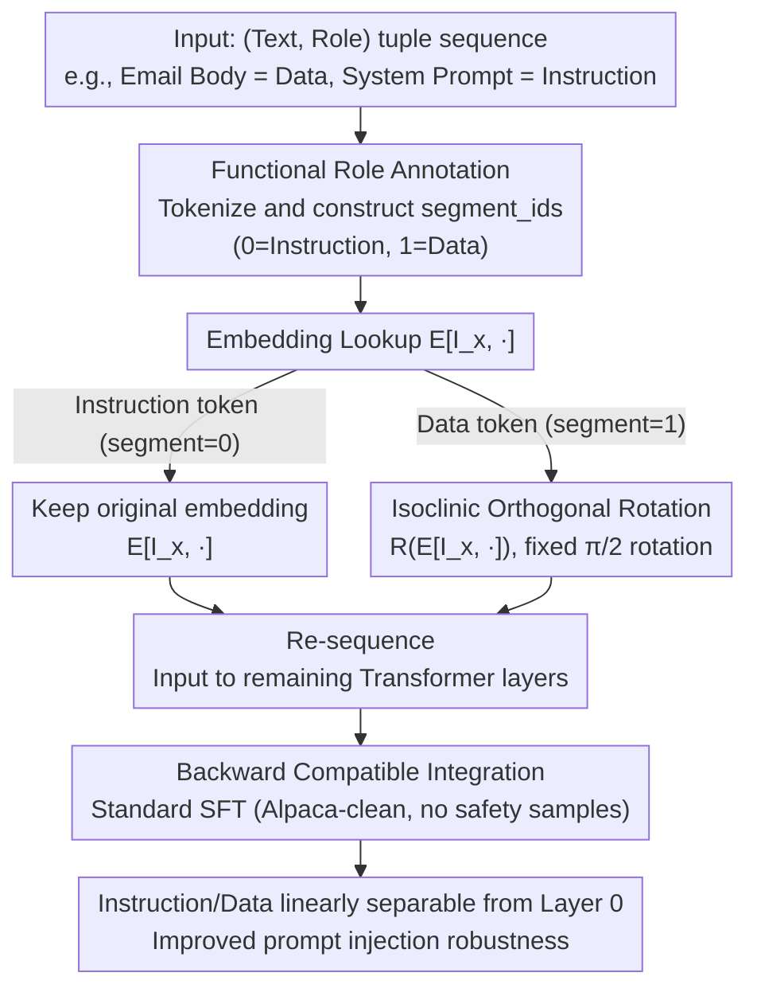

# ASIDE: Architectural Separation of Instructions and Data in Language Models

**Conference**: ICLR 2026  
**arXiv**: [2503.10566](https://arxiv.org/abs/2503.10566)  
**Code**: None  
**Area**: LLM Evaluation  
**Keywords**: instruction-data separation, prompt injection, orthogonal rotation, token embedding, architectural safety  

## TL;DR
The paper proposes ASIDE, an architectural modification that distinguishes instructions and data via orthogonal rotation at the token embedding layer. By modifying only the forward pass and training on standard instruction-tuning data, it significantly enhances instruction-data separation and prompt injection robustness without requiring specialized safety training.

## Background & Motivation
**Background**: LLMs are widely integrated into software systems like email clients and agent pipelines. These scenarios naturally involve two types of inputs: instructions (to be executed) and data (to be processed, not executed). However, current LLM architectures use identical embeddings for both, making them indistinguishable within the model.

**Limitations of Prior Work**: The lack of instruction-data separation is the root cause of successful prompt injection (indirect and direct) attacks. Existing defenses rely on prompt engineering or special delimiters (easily bypassed) or adversarial training (restricted to specific attack patterns), failing to address the fundamental issue.

**Key Challenge**: In traditional LLMs, the same token has identical embeddings whether it appears in an instruction or data. The model must infer the functional role of a token from context, which is extremely difficult to achieve reliably in deep networks.

**Goal**: How can a model distinguish between instruction and data tokens from the very first layer without adding parameters or re-pretraining?

**Key Insight**: Token embeddings typically exhibit a low-rank structure. Instructions and data can share the same high-dimensional space but reside in different linear subspaces. Orthogonal rotation can create this separation without altering embedding norms or inner-product structures.

**Core Idea**: Apply a fixed $\frac{\pi}{2}$ orthogonal rotation to the embeddings of data tokens, enabling the model to distinguish instructions from data via embeddings starting from the first layer.

## Method

### Overall Architecture
ASIDE addresses the issue where traditional LLMs assign identical embeddings to instruction and data tokens, forcing the model to infer whether a token should be "executed" or "processed" solely from context—the fundamental vulnerability to prompt injection. The approach is lightweight, modifying only the forward pass of the embedding layer without adding parameters. The deployer decomposes the input into a sequence of (text, role) tuples (e.g., labeling an email body as "data" and a system prompt as "instruction"). After tokenization, `segment_ids` are constructed with the same shape as `input_ids` (0=instruction, 1=data). The forward pass branches based on these roles: if a token $x$ is an instruction, it uses the original embedding $E[I_x, \cdot]$; if it is data, it uses the rotated embedding $R(E[I_x, \cdot])$, where $R \in \mathbb{R}^{d \times d}$ is a fixed orthogonal rotation matrix. The rotated data embeddings and unrotated instruction embeddings are re-sequenced and passed through the rest of the Transformer. Finally, the model is fine-tuned on standard SFT data (e.g., Alpaca-clean, without safety samples), learning to place the two types of tokens into distinct subspaces from the first layer.

### Key Designs

**1. Functional Role Annotation: Removing reliance on model inference**

ASIDE determines which tokens to rotate based on role annotations known at deployment, rather than model inference. In many real-world systems, role information is predefined—email bodies are always data, and system prompts are always instructions. Technically, inputs are split into (text, role) tuples, and a `segment_ids` tensor is constructed (0 for instructions, 1 for data). Since external inputs (controlled by attackers) are always labeled as "data," attackers cannot prevent rotation through text content. A limitation is the requirement for token-level role labels, making it unsuitable for general chat scenarios with ambiguous boundaries.

**2. Isoclinic Orthogonal Rotation: Pushing data tokens into an orthogonal subspace**

For tokens labeled as data, a geometric rotation is applied directly to the embedding rather than learning an offset. Specifically, the $d$-dimensional embedding is split into pairs, and each pair is subjected to the same $\frac{\pi}{2}$ rotation matrix $\begin{pmatrix} 0 & -1 \\ 1 & 0 \end{pmatrix}$ (isoclinic rotation). This is a fixed transformation with no trainable parameters. At $\theta=\frac{\pi}{2}$, the transformation simplifies to swapping and negating coordinate pairs: $(x_1, x_2, x_3, x_4, \ldots) \mapsto (-x_2, x_1, -x_4, x_3, \ldots)$. Orthogonal rotation is chosen because it preserves norms and angles (preserving information) while moving data embeddings to a subspace orthogonal to instructions. This is superior to ISE (Wu et al., 2024), which uses learnable offsets; offsets remain in the same subspace and can be "absorbed" by deeper layers, whereas orthogonal rotation creates permanent geometric separability.

**3. Backward Compatible Integration: Zero parameter modification to pre-trained models**

The method can be integrated into any existing pre-trained model without re-pretraining. The process involves two steps: adding the rotation logic to the embedding forward pass and fine-tuning on standard SFT data (no safety/adversarial samples) for 3 epochs. Since the rotation matrix is fixed, this is essentially standard instruction tuning—the safety benefits derive from the architectural change rather than the training objective.

### Loss & Training
Standard SFT is used throughout, without adversarial training or safety-specific objectives. The training set is Alpaca-clean-gpt4-turbo (51.8k samples), with learning rates in $[1 \times 10^{-6}, 2 \times 10^{-5}]$, batch sizes of 64-256, and warm-up ratios of [0, 0.1].

## Key Experimental Results

### Main Results: Instruction-Data Separability (SEP Score)

| Model | Vanilla | ISE | ASIDE | Gain (vs Vanilla) |
|------|---------|-----|-------|-------------------|
| Llama 2 7B | ~55% | ~52% | ~67% | +12.3 pp |
| Llama 3.1 8B | ~50% | ~53% | ~70% | +20 pp |
| Qwen 2.5 7B | ~57% | ~57% | ~75% | +18 pp |
| Qwen 3 8B | ~31% | ~20% | ~65% | +34 pp |
| Mistral 7B | ~28% | ~50% | ~72% | +44.1 pp |

ASIDE's utility (AlpacaEval, SEP Utility) remains comparable to the Vanilla models.

### Prompt Injection Robustness (ASR↓)

| Model | Attack Type | Vanilla | ASIDE | Reduction |
|------|---------|---------|-------|------|
| Llama 3.1 8B | BIPIA-text | 13.6% | 4.1% | -9.5 pp |
| Llama 3.1 8B | BIPIA-code | 22.8% | 9.2% | -13.6 pp |
| Llama 3.1 8B | StruQ-ID | 43.3% | 41.3% | -2.0 pp |
| Qwen 2.5 7B | BIPIA-text | 18.3% | 14.5% | -3.8 pp |
| Qwen 3 8B | BIPIA-text | 10.2% | 2.8% | -7.4 pp |
| Qwen 3 8B | StruQ-ID | 47.0% | 8.1% | -38.9 pp |
| Mistral 7B | BIPIA-text | 11.1% | 0.5% | -10.6 pp |
| Mistral 7B | StruQ-ID | 33.4% | 9.6% | -23.8 pp |

### Key Findings
- ASIDE consistently improves SEP scores across all models (12-44 pp) while maintaining near-constant utility.
- Indirect prompt injection ASR is reduced by approximately 10-40 pp on average, with particularly significant results on Mistral and Qwen3.
- The ISE method shows no statistically significant difference from Vanilla on most models or even performs worse, suggesting learnable offsets are insufficient to maintain deep separation.
- Linear probing analysis shows ASIDE achieves 100% linear separability from Layer 0 (after embedding), while Vanilla only becomes gradually separable by Layers 5-10.
- Concept activation analysis indicates ASIDE effectively suppresses the spurious activation of "instruction concepts" within data regions.

## Highlights & Insights
- **Architectural Solutions for Safety**: Analogous to Data Execution Prevention (DEP) in computer security, ASIDE distinguishes executable and non-executable memory at the architectural level. This is the first work to successfully adapt this concept to LLMs.
- **Zero-Cost Safety Gains**: Significant safety improvements are achieved without adversarial training, safety datasets, or additional parameters, relying solely on a fixed rotation and standard SFT.
- **Rotation vs. Offset Design Insight**: While ISE uses learnable offsets to create distinction, these can be neutralized as layers deepen. Orthogonal rotation provides geometric persistence by creating orthogonal subspaces rather than just shifting locations in the same subspace.

## Limitations & Future Work
- Requires knowledge of functional roles (instruction vs. data) for each token at deployment, which limits applicability in general-purpose chat assistants where roles are blurred.
- Not tested on safety-tuned Instruct models (intentional for this study, but relevant for real-world deployment). The interaction between ASIDE and safety tuning is unknown.
- Limited improvement on StruQ-OOD attacks, indicating that OOD injection remains a challenge.
- Whether the fixed $\frac{\pi}{2}$ rotation is optimal hasn't been fully explored (e.g., other angles or learnable rotations).

## Related Work & Insights
- **vs. ISE (Wu et al., 2024)**: ISE uses learnable offsets that lose separation in deeper layers, resulting in safety metrics similar to or worse than Vanilla. ASIDE provides more persistent separation via rotation.
- **vs. Prompt Engineering**: Delimiters and special tokens operate at the input level and can be forged; ASIDE operates at the embedding level, where attackers cannot manipulate the rotation.
- **vs. Adversarial Training**: Adversarial training is reactive to specific attacks, whereas ASIDE offers an attack-agnostic structural defense.
- This method can be extended to multi-level hierarchies (e.g., system > user > tool) by defining additional orthogonal transformations.

## Rating
- Novelty: ⭐⭐⭐⭐⭐ First architectural implementation of instruction-data separation; clear and elegant concept.
- Experimental Thoroughness: ⭐⭐⭐⭐ 6 models × 8 safety benchmarks + separability assessment + interpretability analysis; lacks Instruct model testing.
- Writing Quality: ⭐⭐⭐⭐⭐ Motivated by classical computer security principles; fluent and logical.
- Value: ⭐⭐⭐⭐⭐ Provides a brand-new path for safety enhancement that is practical and theoretically sound.

<!-- RELATED:START -->

## Related Papers

- [\[AAAI 2026\] ConInstruct: Evaluating Large Language Models on Conflict Detection and Resolution in Instructions](../../AAAI2026/llm_evaluation/coninstruct_evaluating_large_language_models_on_conflict_detection_and_resolutio.md)
- [\[ICLR 2026\] Prompt and Parameter Co-Optimization for Large Language Models](prompt_and_parameter_co-optimization_for_large_language_models.md)
- [\[ICLR 2026\] Inverse IFEval: Can LLMs Unlearn Stubborn Training Conventions to Follow Real Instructions?](inverse_ifeval_can_llms_unlearn_stubborn_training_conventions_to_follow_real_ins.md)
- [\[ICLR 2026\] DAComp: Benchmarking Data Agents across the Full Data Intelligence Lifecycle](dacomp_benchmarking_data_agents_across_the_full_data_intelligence_lifecycle.md)
- [\[ICLR 2026\] Evaluating Language Models' Evaluations of Games](evaluating_language_models_evaluations_of_games.md)

<!-- RELATED:END -->
