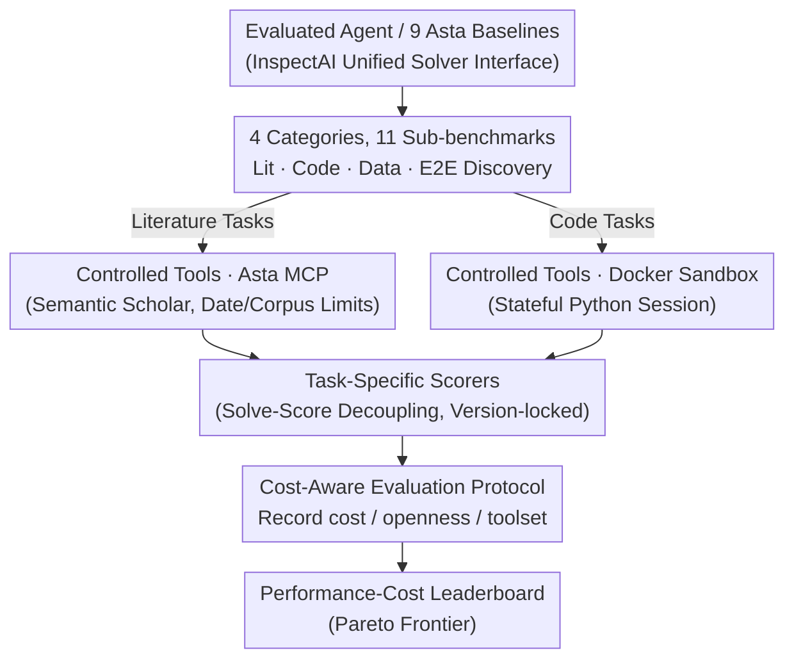

# AstaBench: Rigorous Benchmarking of AI Agents with a Scientific Research Suite

**Conference**: ICLR 2026 Oral  
**arXiv**: [2510.21652](https://arxiv.org/abs/2510.21652)  
**Code**: [allenai/asta-bench](https://github.com/allenai/asta-bench)  
**Area**: LLM Evaluation  
**Keywords**: Agent Benchmarks, Scientific Research Automation, Reproducible Evaluation, AI for Science  

## TL;DR

The AI2 team addresses five methodological flaws in existing scientific agent benchmarks by constructing AstaBench, the first evaluation suite covering the full scientific research process. It includes 4 categories of 11 sub-benchmarks with a total of 2400+ problems, equipped with a production-grade controlled search tool based on Semantic Scholar and 9 types of research-optimized Asta Agent baselines. Conducted as the largest systematic evaluation to date on 57 agents (22 types), the study finds that while progress has been made in individual tasks like literature search, AI remains far from reaching standards for end-to-end scientific research assistance.

## Background & Motivation

**Background**: AI Agents have demonstrated immense potential in the field of scientific research automation—automating literature reviews, experiment replication, data analysis, and even proposing new research directions. Numerous related systems have emerged: general-purpose ones like Google/OpenAI's Deep Research, and specialized ones like AI Scientist and AIGS. However, "rigorous evaluation" of these agents is a prerequisite for driving substantial progress.

**Limitations of Prior Work**: The authors systematically identified five methodological flaws in existing benchmarks. First, **lack of full-process measurement**: most benchmarks only test a single sub-task (e.g., QA or retrieval), failing to reflect the comprehensive demands of agents in real research scenarios. Second, **irreproducible tools**: different agents come with different search engines and toolchains, resulting in evaluations that essentially compare "tool differences" rather than "agent capabilities." Third, **uncontrolled confounding variables**: model costs, API call frequencies, and tool access permissions are not standardized, making it impossible to distinguish whether the performance stems from the model or the tools. Fourth, **lack of standardized interfaces**: without a unified framework for agent construction and evaluation, rapid prototyping and fair comparisons are difficult. Fifth, **insufficient baselines**: the lack of sufficient types and quantities of baseline agents makes it hard for the community to judge the authenticity of claimed "progress."

**Key Challenge**: Evaluating scientific agents requires measuring both "point capabilities" (e.g., retrieval, programming) and "full-process capabilities" (from literature surveys to end-to-end discovery). However, the complexity of evaluating the latter is significantly higher and requires a controlled tool environment to eliminate confounding factors.

**Key Insight**: Leveraging the deployed systems of Semantic Scholar / Asta (108M+ abstracts, 12M+ full-text papers), the team possesses unique advantages: (1) access to production-grade literature search APIs that serve as controlled tools; (2) data from the deployed Asta Agent, providing a large volume of real user requests to construct datasets grounded in practical needs.

**Core Idea**: Systematically fix the five methodological flaws of research agent evaluation at the level of methodology, constructing a standardized evaluation platform that covers the full process, ensures tool controllability, and provides sufficient baselines.

## Method

### Overall Architecture

AstaBench addresses how to evaluate a research agent fairly and reproducibly by decoupling evaluation into four interlocking infrastructure components through which any evaluated agent must pass. Any agent (including the 9 types of Asta baselines) connects via a unified InspectAI solver interface and is assigned to a dataset of 2400+ problems (4 categories, 11 sub-benchmarks) covering the research lifecycle. During solving, agents can only call controlled tool environments—literature retrieval via the Semantic Scholar-based Asta MCP and code execution within Docker sandboxes. Answers are scored by task-specific scorers for each sub-benchmark, with scoring code independently version-locked to ensure consistency over time. Finally, the agent-eval toolkit tracks cost, toolset tier, and openness, aggregating them into a leaderboard showing the performance-cost tradeoff. In other words, the problem set defines "what to test," the tool environment constrains "how to answer," the scorers determine "correctness," and the evaluation protocol records the "cost and tools used"—together, these ensure comparisons focus on "capability" rather than "tools or budget."

### Key Designs

**1. 4 Categories & 11 Sub-benchmarks: Covering the Full Research Chain from Retrieval to Discovery**

A common issue with existing benchmarks is capturing only one research phase—either retrieval or programming. Mastering sub-tasks does not equate to mastering research. AstaBench decomposes research capability into four progressive levels with independent sub-benchmarks: Literature (5 tasks, including PaperFindingBench, ScholarQABench2, LitQA2-FT/Search, and ArxivDIGESTables-Clean); Code (3 tasks, including CORE-Bench-Hard, DS-1000, and SUPER-Expert); Data Analysis (DiscoveryBench); and Discovery (E2E-Bench and its Hard version). Problems span Computer Science, Biomedicine, and other fields, with many derived from real user requests to ensure the distribution reflects actual needs rather than researcher assumptions.

**2. Asta MCP-based Controlled Tool Environment: Isolating "Tool Variance" from "Agent Capability"**

If every agent brings its own search engine, results often compare tool quality rather than intelligence. AstaBench mandates all literature tasks use the Asta MCP interface, backed by the Semantic Scholar API (108M+ abstracts, 12M+ full texts), with date and corpus restrictions—ensuring results do not drift even as new papers are published. Code tasks run in stateful Python sessions within Docker sandboxes (supporting `%%writefile`, `%matplotlib`, etc.) to guarantee reproducibility. Agents are categorized into three tool tiers on the leaderboard: Standard (✓, pre-set tools), Custom interface (∼, equivalent or more restricted custom tools), and Fully custom (×, exceeding constraints). This ensures long-term reproducibility via production-grade APIs rather than one-off snapshots.

**3. Task-Specific Scorers and Solve-Score Decoupling: Ensuring Consistent Scoring Across Versions**

After controlling tools, the next challenge is determining correctness. AstaBench employs task-specific scorers: literature retrieval is measured by precision/recall; QA by answer correctness (auto-eval + LLM judgment); code by execution pass rate; and end-to-end discovery by multi-dimensional report quality. The framework introduces **solve-score decoupling**, splitting "solving" and "scoring" into independently versioned phases. Scoring code can be fixed while the solution persists, allowing consistent scores across different times and scorer versions, preventing "comparability drift."

**4. 9 Baseline Types + Cost-Aware Evaluation Protocol: Debunking "Illusory Progress"**

AstaBench open-sources 9 research-optimized Asta Agent architectures (e.g., ReAct, Code-Execution, Context-Compression) to serve as benchmarks for the community. The agent-eval toolkit records model calls and token consumption to calculate **time-invariant cost**, converting tokens to USD using a fixed LiteLLM cost snapshot. This allows costs to remain comparable even if API prices change. The leaderboard displays the Pareto frontier of performance vs. cost, encouraging developers to consider efficiency. Additionally, agents are categorized by **openness** (4 levels: Open weights/source to Closed API/UI) and the 3 toolset tiers to further eliminate confounding factors.

## Key Experimental Results

### Main Results: AstaBench Task Composition

| Task Category | Sub-benchmark Name | Evaluated Capability | Scale |
|:---|:---|:---|:---|
| Literature (lit) | PaperFindingBench | Paper Retrieval | Hundreds |
| Literature (lit) | ScholarQABench2 | Sci-Lit QA | Hundreds |
| Literature (lit) | LitQA2-FT / FT-Search | Lit QA + Search | Hundreds |
| Literature (lit) | ArxivDIGESTables-Clean | Structured Table Gen | Hundreds |
| Code (code) | CORE-Bench-Hard | Repo-level Code Issues | Hundreds |
| Code (code) | DS-1000 | Data Science Coding | Hundreds |
| Code (code) | SUPER-Expert | Complex Coding + Trajectory | Hundreds |
| Data (data) | DiscoveryBench | Data-driven Discovery | Hundreds |
| Discovery (discovery) | E2E-Bench / E2E-Hard | End-to-end Sci Discovery | Hundreds |
| **Total** | **11 Sub-benchmarks** | **Full Process Coverage** | **2400+** |

### Methodology Comparison

| Evaluation Dimension | Issues in Prior Benchmarks | AstaBench Solution |
|:---|:---|:---|
| Measurement Scope | Single sub-task focus (Fragmented) | 11 sub-benchmarks covering full research process |
| Tool Reproducibility | Agent-specific search (High variance) | Unified Asta MCP (Semantic Scholar API) |
| Confounding Control | Unstandardized cost/permissions | Token/API cost tracking, Tool tiers labels |
| Standardized Interface | No common framework | InspectAI solver interface + ToolsetConfig |
| Baseline Sufficiency | Lack of baseline types/quantity | 9 Asta Agent baselines + 57 Agent comparison |
| Openness Categorization | No distinction between open/closed models | 4-level Openness + 3-level Toolset classification |

### Key Findings

- **Progress in Individual Tasks vs. Massive Gap in Full Process**: AI Agents perform well in individual tasks like retrieval and simple QA but show a significant gap compared to humans in end-to-end discovery tasks (E2E-Bench) requiring multi-step reasoning and cross-modal coordination. Success in sub-tasks does not equal success in research.
- **Tool Variance is a Major Confounder**: When tools are controlled (all agents using Asta MCP), performance differences stem primarily from reasoning strategies and context management rather than tool quality.
- **Significant Cost-Performance Trade-offs**: Token consumption varies by several orders of magnitude between agent types at similar performance levels, highlighting that cost efficiency is a critical dimension.
- **Inconsistent Capabilities Across Tasks**: Agents excelling at literature retrieval are not necessarily proficient at coding, and those good at data analysis may struggle with end-to-end discovery.

## Highlights & Insights

- **Methodological Contribution Exceeds Technical Contribution**: The core value is not just "another benchmark" but the systematic definition of how to correctly evaluate research agents via five principles (comprehensiveness, tool controllability, confounding control, standardized interfaces, sufficient baselines).
- **Product-Informed Question Sets**: Many problems originate from real user requests to production Asta Agents, ensuring the benchmark measures what users actually need rather than what researchers assume is important.
- **Clever Tool Environment Design**: Using the production Semantic Scholar API with date/corpus constraints balances reality and reproducibility. The date-restricted search design is particularly ingenious for preventing results from drifting due to new publications.
- **Cost-Visibility Paradigm**: Displaying the performance-cost trade-off on the leaderboard forces developers to consider efficiency—a more expensive agent is only justified if its performance is significantly superior.

## Limitations

- **Domain Bias Toward CS**: Despite claims of multi-domain coverage, the reliance on Semantic Scholar means coverage outside CS and Biomedicine (e.g., Physics, Chemistry, Social Sciences) may be insufficient.
- **Difficulty in Evaluating Experimental Capability**: Current benchmarks lean toward information retrieval and text reasoning, failing to evaluate "hands-on" capabilities like actual experiment design, execution, or instrument operation.
- **Challenges in Measuring Creativity**: Research centers on novel hypotheses and unexpected relationships, dimensions that are extremely difficult to measure with automated metrics.
- **High Hardware Threshold**: Running the full suite requires significant resources (e.g., 128GB+ RAM, many CPU cores) and substantial API costs, which may limit participation from smaller teams.

## Related Work & Insights

- **vs. AI Scientist / AIGS**: These are the evaluated subjects; AstaBench provides the platform to evaluate them fairly.
- **vs. SWE-bench / HumanEval / DS-1000**: These programming benchmarks are integrated as sub-tasks, but AstaBench expands to a broader research chain.
- **vs. GAIA / AgentBench**: General agent benchmarks test general tool use; AstaBench provides deep customization for the research vertical.
- **vs. Deep Research Systems**: General research agents can be directly evaluated on AstaBench to compare fairly against specialized research agents.

## Rating

- Novelty: ⭐⭐⭐⭐ (First to systematically fix methodological flaws in research agent evaluation)
- Experimental Thoroughness: ⭐⭐⭐⭐⭐ (57 Agents / 22 types / 11 sub-benchmarks / 2400+ problems)
- Writing Quality: ⭐⭐⭐⭐ (Clear definitions, logical organization of flaws and contributions)
- Value: ⭐⭐⭐⭐⭐ (Established standardized evaluation infrastructure for AI-for-Science agents)

<!-- RELATED:START -->

## Related Papers

- [\[ICLR 2026\] DeepResearch Bench: A Comprehensive Benchmark for Deep Research Agents](deepresearch_bench_a_comprehensive_benchmark_for_deep_research_agents.md)
- [\[ICLR 2026\] ResearchRubrics: A Benchmark of Prompts and Rubrics For Evaluating Deep Research Agents](researchrubrics_a_benchmark_of_prompts_and_rubrics_for_evaluating_deep_research_.md)
- [\[ICLR 2026\] From Reproduction to Replication: Evaluating Research Agents with Progressive Code Masking](from_reproduction_to_replication_evaluating_research_agents_with_progressive_cod.md)
- [\[ICLR 2026\] CyberGym: Evaluating AI Agents' Real-World Cybersecurity Capabilities at Scale](cybergym_evaluating_ai_agents_real-world_cybersecurity_capabilities_at_scale.md)
- [\[ICLR 2026\] AirQA: A Comprehensive QA Dataset for AI Research with Instance-Level Evaluation](airqa_a_comprehensive_qa_dataset_for_ai_research_with_instance-level_evaluation.md)

<!-- RELATED:END -->
