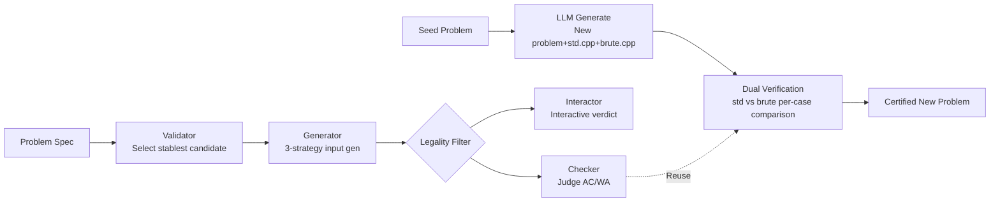

# AutoCode: LLMs as Problem Setters for Competitive Programming

**Conference**: ICLR 2026  
**OpenReview**: [https://openreview.net/forum?id=F96nsbbhXC](https://openreview.net/forum?id=F96nsbbhXC)  
**Code**: To be confirmed  
**Area**: LLM Evaluation / Code Intelligence  
**Keywords**: Competitive Programming, Test Case Generation, Problem Generation, RLVR Verifier, Consistency Evaluation  

## TL;DR
AutoCode utilizes a "Validator-Generator-Checker(-Interactor)" closed-loop multi-agent framework to enable LLMs to generate test data for existing competitive problems with ~99% official verdict consistency. Furthermore, starting from seed problems, it automatically generates new problems recognized by Grandmasters as competition-level through "Reference vs. Brute-force" dual verification.

## Background & Motivation
- **Background**: While LLM coding capabilities have advanced rapidly, "problem-solving" evaluation is becoming increasingly unreliable. Official test data from top platforms (Codeforces/AtCoder) are not public, forcing researchers to rely on synthetic datasets like CodeContests+, TACO, and HardTests to judge submission correctness.
- **Limitations of Prior Work**: Existing synthetic test sets suffer from high False Positive Rates (FPR, where incorrect/TLE solutions are misjudged as pass) and high False Negative Rates (FNR, where correct solutions crash due to illegal input). Consistency of existing methods is only 72–81%, with FNR often higher than FPR—a creative but correct solution may be wrongly rejected because the test input itself is invalid.
- **Key Challenge**: "Problem setting" is inherently harder than "problem solving." Setting a problem requires defining constraints, input distributions, and edge cases to prevent shortcuts, targeting specific algorithm complexities, and covering the entire solution space. Current evaluations treat low-quality test data as ground truth, rewarding models that take shortcuts (high FPR) and punishing valid reasoning (high FNR), thereby polluting RLVR reward signals.
- **Goal**: Construct a human-free, end-to-end pipeline for competitive problem creation and evaluation, serving as both a high-fidelity verifier (reducing FPR/FNR) and an automated producer of novel, competition-grade problems.
- **Key Insight**: **Treat "LLM problem-setting capability" as a touchstone for general intelligence.** By using a multi-agent closed loop and dual cross-verification, every step of problem setting (data generation, legality validation, judging, anti-hacking) is decomposed into specialized LLM programs that verify one another.

## Method

### Overall Architecture
AutoCode consists of two layers: the bottom layer is **Test Data Generation** (creating high-quality test sets for existing problems), and the top layer is **New Problem Generation** (reusing the underlying verification capability with dual verification to produce original problems). The bottom layer links four role-based programs in a closed loop: the Validator maintains input legality, the Generator creates adversarial inputs, the Checker judges final correctness, and the Interactor handles interactive problems. For each role, the LLM generates multiple candidates and selects the most robust one via targeted testing.

### Key Designs

**1. Validator: Selecting the strictest legality gatekeeper via "near-valid" samples.** The foundation of the system is the Validator, responsible for rejecting any input that violates problem constraints, thereby minimizing FNR (ensuring correct programs no longer crash on dirty data). During construction, the LLM generates 40 evaluation samples—10 valid and 30 "near-valid" (subtly violating constraints, e.g., range off-by-one, failing permutation properties). Three candidate Validator programs are produced, each scored via $\text{score}(V)=\sum_{(x,\text{label})\in E}[V(x)=\text{label}]$. The most accurate $V^\star$ is selected. Using "near-valid" rather than random invalid samples forces the Validator to strictly capture boundary conditions.

**2. Generator: Tri-adversarial strategy to minimize FPR.** With a reliable Validator, the Generator's goal shifts to maximizing coverage to catch incorrect or inefficient solutions. It executes three parallel strategies: **Exhaustive** (enumerates all small-scale permutations to cover boundaries for small-constraint problems); **Random/Extreme** (generates large-scale random and extreme inputs targeting integer overflows, floating-point precision, and array bounds, including adversarial cases to hack greedy algorithms or hash collisions); and **TLE-Inducing** (constructs worst-case structured inputs to force timeouts, ensuring only solutions meeting target complexity pass). Outputs are filtered by $V^\star$, deduplicated by signature, and sampled into a final test set $T$ balanced by difficulty/scale.

**3. Interactor: Automated judging for interactive problems via "Mutants."** Interactive problems (multi-round dialogue between program and judge) previously lacked automated data generation. AutoCode has the LLM apply small, critical logic changes to the reference solution (e.g., swapping `<` for `≤`, off-by-one, missing checks) to generate a set of **Mutants** $M$, acting as sophisticated "wrong solutions." Three candidate Interactors are generated and scored lexicographically as $\text{score}(I)=(p, f)$—first ensuring the true reference solution passes ($p$), then maximizing the number of rejected mutants ($f=\sum_{m\in M}[\text{SIMULATE}(I,m)=\text{Rejected}]$). The Interactor that passes the correct solution while catching the most mutants is chosen.

**4. New Problem Generation via Dual Verification: Mutual certification between std.cpp and brute.cpp.** Inspired by 8 human expert setters who acknowledge that setting often involves modifying constraints of existing problems, AutoCode selects a Codeforces problem (difficulty < 2200) as a seed. The LLM modifies conditions to generate a new problem spec, an efficient reference `std.cpp`, and a slow but reliable `brute.cpp`. The underlying framework generates a full-coverage small-data test set; the problem is certified only if the outputs of both solutions (where the brute-force solution may legally timeout) are judged identical by the Checker for every case. This protocol of "brute.cpp as initial ground truth + reference solution passing full tests" filtered 27% of error-prone problems and raised the LLM reference solution accuracy from 86% to 94%.

## Key Experimental Results

### Main Results (7,538 problems, 195,988 human submissions, driven by o3)

| Method | Consistency (%)↑ | FPR (%)↓ | FNR (%)↓ |
|---|---|---|---|
| CodeContests | 72.9 | 7.7 | 46.3 |
| CodeContests+ | 79.9 | 8.6 | 31.6 |
| TACO | 80.7 | 11.5 | 26.9 |
| HardTests | 81.0 | 12.1 | 25.8 |
| **AutoCode (Ours)** | **91.1** | **3.7** | **14.1** |

Consistency improved by ~10 points over the strongest baseline, with FPR and FNR both reduced by ~50%. On a harder, unfiltered 720-problem Codeforces benchmark (including interactive problems), consistency reached **98.7%**, whereas old methods could not be evaluated due to lack of public code.

### Ablation Study (720-problem benchmark, GPT-5-High, 33 submissions/problem)

| Configuration | Consistency (%)↑ | FPR (%)↓ | FNR (%)↓ |
|---|---|---|---|
| w/o Generator Strategy 1 (Exhaustive) | 98.4 | 1.7 | 1.3 |
| w/o Generator Strategy 2 (Random/Extreme) | 98.4 | 1.6 | 1.3 |
| w/o Generator Strategy 3 (TLE) | 98.6 | 1.4 | 1.3 |
| w/o Prompt Optimization | 98.0 | 1.8 | 2.9 |
| **Full Framework** | **98.7** | **1.3** | **1.2** |

Prompt optimization is most critical (FNR doubles to 2.9% without it). The three Generator strategies are complementary; removing any increases FPR. Candidate selection for Validator/Checker is also essential for suppressing FNR.

### Key Findings
- **Finding 1**: Approximately 4.2% of problems generated by the LLM could be set but not solved by itself—these "solvable but author-unsolved" problems are potential material for model self-improvement.
- **Finding 2**: LLMs tend toward combinatorial innovation (embedding existing algorithmic knowledge into existing problem frameworks) rather than proposing entirely new problem models requiring original solutions.
- **Finding 3**: Adapted problems are on average 334 Elo harder; those judged "novel" increase by 498, while non-novel increase by 108. Yield is highest from medium-hard seed problems. About 5% fall into the critical pass@1 ∈ [0.1, 0.5] zone, a goldmine for self-play RL training.
- Human Grading: 91.6% passed solvability checks, 76.3% had correct solutions, 61.6% reached training-grade usability, 17.4% contained novel designs, and 3.2% reached ICPC/IOI competition level.

## Highlights & Insights
- **Perspective Innovation**: Treating "problem setting" rather than "problem solving" as a metric for general intelligence is well-grounded—setting requires covering the entire solution space and potential shortcuts, encompassing all challenges of solving and more.
- **Addressing RLVR Pain Points**: Explicitly targets high-fidelity verification for RLVR, noting that dirty test data simultaneously rewards shortcuts (high FPR) and punishes valid reasoning (high FNR), polluting RL signals. This is highly relevant for researchers using code tasks for RL.
- **First Automated Interactive Data Generation**: The mutant discrimination approach is elegant, converting the question of "is the judge strict enough" into a measurable goal of "can it distinguish the correct solution from fine-tuned mutants."
- **Brute-Force Safeguard**: Using slow but reliable `brute.cpp` as the ground truth cleverly bypasses the deadlock of "unable to verify without an official answer."

## Limitations & Future Work
- **Model Dependency**: Main results use o3 and ablations use GPT-5-High. The extent to which the framework (especially candidate selection) compensates for weaker models requires more systematic investigation.
- **Recombinatorial Innovation**: Finding 2 admits LLM setting is primarily knowledge recombination. There remains a "creative" gap compared to top human setters who produce entirely new paradigms.
- **Seed Dependency**: Setting is highly dependent on random seeds and requires moderate difficulty; too easy or too hard seeds struggle to yield high-quality problems.
- **Manual Grading for Quality**: Fine-grained quality determination (Levels 3–6) relies on 8 expert scorers; large-scale automated quality assessment remains unsolved.
- Future work: Using "solvable but self-unsolved" and critical pass@1 problems for self-play/self-improvement training is a promising next step.

## Related Work & Insights
- **Test Augmentation/Generation**: Compared to augmenting existing unit tests (EvalPlus) or rule/LLM-driven adversarial cases (HardTests, CodeContests+), AutoCode provides an end-to-end pipeline including interactive problems.
- **Solving/Data-Centric Methods**: AlphaCode, AceReason, Absolute Zero, rStar-Coder, etc., focus on RL/self-play to expand search or curate datasets. AutoCode unifies "setting + verification," addressing both static benchmark contamination and under-constrained testing.
- **Insight**: For any code RLVR work, this paper is a strong reminder—the ceiling of reward signal quality is determined by test data FPR/FNR. Rather than just accumulating solution data, first ensure the verifiers are correct.

## Rating
- **Novelty**: ⭐⭐⭐⭐⭐ Viewing problem setting as an intelligence touchstone + multi-agent loop + mutant interactive judging + dual verification is a highly original and well-conceived combination.
- **Experimental Thoroughness**: ⭐⭐⭐⭐ 7,538-problem large-scale benchmark + 720-problem hard benchmark + full ablation + human expert grading. Slightly lacks human evaluation for larger-scale new problems and performance on weaker models.
- **Writing Quality**: ⭐⭐⭐⭐ Logic is progressive, pseudo-code is clear, and diagrams are effective; statistical details for some findings could be more systematic.
- **Value**: ⭐⭐⭐⭐⭐ Directly repairs the reliability foundation of competitive programming evaluation, with immediate practical value for RLVR, benchmark construction, and model self-improvement.

<!-- RELATED:START -->

## Related Papers

- [\[ACL 2025\] ELABORATION: A Comprehensive Benchmark on Human-LLM Competitive Programming](../../ACL2025/llm_evaluation/elaboration_competitive_programming.md)
- [\[ICLR 2026\] How Many Code and Test Cases Are Enough? Evaluating Test Cases Generation from a Binary-Matrix Perspective](how_many_code_and_test_cases_are_enough_evaluating_test_cases_generation_from_a_.md)
- [\[ICLR 2026\] Preference Leakage: A Contamination Problem in LLM-as-a-judge](preference_leakage_a_contamination_problem_in_llm-as-a-judge.md)
- [\[ICLR 2026\] Benchmarking Overton Pluralism in LLMs](benchmarking_overton_pluralism_in_llms.md)
- [\[ICLR 2026\] LLMs Get Lost In Multi-Turn Conversation](llms_get_lost_in_multi-turn_conversation.md)

<!-- RELATED:END -->
