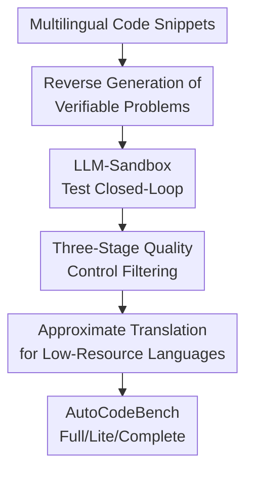

# AutoCodeBench: Large Language Models are Automatic Code Benchmark Generators

**Conference**: ICLR2026  
**OpenReview**: [https://openreview.net/forum?id=fN0MED2Idq](https://openreview.net/forum?id=fN0MED2Idq)  
**Paper**: [https://autocodebench.github.io/](https://autocodebench.github.io/)  
**Code**: Project page to be released  
**Area**: LLM Evaluation / Code Generation Benchmark / Multilingual Code Evaluation  
**Keywords**: Automatic Benchmark Generation, Code Generation Evaluation, Multilingual Code, LLM-Sandbox Interaction, AutoCodeBench  

## TL;DR
AutoCodeBench utilizes AutoCodeGen to automatically synthesize high-difficulty, multilingual, and execution-validated code generation problems. It chains LLM-generated test inputs, sandbox execution for test outputs, reverse prompt generation, and multi-stage filtering into a single pipeline. This process constructed a benchmark of 3,920 problems across 20 programming languages. Experiments show that even the strongest current models achieve an average Pass@1 of no more than 55.4%.

## Background & Motivation
**Background**: Code generation has become a core task for measuring the practical capabilities of large models. Early benchmarks like HumanEval and MBPP proved the effectiveness of "evaluating code with unit tests." Subsequent works such as LiveCodeBench, FullStackBench, and McEval pushed evaluation toward competitive programming, real-world engineering snippets, and multilingual scenarios.

**Limitations of Prior Work**: High-quality code benchmarks are difficult to expand continuously through manual effort. Human annotators are typically familiar with Python and common algorithms, leading to insufficient coverage of low-resource or niche languages like Elixir, Racket, Shell, and Kotlin. Furthermore, manual problem and test writing is slow, and problem difficulty often fails to keep pace with model iterations. Comparison tables in the paper show that prior multilingual benchmarks suffer from either unbalanced language coverage or limited task categories and difficulty.

**Key Challenge**: Code benchmarks must be executable, verifiable, and correctly tested while covering a sufficient variety of languages, scenarios, and difficulty levels. Manual processes better ensure local quality but struggle with scalability and balanced coverage. While pure LLM generation is scalable, directly prompting models to generate problem descriptions, solutions, and test outputs simultaneously often leads to incorrect test answers, missing entry functions in descriptions, or inconsistencies between examples and private tests.

**Goal**: The authors aim to solve three specific sub-problems: first, how to generate executable and correctly tested code problems without manual annotation; second, how to cover 20 languages with balanced distribution and task categories; and third, how to demonstrate that these automatically generated problems can distinguish the weaknesses of current LLMs, especially in multi-logic tasks and low-resource languages.

**Key Insight**: The paper observes that while LLMs are unreliable at "fabricating test outputs," they can generate test inputs. By executing these inputs in a sandbox to obtain real outputs, the most error-prone part of the process—output calculation—is delegated to a deterministic execution environment. Furthermore, generating problem descriptions *from* "code solutions + test functions" (reverse generation) better ensures consistency in entry point names, parameter formats, and examples compared to the traditional forward approach.

**Core Idea**: Replace manual problem writing with LLM-Sandbox interaction. The pipeline consists of "solution and test input generation → sandbox execution for outputs → test function synthesis → reverse problem generation → difficulty/quality/diversity filtering" to expand a high-difficulty, multilingual, and verifiable code generation benchmark.

## Method

### Overall Architecture
The input to AutoCodeGen is not manual problems but multilingual code snippets from Stack-Edu; the output consists of complete code generation samples (problem descriptions, reference solutions, public test functions, and private test functions). It first transforms real code snippets into self-contained solutions and test input functions, then executes them in a multilingual sandbox to obtain outputs. Next, the LLM integrates inputs and sandbox outputs into assertion-style test functions and reverse-generates problem descriptions. Finally, AutoCodeBench is formed through three layers of filtering for difficulty, quality, and diversity.

The first four nodes correspond to the methodological core: reverse generation solves consistency issues; the LLM-Sandbox loop ensures test output reliability; three-stage filtering controls difficulty and distribution; and approximate translation enables low-resource language expansion. Based on the same pipeline, the authors also generated AutoCodeInstruct for multilingual code training and reinforcement learning verification.

### Key Designs
**1. Reverse Generation of Verifiable Problems: Solidify Tests and Solutions Before Writing Descriptions**

Traditional code problem creation follows "description first, then solution and tests." AutoCodeGen reverses this: it starts with educational code snippets from Stack-Edu and uses DeepSeek-V3-0324 with language-specific few-shot prompts to rewrite snippets into self-contained, executable solutions while removing non-core logic like plotting or file I/O. The result is a deterministic program rather than an abstract intent.

The advantage is that the problem description is constrained by the "solution + test functions." The paper notes that LLMs often omit critical information like entry functions or return formats when generating descriptions. Thus, the authors explicitly require function/class names, input/output formats, constraints, and public examples during description generation. The description becomes a natural language wrapper for a verified execution protocol.

**2. LLM-Sandbox Test Closed-Loop: Models Generate Inputs, Environments Generate Outputs**

AutoCodeGen does not ask the LLM to write complete test assertions directly. It splits the process into three steps: first, the LLM generates public and private test input functions; second, the solution and input functions are concatenated and executed in a multilingual sandbox to capture ground-truth outputs; third, the LLM synthesizes the inputs and sandbox outputs into full test functions. Public tests (typically $\le 3$ samples) are embedded in the description, while private tests (at least 7 samples) include edge cases for final scoring.

This captures the most fragile link in evaluation: outputs for difficult tasks are often not immediately calculable by humans or LLMs. Anchoring correctness to an executable reference solution via a sandbox ensures each sample is represented as a `<programming problem, code solution, public test function, private test function>` quadruple.

**3. Three-Stage Quality Control: Difficulty, Alignment, and Diversity**

Automatic generation risks being either too trivial or too noisy. The paper uses three stages to handle these. In **Difficulty Filtering**, DeepSeek-Coder-V2-Lite samples each problem 10 times; if it passes all 10, the problem is discarded as too easy (removing 25.1% of Python problems). **Quality Filtering** uses DeepSeek-R1-0528 as a critic to check alignment between the description and test functions, specifically looking for mismatched names, randomness, or irrelevant requirements. **Diversity Filtering** uses DeepSeek-V3-0324 to label task categories and then performs round-robin sampling to prevent the dataset from being dominated by common algorithms.

Each layer serves a distinct purpose: the difficulty layer ensures relevance for current models, the quality layer ensures validity, and the diversity layer ensures coverage across string processing, data structures, OOP, systems programming, web, concurrency, and databases.

**4. Approximate Translation for Low-Resource Languages: Verifiable Translation for Balance**

For Python, C++, Shell, Java, JavaScript, and Go, the full AutoCodeGen pipeline is run. For 14 other low-resource languages, generating from native snippets is limited by data scarcity. The paper employs **approximate language translation**: samples from unused generated data are translated into target language pairs (e.g., Python to R/Ruby/Elixir/Julia; Java to Scala/Kotlin; C++ to Rust).

This is not just translating the description; it translates the solution and test functions, followed by verification and filtering. This maintains balance across the benchmark: ACB-Full contains 3,920 problems, with approximately 184 to 200 problems per language. This is more effective at exposing language-specific biases than benchmarks with sparse coverage for niche languages.

### Mechanism
The `two_sum` example in Figure 1 illustrates the minimal process. Step 1: the LLM generates a self-contained function `two_sum(a, b)` and test inputs like `[1, 2]`. Step 2: the system executes these in the sandbox to get output `3`. Step 3: the LLM combines input `[1, 2]` and sandbox output `3` into the assertion `two_sum(a=1, b=2) == 3`. Finally, the description generator writes "Given two integers, return their sum" based on the validated protocol.

### Loss & Training
AutoCodeBench is an evaluation set, but the authors leverage the pipeline to build **AutoCodeInstruct**, containing ~37K verifiable multilingual problems. For training, the authors performed two-stage **GRPO** on Qwen2.5-Coder-7B/32B-Instruct. The first stage used "solve-partial" samples ($0 < \text{pass rate} < 0.6$) to consolidate existing capabilities, while the second stage added "solve-none" samples and increased rollout size to 16 to encourage exploration of harder problems. Hyperparameters included a learning rate of $1\times10^{-6}$ and max lengths of 8192.

## Key Experimental Results

### Main Results
AutoCodeBench covers over 40 models with Pass@1 as the default metric. ACB-Full includes 3,920 problems and 37,777 test cases across 20 languages. The difficulty distribution consists of 646 easy, 846 medium, and 2,428 hard problems.

| Benchmark | Problems | Test Cases | Languages | Avg Desc Len | Avg Sol Len | Dist (E/M/H) |
|-----------|----------|------------|-----------|--------------|-------------|--------------|
| ACB-Full  | 3,920    | 37,777     | 20        | 498.2        | 487.5       | 646/846/2428 |
| ACB-Lite  | 1,586    | 15,341     | 20        | 517.2        | 469.3       | 263/421/902  |

In ACB-Full, no single model exceeded 55.4% average. Claude Opus 4.1 (Reasoning) led with 55.4%, followed by GPT-5 at 53.5%. The **current upper bound** (union of all correctly solved problems) reached 75.3%, indicating significant complementarity between models and substantial room for improvement.

| Model / Upper Bound | ACB-Full Pass@1 | Note |
|---------------------|-----------------|------|
| Current Upper Bound | 75.3 | Union of all models |
| Claude Opus 4.1 (Reasoning) | 55.4 | Highest single model |
| GPT-5 | 53.5 | Top closed-source model |
| DeepSeek-V3.1 (Thinking) | 48.2 | Strong performance |

### Ablation Study
The paper performs diagnostic analyses:
- **Human Verification**: Checked 6 languages; average problem accuracy was 87.6%. Claude Opus 4 reasoning's score (44.6%) was 43.0 points below human accuracy, proving the difficulty is not just due to noise.
- **Multi-Logic Analysis**: 1,622 problems (41.4%) required multiple logic units. Models typically dropped 3–6 points on this subset compared to single-logic tasks.
- **Training Impact**: Qwen2.5-Coder-32B-Instruct improved from 35.8 to 41.9 on ACB-Full after GRPO and SFT. Improvements were also observed on FullStackBench and McEval, suggesting the generated data generalizes well.

### Key Findings
- **High Difficulty**: The best model remains far from the 75.3% upper bound.
- **Low-Resource Gap**: The performance gap between top models expands significantly on low-resource languages ($\Delta=6.3$) compared to popular ones ($\Delta=3.1$).
- **Multi-Logic Challenge**: Multi-logic problems are significantly harder, with a distinct drop in performance even for reasoning models.
- **Sandbox Value**: Refinement using sandbox feedback significantly boosts scores (e.g., Qwen2.5-Coder-32B rose from 35.8 to 47.4).

## Highlights & Insights
- **Execution-Centric Reliability**: Outsourcing output correctness to a sandbox rather than an LLM is the core source of reliability for automatic benchmark generation.
- **Protocol-First Generation**: Reverse-generating descriptions from validated sets of "solution + tests" ensures that the natural language description aligns with the execution protocol.
- **Multilingual Balance**: AutoCodeBench prioritizes balanced distribution across 20 languages and 14 task categories, which better exposes model biases than simply maximizing language counts.
- **Evaluating Atomic Multi-Logic**: By focusing on multi-logic tasks, AutoCodeBench acts as a precursor stress test for code agents, moving beyond isolated single functions.

## Limitations & Future Work
- **Intrinsic Description Quality**: While the sandbox ensures test-solution consistency, it cannot guarantee that descriptions are perfectly unambiguous or that tests provide 100% coverage.
- **Model Bias**: The generation process used DeepSeek models; while filtering mitigated this, a family-level bias might persist.
- **Authenticity of Translated Tasks**: Approximate translation might cover syntax well but may not fully capture the "native" coding style or idioms of low-resource languages.
- **Future Expansion**: The authors plan to expand toward multi-file repo-level generation and interactive environments like SWE-Bench.
- **Contamination**: As an open benchmark, it faces risks of data contamination, requiring continuous versioning or private test pools.

## Related Work & Insights
- **vs HumanEval/MBPP**: AutoCodeBench is significantly larger, covers more languages, and is harder.
- **vs LiveCodeBench**: While LiveCodeBench uses new competitive problems to fight contamination, AutoCodeBench focuses on controlled multilingual balance and multi-logic tasks.
- **vs McEval**: AutoCodeBench provides higher category diversity and difficulty filtering compared to McEval's 40-language breadth.
- **Insight**: The same automated synthesis ideas used for training data (like Magicoder) can be adapted for benchmark construction by placing execution-based verifiability at the center.

## Rating
- Novelty: ⭐⭐⭐⭐⭐ 
- Experimental Thoroughness: ⭐⭐⭐⭐⭐ 
- Writing Quality: ⭐⭐⭐⭐☆ 
- Value: ⭐⭐⭐⭐⭐ 

<!-- RELATED:START -->

## Related Papers

- [\[ACL 2026\] Zero-shot Large Language Models for Automatic Readability Assessment](../../ACL2026/llm_evaluation/zero-shot_large_language_models_for_automatic_readability_assessment.md)
- [\[ACL 2025\] CodeMEnv: Benchmarking Large Language Models on Code Migration](../../ACL2025/llm_evaluation/codemenv_benchmarking_large_language_models_on_code_migration.md)
- [\[ACL 2026\] ScaleBox: Enabling High-Fidelity and Scalable Code Verification for Large Language Models](../../ACL2026/llm_evaluation/scalebox_enabling_high-fidelity_and_scalable_code_verification_for_large_languag.md)
- [\[ICLR 2026\] CMPhysBench: A Benchmark for Evaluating Large Language Models in Condensed Matter Physics](cmphysbench_a_benchmark_for_evaluating_large_language_models_in_condensed_matter.md)
- [\[ICLR 2026\] AlphaBench: Benchmarking Large Language Models in Formulaic Alpha Factor Mining](alphabench_benchmarking_large_language_models_in_formulaic_alpha_factor_mining.md)

<!-- RELATED:END -->
