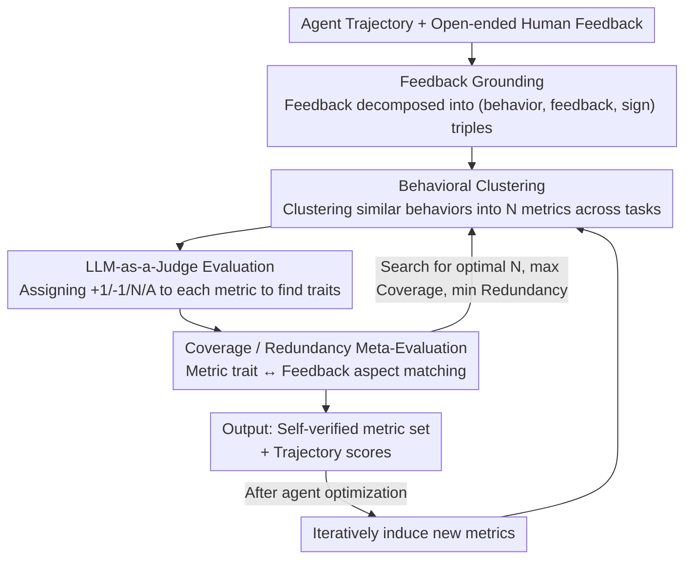

# AutoLibra: Agent Metric Induction from Open-Ended Human Feedback

**Conference**: ICLR2026  
**OpenReview**: [https://openreview.net/forum?id=4BjGVZ7Bxn](https://openreview.net/forum?id=4BjGVZ7Bxn)  
**Code**: https://autolibra.org (Available)  
**Area**: Agent Evaluation / LLM-as-a-Judge  
**Keywords**: Agent evaluation, metric induction, open-ended human feedback, thematic analysis, self-regulated optimization

## TL;DR
AutoLibra automatically induces a set of fine-grained evaluation metrics—complete with definitions and positive/negative examples—from open-ended natural language feedback on agent trajectories (e.g., "Don’t keep clicking the button if it's disabled"). It employs two meta-metrics, "coverage" and "redundancy," to optimize the metric set. This approach characterizes agent behavior more precisely than expert-defined metrics and enables front-end models to achieve a 20%+ increase in success rates on 2D text games through self-regulated optimization.

## Background & Motivation
**Background**: Current evaluation and optimization of language agents (web agents, social agents, text game agents, etc.) rely almost exclusively on terminal metrics such as **task success rate**—whether the task was completed and if the final state is correct.

**Limitations of Prior Work**: Success rate metrics suffer from three major flaws. First, they are **coarse-grained**: a trajectory may span dozens of steps, but the success rate provides only a binary 0/1, failing to identify at which step or due to what behavior the agent failed. Second, they **rely on expert design**: for every new environment, experts must manually design evaluation dimensions and failure categories, which is costly and subjective. Third, they **fail to reward intermediate emergent behaviors**: agents may develop new beneficial behaviors or encounter novel failure modes (e.g., "excessive autonomous decision-making" or "hitting map boundaries") during optimization that fixed success metrics cannot capture.

**Key Challenge**: Humans find it easy to provide **specific feedback** for a particular trajectory ("It didn't use the dropdown menu to select iPhone 14/15"), but struggle to **design a universal metric suite** from scratch. This creates a mismatch between cheap supervision signals (open-ended feedback) and expensive outputs (evaluation metrics), forcing humans into the high-cost end of the spectrum.

**Goal**: (1) Automatically convert scattered, colloquial human feedback into structured, reusable, and cross-task evaluation metrics; (2) Implement "quality checks" for these metrics to search for an optimal set; (3) Enable metrics to serve both as a "lens" for behavioral analysis and a "ladder" for agent optimization.

**Key Insight**: The authors draw inspiration from **thematic analysis** in social sciences, where qualitative researchers "code" interview texts into labeled fragments and then "induct themes" by grouping similar fragments. Agent feedback induction is a near-isomorphic problem: anchoring feedback to behavior (coding) $\rightarrow$ clustering similar behaviors into metrics (induction).

**Core Idea**: Induce metrics from open-ended feedback via a "feedback grounding + behavioral clustering" two-step process. Use an LLM-as-a-Judge closed-loop to calculate "coverage" and "redundancy" as meta-metrics to inversely optimize the metric set. This transforms the evaluation framework from "human-designed" to "feedback-derived and self-validated."

## Method

### Overall Architecture
AutoLibra is a **closed-loop pipeline**. The input consists of "agent trajectories + corresponding open-ended human feedback," and the output is "a set of evaluation metrics with definitions and examples" along with "scores for each trajectory based on these metrics." The process is divided into two main phases: the **Induction process**, which converts feedback into metrics, and the **Evaluation process**, which scores new trajectories, calculates metric quality via meta-evaluation, and feeds these signals back to search for an optimal metric set.

Specifically, the induction process involves "feedback grounding $\rightarrow$ behavioral clustering." First, an LLM decomposes a piece of feedback into several (behavior, feedback, sign) triples (aspects). Then, an LLM clusters aspects across all trajectories and tasks into $N$ metrics. In the evaluation phase, an LLM-as-a-Judge assigns $\{+1, -1, \text{N/A}\}$ to each metric for every trajectory, yielding positive/negative traits. Meta-evaluation then matches these traits against the original feedback aspects to calculate **coverage** and **redundancy**. Finally, these meta-metrics are used to search for the optimal number of metrics $N$ and the specific metric set. This loop also supports **iteration**: as the agent improves and new behaviors emerge, new metrics are incrementally induced relative to the existing set.

### Key Designs

**1. Feedback Grounding: Decomposing colloquial feedback into behavioral triples**

Human feedback often mixes multiple layers of meaning and remains abstract. AutoLibra defines an **aspect as a triple $(\text{behavior}, \text{feedback}, \text{sign})$**: where behavior is the specific sequence of actions in the trajectory (e.g., "generating a 20-day Maldives itinerary"), feedback is the evaluation ("itinerary is consistent"), and sign is positive or negative. Using GPT-4o and **constrained decoding**, the system splits feedback into bullet points and maps each to a trajectory segment. On average, each trajectory yields 1-2 aspects (max 5). This step is equivalent to "coding" in thematic analysis, anchoring evaluations to specific behaviors for subsequent clustering.

**2. Behavioral Clustering: Using LLMs instead of K-means for cross-task metrics**

Clustering hundreds of aspects into $N$ metrics using traditional methods like K-means with `text-embedding-3-large` results in clusters grouped by "task" (e.g., all "shopping" tasks together) rather than "behavior." AutoLibra instead uses an LLM (o3-mini high) for semantic clustering. It aggregates aspects from $M$ trajectories into $N$ metrics, where each metric includes a definition and sets of positive/negative examples. The prompt controls granularity to ensure behaviors are similar enough to be specific but general enough to be task-agnostic.

**3. Coverage/Redundancy Meta-Evaluation: Self-verification and search optimization**

To objectively evaluate the induced metrics, AutoLibra introduces two meta-metrics. An LLM-as-a-Judge (o3-mini medium) scores trajectories to find traits, which are then matched against the human feedback aspects using GPT-4o. **Coverage** is the ratio of aspects matched to a trait (how many human concerns the metrics capture). **Redundancy** is the ratio of detected traits that do not match any human aspect (how many metrics are irrelevant to human feedback). These metrics turn "evaluation quality" into a computable objective.

**4. Metric Optimization and Iterative Induction: Searching for optimal N**

The number of metrics $N$ is a hyperparameter; too few leads to low coverage, while too many leads to high redundancy. The optimization goal is to **maximize coverage first, then minimize redundancy**. The system generates 20 metric sets with $N$ ranging from 4 to 13, selects the set with the lowest redundancy among those whose coverage is within $1\%$ of the maximum, and iterates the search range until convergence (usually within 3 rounds). Furthermore, as the agent improves, the clustering step is modified to "add new behaviors to old metrics or add new metrics without changing old definitions," analogous to adding new unit tests in software development.

### A Complete Example
Consider a WebVoyager shopping trajectory: Task is to "compare prices and chips of iPhone 14 Pro and 15 Pro," but the agent clicks "iPhone 16 Pro Max." Human feedback: "Agent failed to use the dropdown menu to select iPhone 14/15 Pro." **Feedback Grounding** produces an aspect: (behavior=selected iPhone 16 Pro Max from dropdown, feedback=wrong model selected, sign=negative). **Behavioral Clustering** groups this with similar behaviors like "wrong price sort" or "wrong category selection" into a metric named **Element Interaction Accuracy**, defined as "evaluating whether the agent interacts with the correct UI elements." **LLM-as-a-Judge** assigns a $-1$ for this trajectory. **Meta-Evaluation** matches this negative trait to the human aspect, marking it as "covered."

## Key Experimental Results

Experiments covered diverse agent environments: CoGym (collaboration), Sotopia (social), WebArena/WebVoyager (web), and Baba-is-AI/MiniHack (text games).

### Main Results: Alignment with Human Judgment
Experts audited 40 instances step-by-step to verify agreement (1/0).

| Step | CoGym | Sotopia | WebArena | WebVoyager | Baba-is-AI | Average |
|------|-------|---------|----------|------------|------------|------|
| Grounding | 0.95 | 0.95 | 0.98 | 0.93 | 0.93 | 0.95 (±0.03) |
| LLM-as-a-Judge | 0.90 | 0.85 | 0.95 | 1.00 | 0.90 | 0.92 (±0.04) |
| Meta-Eval | 0.98 | 0.90 | 0.85 | 0.83 | 0.95 | 0.90 (±0.04) |

Human agreement rates exceeded 85% across all steps, demonstrating the reliability of the LLM components.

### Lens Analysis
Coverage typically converged at $N=6\sim10$. In comparative analysis, AutoLibra discovered finer or even **overlooked** metrics compared to expert-designed ones:

| Dataset | AutoLibra Findings vs. Expert Metrics |
|--------|------------------------------|
| CoGym | Induced 9 metrics corresponding to 5 expert categories; failure rates matched closely. |
| Sotopia | Recovered "Goal Completion" and split "Believability" into 3 sub-dimensions; found 4 metrics ignored by experts. |
| WebVoyager | Refined "Stuck Navigation" into Error Recovery, Step Efficiency, and Navigation Accuracy; identified high-frequency issues in Query Strategy (7%) and Output Quality (18%). |

### Key Findings
- **Examples are critical**: Removing good/bad behavior examples from metrics dropped CoGym coverage by up to 30%.
- **Simple search is effective**: Basic iterative search outperformed complex genetic algorithms.
- **Blind spots**: AutoLibra cannot "see" internal neural representations, thus missing issues like "visual grounding problems" (25% in WebVoyager) unless they manifest as distinct behaviors.
- **Acting as a Ladder (§5)**: On Baba-is-AI using Gemini-2.5-Flash, AutoLibra optimized agent prompts using metric scores. **Without directly optimizing for success rate, success rates increased by over 20%** until performance plateaued in Stage 3 due to "overthinking."

## Highlights & Insights
- **Shifting metric design from experts to data**: AutoLibra allows metrics to "grow" from cheap open-ended feedback, using coverage/redundancy for quality control—turning evaluation from a craft into an optimizable data process.
- **Interdisciplinary mapping**: Applying thematic analysis's "coding-induction" to "grounding-clustering" is a clean and reusable methodological transfer applicable to other fields like code review or customer service scoring.
- **"Metrics as Unit Tests"**: The iterative induction of metrics tracks growth while preventing regression, providing a concrete paradigm for "continuous evaluation."
- **Meta-metrics as independent tools**: Coverage and redundancy can be detached to quantify how well any LLM-generated criteria align with human intent.

## Limitations & Future Work
- **Single-feedback constraint**: Each trajectory currently receives only one feedback point; multi-step feedback remains for future work.
- **Behavior-only limitation**: It cannot capture latent issues like visual grounding failure that don't result in unique behavioral patterns.
- **LLM dependency**: The system relies on a specific sequence of varied LLMs (GPT-4o, o3-mini); the robustness and cost-effectiveness of this combination require further study.
- **Reward hacking risk**: The performance drop in Stage 3 of text game experiments suggests that optimizing purely for induced metrics can occasionally lead to unintended behaviors.

## Related Work & Insights
- **vs. Traditional Benchmarks**: Unlike SWE-Bench or WebArena which use **predefined** unit tests or state checks, AutoLibra is data-driven, has no preset failure categories, and induces interpretable metrics.
- **vs. Intrinsic Rewards**: While curiosity-driven rewards encourage exploration, AutoLibra creates **interpretable metrics aligned with human intent**.
- **vs. Text2Reward / Preference Feedback**: Most methods map feedback directly to rewards; AutoLibra instead induces a **generalizable metric suite** from all instances that can be used for both evaluation and broad policy optimization.

## Rating
- Novelty: ⭐⭐⭐⭐⭐ Bringing thematic analysis to agent evaluation with self-validating loops is highly original.
- Experimental Thoroughness: ⭐⭐⭐⭐ Strong verification across 6 environments, though the optimization case study was limited to a specific game/model.
- Writing Quality: ⭐⭐⭐⭐ Clear analogies ("lens/ladder/unit tests") and helpful visualizations.
- Value: ⭐⭐⭐⭐⭐ Provides a low-cost, interpretable, and optimizable tool for agent evaluation and alignment.

<!-- RELATED:START -->

## Related Papers

- [\[ICLR 2026\] An Open-Ended Benchmark and Formal Framework for Adjuvant Research with MLLM](an_open-ended_benchmark_and_formal_framework_for_adjuvant_research_with_mllm.md)
- [\[ACL 2026\] Automated Creativity Evaluation of Language Models Across Open-Ended Tasks](../../ACL2026/llm_evaluation/automated_creativity_evaluation_of_language_models_across_open-ended_tasks.md)
- [\[ICLR 2026\] Towards Self-Evolving Agent Benchmarks: Validatable Agent Trajectory via Test-Time Exploration](towards_self-evolving_agent_benchmarks_validatable_agent_trajectory_via_test-tim.md)
- [\[ICLR 2026\] Computer Agent Arena: Toward Human-Centric Evaluation and Analysis of Computer-Use Agents](computer_agent_arena_toward_human-centric_evaluation_and_analysis_of_computer-us.md)
- [\[ACL 2025\] ONEBench to Test Them All: Sample-Level Benchmarking Over Open-Ended Capabilities](../../ACL2025/llm_evaluation/onebench_to_test_them_all_sample-level_benchmarking_over_open-ended_capabilities.md)

<!-- RELATED:END -->
