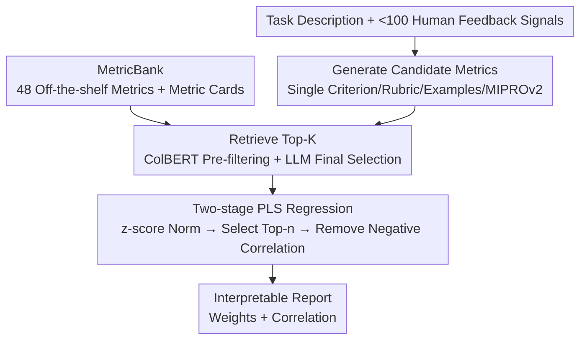

# AutoMetrics: Approximate Human Judgments with Automatically Generated Evaluators

**Conference**: ICLR 2026  
**OpenReview**: [https://openreview.net/forum?id=ymJuBifPUy](https://openreview.net/forum?id=ymJuBifPUy)  
**Code**: https://github.com/SALT-NLP/autometrics  
**Area**: LLM Evaluation / LLM-as-a-Judge / Automated Metrics  
**Keywords**: Automatic metric synthesis, LLM evaluators, PLS regression, Low-data evaluation, Proxy rewards

## TL;DR
AutoMetrics automatically converts fewer than 100 sparse human feedback signals (upvotes/downvotes, Likert scales, behavioral signals) into a set of interpretable evaluation metrics. It first generates candidate LLM-as-a-Judge criteria and retrieves from a MetricBank of 48 off-the-shelf metrics, then uses Partial Least Squares (PLS) regression to combine them into a composite metric that best fits human judgment. It improves Kendall's correlation with human ratings by up to 33.4% across five tasks and can serve as a proxy reward to optimize downstream agents, performing on par with verifiable rewards.

## Background & Motivation
**Background**: Evaluating open-ended AI applications (travel planning, clinical notes, dialogue) for users remains a challenge. The gold standard is human feedback or behavioral signals (likes, retention), but these signals are extremely scarce during the prototyping phase, or too slow to be used for online system optimization. The mainstream alternative is rubric-based LLM-as-a-Judge.

**Limitations of Prior Work**: The gap between verifiable rewards (math, code) and subjective open-ended tasks is widening—the latter being difficult to quantify. Reward models typically require thousands of annotations, while LLM-as-a-Judge assumes that system behavior is clearly defined and does not guarantee strict adherence to a given rubric. A more realistic predicament is that practitioners often only have non-descriptive signals (user upvotes/downvotes) and know neither what rubric to write nor which underlying criteria truly matter.

**Key Challenge**: Evaluation itself should be **adaptive**, yet most existing work focuses on "making LLMs better evaluators" or "using rubrics to optimize LLMs." Few have explored **automatically generating** the rubrics and criteria that align with human judgment. When the task is novel and data is extremely scarce, the problem is not just "formulating a rubric" but "discovering which criteria truly matter."

**Goal**: Under low-data constraints (fewer than 100 human signals), automatically induce a set of metrics from a task description that are both predictive of human judgment and interpretable.

**Key Insight**: Rather than choosing between "pure human judgment" and "fixed rubrics," metric learning should be dynamic—generating a large number of candidate criteria to ensure coverage, and then using statistical regression to filter, weight, and compress them into a few metrics that actually predict human signals.

**Core Idea**: Use a four-step pipeline of "Generate candidates + Retrieve existing + Regress combinations" to distill sparse human feedback into interpretable automated evaluators, allowing metrics to provide both scores and explanations of "what the user actually cares about."

## Method

### Overall Architecture
The goal of AutoMetrics is to produce a set of metrics strongly correlated with human judgment, given a description of a subjective/novel task and fewer than 100 human labels. The pipeline consists of four steps: **Generate → Retrieve → Regress → Report**. The first two steps cast a wide net to create a large pool of candidate evaluators (both newly generated by LLMs and retrieved from a MetricBank). The third step uses PLS regression on a small amount of human annotations to compress and weight these candidates into a final composite metric. The final step outputs an interpretable report with weights and correlations. All candidate metrics are equipped with a Metric Card (description, use case, implementation, limitations), which serves as documentation for retrieval and as the basis for the final explanation.

### Key Designs

**1. MetricBank + Metric Card: Converting NLP Literature Metrics into a Searchable "Library"**

New tasks may lack existing metrics, but many classical metrics (INFORM/LDL reward models, SummaQA, Toxicity, and various text generation metrics) remain useful. The authors implement 48 metrics from NLP literature into a unified MetricBank, each accompanied by a **Metric Card** detailing its description, applicable scenarios, implementation details, and limitations. The key here is "treating metrics as documents"—the Metric Card is not just documentation but the unit of retrieval (where the query is the task description and the document is the Metric Card). Ablations show that retrieval using Metric Cards ($k=20$) outperforms retrieval using only single-sentence descriptions across all 5 tasks, indicating that rich documentation is crucial for recalling the correct metrics.

**2. Generate: Broad Candidate Generation for Evaluators**

For sufficiently novel tasks, LLM-as-a-Judge criteria must be generated on the fly; broad coverage is necessary to later filter for truly important ones. By default, each run generates 10 **Single Criterion** LLM judges, 5 **Rubric** LLM judges, 1 **few-shot** optimized judge, and 1 **prompt-optimized (MIPROv2)** judge. The first two types are inexpensive, while the latter two are more token-intensive but specialized. This mixed-granularity recipe has been validated across nearly 30 settings for cross-domain generalization—single criteria provide fine-grained perspectives, rubrics provide structured scoring, and example/prompt optimization provide strong task-aligned signals. Each generated metric also receives a Metric Card.

**3. Retrieve: ColBERT + LLM Hybrid Filtering**

Running all generated candidates and the MetricBank is too costly, so retrieval is treated as a **filtering step** rather than a recall step. A hybrid approach is used: **ColBERT** first pre-filters candidates (generated + MetricBank) based on relevance to the task description down to $k'$ Metric Cards, and then an LLM selects the final $k$. Ablations show that correlation grows roughly linearly with $k$, with an optimal default of $k=30$. Interestingly, on small datasets (CoGym), the top 5 retrieved items are often generated metrics, which helps avoid spurious correlations from off-the-shelf metrics on small samples.

**4. Regress: Two-stage PLS Compression + Negative Correlation Removal**

Filtered candidates are combined into a signal to predict human judgment. All metric scores are first normalized to z-scores, and then **Partial Least Squares (PLS) regression** is fitted. PLS is chosen because the scenario is inherently "high-dimensional, low-sample": the number of predictors (metrics) may exceed the number of observations (data points), and predictors are highly correlated—Ordinary Least Squares (OLS) would fail. PLS projects the metric space onto directions most predictive of human labels. With a single latent variable, PLS finds a unit weight vector:
$$w^\star = \arg\max_{\lVert w \rVert_2 = 1} \operatorname{cov}(Xw, y)^2,$$
where $X$ is the normalized metric score matrix and $y$ denotes human labels; the latent score is $t = Xw^\star$, and regression is performed as $\hat{y} = t\beta$ with coefficient $\beta = \frac{t^\top y}{t^\top t}$.

This step is performed in two stages: Stage one fits PLS on all candidates and ranks them by weights in $w^\star$ to select the Top-$n$ (default $n=5$); Stage two re-fits on these $n$ metrics to obtain a new projection. Finally, **negative correlation removal** is applied: LLM-generated metrics negatively correlated with human labels are removed (as they should be positively correlated; negative correlation suggests noise), while reasonable negative correlations in off-the-shelf metrics (e.g., length vs. conciseness) are retained. The weights themselves represent "relative importance," directly forming the interpretable report.

### Loss & Training
There is no traditional training loss—the objective of PLS is the covariance maximization goal $\operatorname{cov}(Xw,y)^2$ shown above. The entire pipeline fits the regression exactly once on the training set (human annotations) of each task, without gradient-based training. The only "training" analogy is the hyperparameter sweep for $k$ (retrieval number), $n$ (number of metrics kept for regression), and the MetricBank, all performed on the dev set.

## Key Experimental Results

### Main Results (Criterion Validity: Correlation with Human Judgment)
The table reports Kendall's $\tau$ on five tasks (2 in-distribution + 3 out-of-distribution) using Qwen-3-32B (Reasoning) as the backbone over 5 independent runs:

| Method | SimpEval | HelpSteer2 | EvalGen | RealHumanEval | CoGym |
|------|----------|-----------|---------|---------------|-------|
| Best Existing Metric | 0.246 | 0.327 | 0.193 | 0.138 | 0.074 |
| MetaMetrics | 0.127 | 0.204 | -0.214 | 0.025 | -0.119 |
| Finetuned LLM (ModernBERT-large) | 0.076 | 0.039 | 0.054 | 0.049 | 0.223 |
| LLM-Judge | 0.294 | 0.334 | 0.272 | 0.025 | 0.276 |
| DnA-Eval | 0.042 | 0.260 | 0.232 | 0.071 | 0.353 |
| **AutoMetrics (Ours)** | **0.316** | **0.342** | **0.382** | 0.145 | **0.365** |

Using Qwen3-32B, AutoMetrics outperforms all baselines on all 5 tasks. With GPT-4o-mini, 4/5 tasks fall within the 95% confidence interval of the best performance. On EvalGen, it achieves a **33.4%** improvement over the closest baseline (LLM-Judge). A key observation is that the "best" baseline varies by dataset (LLM-Judge and DnA-Eval excel in different tasks) and by backbone model, whereas AutoMetrics is the **only choice that remains consistently optimal** across both datasets and backbones.

### Ablation Study (Qwen3-32B, dev set)

| Configuration | EvalGen | CoGym | Description |
|------|---------|-------|------|
| Existing Metrics Only | 0.389 | 0.258 | Using only MetricBank off-the-shelf metrics |
| Generated Metrics Only | 0.503 | 0.433 | Using only LLM-generated metrics |
| Full MetricBank | 0.474 | 0.329 | Using both (default) |
| Retrieve k=5 / k=30 | 0.414 / 0.474 | 0.385 / 0.329 | Correlation grows linearly with k; default k=30 |
| No Regression (n=1) | 0.353 | 0.356 | No regression; taking the single best metric |
| Regress n=5 | 0.474 | 0.329 | Default; trade-off point for cost/performance |

### Construct Validity (Robustness: Sensitivity / Stability)
Authors define two metrics to quantify "convergent-discriminant validity." **Sensitivity** measures whether the metric gives lower scores to degraded outputs:
$$\text{Sensitivity} = \frac{1}{N}\sum_{i=1}^{N}\mathbb{1}\!\left[s^{(i)}_{\text{worse}} < s^{(i)}_{\text{orig}}\right];$$
**Stability** measures whether scores remain stable under irrelevant perturbations (paraphrasing, reordering):
$$\text{Stability} = 1 - \frac{1}{N}\sum_{i=1}^{N}\left|s^{(i)}_{\text{orig}} - s^{(i)}_{\text{same}}\right|.$$
AutoMetrics identifies quality degradation in 81.0%–97.8% of cases (far above the 50% baseline) and exceeds the normal distribution baseline for stability with a >95% confidence interval.

### Proxy Reward Case Study (τ-Bench Agent Optimization)
On τ-airline (a tool-calling agent), AutoMetrics learned 3 metrics from 25 training tasks, which were then used to optimize the agent via DSPy GEPA. After 2000 rollouts: verifiable rewards yielded 0.680±0.11, while **AutoMetrics yielded 0.720±0.06**, both significantly exceeding the unoptimized baseline of 0.60 ($p<0.05$). This suggests that automated metrics can serve as proxy rewards with performance comparable to or exceeding verifiable rewards.

### Key Findings
- **Data saturation occurs at ~80 samples**: Performance on SimpEval / HelpSteer2 / RealHumanEval plateaus after roughly 80 samples; samples below 80 are primarily hampered by high variance in small-sample regression.
- **"Generated Metrics Only" performs better for small-sample/OOD tasks**: On CoGym and EvalGen (smallest training sets, 37 and 57 samples), Generated Only outperformed Full MetricBank because off-the-shelf metrics act as noise predictors on small samples, leading to spurious correlations. Thus, the authors default to generated metrics when samples < 80.
- **Regression count $n$ is task-dependent**: $n=5$ is the default trade-off for cost, performance, and variance. Larger $n$ requires running more expensive metrics during downstream evaluation.

## Highlights & Insights
- **Metrics as Searchable + Regressible Objects**: The Metric Card serves as both an explanation document and a retrieval unit. Regression weights provide both combination coefficients and the relative importance of "what users care about"—addressing accuracy, interpretability, and reusability simultaneously.
- **PLS is the Precise Choice for this Scenario**: High-dimensional, low-sample settings with strongly correlated predictors are exactly where OLS fails. The covariance-maximization projection of PLS is perfectly suited for this, proving much more stable than direct XGBoost (MetaMetrics).
- **Clever Negative Correlation Removal**: Removing negative correlations for generated metrics while keeping them for off-the-shelf metrics (e.g., length vs. conciseness) reflects a nuanced distinction of "metric semantics" rather than a one-size-fits-all approach.
- **Transferable to Any Low-Data Evaluation Scenario**: As long as there is a task description and a few dozen upvotes/downvotes, one can derive a set of interpretable metrics. This is particularly suitable for rapid evaluation during product prototyping and can seamlessly transition into reward signals for RL or prompt optimization.

## Limitations & Future Work
- **Metrics are tied to the generating LLM**: Metrics generated by one model may drop in performance when run on another, implying that upgrading to a stronger model requires re-running AutoMetrics rather than just replacing the backbone.
- **Generalization Limited by Data Representativeness**: Metrics can only generalize to the demographics/tastes covered by the training feedback; collecting authentic and diverse human data remains an essential part of evaluation.
- **Risk of Spurious Correlations in High P, Low N**: Although PLS and negative correlation removal mitigate this, the authors can only add warnings for low significance ($p>0.05$) in reports, relying on human oversight.
- **No Formal User Study**: Only informal feedback from AI developers was recorded; a rigorous evaluation of actual adoption rates is currently missing.

## Related Work & Insights
- **vs. LLM-as-a-Judge (Zheng et al., 2023)**: These use a fixed rubric/prompt for scoring, assuming criteria are known. AutoMetrics automates the "discovery of criteria" and uses regression to filter out ineffective ones, proving more stable for new tasks where criteria are unknown.
- **vs. MetaMetrics (Winata et al., 2025)**: Also uses regression to combine multiple metrics, but MetaMetrics uses only off-the-shelf metrics + XGBoost, which showed negative correlations (-0.214) on low-data novel tasks like EvalGen. AutoMetrics argues that "adaptive **generation** of metrics" is critical for low-data OOD, and PLS is more robust than XGBoost for high-P low-N.
- **vs. EvalGen / DnA-Eval (Shankar et al., 2024b; Li et al., 2025)**: EvalGen uses human-in-the-loop iteration to refine criteria, and DnA-Eval decomposes evaluation into dimensions for weighted aggregation. AutoMetrics borrows ideas from "extracting criteria from feedback" and "multi-dimensionality" but streamlines them into a more automated, interpretable pipeline using retrieval and PLS weighting.

## Rating
- Novelty: ⭐⭐⭐⭐ The framework of "automatic generation + retrieval + PLS regression" for interpretable evaluators is comprehensive; individual components are clever combinations of existing techniques.
- Experimental Thoroughness: ⭐⭐⭐⭐⭐ 5 tasks × 2 backbones × 5 seeds, three types of validity, data scaling analysis, and proxy reward case study provide full coverage.
- Writing Quality: ⭐⭐⭐⭐ Concepts of criterion/construct validity from psychometrics are well-integrated into LLM evaluation; clear arguments and thorough ablations.
- Value: ⭐⭐⭐⭐⭐ High practical value for the low-data "feedback → metrics → rewards" pipeline; tools are open-sourced.

<!-- RELATED:START -->

## Related Papers

- [\[ICLR 2026\] Foundational Automatic Evaluators: Scaling Multi-Task Generative Evaluator Training for Reasoning-Centric Domains](foundational_automatic_evaluators_scaling_multi-task_generative_evaluator_traini.md)
- [\[ICLR 2026\] Human-LLM Collaborative Feature Engineering for Tabular Learning](human-llm_collaborative_feature_engineering_for_tabular_data.md)
- [\[ACL 2025\] HPSS: Heuristic Prompting Strategy Search for LLM Evaluators](../../ACL2025/llm_evaluation/hpss_heuristic_prompting_strategy_search_for_llm_evaluators.md)
- [\[ICLR 2026\] SimBench: Benchmarking the Ability of Large Language Models to Simulate Human Behaviors](simbench_benchmarking_the_ability_of_large_language_models_to_simulate_human_beh.md)
- [\[ICML 2026\] From Human-Level AI Tales to AI Leveling Human Scales](../../ICML2026/llm_evaluation/from_human-level_ai_tales_to_ai_leveling_human_scales.md)

<!-- RELATED:END -->
