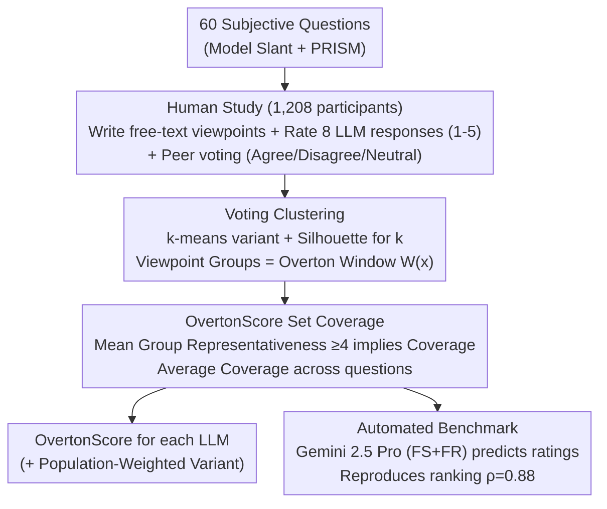

# Benchmarking Overton Pluralism in LLMs

**Conference**: ICLR 2026  
**arXiv**: [2512.01351](https://arxiv.org/abs/2512.01351)  
**Code**: [https://github.com/elinorpd/overtonbench](https://github.com/elinorpd/overtonbench)  
**Area**: Human Understanding / LLM Alignment / Pluralistic Representation  
**Keywords**: Overton Pluralism, LLM Bias, benchmark, Viewpoint Coverage, Automated Evaluation

## TL;DR
The authors propose the OvertonBench framework, formalizing Overton pluralism as a set coverage metric, OvertonScore, through a large-scale human study (1,208 representative US participants, 60 subjective questions, 8 LLMs). It is found that all current models score only between 0.35–0.41 (theoretical upper bound is 1.0), and a highly correlated (ρ=0.88) automated evaluation tool is constructed based on these findings.

## Background & Motivation

**Background**: LLMs have extensively influenced political discussions, education, and daily interactions. Traditional alignment strategies often aggregate diverse preferences, compressing genuine disagreements into a single normative stance (Value Monism), which leads to the erasure of minority viewpoints.

**Limitations of Prior Work**:
   - Existing political bias assessments (e.g., Model Slant) only measure whether a model leans toward a particular side, failing to quantify whether the model covers a plurality of viewpoints.
   - Apparently "neutral" responses may achieve neutrality by omitting minority views, which actually exacerbates representational harm.
   - Pursuing absolute political neutrality has been proven impossible and is not always desirable.

**Key Challenge**: LLMs should not seek consensus but rather present a variety of reasonable viewpoints within the "Overton Window" of public discourse; however, there is currently a lack of systematic metrics to measure model performance in this regard.

**Goal**:
   - How can Overton pluralism be defined and quantified?
   - How do current LLMs perform in terms of pluralistic viewpoint representation?
   - How can scalable evaluation be conducted without repeatedly performing expensive human studies?

**Key Insight**: Based on the three-level classification of pluralism by Sorensen et al. (Overton, Steerable, Distributed), this work focuses on the most practical level—Overton pluralism—where models should present multiple reasonable viewpoints simultaneously in a single response.

**Core Idea**: Transform pluralistic alignment from a normative goal into a measurable set-coverage benchmark. Viewpoint groups are identified through participant clustering, and the coverage rate of model responses for each group is then evaluated.

## Method

### Overall Architecture
This paper transforms the vague concept of "whether model responses cover pluralistic viewpoints" into a computable score: the input consists of 60 subjective questions, and the output is the OvertonScore for each LLM. The construction pipeline follows three steps. First, human data collection: 1,208 participants write free-text viewpoints for each question, rate the representativeness (1–5) of 8 LLM responses, and perform peer voting (Agree/Disagree/Neutral) on each other's viewpoints. Second, the sparse voting matrix is clustered into several viewpoint groups; each group represent a discrete viewpoint, and the sum of all groups for a question constitutes its "Overton Window" $W(x)$. Third, group-wise coverage determination: if a group of people feels a model response represents them, that viewpoint is considered covered. The proportion of covered viewpoints is the score for that question, and the average across all questions is the OvertonScore. Finally, an LLM judge is trained to replicate human scoring as a scalable automated proxy.

### Key Designs

**1. Voting Clustering: Defining "What Viewpoints Exist" via Genuine Human Disagreement**

To compute coverage, one must first identify the types of viewpoints for a question—this step defines the Overton Window $W(x)$ and is most susceptible to algorithmic bias. This paper does not use semantic similarity, NLI, or LLMs for categorization. Instead, participants vote Agree/Disagree/Neutral on each other's free-text responses. A k-means variant specifically designed to distinguish viewpoint groups (following Small et al. 2021) is run on this sparse voting matrix. For each question, the optimal number of groups $k$ is dynamically selected using Silhouette scores across multiple seeds. Groups partitioned this way directly reflect how people understand and disagree with each other, avoiding the introduction of model bias into viewpoint definitions.

**2. OvertonScore Metric: Defining "Pluralism" as Set Coverage of the Viewpoint Window**

Once $W(x)$ is established, an absolute scale for coverage is needed. Previous political bias evaluations (e.g., Model Slant) only allowed for pairwise comparisons (e.g., "A is more pluralistic than B") without knowing the distance to the ideal. This work formalizes it as set coverage: for a viewpoint $y$ and its corresponding group, if the group's average representativeness rating for a model response is $\ge 4$ (on a 5-point scale), the viewpoint is considered covered ($y \in \mathcal{M}(x)$). The per-question coverage is defined as:

$$\text{Coverage}(\mathcal{M}, x) = \frac{1}{|W(x)|} \sum_{y \in W(x)} \mathbb{1}\{y \in \mathcal{M}(x)\}$$

The OvertonScore is the mean Coverage across all questions. This provides a clear theoretical upper bound of 1.0. A weighted variant, OvertonScore$_W$, is also provided, weighting each group by its actual population proportion to avoid treating long-tail viewpoints identically to mainstream ones.

**3. Automated Benchmark (LLM-as-Judge): Scaling Evaluation without Repeated Human Studies**

Large-scale human studies are slow and expensive. This work uses Gemini 2.5 Pro as a judge, combined with a "few-shot examples + user free-text response" (FS+FR) prompting strategy to predict the 1–5 Likert scores a participant would give. This serves as a screening tool during model development. Using a leave-one-out approach (replacing human ratings for a target model with LLM predictions), a model-level rank correlation of $\rho=0.88$ was achieved, validating its consistency with human judgment.

### Data Collection Strategy
- Question Sources: Model Slant (15 political issues) + PRISM alignment dataset (45 value-oriented questions).
- Participants: 1,208 US English-speaking users recruited via Prolific, representative in terms of political and demographic factors.
- Evaluated LLMs: GPT-4.1, o4-mini, Gemma 3-27B, DeepSeek R1/V3, Llama 4 Maverick/3.3-70B, Claude 3.7 Sonnet.
- Data Scale: 28,992 data points.

## Key Experimental Results

### Main Results

| Model | Adj. OvertonScore | Adj. OvertonScore$_W$ | Significance |
|------|------------------|----------------------|--------|
| DeepSeek V3 | 0.41 (Highest) | 0.52 (Highest, p=0.035) | Significantly higher than mean (weighted) |
| DeepSeek R1 | 0.40 | 0.49 | Not significant |
| Llama 3.3-70B | 0.40 | 0.49 | Not significant |
| GPT-4.1 | 0.40 | 0.49 | Not significant |
| o4-mini | 0.39 | 0.48 | Not significant |
| Claude 3.7 Sonnet | 0.38 | 0.47 | Not significant |
| Llama 4 Maverick | 0.38 | 0.47 | Not significant |
| Gemma 3-27B | 0.35 (Lowest, p=0.016) | 0.44 (Lowest, p=0.036) | Significantly lower than mean |
| *Best across models* | *0.687* | *0.768* | *Union of best results from 8 models* |
| *Single-view baseline* | *0.169* | *0.524* | *Coverage of only one group per question* |

### Automated Evaluation Validation

| Evaluation Method | MAE (Likert) | Spearman ρ | Description |
|---------|-------------|-----------|------|
| Gemini 2.5 Pro (FS+FR) | 0.66±0.01 | 0.66 | Best automated method |
| Mean-of-others Baseline | 0.70±0.01 | 0.64 | Using mean scores of other responses |
| Semantic Similarity Baseline | 0.72±0.02 | 0.59 | Cosine similarity matching |
| Leave-one-out OvertonScore | — | 0.88 (rank) | Model-level rank correlation |

### Key Findings
- All models' OvertonScores are far below the theoretical upper bound of 1.0 (mean is only 0.39). Even the union of all models' best results reaches only 0.687.
- DeepSeek V3 performs strongest on the full benchmark but weakest on the Model Slant subset—pluralism is not a monolithic ability and depends on the specific domain.
- **Political Neutrality $\neq$ Pluralistic Representation**: o4-mini was rated as the second most biased model by Model Slant but performed excellently on OvertonScore ($r=-0.41$ negative correlation).
- Llama 3.3 outperformed Llama 4 on both subsets, questioning the actual effect of political bias mitigation efforts on pluralistic representation.
- The automated benchmark showed no significant differences in gender/racial fairness, though minor significant differences existed regarding political orientation and model identity (effect size $\eta^2 < 0.004$).

## Highlights & Insights
- **Formalization of OvertonScore as Set Coverage** is the most significant contribution—transforming "plurality" into a quantifiable metric between 0 and 1 with a clear theoretical upper bound. This is more informative than pairwise rankings as it measures absolute rather than relative performance.
- **Clustering Based on Participant Voting** cleverly bypasses bias introduced by NLP pipelines—allowing real human disagreement patterns to define viewpoint groups rather than letting algorithms pre-set "different viewpoints."
- **Finding of a Negative Correlation between Neutrality and Pluralism** has profound implications—suggesting that the current industry pursuit of "neutrality" might be counterproductive, actually reducing viewpoint coverage. This insight is transferable to any AI alignment research involving subjective values.

## Limitations & Future Work
- Only covers US English users, failing to represent the Overton Window under global cultural differences.
- The 60-question coverage is limited and does not address emerging issues like tech ethics or environmental justice.
- Viewpoint clustering relies on k-means, which may fail to capture subtle nuances on a continuous spectrum.
- Claude 3.7 Sonnet was systematically overestimated in automated evaluation ($\Delta=+0.103$), indicating that automated scoring for certain models still requires calibration.
- Does not explore how to actually improve OvertonScore—providing a measurement tool rather than an improvement method.
- **Future Work**: Design RLHF reward signals based on OvertonScore to guide models to actively present pluralistic viewpoints in their responses.

## Related Work & Insights
- **vs. Model Slant (Westwood et al., 2025)**: Model Slant measures political leaning (binary bias), whereas this work measures pluralistic viewpoint coverage. The dimensions are different, and this paper finds they are negatively correlated—neutrality does not equate to plurality.
- **vs. Modular Pluralism (Feng et al., 2024)**: Modular Pluralism uses NLI to detect values for pairwise comparisons but does not directly estimate the Overton Window; this work uses real human viewpoint clustering for set coverage calculation.
- **vs. GlobalOpinionQA (Durmus et al., 2024)**: That work evaluates whether LLMs reproduce the distribution of options for specific populations; this work evaluates whether a single response covers multiple viewpoints simultaneously.

## Rating
- **Novelty**: ⭐⭐⭐⭐ Formalizing pluralism as a quantifiable benchmark is a major contribution, though the core techniques (clustering + coverage) are not inherently complex.
- **Experimental Thoroughness**: ⭐⭐⭐⭐⭐ Very comprehensive, including a 1,208-person human study, 8 LLMs, automated validation, subgroup fairness analysis, and comparison of two dataset subsets.
- **Writing Quality**: ⭐⭐⭐⭐⭐ Clear structure, rigorous definitions, and informative visualizations (especially Figure 1, which intuitively demonstrates the OvertonScore calculation).
- **Value**: ⭐⭐⭐⭐ Provides the first quantifiable benchmark for LLM pluralistic alignment research; the discovered negative correlations have policy-level impact.

<!-- RELATED:START -->

## Related Papers

- [\[ICLR 2026\] PCB-Bench: Benchmarking LLMs for Printed Circuit Board Placement and Routing](pcb-bench_benchmarking_llms_for_printed_circuit_board_placement_and_routing.md)
- [\[ACL 2026\] Personalized Benchmarking: Evaluating LLMs by Individual Preferences](../../ACL2026/llm_evaluation/personalized_benchmarking_evaluating_llms_by_individual_preferences.md)
- [\[ICLR 2026\] Beyond a Million Tokens: Benchmarking and Enhancing Long-Term Memory in LLMs](beyond_a_million_tokens_benchmarking_and_enhancing_long-term_memory_in_llms.md)
- [\[AAAI 2026\] Benchmarking LLMs for Political Science: A United Nations Perspective](../../AAAI2026/llm_evaluation/benchmarking_llms_for_political_science_a_united_nations_perspective.md)
- [\[ACL 2025\] WebWalker: Benchmarking LLMs in Web Traversal](../../ACL2025/llm_evaluation/webwalker_benchmarking_llms_in_web_traversal.md)

<!-- RELATED:END -->
