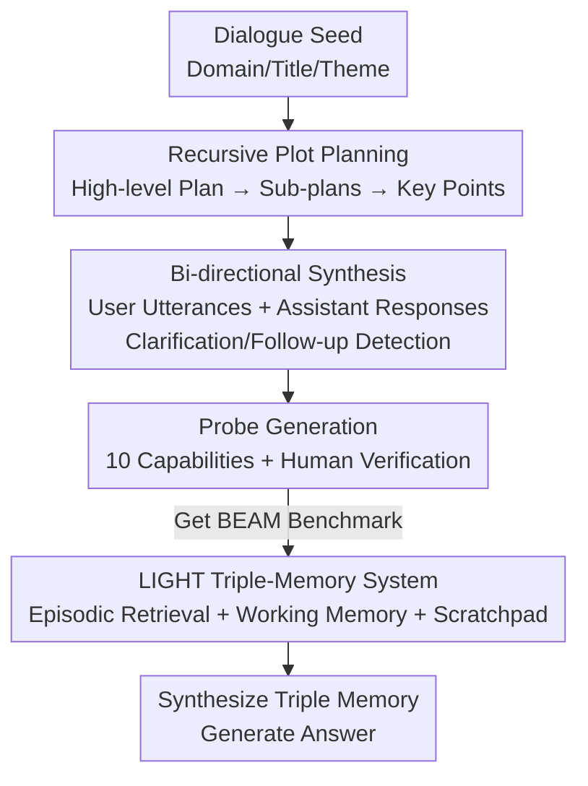

# Beyond a Million Tokens: Benchmarking and Enhancing Long-Term Memory in LLMs

**Conference**: ICLR2026  
**OpenReview**: [https://openreview.net/forum?id=y59hf5lrMn](https://openreview.net/forum?id=y59hf5lrMn)  
**Code**: https://github.com/mohammadtavakoli78/BEAM  
**Area**: LLM Evaluation / Long-term Memory / Long Context  
**Keywords**: Long-term Memory, Dialogue Evaluation, Synthetic Data, Memory Enhancement, RAG

## TL;DR
Addressing the three major flaws of existing long-dialogue memory evaluations—topic fragmentation, narrow domains, and simple recall—this paper first utilizes a recursive plot planning synthesis pipeline to create BEAM (100 dialogues up to 10M tokens + 2,000 probes covering 10 memory capabilities). It then proposes the LIGHT framework, inspired by human cognition, which integrates "Episodic Memory + Working Memory + Scratchpad" systems, achieving an average improvement of 3.5%–12.69% over the strongest baselines on BEAM.

## Background & Motivation
**Background**: LLMs are extensively deployed in scenarios requiring the ability to "remember what was said long ago," such as multi-turn dialogues, RAG, and long document/code analysis, leading to models like Gemini with 1M token context windows. To measure whether these models can truly utilize long dialogue history, appropriate long-term memory benchmarks are required.

**Limitations of Prior Work**: Current long-dialogue memory evaluations have three fundamental flaws. First, most benchmarks are **manually concatenated** from several short dialogues of different users, resulting in topical shifts and narrative incoherence. This concatenation actually simplifies the task because isolated segments are easily locatable and do not require true long-range reasoning. Second, data domains are **narrow**, mostly covering personal life scenes while ignoring many real-world application domains. Third, the testing methods are **singular**, focusing almost exclusively on simple context recall while neglecting critical capabilities like conflict resolution, identifying information evolution, and instruction following.

**Key Challenge**: Creating dialogue data that is long (millions or tens of millions of tokens), coherent, diverse in topics, and capable of testing ten distinct memory abilities is impractical via manual annotation. Conversely, concatenating short dialogues destroys coherence and distorts evaluation. There is a tension between length, coherence, and capability coverage.

**Goal**: This is divided into two sub-problems: (1) How to **automatically** generate long, coherent, and domain-diverse dialogue data with fine-grained probes as a benchmark; (2) How to enable models to **better remember and invoke** historical information within long dialogues under the realistic constraint of 1M (or shorter) context windows.

**Key Insight**: The authors treat the generation of ultra-long coherent dialogues as a **recursive plot planning** problem—determining high-level plots first, then decomposing them layer by layer into sub-plots/points, and finally expanding them into chronological user-assistant turns. Furthermore, drawing from human cognitive science on the division of "Episodic Memory / Working Memory / Scratchpad," memory enhancement is decomposed into three complementary subsystems.

**Core Idea**: Use "top-down recursive plot generation + manual probe verification" to create the BEAM benchmark, and the LIGHT framework with "Episodic Retrieval + Working Memory + Filterable Scratchpad" to upgrade long-term memory from "brute-force reading in context" to "hierarchical retrieval and accumulation."

## Method

### Overall Architecture
This paper presents two parallel outputs: the **BEAM** benchmark and the **LIGHT** memory enhancement method. BEAM addresses "what to test," and LIGHT addresses "how to make models perform better."

The data generation for BEAM is a five-stage pipeline: starting from a dialogue seed (domain, title, theme, sub-topics), it generates a high-level **dialogue plan** and recursively decomposes it into sub-plans; next, it generates **user utterances** chronologically; then, it generates **assistant responses** under a role-play setting (interspersed with clarification and follow-up detection modules for natural two-way interaction); it then automatically generates **probes** for ten memory capabilities; finally, humans **verify and filter** invalid questions and construct scoring nuggets for valid ones. For ultra-long dialogues like 10M tokens, the authors use ten interlocking sub-plans to form a longer coherent storyline.

LIGHT is an inference-time memory architecture: given a question $x$ about dialogue $T=\{t_i\}_{i=1}^{|T|}$, the framework pulls data from three memories in parallel—retrieving $k$ relevant segments $E=R(x,k,T)$ from Episodic Memory, taking the last $z$ turns $W=\{t_{|T|-i}\}_{i=0}^{z}$ for Working Memory, and passing a pre-constructed scratchpad $S_{|T|}$ through a filter function to get a relevant subset $S_x=f(S_{|T|},x)$. Finally, the model $\pi$ synthesizes these to generate answer $y=\pi(x,E,W,S_x)$.

### Key Designs

**1. Recursive Plot Planning: Decomposing "Long Coherent Dialogue" into Controllable Top-down Generation**

To solve the issue of "topic fragmentation" in concatenated data, BEAM uses an LLM to generate a **dialogue plan** as a scaffold from a seed. The seed includes domain, title/theme, sub-topics, narratives characterizing evolution (e.g., career growth), a user persona sampled from MBTI, a constrained relationship graph, and a clear timeline. The plan consists of $N$ sub-plans, each containing $M$ key points (narrative + story role + time anchor). For 128K/500K/1M dialogues, a single plan suffices; for 10M, ten interlocking plans are used via **Sequential Expansion** (subsequent seeds represent sequential events conditioned on the previous) and **Hierarchical Decomposition** (decomposing a master seed into ten sub-seeds, e.g., planning, execution, and review of an international trip). Both methods keep core relationships constant while gradually introducing acquaintances. This ensures the storyline is coherent without redundancy, with explicit topic boundaries.

**2. Bi-directional Dialogue Synthesis: Natural Interaction via Clarification and Follow-ups**

Expanding a plan linearly as "user asks, assistant answers" feels mechanical. User utterances are generated from sub-plans: $M$ points are split into $K$ batches, and LLaMA-3.3 70B generates $I$ questions per batch to reduce repetition. Assistant responses are generated iteratively: the model is conditioned on the seed, previous sub-plans, recent $M$ turn summaries, and compressed older summaries. Two modules intervene: **Clarification Detection** determines if the assistant needs to ask the user a question (looping until a threshold $\delta_1=2$); **Follow-up Detection** determines if the user would naturally ask a follow-up (up to $\delta_2=2$). These modules create bi-directional, context-dependent, and clarifying human-computer interaction qualities.

**3. Ten Memory Capabilities + Nugget Scoring: Granular Measurement of "Remembering"**

BEAM evaluates ten complementary capabilities—seven existing and three new: **Instruction Following** (maintaining constraints over long context), **Event Ordering** (reconstructing chronological sequence), and **Conflict Resolution** (detecting and reconciling distant inconsistent statements). Others include Abstention, Information Extraction, Knowledge Updating, Multi-hop Reasoning, Preference Following, Summarization, and Temporal Reasoning. Probes are generated by GPT-4.1-mini, verified by humans to retain 20 questions per dialogue. Scoring uses a **nugget** mechanism: the ideal answer is split into atomic semantic criteria, and an LLM judge scores each nugget 0/0.5/1. For Event Ordering, **Kendall tau-b** is used after aligning events with an LLM-based equivalence detector to capture both recall and order fidelity.

**4. LIGHT Triple-Memory System: Episodic Retrieval + Working Memory + Filterable Scratchpad**

LIGHT mimics three human cognitive mechanisms. **Episodic Memory**: For each turn, Qwen2.5-32B extracts Key-Value pairs (entities and attributes) and turn summaries, which are embedded and stored in a vector DB; retrieval returns the original dialogue snippets. **Working Memory**: Directly retrieves the last $z$ dialogue turns for short-term context. **Scratchpad**: For each turn, semantic knowledge, autobiographical details, future intentions, and context metadata are processed and merged. Once the scratchpad exceeds 30K tokens, GPT-4.1-nano compresses it to 15K, maintaining efficiency and long-term coherence. During inference, the scratchpad passes through a **filtering function $f$** that uses semantic chunking and relevance tagging to provide a concentrated version for the current question. The three systems ensure precise retrieval, recent detail retention, and high-level abstraction respectively.

## Key Experimental Results

### Main Results
On BEAM, four backbones (Qwen2.5-32B, Llama-4-Maverick, Gemini-2.0-flash, GPT-4.1-nano) were compared across three methods: Vanilla (full history in context), RAG (top-5 retrieval), and Ours (LIGHT). Table shows the average nugget score (max 1) at 100K token length:

| Length | Method | Qwen2.5 | Llama Maverick | Gemini 2 Flash | GPT-4.1-nano |
|------|------|---------|----------------|----------------|--------------|
| 100K | Vanilla | 0.280 | 0.240 | 0.242 | 0.239 |
| 100K | RAG | 0.269 | 0.323 | 0.280 | 0.309 |
| 100K | Ours (LIGHT) | **0.311** | **0.358** | **0.294** | **0.345** |

LIGHT achieved the highest scores across all backbones, with average improvements of 3.5%–12.69%. A key observation: even models with 1M context windows show **significant performance degradation** as dialogues lengthen, proving that a large window does not equate to effective memory.

### Ablation Study
Ablations confirmed that each memory component is essential:

| Configuration | Description |
|------|------|
| Full LIGHT | Complete Episodic + Working + Scratchpad |
| w/o Scratchpad | Loss of high-level abstraction; multi-hop/summarization drop |
| w/o Episodic Retrieval | Loss of precise recall; information extraction drops |
| w/o Working Memory | Loss of recent context; temporal/preference tasks drop |

### Key Findings
- Performance varies significantly across capabilities: RAG is often highest in "Abstention," while LIGHT shows the largest gains in "Information Extraction," "Multi-hop Reasoning," and "Summarization" which require synthesizing scattered evidence.
- The "degradation with length" phenomenon is universal, even in 1M token models. 10M evaluation was only possible on recent segments for the tested models, highlighting that ultra-long memory remains an open challenge.
- Scores for Conflict Resolution and Event Ordering are extremely low (often ~0.0x), indicating that current models have barely mastered reconciling distant inconsistencies.

## Highlights & Insights
- **Plot Planning as Data Generation**: Recursive top-down decomposition ensures coherence for ultra-long synthetic corpora (10M tokens), a strategy transferable to long documents or agentic traces.
- **Three Memories Addressing Three Failures**: Episodic retrieval fixes "recall failure," working memory fixes "recency loss," and the scratchpad fixes "abstraction loss."
- **"Accumulate and Compress" Budget Control**: Managing the scratchpad with a fixed compression threshold (30K to 15K) keeps context costs bounded rather than growing infinitely.
- **Large Window ≠ Storage Memory**: The decline of 1M-window models on long dialogues suggests that hierarchical retrieval and external memory are still indispensable.

## Limitations & Future Work
- **Reliance on LLM Synthesis**: Dialogues and probes are LLM-generated, potentially inheriting the biases or distributions of the generator models.
- **10M Evaluation Constraints**: Due to hardware limits, 10M token models like Llama-4-Scout were not fully tested, and evaluations were restricted to local segments.
- **System Complexity**: LIGHT relies on multiple models (Qwen, BGE, GPT) for different tasks, introducing latency and deployment costs.
- **Hard Capability Bottlenecks**: Models performed poorly on conflict resolution; while the benchmark highlights this, the current method does not specifically solve it.

## Related Work & Insights
- **vs. Concatenated Benchmarks (e.g., LoCoMo)**: Unlike benchmarks that stitch unrelated dialogues, BEAM forces true long-range reasoning through a single coherent storyline.
- **vs. Naive RAG**: RAG only provides episodic recall. LIGHT adds recent context and high-level summaries, significantly outperforming RAG on integrative tasks like summarization and multi-hop reasoning.
- **vs. Long-Context (Vanilla)**: LIGHT with a 32K context + hierarchical retrieval outperforms brute-force filling of a 1M window, indicating better scalability.

## Rating
- Novelty: ⭐⭐⭐⭐⭐ Recursive plot planning for 10M tokens + Triple-memory system.
- Experimental Thoroughness: ⭐⭐⭐⭐ Extensive matrix evaluation, though 10M was not end-to-end.
- Writing Quality: ⭐⭐⭐⭐ Clear explanation of pipelines and memory systems.
- Value: ⭐⭐⭐⭐⭐ High-quality benchmark + reusable memory framework, fully open-sourced.

<!-- RELATED:START -->

## Related Papers

- [\[NeurIPS 2025\] MEMTRACK: Evaluating Long-Term Memory and State Tracking in Multi-Platform Dynamic Agent Environments](../../NeurIPS2025/llm_evaluation/memtrack_evaluating_long-term_memory_and_state_tracking_in_multi-platform_dynami.md)
- [\[ICLR 2026\] Are LLMs Really Not Knowledgeable? Mining the Submerged Knowledge in LLMs' Memory](are_llms_really_not_knowledgeable_mining_the_submerged_knowledge_in_llms_memory.md)
- [\[ICLR 2026\] LFQA-E: Carefully Benchmarking Long-form QA Evaluation](lfqa-e_carefully_benchmarking_long-form_qa_evaluation.md)
- [\[ICLR 2026\] Can You Hear Me Now? A Benchmark for Long-Range Graph Propagation and Beyond](can_you_hear_me_now_a_benchmark_for_long-range_graph_propagation_and_beyond.md)
- [\[AAAI 2026\] BCWildfire: A Long-term Multi-factor Dataset and Deep Learning Benchmark for Boreal Wildfire Risk Prediction](../../AAAI2026/llm_evaluation/bcwildfire_a_long-term_multi-factor_dataset_and_deep_learning_benchmark_for_bore.md)

<!-- RELATED:END -->
