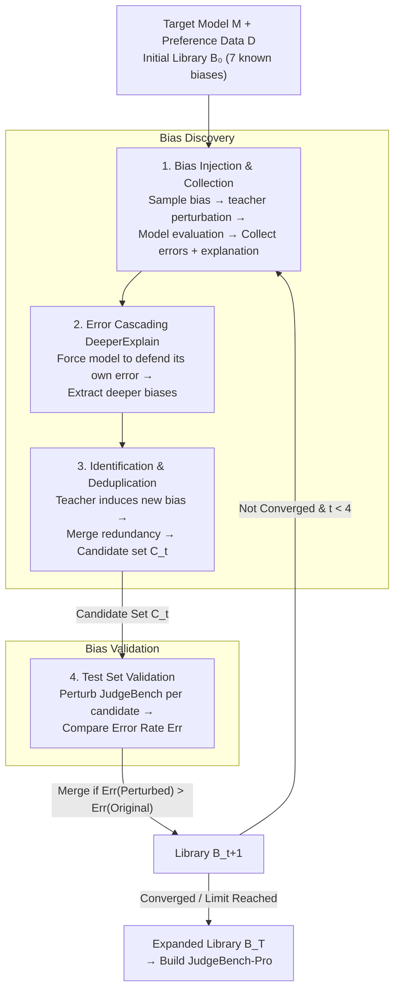

# BiasScope: Towards Automated Detection of Bias in LLM-as-a-Judge Evaluation

**Conference**: ICLR 2026  
**arXiv**: [2602.09383](https://arxiv.org/abs/2602.09383)  
**Code**: [https://github.com](https://github.com) (Available, includes code and JudgeBench-Pro data)  
**Area**: LLM Evaluation  
**Keywords**: LLM-as-a-Judge, Bias Discovery, Evaluation Robustness, Automated Bias Mining, JudgeBench-Pro

## TL;DR
Proposes BiasScope, a fully LLM-driven iterative framework that automatically discovers latent unknown biases in LLM-as-a-Judge at scale. Based on this, it constructs the more challenging JudgeBench-Pro benchmark, where even strong LLM evaluators exhibit error rates exceeding 50%.

## Background & Motivation

**Background**: LLM-as-a-Judge has been widely adopted for benchmark construction, data filtering, and model performance assessment, utilizing LLMs as "judges" to automatically evaluate model outputs at scale.

**Limitations of Prior Work**: Existing research on bias is primarily restricted to known types—focusing on validating the impact of position bias, length bias, and self-preference bias on evaluation results—lacking systematic exploration of unknown latent biases. Furthermore, manual identification of new bias types is costly, has narrow coverage, and is difficult to scale. Fundamentally, traditional methods remain in a "passive discovery" mode, depending on researchers to pre-define bias lists before individual verification, which fails to support proactive mining.

**Key Challenge**: While LLM-as-a-Judge is extensively used, its reliability and robustness are not guaranteed. Unknown biases may exert greater influence than known ones, yet automated and systematic means to discover these biases are currently missing.

**Goal**: How to automatically and at scale discover unknown biases that might arise during the LLM evaluation process?

**Key Insight**: Leveraging a teacher model to inject known biases to "stimulate" the target model into exposing new bias tendencies, combined with an error cascading strategy (DeeperExplain) to further excavate deep-seated biases, forming an iterative self-expansion mechanism for the bias space.

**Core Idea**: Transforming bias discovery from passive manual exploration to active automated mining through an iterative pipeline of "bias injection → misjudgment collection → error cascading → bias identification → validation."

## Method

### Overall Architecture
BiasScope aims to solve the problem of automatically discovering "unnamed" unknown biases within LLM evaluators at scale. It frames bias discovery as a self-expanding two-phase cycle. Given a target model $M$, a dataset $\mathcal{D}$ with correct preference labels, and an initial bias library $\mathcal{B}_0$ containing 7 known biases, each iteration begins with **Bias Discovery**: injecting known biases into data to induce errors in the target model, using an error cascading strategy to force out deeper biases, and finally using a teacher model to identify and deduplicate new bias candidates from the errors. This is followed by **Bias Validation**: confirming whether the candidate biases actually increase the error rate on an independent test set. Validated biases are merged into the library for the next iteration. This cycle continues until no new effective biases are found, the library stabilizes, or the maximum iteration limit (default 4) is reached, resulting in the expanded bias library $\mathcal{B}_T$. The entire process requires no manual pre-definition of bias lists, as the bias space expands itself by using "known biases to leverage unknown ones."

### Key Designs

**1. Bias Injection and Misjudgment Collection: Using known biases to "pry" the model into exposing new tendencies**

To address the "passive discovery" pain point where traditional methods only verify pre-listed biases, BiasScope proactively creates bias scenarios. In each round, a bias $b_k$ is sampled from the library, and a teacher model perturbs the rejected response $y_i^r$ according to this bias to generate $\tilde{y}_i^r$ (while the correct response $y_i^c$ remains unchanged), forming the perturbed dataset $\tilde{\mathcal{D}}_t$. The target model performs pair-wise evaluation; samples where the model is induced to select the rejected response are collected, along with the provided explanation $E_i$. The hypothesis is that a known bias pushes the model into an error-prone state, and the resulting erroneous explanations often contain other, as-of-yet unnamed bias tendencies.

**2. Error Cascading Strategy (DeeperExplain): Forcing the model to "explain its own error" to extract deeper biases**

Initial erroneous explanations are often insufficient to fully expose latent biases. DeeperExplain continues to query the model regarding its incorrect judgment, forcing it to further justify its flawed reasoning:

$$E_i' = \text{DeeperExplain}(x_i, y_i^c, \tilde{y}_i^r, E_i; M)$$

As the model follows its own error in explanation, it reveals more hidden judgment preferences, pushing the depth of bias extraction beyond a single perturbation. Ablation studies confirm this: with this strategy, Qwen2.5-7B identifies 27 biases (vs. 25) and Qwen2.5-1.5B identifies 48 (vs. 43), a roughly 10% increase.

**3. Bias Identification and Deduplication: Ensuring independence of library entries**

Collected misjudgment data is handed to the teacher model for synthesis, identifying a new candidate bias set $\tilde{\mathcal{B}}_t$. Since candidates might be paraphrases of existing biases, deduplication is performed: candidates and the current library are merged into $\mathcal{B}_t^{\text{temp}} = \tilde{\mathcal{B}}_t \cup \mathcal{B}_t$, followed by pair-wise similarity comparison and merging of redundant entries. This ensures the final bias set is independent and non-overlapping, preventing inflated counts from repeated biases.

**4. Test Set Validation: Filtering "fake biases" using objectively labeled data**

Candidate biases are not necessarily destructive; they must be tested on an independent test set (JudgeBench, which contains objective ground truth). For each candidate $b_j$, the teacher model perturbs the test set, and the target model's error rate on perturbed vs. original data is compared. Only if $\text{Err}(\tilde{\mathcal{D}}_j^{\text{test}}) > \text{Err}(\mathcal{D}^{\text{test}})$ is the bias deemed effective and merged into the library. Using objective test sets rather than subjective preference data ensures a distinction between "different preferences" and "actual bias-induced errors," eliminating subjective noise.

### Implementation & Setup
- Pair-wise evaluation is used for bias identification.
- Option positions are randomly swapped during evaluation to eliminate position bias.
- Greedy decoding + fixed random seed are used for reproducibility.
- The initial library contains 7 known biases.
- Maximum iterations are set to 4 (most models nearly converge by this point).

## Key Experimental Results

### Main Results
BiasScope was run on 7 target models of different scales and families, using JudgeBench as the validation set:

| Target Model | Validated Biases | Original Err (%) | BiasScope Err (%) | Gain |
|----------|-----------|-----------|-----------------|------|
| Qwen2.5-1.5B-Instruct | 48 | 48.6 | 53.1 | +4.5 |
| InternLM3-8B-Instruct | 19 | 45.3 | 50.7 | +5.4 |
| Mistral-7B-Instruct-v0.3 | 41 | 43.9 | 51.2 | +7.3 |
| Qwen2.5-7B-Instruct | 27 | 43.4 | 48.1 | +4.7 |
| LLaMA-3.1-8B-Instruct | 29 | 41.7 | 52.5 | +10.8 |
| Qwen2.5-14B-Instruct | 19 | 37.7 | 47.8 | +10.1 |
| Qwen3-8B (Non-Thinking) | 14 | 36.9 | 42.7 | +5.8 |
| **Average** | - | - | - | **+6.9** |

### Ablation Study

| Configuration | Key Metric | Description |
|------|---------|------|
| Early-Validate (Default) | LLaMA: 29 biases, Err 52.5% | Validation per round; discovers more biases |
| Late-Validate | LLaMA: 27 biases, Err 52.2% | Delayed validation; slightly fewer biases |
| With DeeperExplain | Qwen2.5-7B: 27, 1.5B: 48 | Error cascading assists in mining more biases |
| Without DeeperExplain | Qwen2.5-7B: 25, 1.5B: 43 | ~10% fewer biases discovered |
| GPT-OSS-120B as Teacher | LLaMA: 19 biases, Err 53.8% | Stronger teacher finds more effective biases |
| GPT-OSS-20B as Teacher | LLaMA: 9 biases, Err 47.7% | Weak teacher halves the bias count |

### Key Findings
- **Simple domains are more easily influenced by bias**: The math domain had the lowest original error rate, but the largest increase after bias injection (+11.1%), indicating biases more easily interfere when tasks are straightforward.
- **Stronger models reveal fewer biases**: In the Qwen2.5 series, the number of discoverable biases decreased as parameter size increased, suggesting stronger models are more stable.
- **Length is not the root cause of error increases**: Truncation experiments showed that multi-bias perturbations maintained higher error rates even after controlling for length (+2.2%), whereas pure length bias dropped below the baseline after truncation (-2.5%).
- **Bias mining is transferable**: Biases discovered on Qwen2.5-1.5B, when used to build JudgeBench-Pro, significantly degraded the performance of closed-source models (e.g., GPT-4o).

## JudgeBench-Pro
- Constructed from 620 JudgeBench samples, generating 10 bias variants each (6200 total), followed by strong model adversarial filtering and manual review, resulting in 1178 high-quality samples.
- Four out of five mainstream strong models performed no better than random guessing on JudgeBench-Pro.
- GPT-4o error rate reached 74.7%, while only Doubao-Seed-1-6 performed relatively well (20.4%).
- Rejected responses were only 8.4% longer than original ones, excluding pure length effects.
- Inter-annotator agreement (Fleiss' Kappa) = 0.92.

## Bias Mitigation
Verified using discovered biases to construct augmented preference data for DPO training:
- Training with original UltraFeedback DPO actually increased error rates (Mistral: 14.3→20.6%).
- Bias-augmented DPO training reduced error rates (Mistral: 14.3→13.3%, LLaMA: 21.5→20.3%).

## Highlights & Insights
- **Error Cascading Strategy**: Leveraging a model's "explanation of its own errors" to induce further exposure is a clever approach that could be transferred to other red-teaming scenarios.
- **Transferability from Small Models to Large/Closed-Source Models**: Running the framework on cost-effective small open-source models can identify biases that also expose weaknesses in closed-source models like GPT-4o, lowering the barrier to entry.
- **Closed Loop from Discovery to Mitigation**: Beyond identifying problems, the research uses bias-augmented data via DPO to solve them.

## Limitations & Future Work
- The discovery process remains computationally expensive, requiring strong teacher models and multiple iterations.
- Bias validation relies on test sets with objective ground truths, limiting applicability to subjective evaluation scenarios.
- The maximum iteration count is only 4, potentially missing deeper latent biases.
- Currently limited to the pair-wise evaluation paradigm, excluding point-wise or reference-based evaluation.

## Related Work & Insights
- **vs. CALM (Ye et al., 2024)**: CALM uses known biases to construct benchmarks for quantifying bias, which is "passive validation"; BiasScope performs "active discovery" of unknown biases.
- **vs. JudgeBench (Tan et al., 2025)**: JudgeBench provides an objectively labeled evaluation benchmark; BiasScope builds the more difficult JudgeBench-Pro on top of it.

## Rating
- Novelty: ⭐⭐⭐⭐ Innovative shift from passive validation to active mining within the framework.
- Experimental Thoroughness: ⭐⭐⭐⭐⭐ Comprehensive coverage across 7 models, multiple ablations, reliability checks, length controls, and DPO mitigation.
- Writing Quality: ⭐⭐⭐⭐ Clear structure, standardized formalization, and good integration of charts.
- Value: ⭐⭐⭐⭐ Provides practical tools and new benchmarks for the robustness evaluation of LLM-as-a-Judge.

<!-- RELATED:START -->

## Related Papers

- [\[ACL 2026\] Contrastive Decoding Mitigates Score Range Bias in LLM-as-a-Judge](../../ACL2026/llm_evaluation/contrastive_decoding_mitigates_score_range_bias_in_llm-as-a-judge.md)
- [\[ICLR 2026\] Talk, Evaluate, Diagnose: User-aware Agent Evaluation with Automated Error Analysis](talk_evaluate_diagnose_user-aware_agent_evaluation_with_automated_error_analysis.md)
- [\[ICLR 2026\] Preference Leakage: A Contamination Problem in LLM-as-a-judge](preference_leakage_a_contamination_problem_in_llm-as-a-judge.md)
- [\[ACL 2026\] Fin-Bias: Comprehensive Evaluation for LLM Decision-Making under human bias in Finance Domain](../../ACL2026/llm_evaluation/fin-bias_comprehensive_evaluation_for_llm_decision-making_under_human_bias_in_fi.md)
- [\[ICLR 2026\] Rethinking LLM-as-a-Judge: Representation-as-a-Judge with Small Language Models via Semantic Capacity Asymmetry](rethinking_llm-as-a-judge_representation-as-a-judge_with_small_language_models_v.md)

<!-- RELATED:END -->
