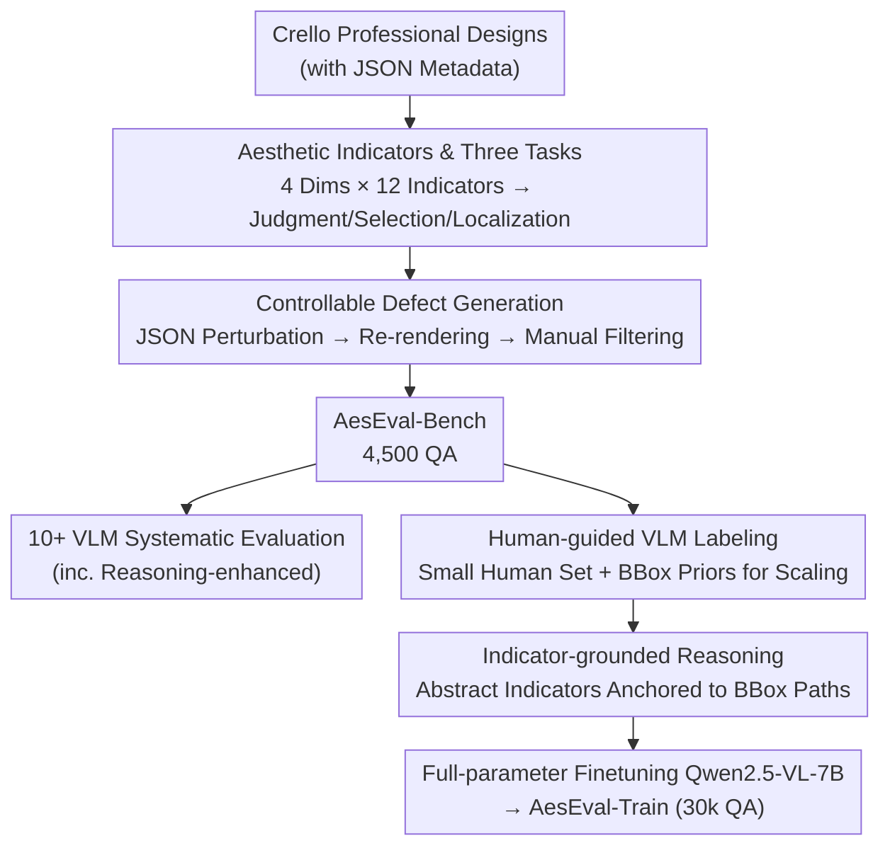

# Can Vision–Language Models Assess Graphic Design Aesthetics? A Benchmark, Evaluation, and Dataset Perspective

**Conference**: ICLR2026  
**arXiv**: [2603.01083](https://arxiv.org/abs/2603.01083)  
**Code**: [https://github.com/arctanxarc/AesEval-Bench](https://github.com/arctanxarc/AesEval-Bench)  
**Area**: LLM Evaluation  
**Keywords**: design aesthetics, VLM evaluation, benchmark, indicator-grounded reasoning, graphic design

## TL;DR
The study introduces AesEval-Bench, the first systematic benchmark to evaluate VLM capabilities in graphic design aesthetic assessment (4 dimensions × 12 indicators × 3 tasks). It finds that existing VLMs (including reasoning-enhanced ones) show limited performance in design aesthetics. By utilizing human-guided VLM labeling and indicator-grounded reasoning to construct training data, a fine-tuned 7B model outperforms GPT-5 on precise localization tasks.

## Background & Motivation

**Background**: VLMs have made significant progress in tasks like image captioning and VQA, but their ability to evaluate graphic design aesthetics (assessing the visual appeal of posters, advertisements, and UIs) remains largely unexplored.

**Limitations of Prior Work**: (a) **Incomplete Benchmarks**—Existing design aesthetic benchmarks cover only few dimensions (e.g., ignoring graphic quality or typography), and evaluation protocols are either coarse-grained scoring (unable to locate problematic areas) or open-ended descriptions (hard to quantify); (b) **Lack of Systematic Comparison**—No comprehensive comparison exists across open-source, closed-source, and reasoning-enhanced VLMs; (c) **Scarcity of Training Data**—Methods to improve VLM performance in this specific domain have not been investigated.

**Key Challenge**: Design aesthetics is a multi-dimensional and highly subjective task involving typography, layout, color, and graphics. The general reasoning capabilities of existing VLMs are insufficient for handling such fine-grained evaluations that require domain-specific knowledge.

**Goal**: (a) Establish a quantitative benchmark covering complete design dimensions; (b) Systematically evaluate the capability boundaries of various VLMs; (c) Construct training data that effectively enhances VLM performance.

**Key Insight**: Design aesthetics is decomposed into 4 dimensions (Typography, Layout, Color, Graphics) × 12 indicators. Three tasks (Judgment, Region Selection, Precise Localization) are designed to evaluate from coarse to fine levels. Furthermore, "indicator-grounded reasoning" is employed to let VLMs learn to associate abstract aesthetic indicators with specific design regions.

**Core Idea**: Establish the first systematic design aesthetic benchmark + discover the lack of advantage in reasoning-enhanced VLMs + significantly improve VLM aesthetic evaluation via indicator-anchored reasoning training data.

## Method

### Overall Architecture

This paper addresses a previously unstudied question: whether VLMs can judge graphic design aesthetics and whether they can be taught to do so. The work is divided into three interconnected phases. The first step establishes an **aesthetic indicator system and a three-level task hierarchy**, decomposing the subjective "attractiveness" into 4 dimensions and 12 indicators, alongside three tasks ranging from coarse to fine to serve as a coordinate system for evaluation and labeling. The second step involves data construction: starting from professional Crello designs, **controllable defect design generation** is applied to structured metadata followed by re-rendering and manual filtering to create **AesEval-Bench** (4,500 QAs) with precise ground truth. This benchmark is used to evaluate 10+ VLMs to map their capability boundaries. The third step uses **Human-guided VLM Labeling** to scale few-shot human standards into large-scale training labels. Finally, **Indicator-grounded Reasoning** generates reasoning paths anchored to specific bounding boxes (bboxes) for each sample, forming AesEval-Train (30k QAs) for full-parameter fine-tuning of Qwen2.5-VL-7B.

### Key Designs

**1. Aesthetic Indicator System & Three Tasks: Quantifying "Attractiveness"**

Existing aesthetic benchmarks often cover limited dimensions, and evaluations stay at coarse scoring or open descriptions, making them hard to quantify or use for locating problematic regions. This system decomposes design aesthetics into 12 indicators across 4 dimensions: Typography (legibility, hierarchy), Layout (balance, layering, whitespace, alignment), Color (harmony, contrast, appeal, psychology), and Graphics (quality, relevance). Based on this, three progressive tasks are designed: Aesthetic Judgment (yes/no for the whole image), Region Selection (4-choice to find the problematic area), and Precise Localization (outputting the bbox coordinates of the problematic area). These tasks progress from global perception to fine-grained spatial localization, allowing for a layered measurement of VLM aesthetic understanding.

**2. Controllable Defect Design Generation: Reverse-Engineering Defects for Ground Truth**

Collecting "defective designs" directly is difficult for labeling types and locations. AesEval-Bench starts with professional designs from the Crello dataset, which include JSON metadata (coordinates, fonts, colors). Controllable perturbations are applied at the JSON level—repositioning elements, changing fonts, adjusting colors—and then re-rendered. Since perturbations occur on structured metadata, the affected elements and problem types are known, providing precise ground truth. Manual annotators verify if perturbations actually cause perceptible aesthetic issues, resulting in 4,500 QA pairs.

**3. Human-guided VLM Labeling: Scaling Labels using Human Exemplars**

Training sets require significantly more labels than 4,500, but full manual annotation is expensive. Here, a few manual annotations serve as in-context examples, and the bbox coordinates of the perturbed area are provided as a prior to a strong VLM (e.g., GPT) to generate binary alignment labels. While bbox priors are unavailable in real inference, they significantly improve label reliability during the annotation phase, effectively scaling human judgment standards to large datasets.

**4. Indicator-grounded Reasoning: Anchoring Abstract Indicators to Specific BBoxes**

The authors observed that general reasoning-enhanced VLMs (GPT-o1/o3) do not possess an advantage in aesthetic evaluation because their reasoning is based on general global analysis rather than specific regions. Indicator-grounded reasoning addresses this by providing GPT with target bbox coordinates and corresponding design layers, requiring it to output a reasoning path that includes coordinates and explains the relationship between that region and a specific aesthetic indicator. This forces abstract concepts like "hierarchy" or "alignment" to be associated with specific bboxes. Different tasks use different anchoring strategies: Judgment uses the perturbed bbox, Region Selection provides both perturbed and unperturbed areas for contrast, and Localization emphasizes the region's relationship with the overall design.

### Loss & Training
The model is based on Qwen2.5-VL-7B-Instruct using full-parameter fine-tuning, with the vision encoder frozen. Training uses a learning rate of $1e-6$, a cosine scheduler, 3% warmup, and bfloat16 + FlashAttention-2. The training data consists of 30k QA pairs where the input includes task descriptions, design images, and JSON metadata, and the supervision signal is the reasoning path + task label.

## Key Experimental Results

### Main Results (VLM Baseline Evaluation)

| Model | Judgment Acc | Selection Acc | Localization (choice) Acc | Localization (bbox) IoU |
|------|------------|------------|-------------------|------------------|
| GPT-5 | **0.7252** | **0.6989** | **0.6090** | **0.1993** |
| GPT-4o | 0.7031 | 0.6745 | 0.5680 | 0.1712 |
| GPT-o3 | 0.7105 | 0.6581 | 0.5800 | 0.1418 |
| GPT-o1 | 0.6705 | 0.6347 | 0.5295 | 0.1286 |
| Gemini-2.5-Pro | 0.6368 | 0.6100 | 0.6047 | 0.0977 |
| Qwen-VL-72B | 0.6724 | 0.6626 | - | - |
| InternVL3-14B | 0.6883 | 0.6378 | - | - |
| AesExpert-7B | 0.4056 | 0.2883 | 0.3377 | 0.0327 |

### Ablation Study (Fine-tuning Effect)

| Configuration | Judgment Acc | Selection Acc | Localization (bbox) IoU |
|------|------------|------------|------------------|
| Qwen-VL-7B (Base) | 0.6390 | 0.5795 | 0.0514 |
| + AesEval-Train | **0.6987 (+5.97%)** | **0.6065 (+2.70%)** | **0.2105 (+17.17%)** |
| - Reasoning Path | 0.6576 | 0.5795 | 0.1634 |
| - Positive Samples | 0.2072 | 0.2437 | 0.0012 |

### Key Findings
- **Reasoning-enhanced VLMs show no advantage**: GPT-o1/o3 are not superior to GPT-4o/GPT-5 in aesthetic judgment and selection, indicating that general reasoning does not directly transfer to design aesthetics.
- **Image aesthetic specialist models perform poorly**: Models like AesExpert and UNIAA-LLAVA score significantly lower than general VLMs, highlighting the fundamental difference between natural image aesthetics and design aesthetics.
- **BBox localization is a major bottleneck**: Even GPT-5 achieves only 0.1993 IoU in precise localization, showing a large gap in VLM spatial understanding of design elements.
- **Indicator-grounded reasoning is critical**: Removing reasoning paths drops localization IoU from 0.2105 to 0.1634, and removing positive samples drops it to near zero.
- **Fine-tuned 7B model can surpass GPT-5**: On the precise localization task, the fine-tuned Qwen-VL-7B (IoU 0.2105) outperforms GPT-5 (0.1993).

## Highlights & Insights
- **Sophisticated Task Design**: The three-level task hierarchy comprehensively tests VLM depth of understanding. This benchmark design can be transferred to other subjective tasks like code or writing quality assessment.
- **Generality of Grounded Reasoning**: Anchoring abstract concepts to spatial regions is applicable beyond aesthetics to any task requiring the association of high-level concepts with low-level visual features.
- **Reasoning $\neq$ Domain Knowledge**: Reasoning-enhanced VLMs may excel in general tasks but lack an edge in professional domains, which provides guidance for VLM application selection.

## Limitations & Future Work
- **Single Data Source**: Limited to the Crello dataset (mostly graphic design), excluding UI, web, or packaging design.
- **Limited Perturbation Types**: Focuses on JSON-level perturbations, missing complex defects like semantic mismatch or cultural inappropriateness.
- **Simple Metric**: IoU may not be the optimal metric for aesthetic localization given that aesthetic boundaries are inherently fuzzy.
- **Lack of Designer Feedback**: Reasoning paths are GPT-generated and lack validation against professional designer's reasoning processes.
- **Scale**: Strategies were only verified on Qwen-VL-7B.

## Related Work & Insights
- **vs AesBench/UNIAA-Bench (Image Aesthetics)**: These target natural photos and focus on exposure/composition. Ours focuses on graphic design with new typography and layout dimensions.
- **vs DesignProbe/GPT-Eval Bench**: Prior works have limited dimensions and simple formats. AesEval-Bench provides 12 indicators across 4 dimensions and 3 quantitative tasks.
- **vs General Grounded Reasoning (e.g., SoM)**: General reasoning anchors semantic entities (cars, people), while Ours anchors aesthetic indicators (hierarchy, alignment), involving a higher level of abstraction.

## Rating
- Novelty: ⭐⭐⭐⭐ 
- Experimental Thoroughness: ⭐⭐⭐⭐⭐ 
- Writing Quality: ⭐⭐⭐⭐⭐ 
- Value: ⭐⭐⭐⭐ 

<!-- RELATED:START -->

## Related Papers

- [\[ICLR 2026\] AirQA: A Comprehensive QA Dataset for AI Research with Instance-Level Evaluation](airqa_a_comprehensive_qa_dataset_for_ai_research_with_instance-level_evaluation.md)
- [\[ACL 2025\] AbGen: Evaluating Large Language Models in Ablation Study Design and Evaluation for Scientific Research](../../ACL2025/llm_evaluation/abgen_evaluating_large_language_models_in.md)
- [\[ACL 2026\] When Vision-Language Models Judge Without Seeing: Exposing Informativeness Bias](../../ACL2026/llm_evaluation/when_vision-language_models_judge_without_seeing_exposing_informativeness_bias.md)
- [\[ICLR 2026\] AutoCodeBench: Large Language Models are Automatic Code Benchmark Generators](autocodebench_large_language_models_are_automatic_code_benchmark_generators.md)
- [\[ICLR 2026\] AnesSuite: A Comprehensive Benchmark and Dataset Suite for Anesthesiology Reasoning](anessuite_a_comprehensive_benchmark_and_dataset_suite_for_anesthesiology_reasoni.md)

<!-- RELATED:END -->
