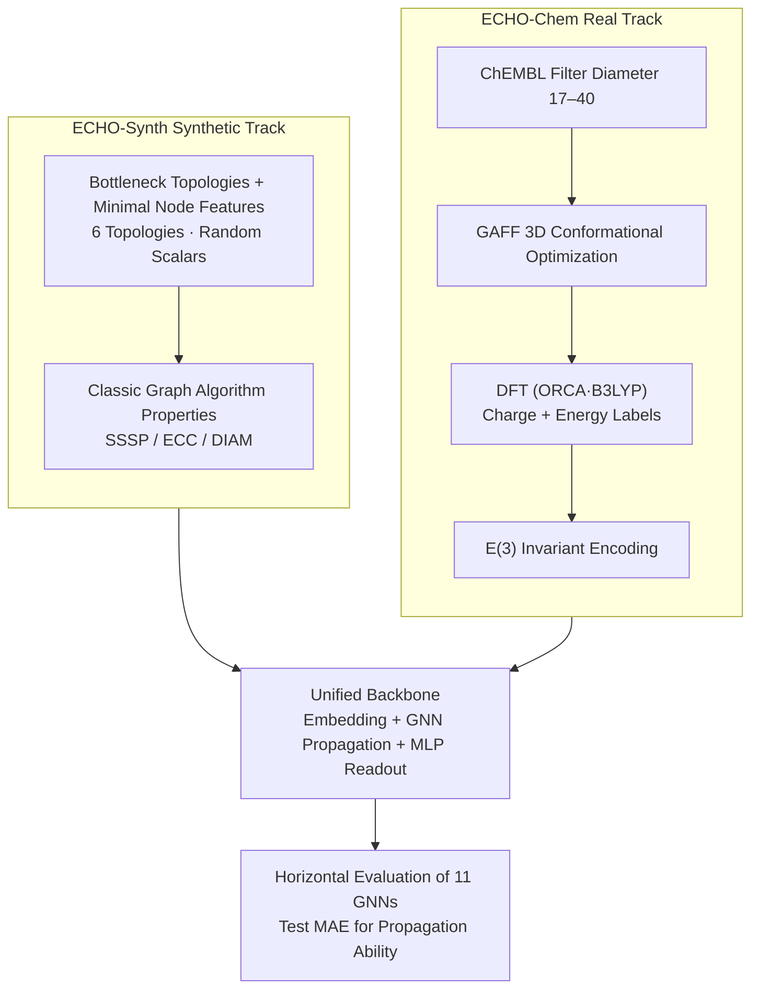

# Can You Hear Me Now? A Benchmark for Long-Range Graph Propagation and Beyond

**Conference**: ICLR 2026  
**arXiv**: [2512.17762](https://arxiv.org/abs/2512.17762)  
**Code**: [GitHub](https://github.com/Graph-ECHO-Benchmark/ECHO)  
**Area**: LLM Evaluation  
**Keywords**: long-range propagation, graph benchmark, over-squashing, graph transformers, molecular property prediction

## TL;DR

This paper proposes the ECHO benchmark, comprising 3 synthetic tasks and 2 real-world chemical tasks based on Density Functional Theory (DFT). It requires Graph Neural Networks to effectively propagate information across 17–40 hops, systematically evaluating the long-range propagation capabilities of 11 GNN architectures.

## Background & Motivation

**The Challenge of Long-Range Propagation in GNNs**: Capturing dependencies between distant nodes in a graph is a fundamental challenge in GNN research, closely related to phenomena such as oversmoothing, over-squashing, and vanishing gradients.

**Limitations of Prior Work**:
   - LRGB (Dwivedi et al., 2022) is the most widely used long-range benchmark, but performance has reached saturation, and some tasks have been proven to be inherently local rather than long-range.
   - Graph Property Prediction (Gravina et al., 2023) utilizes small graphs with limited diameters.
   - Existing benchmarks primarily target individual issues like oversmoothing or over-squashing without a comprehensive evaluation of long-range propagation.

**Requirements of Real-world Applications**: In molecular property prediction, atomic charge distribution and total molecular energy inherently depend on long-range quantum mechanical effects. However, existing benchmarks (ZINC, MoleculeNet) are predominantly short-range tasks.

**Model Maturity**: Driven by the maturity of architectures like Graph Transformers, multi-hop GNNs, and ODE-inspired GNNs, a more challenging benchmark is needed to distinguish their long-range propagation capabilities.

**Scientific Rigor of Evaluation**: There is a need for a clearly defined quantitative standard for "long-range" to ensure that tasks indeed require global information propagation.

## Method

### Overall Architecture

ECHO (Evaluating Communication over long HOps) is a benchmark suite specifically designed for long-range propagation. The Core Idea is to transform the question of whether a model can deliver information across scales of 17–40 hops into controllable and verifiable evaluation tasks. It consists of two tracks: ECHO-Synth is the synthetic track, which starts with six bottleneck topologies and minimal node features, then loads three property prediction tasks corresponding to classic graph algorithms (Single Source Shortest Path SSSP, Node Eccentricity ECC, Graph Diameter DIAM), totaling 10,080 graphs. ECHO-Chem is the real-world track, derived from the ChEMBL database. Through conformational optimization and Density Functional Theory (DFT) calculations, it provides two chemical tasks (Atomic Charge ECHO-Charge, Molecular Energy ECHO-Energy) for approximately 170K–196K molecular graphs. Both tracks feed into a unified backbone (embedding + GNN propagation layers + MLP readout), allowing a horizontal comparison of Test MAE across 11 GNNs to ensure that performance differences reflect the core propagation mechanisms.

### Key Designs

**1. Topologies and Features in ECHO-Synth: Forcing Over-squashing with Structural Bottlenecks and Blocking Shortcuts with Minimal Features**

The reason GNNs based solely on local message passing fail in long-range tasks is that distant information must be squeezed through narrow structural bottlenecks. This process compresses exponentially increasing information into low-dimensional node representations, causing over-squashing. ECHO-Synth creates six topologies with varying bottleneck intensities: line graphs for sequential propagation where every node is a critical bottleneck, with a 20% probability of adding residual edges to nodes 2–6 hops away to introduce non-local interactions; ladder graphs consisting of two parallel line graphs with transverse interconnections for redundant paths; grid graphs which are 2D grids with edges randomly removed (20%) to break regular pathways; trees using preferential attachment (probability proportional to $k_i^{\alpha}$, $\alpha=3$) to grow high-degree hubs where branch points are natural bottlenecks; and caterpillar/lobster graphs that add branches to a central spine to push bottlenecks deeper. Bottlenecks alone are insufficient—if nodes possess rich features, models might bypass propagation via feature similarity. Thus, node features are minimal: each node carries a single scalar $r \sim \mathcal{U}(0,1)$, with an additional binary flag for the source node in SSSP. Since features lack exploitable structural clues, success depends entirely on propagation over the graph structure.

**2. Selection of Graph Property Tasks: Anchoring a Verifiable "Long-range" Definition with Classic Graph Algorithms**

The three synthetic tasks are selected based on their increasing levels of dependence on global information: SSSP finds the shortest path from a source to all other nodes; ECC computes the longest shortest path for each node; DIAM computes the longest shortest path between any two nodes in the graph. These tasks correspond to classic algorithms like Bellman-Ford or Dijkstra, which require a full graph traversal to converge. Thus, the tasks contain an explicit, verifiable "long-range" definition—to succeed, the model must learn to simulate global traversal within its layers, preventing shortcuts through local substructure counting.

**3. DFT Construction Pipeline and E(3) Invariant Encoding for ECHO-Chem: Defining Long-Range Dependency via Physics**

In quantum mechanics, the charge redistribution of an atom and the total energy of a molecule inherently depend on long-range electron-nucleus and electron-electron interactions, providing a natural requirement for long-range propagation. The construction follows two steps: first, molecules with diameters between 17–40 are filtered from ChEMBL, and SMILES strings are converted to 3D conformations optimized using the GAFF force field (100 steps coarse minimization + 500 steps refinement). Second, ORCA quantum chemistry software is used for DFT calculations using the B3LYP functional (with TightSCF convergence) to obtain ground-truth labels. The average calculation time per molecule is 634.5 seconds, totaling about 2 months of parallel computation, ensuring label precision is sufficient to expose model charge errors at the $10^{-4}$ to $10^{-6}$ e magnitude. For encoding, nodes use atomic numbers and distances to the molecular centroid, while edges use bond types and lengths. This representation is invariant under the E(3) group (rotation, reflection, translation), ensuring the model learns intrinsic molecular geometry rather than incidental spatial orientation.

**4. Unified Backbone: Isolating Performance Differences to Propagation Mechanisms**

To fairly compare the long-range propagation capabilities of 11 architectures, auxiliary designs like readouts and embeddings must not bias the conclusions. ECHO places all models within the same scaffold: a linear embedding layer, a stack of the specific model's GNN propagation layers, and a task-specific readout. Node-level tasks (SSSP, ECC, Charge) use a 2-layer MLP on node representations. Graph-level tasks (DIAM, Energy) concatenate node representations via mean, max, and sum pooling before passing them through a 2-layer MLP. This ensures the core propagation mechanism is the only variable.

### Loss & Training

The regression target uses Mean Squared Error on a logarithmic scale: $\log_{10}(\text{MSE}(y_{\text{true}} - y_{\text{pred}}))$. This choice is made because values like atomic charges are very small, and the log scale amplifies the discriminative power for minor errors. The optimizer is Adam, with early stopping based on validation loss (patience of 50 epochs, maximum 1000 epochs). To ensure fairness, each model-dataset combination undergoes 100 trials of Bayesian optimization for hyperparameter searching, with the best configuration repeated across 4 random seeds.

## Key Experimental Results

### Main Results

Results for the three ECHO-Synth tasks (Test MAE, lower is better):

| Model | DIAM ↓ | ECC ↓ | SSSP ↓ |
|------|--------|-------|--------|
| **GRIT** | **1.014** | 5.091 | **0.121** |
| SWAN | 1.121 | 4.840 | 0.896 |
| A-DGN | 1.151 | 4.981 | 1.176 |
| **DRew** | 1.243 | **4.651** | 1.279 |
| GPS | 2.160 | 4.758 | 0.472 |
| GCN | 3.832 | 5.233 | 2.102 |
| GraphCON | 2.969 | 5.474 | 5.734 |

Results for the two ECHO-Chem chemical tasks (Test MAE, lower is better):

| Model | ECHO-Energy ↓ | ECHO-Charge (×10⁻³) ↓ |
|------|--------------|----------------------|
| **GPS** | **5.257** | 6.182 |
| DRew | 11.325 | 9.086 |
| A-DGN | 12.486 | 6.543 |
| **SWAN** | 12.629 | **6.109** |
| GCN | 28.112 | 8.421 |
| GIN | 47.851 | 10.784 |

### Ablation Study

Depth analysis (impact of layer/hop count on performance):

| Analysis Dimension | Conclusion |
|---------|------|
| Network Depth vs. Performance | Deeper networks consistently outperformed shallow ones, verifying the long-range nature of the tasks. |
| Graph Diameter vs. Performance | Errors were larger for high-diameter graphs, confirming the challenge of long-range propagation. |
| Readout Depth | Final performance was independent of readout depth; the bottleneck lies in the propagation layers. |
| Topology Variation | Relative model rankings remained consistent across different topologies. |
| GPS Attention Patterns | High attention scores were frequently assigned to distant, non-adjacent node pairs. |

### Key Findings

- **Global Attention is Key**: GRIT achieved an MAE of only 0.121 on SSSP, significantly better than GCN's 2.102, confirming that Transformer-style global attention mitigates the limitations of local message passing.
- **Effectiveness of Non-dissipative Dynamics**: Non-dissipative GNNs based on differential equations (e.g., A-DGN, SWAN) performed well, indicating that maintaining signal energy is crucial for long-range propagation.
- **Mitigating Oversmoothing is Insufficient**: GraphCON, designed specifically for oversmoothing, performed poorly on long-range tasks, proving that long-range propagation requires dedicated mechanisms beyond just preventing feature collapse.
- **Accuracy-Efficiency Trade-off**: GPS and other Transformers provide strong performance but are computationally expensive; A-DGN offers a better performance-cost ratio.
- **Practical Value of Chemical Tasks**: Even charge errors in the range of $10^{-4}$ to $10^{-6}$ e can impact downstream molecular modeling.

## Highlights & Insights

- **Rigor in Task Design**: Synthetic tasks directly correspond to classic graph algorithms (Dijkstra, Bellman-Ford), providing a clear physical definition of "long-range".
- **Complementary Perspectives**: Synthetic tasks provide controlled theoretical testing, while chemical tasks demonstrate the practical necessity of long-range propagation (DFT calculations took ~2 months).
- **Exposing LRGB Limitations**: The propagation range in ECHO (17–40 hops) far exceeds LRGB, and tasks cannot be solved by local substructure counting.
- **Fair Experimental Design**: All models share a unified backbone (embedding + GNN layers + MLP readout), isolating differences to the core propagation mechanism.
- **Bayesian Hyperparameter Search**: 100 trials per model-dataset pair provide more reliable results than random or manual searches.

## Limitations & Future Work

- The graph scale of synthetic tasks remains limited (approx. 30 to several hundred nodes); this could be scaled up further.
- Chemical tasks currently only utilize atomic numbers and distance features, lacking richer chemical descriptors (e.g., angles, dihedrals).
- There is a lack of evaluation for graph rewiring methods.
- Random node features in ECHO-Synth might be unfavorable to methods relying on feature similarity.
- Molecular graph construction does not account for non-covalent interactions (e.g., hydrogen bonds, van der Waals forces), potentially underestimating actual long-range dependencies.
- Future work could include more task types such as link prediction or graph generation for a comprehensive assessment.

## Related Work & Insights

- **Dwivedi et al. (2022)**: LRGB benchmark, widely used but saturated; ECHO significantly exceeds it in propagation range and task difficulty.
- **Gravina et al. (2023)**: GPP dataset, uses small graphs and short distances; ECHO uses larger diameters and diverse topologies.
- **Alon & Yahav (2021)**: Theoretical analysis of over-squashing; ECHO provides an empirical validation platform.
- **Rampášek et al. (2022)**: GPS Graph Transformer; experiments confirm its advantages in long-range chemical tasks.
- **Mechanism Insight**: The construction logic of ECHO-Chem can be extended to other scientific domains requiring long-range modeling, such as protein interactions or crystalline materials.

## Rating

- **Novelty**: ⭐⭐⭐⭐ First comprehensive benchmark to explicitly quantify long-range propagation (17–40 hops) with scientific value in chemical tasks.
- **Experimental Thoroughness**: ⭐⭐⭐⭐⭐ Very comprehensive, covering 11 models, 5 tasks, Bayesian hyperparameter search, and multiple analysis dimensions.
- **Writing Quality**: ⭐⭐⭐⭐ Well-justified motivation and clear comparisons with existing benchmarks, though some sections are verbose.
- **Value**: ⭐⭐⭐⭐⭐ Provides a much-needed standardized evaluation platform for GNN long-range propagation research with prospects in AI for Science.

<!-- RELATED:START -->

## Related Papers

- [\[ICLR 2026\] Beyond a Million Tokens: Benchmarking and Enhancing Long-Term Memory in LLMs](beyond_a_million_tokens_benchmarking_and_enhancing_long-term_memory_in_llms.md)
- [\[ICML 2026\] Beyond Trajectory-Level Attribution: Graph-Based Credit Assignment for Agentic Reinforcement Learning](../../ICML2026/llm_evaluation/beyond_trajectory-level_attribution_graph-based_credit_assignment_for_agentic_re.md)
- [\[NeurIPS 2025\] BLINK-Twice: You See But Do You Observe? A Reasoning Benchmark on Visual Perception](../../NeurIPS2025/llm_evaluation/blink-twice_you_see_but_do_you_observe_a_reasoning_benchmark_on_visual_perceptio.md)
- [\[ICLR 2026\] RedacBench: Can AI Erase Your Secrets?](redacbench_can_ai_erase_your_secrets.md)
- [\[ICLR 2026\] LFQA-E: Carefully Benchmarking Long-form QA Evaluation](lfqa-e_carefully_benchmarking_long-form_qa_evaluation.md)

<!-- RELATED:END -->
