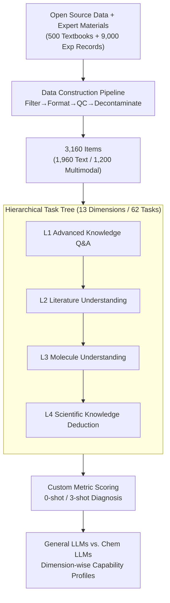

# ChemEval: A Multi-level and Fine-grained Chemical Capability Evaluation for Large Language Models

**Conference**: ICLR 2026  
**OpenReview**: [https://openreview.net/forum?id=JrqjSkEPrX](https://openreview.net/forum?id=JrqjSkEPrX)  
**Code**: https://github.com/USTC-StarTeam/ChemEval  
**Area**: LLM Evaluation / AI for Chemistry / Multimodal  
**Keywords**: Chemistry Evaluation, Hierarchical Benchmark, Domain LLM, Multimodal Chemistry, Fine-grained Diagnosis

## TL;DR
ChemEval decomposes LLM chemical capabilities into a four-level hierarchy (Concept → Literature → Molecule → Reasoning), spanning 13 dimensions and 62 tasks (including text and multimodal). Using 3,160 expert-curated questions for fine-grained diagnosis, it reveals that general-purpose models excel at literature comprehension but struggle with deep chemical reasoning, while chemical-specific models understand terminology but almost entirely lose instruction-following capabilities.

## Background & Motivation

**Background**: Following the entry of LLMs into the chemical domain, both general-purpose LLMs (GPT-4o, Qwen, DeepSeek) and specialized fine-tuned chemical models (ChemDFM, ChemLLM, LlaSMol, ChemSpark) have been applied to chemistry tasks. Evaluating their actual performance requires a reliable benchmark.

**Limitations of Prior Work**: General benchmarks (MMLU, XieZhi) rarely touch deep chemical knowledge; scientific benchmarks like SciEval contain overly simplistic chemistry tasks; chemical-specific benchmarks such as ChemLLMbench feature only 8 task types with unverified data. ChemBench includes 7,000 questions but relies solely on multiple-choice formats, lacks open-ended tasks, and provides no suitable metrics for experimental design tasks like synthetic pathways. MaCBench introduces multimodality but suffers from limited task diversity. Critically, few benchmarks evaluate the ability to extract chemical information from text and tables—a core requirement for chemical researchers.

**Key Challenge**: Existing evaluations are either broad but shallow in chemistry, or specialized but limited in task format (mostly multiple-choice) and data sources (relying on public datasets). Neither can answer where a model’s strengths and weaknesses lie across the entire chemical research workflow.

**Goal**: To construct a hierarchical, fine-grained evaluation framework covering the actual needs of chemical research. This includes difficulty gradients from basic concepts to graduate-level reasoning, integration of text and multimodality (molecular structures, spectra), and high-quality, expert-customized data to prevent leakage.

**Key Insight**: Tasks are designed from the perspective of a chemical researcher rather than an NLP researcher—organizing competency dimensions according to the natural hierarchy of chemical cognition (concepts → literature → molecules → reaction reasoning) and intentionally introducing ignored tasks such as information extraction and inductive generation.

**Core Idea**: A hierarchical task tree of "4 levels × 13 dimensions × 62 tasks" combined with an expert-authored, strictly decontaminated data pipeline provides a holistic "diagnostic report" of LLM chemical capabilities.

## Method

### Overall Architecture
ChemEval is an evaluation system centered on a **hierarchical task tree** and a **data construction pipeline**. The task tree divides chemical capabilities into four progressive levels based on cognitive difficulty, with 13 dimensions and 62 specific tasks. The data pipeline processes crawled open-source data and expert-authored materials through filtering, formatting, three-stage quality control, and decontamination, resulting in 3,160 high-quality items. Each item includes zero-shot and 3-shot instructions, scored using task-specific metrics (F1, Accuracy, BLEU, Tanimoto, NRMSE, LLM Score, etc.).

The four levels of the task tree are: ① **Advanced Knowledge Q&A** (basic concepts and calculations, 15 tasks) → ② **Literature Understanding** (extracting and summarizing info from text and tables, 19 tasks) → ③ **Molecule Understanding** (recognition, translation, property prediction, 15 tasks) → ④ **Scientific Knowledge Deduction** (reaction reasoning, retrosynthesis, mechanism analysis, 13 tasks). The hierarchy is progressive: later levels depend on the capabilities of previous levels.

### Key Designs

**1. Four-level Progressive Hierarchical Task Tree: Decomposing "Chemical Capability" into a Cognitive Ladder**
Previous benchmarks either used flattened multiple-choice questions or covered few task types, leading to vague conclusions about model performance. ChemEval organizes capabilities into four **interdependent** levels: Advanced Knowledge Q&A (L1: concepts/calculation), Literature Understanding (L2: extraction/summarization from text/tables), Molecule Understanding (L3: formula conversion, property prediction, structure interpretation), and Scientific Knowledge Deduction (L4: retrosynthesis, conditions, mechanisms). This hierarchy ensures that if a model performs well on L1/L2 but fails L3/L4, it is diagnosed as "capable of reading but incapable of reasoning." 37 of the 62 tasks are newly designed by experts to fill gaps like information extraction.

**2. Text + Multimodal Dual-Track Tasks: Categorical Evaluation of Cross-Modal Alignment**
Chemical information is naturally multimodal (structures, spectra, tables). ChemEval includes 1,960 text-only items and 1,200 multimodal items (covering formula recognition, spectral analysis, etc.). A key design is that several core tasks appear in **both** text and multimodal forms. This allows direct comparison of a model's performance given a text description versus a structural image, explicitly quantifying the cross-modal alignment capability of vision-language models. It distinguishes whether a model "understands" a molecule or has simply memorized its text description.

**3. Expert-Led, Strictly Decontaminated Data Pipeline: Ensuring Research Relevance and Anti-Leakage**
To avoid inflated scores from training data overlap, ChemEval's pipeline heavily involves chemistry experts. In the **Collection** phase, data is crawled from academic sites and manually compiled from ~500 textbooks and ~9,000 real experimental records. During **Filtering & Formatting**, ~200 items (2%) are removed for ambiguity or obsolescence. In **QC & Decontamination**, a three-tier pipeline (undergraduate annotation → graduate cross-verification → faculty final audit) ensures factual accuracy. To prevent leakage, textbook exercises are not copied; instead, experts **rewrite** new questions targeting the same knowledge dimensions, eliminating the possibility of memorization-based scoring.

### Loss & Training
ChemEval is an evaluation benchmark and does not involve model training. Key evaluation settings include: all LLMs use greedy decoding; general-purpose models are accessed via APIs; specialized chemical models are run locally on two A40 48GB GPUs. Each task includes zero-shot and 3-shot instructions (except for long-context tasks like abstract generation). Metrics are task-specific: F1/Accuracy for most, Tanimoto similarity/L2/Exact Match for molecular tasks, NRMSE for regression, and BLEU/Overlap/LLM Score (via GPT-4o) for open-ended generation.

## Key Experimental Results

### Main Results
0-shot performance on 13 representative text tasks (selected, metrics vary by task; ↑ higher is better, NRMSE lower is better):

| Level/Task | Metric | Gemini-2.5-Pro | DeepSeek-R1 | OpenAI-o1 | GPT-4o | ChemSpark | ChemDFM | ChemLLM |
|-----------|------|------|------|------|------|------|------|------|
| L1 MCTask | Accuracy | 87.6 | 82.4 | 74.0 | 66.8 | 43.6 | 41.2 | 24.4 |
| L1 CalcTask | LLM Score | 82.4 | 76.1 | 78.0 | 61.8 | 18.5 | 14.7 | 15.9 |
| L2 ProdE | Accuracy | 92.8 | 91.2 | 90.3 | 86.1 | 94.4 | 34.7 | 0.0 |
| L3 MolNG | Tanimoto | 71.1 | 56.1 | 49.8 | 39.3 | 74.8 | 47.1 | 0.0 |
| L4 IMDer | LLM Score | 82.3 | 79.5 | 80.0 | 81.5 | 92.8 | 76.0 | 4.8 |
| L4 RRec | F1 | 0.7 | 21.9 | 25.6 | 15.8 | 63.7 | 13.1 | 0.0 |

Two main trends emerge: **General reasoning models** (Gemini-2.5-Pro, DeepSeek-R1, OpenAI-o1) lead in concepts and literature understanding but drop significantly in "hard" chemistry tasks like molecule translation. **ChemSpark** (Spark-Chemistry-X1-13B) outperforms all general models in professional tasks (generation, mechanism, conditions), but other chemical models (ChemLLM, LlaSMol) almost fail general tasks (ChemLLM F1 scores of 0.0), revealing catastrophic forgetting from fine-tuning.

### Ablation Study
Changes in 3-shot vs. 0-shot performance (Selected models; bracketed values indicate task counts for [Significant increase / No change / Significant decrease]):

| Model | Net Effect (↑, ˜, ↓) | Typical Representation |
|------|------|------|
| OpenAI-o1 | (9, 0, 1) | Almost universal few-shot improvement |
| GPT-4o / Qwen2.5-72B | (7, 0, 3) | Most tasks benefit |
| Gemini-2.5-Pro | (6, 1, 3) | Benefit, though some subjective scores drop |
| Llama3.3-8B | (5, 0, 5) | Balanced gains and losses |
| ChemDFM | (4, 0, 6) | Worse performance with few-shot |
| ChemLLM | (1, 6, 3) | Mostly unresponsive |

### Key Findings
- **General vs. Specialized Models are Complementary**: General LLMs excel at document understanding and reasoning; specialized models excel at terminology and molecular properties. Neither currently balances "language proficiency" and "chemical expertise," indicating a need for hybrid training.
- **Instruction Following is the Achilles' Heel of Specialized Models**: Without strict output constraints, ChemLLM and LlaSMol revert to patterns in their fine-tuning data, often resulting in 0.0 F1 scores. This defect severely limits their practical value despite their domain knowledge.
- **Few-shot Gains Correlate with Reasoning Ability**: Strong reasoning models (o1) consistently benefit from examples, while specialized models (ChemDFM, ChemLLM) show little to no few-shot dividend, confirming weak in-context learning.
- **"Over-caution" in Complex Quantitative Tasks**: Models often avoid answering quantitative molecular tasks, citing the need for software like Gaussian/ORCA. While scientifically "safe," this reduces practical utility.

## Highlights & Insights
- **Hierarchical Cognition**: Decomposing "chemical capability" into dependent cognitive steps rather than a flat set of tasks allows for specific pinpointing of where a model "gets stuck."
- **Dual-Track Modality**: Presenting the same core tasks in both text and multimodal formats is a clever design to isolate "linguistic memory" from "true cross-modal understanding."
- **Expert Redesign for Anti-Leakage**: Experts rewriting questions based on textbooks—rather than copying them—combined with cross-referencing against open-source training data, effectively addresses the persistent issue of benchmark contamination.
- **Symmetry of Conclusions**: General models "can read but not do," while specialized models "can do but not listen." This clearly defines the goal for the next generation of chemical models: unification.

## Limitations & Future Work
- **Dependency on LLM Score**: Many open-ended tasks rely on GPT-4o as a judge. Bias and knowledge gaps in the judge model may introduce systematic errors.
- **Limited Multi-modal Coverage**: Multimodal tests were restricted to a few MLLMs (GPT-4o, Claude-3.7, Qwen-VL Max, Phi-Vision-3.5), limiting the universality of findings.
- **Gap with Real Research**: Tasks remain discrete Q&A formats; there is a gap between these and an "end-to-end chemical research project." Long-context chemical capabilities were also not fully explored.
- **Future Directions**: Introducing multi-judge systems, expanding multimodal spectral tasks, and incorporating interactive, multi-turn real-world research workflows.

## Related Work & Insights
- **vs. ChemLLMbench**: ChemLLMbench has only 8 tasks with unverified data; ChemEval provides 62 tasks and 13 dimensions with three-tier quality control.
- **vs. ChemBench**: ChemBench relies on multiple-choice; ChemEval adds information extraction, inductive generation, and retrosynthesis with custom metrics.
- **vs. MaCBench**: ChemEval uses a dual-track approach to explicitly evaluate cross-modal alignment, which MaCBench lacks despite its multimodal focus.
- **vs. SciEval**: ChemEval focuses specifically on chemistry, reaching graduate-level reaction reasoning where SciEval remains relatively basic.

## Rating
- Novelty: ⭐⭐⭐⭐ Hierarchical task tree + dual-track modality + expert anti-leakage pipeline.
- Experimental Thoroughness: ⭐⭐⭐⭐⭐ Covers 10+ models, 0-shot/3-shot, text/multimodality, and fine-grained diagnosis.
- Writing Quality: ⭐⭐⭐⭐ Clear structure and motivation, though some complex tables require careful cross-referencing.
- Value: ⭐⭐⭐⭐⭐ A foundation-level work for the training and evaluation of chemical LLMs.

<!-- RELATED:START -->

## Related Papers

- [\[ICLR 2026\] Reliable Fine-Grained Evaluation of Natural Language Math Proofs](reliable_fine-grained_evaluation_of_natural_language_math_proofs.md)
- [\[ICLR 2026\] Multi-turn Evaluation of Anthropomorphic Behaviours in Large Language Models](multi-turn_evaluation_of_anthropomorphic_behaviours_in_large_language_models.md)
- [\[ICLR 2026\] FRABench and UFEval: Unified Fine-grained Evaluation with Task and Aspect Generalization](frabench_and_ufeval_unified_fine-grained_evaluation_with_task_and_aspect_general.md)
- [\[ICLR 2026\] RefineBench: Evaluating Refinement Capability of Language Models via Checklists](refinebench_evaluating_refinement_capability_of_language_models_via_checklists.md)
- [\[ICLR 2026\] SparseEval: Efficient Evaluation of Large Language Models by Sparse Optimization](sparseeval_efficient_evaluation_of_large_language_models_by_sparse_optimization.md)

<!-- RELATED:END -->
