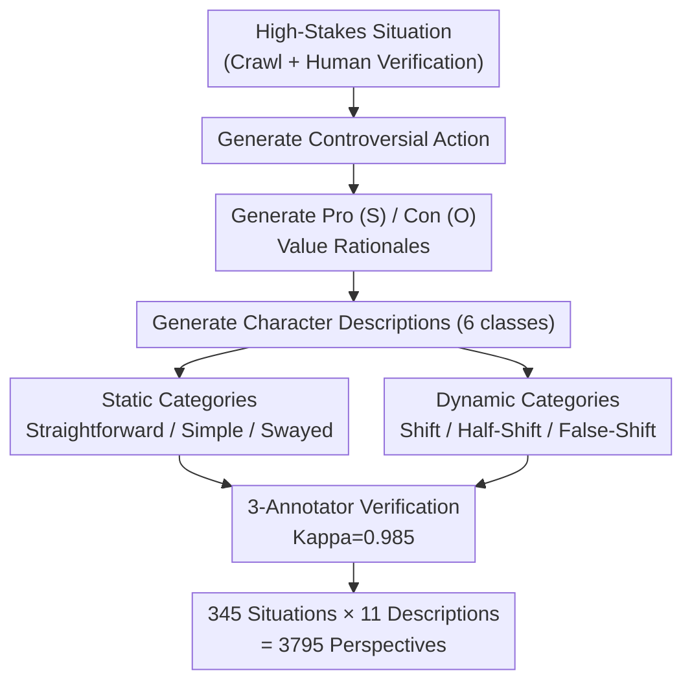

# CLASH: Evaluating Language Models on Judging High-Stakes Dilemmas from Multiple Perspectives

**Conference**: ICLR2026  
**OpenReview**: [https://openreview.net/forum?id=WdpslG6ro5](https://openreview.net/forum?id=WdpslG6ro5)  
**Dataset**: https://huggingface.co/datasets/launch/CLASH  
**Code**: TBD  
**Area**: LLM Evaluation / Value Reasoning / High-Stakes Dilemma Benchmark  
**Keywords**: Value Dilemmas, Moral Reasoning, Ambivalence, Value Shift, Steerability

## TL;DR
CLASH is an evaluation benchmark consisting of 345 human-written high-stakes value dilemmas and 3795 character perspectives. It specifically tests whether language models can judge whether a controversial action should be taken from different perspectives. It systematically examines model understanding of **ambivalence, psychological discomfort, and value shift** over time. Results indicate that even top-tier models like GPT-5 and Claude-4-Sonnet only achieve accuracies of 24.06% and 51.01% in judging ambivalence.

## Background & Motivation
**Background**: As large models are deployed in value-sensitive high-stakes scenarios such as medicine, law, and finance, the ability of models to understand diverse values and make context-appropriate judgments has become a core problem. Existing moral judgment datasets (e.g., ETHICS, Social Chemistry, DailyDilemmas) mostly focus on daily trifles, with scenarios described in only one or two sentences. These are often either collected through crowdsourcing of trivial situations or synthesized by LLMs, lacking the depth of real-world high-stakes conflicts.

**Limitations of Prior Work**: The authors identify three gaps: (1) **Focus on low-stakes dilemmas**, with no testing on severe consequences like life-or-death decisions or bankruptcy; (2) **Compressing values into metadata or demographic labels** (gender, ethnicity) rather than "contextualizing" values through narrative, which fails to capture real human expressions of values; (3) **Sole focus on the final decision**, completely ignoring three dimensions inherent in the decision-making process: ambivalence between options, psychological discomfort during difficult choices, and value shifts over time.

**Key Challenge**: Existing work often restricts models to binary "yes/no" judgments or conflates "ambivalence" with scenario complexity or annotator disagreement. However, real-world high-stakes decisions involve **competing values that are simultaneously valid but in conflict**. In such cases, a definitive answer may be misleading or lead to irreversible consequences.

**Goal**: Construct a benchmark that is verifiably evaluable even when "no unique correct answer" exists, decomposed into four sub-problems: Can the model identify ambivalence? Can it perceive psychological discomfort? Can it react to value shifts? And how can steerability toward a specific value be measured?

**Key Insight**: The authors draw from philosophy and cognitive science—ambivalence stems from "indecision" caused by competing values (van Delft), psychological discomfort corresponds to cognitive dissonance theory (Festinger), and value shift simulates the human process of revising values over time. These are real-world phenomena that have never been benchmarked.

**Core Idea**: Utilize long-form, human-written high-stakes dilemmas + 11 carefully designed character perspectives to extend "value judgment" from single-point accuracy to "understanding decision complexity." The authors introduce the concept of **conditional steerability** to measure the degree to which a model can be guided toward one value when two are in conflict.

## Method
CLASH is essentially an evaluation benchmark, so the "method" focuses on dataset construction and evaluation design. Its sophistication lies not in a specific model, but in a **character description taxonomy** that translates abstract concepts (ambivalence/discomfort/shift) into verifiable questions with definite ground truths.

### Overall Architecture
Each data entry in CLASH consists of four components: **situation, action, value-related rationales, and character descriptions**. Situations are real-world high-stakes dilemmas crawled from the web (e.g., organ transplant allocation, bank errors). The action is the controversial behavior within that dilemma. Rationales include arguments for (S) or against (O) the action. Character descriptions embed these rationales into personas named "Character A" (gender and ethnicity are removed to avoid bias).

During evaluation, the model reads a character description and answers from **that character's perspective**: "Is this action acceptable?" (Yes/No/Ambiguous) and "Would the character feel psychological discomfort?" (Yes/No). The dataset comprises 345 situations × 11 character descriptions = 3795 perspectives.

The character descriptions are divided into **two meta-categories and six sub-categories**, each corresponding to a set of predefined "correct answers":

### Key Designs

**1. Six-Category System: Encoding "Ambivalence" and "Value Shift" into Definite Answers**

This is the core of CLASH. It addresses the pain point that "understanding hesitation" is typically difficult to score. The authors split character descriptions into **Static (unchanging values) and Dynamic (changing values)**, with three sub-categories each. The relative strength of S/O rationales determines the ground truth:

- **Static Categories**: `Straightforward` (one rationale clearly dominates, S>O, resulting in a clear Yes/No, no discomfort); `Simple Contrast` (two rationales are equally strong, S=O, the correct answer is Ambiguous, discomfort not evaluated); `Swayed Contrast` (both rationales acknowledged but one prioritized, resulting in a clear Yes/No **accompanied by psychological discomfort**).
- **Dynamic Categories**: `Shift` (values reverse, answers for "before" and "now" are opposite); `Half-Shift` (a previously preferred rationale becomes equalized, "now" answer becomes Ambiguous); `False-Shift` (character context challenges values but they hold firm, "before/now" answers are identical).

Static categories are asked about acceptability and discomfort; dynamic categories are asked about acceptability relative to **Before/Now** value preferences. 

**2. Three Unexplored Evaluation Dimensions: Ambivalence, Discomfort, Value Shift**

Standard value benchmarks only ask "what is right." CLASH uses the category system to isolate three dimensions. **Ambivalence** uses Simple/Swayed Contrast to check if models mistakenly give Ambiguous answers when they should say Yes/No, or vice versa. **Psychological discomfort** leverages cognitive dissonance: `Straightforward` characters answer "No discomfort" due to extreme stance, while `Swayed Contrast` characters answer "Yes" because they acknowledge both sides. **Value Shift** uses Half-Shift/False-Shift; answering "before" is easier than "now," so the drop in performance on "now" questions quantifies the gap in understanding dynamic values.

**3. Conditional Steerability: Measuring Guidance under Value Conflict**

Previous "steerability" studies only measured **absolute steerability**—pushing a model toward a single "good" value without considering conflict. Real dilemmas involve clashing values. The authors map situational rationales to 301 intermediate values from DailyDilemmas (e.g., Justice, Autonomy), then to four frameworks (WVS, Moral Foundations, Maslow, Aristotle), resulting in competing value pairs (e.g., Safety vs. Self-Esteem).

For each pair, three preferences are measured: (i) **Baseline preference** without description; (ii) preference after being pushed toward Safety using `Swayed Contrast`; (iii) preference after being pushed toward Self-Esteem. Scores are normalized (Yes/No/Ambiguous = 1/0/0.5). Steerability toward Safety is defined by the difference between (ii) and (i) relative to potential gain. This allows for the quantification of steerability under conflicting constraints.

**4. Reasoning Chain Analysis (Cognitive Behavior & Ethical Theory)**

The authors analyze the Chain-of-Thought (CoT) of reasoning models (RLM). They track four cognitive behaviors: backward chaining, verification, backtracking, and sub-goaling. They find that **backward chaining and verification, effective in math/games, often appear in failed value reasoning chains**. They also identify failure modes: **early commitment** (rushing to a side) and **overcommitment** (holding that side stubbornly). Analyzing ethical theories (Care, Deontology, Pluralism, Pragmatism, Rights, Utilitarianism, Virtue), they find successful chains appeal more to **Pragmatism and Rights Ethics**.

## Key Experimental Results

### Main Results
Evaluation involved 5 non-reasoning families + 4 reasoning families (RLMs). Human accuracy on 50 random situations reached 92.8, far exceeding models.

| Category | Task | Best Model | Accuracy | Random Baseline |
|------|------|---------|--------|---------|
| Overall | Total | Claude-4-Sonnet | 88.89 | — |
| Simple Contrast | Ambivalence | Mistral-123B | 62.90 | 0.33 |
| Swayed Contrast | Ambivalence | Claude-4-Sonnet | 51.01 | 0.33 |
| Straightforward | Discomfort | GPT-4o | 96.50 | 0.50 |
| Swayed (discomfort) | Discomfort | GPT-5 | 98.61 | 0.50 |
| Value Shift ∆ | Before→Now Drop | GPT-4o-mini (Max) | −66.43 | — |

Notably, while **GPT-5 has high overall accuracy (86.14), its score on Simple Contrast (Ambivalence) is only 24.06**.

### Key Findings

| Finding | Evidence |
|------|------|
| RLMs generally outperform LLMs | Reasoning models perform consistently better within same families; RLM avg output 674.5 tokens vs. LLM 142.8. |
| RLMs struggle more with ambivalence | Reasoning modes typically drop points on Ambivalent scenarios, with Claude-4-Sonnet being the exception. |
| Value Shift causes performance drops | All models show significant declines on "Now" questions (Wilcoxon p<0.0001), with an average drop of 42.95. |
| Stronger baseline preferences are harder to steer | Significant negative correlation between baseline preference and steerability (r=−0.243). |
| Perspectival framing affects steerability | 3rd person is generally easier to steer, though Safety values are more effective in 1st person. |

## Highlights & Insights
- **Verifiable Benchmark for "No Standard Answer" Tasks**: By mapping rationale strength to categories and then to answers, CLASH enables objective scoring for dilemmas without a single correct decision.
- **Novel Dimensions as a Major Contribution**: Ambivalence, discomfort, and value shift are daily realities of human decision-making that were previously un-benchmarked. CLASH reveals top models fail in identifying "when to hesitate."
- **Counter-intuitive CoT Findings**: Conventional "good habits" in mathematical reasoning (backward chaining/verification) do not transfer well to value reasoning and may even signify failure.
- **Conditional Steerability Framework**: Measuring steerability under conflict provides a more realistic assessment for alignment research compared to absolute steerability.

## Limitations & Future Work
- **Ethno-linguistic Bias**: Data is primarily in English and potentially Western-centric, though many situations are generally applicable.
- **GPT-4o Involvement in Construction**: The use of GPT-4o for drafting actions and rationales may introduce model-specific biases into the benchmark.
- **Mapping Chain Dependency**: The multi-level mapping from rationales to broad value frameworks might lose semantic nuance.
- **Future Directions**: Exploring how to guide models toward Pragmatic Ethics reasoning chains and expanding to cross-cultural, non-English dilemmas.

## Related Work & Insights
- **vs. DailyDilemmas / Scherrer et al.**: Previous benchmarks are low-stakes or use simplified descriptors. CLASH uses human-written, long-form narratives to capture subtle value interactions.
- **vs. ETHICS / Social Chemistry**: These feature short scenarios (often <3 sentences). Performance differences on CLASH show that long-context, high-stakes scenarios constitute a distinct task.
- **vs. Absolute Steerability (Dong et al., Rimsky et al.)**: Instead of measuring alignment toward a single value, CLASH introduces the tension of competing values.

## Rating
- Novelty: ⭐⭐⭐⭐⭐ First high-stakes benchmark for ambivalence/discomfort/value shift.
- Experimental Thoroughness: ⭐⭐⭐⭐⭐ Extensive comparison across 14 models plus cognitive/ethical CoT analysis.
- Writing Quality: ⭐⭐⭐⭐ Classification and mapping are clear, though steerability formulas are located in the appendix.
- Value: ⭐⭐⭐⭐⭐ Highlights systematic failure of top models in recognizing ambivalence, serving as a warning for high-stakes deployment.

<!-- RELATED:START -->

## Related Papers

- [\[ICLR 2026\] Cost-of-Pass: An Economic Framework for Evaluating Language Models](cost-of-pass_an_economic_framework_for_evaluating_language_models.md)
- [\[ACL 2026\] ScaleBox: Enabling High-Fidelity and Scalable Code Verification for Large Language Models](../../ACL2026/llm_evaluation/scalebox_enabling_high-fidelity_and_scalable_code_verification_for_large_languag.md)
- [\[ICLR 2026\] Evaluating Language Models' Evaluations of Games](evaluating_language_models_evaluations_of_games.md)
- [\[ICLR 2026\] PerSpectra: A Scalable and Configurable Pluralist Benchmark of Perspectives from Arguments](perspectra_a_scalable_and_configurable_pluralist_benchmark_of_perspectives_from_.md)
- [\[ICLR 2026\] RefineBench: Evaluating Refinement Capability of Language Models via Checklists](refinebench_evaluating_refinement_capability_of_language_models_via_checklists.md)

<!-- RELATED:END -->
