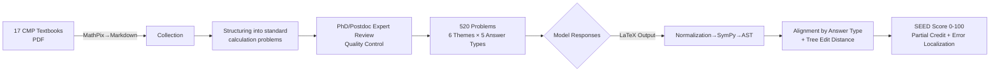

# CMPhysBench: A Benchmark for Evaluating Large Language Models in Condensed Matter Physics

**Conference**: ICLR 2026  
**OpenReview**: [https://openreview.net/forum?id=3d0FRYx0D0](https://openreview.net/forum?id=3d0FRYx0D0)  
**Code**: [https://github.com/CMPhysBench/CMPhysBench](https://github.com/CMPhysBench/CMPhysBench)  
**Area**: LLM Evaluation / Scientific Reasoning Benchmark  
**Keywords**: Condensed matter physics, calculation benchmark, SEED metric, expression edit distance, physical reasoning evaluation  

## TL;DR
The authors propose CMPhysBench—a benchmark of 520 graduate-level open-ended calculation problems in condensed matter physics. Accompanied by the tree-edit-distance-driven SEED metric for fine-grained partial scoring, it reveals that even the strongest Grok-4 achieves only 36 SEED / 29% accuracy, exposing a significant capability gap for LLMs in frontier physics.

## Background & Motivation
**Background**: LLMs have shown impressive performance in math olympiads, programming, and even scientific discovery. Physics is considered an ideal litmus test for verifying whether LLMs "truly understand the structure of the world" due to its rigorous trio of requirements: reasoning, mathematical precision, and conceptual understanding.

**Limitations of Prior Work**: Early physics benchmarks (SciQ, ScienceQA) remain at the high school level. Recent benchmarks like PHYBench and UGPhysics advance to undergraduate levels but still emphasize broad coverage over depth, **seriously underestimating frontier sub-fields of contemporary physical research.** Condensed Matter Physics (CMP), a mainstream of modern physics integrating quantum mechanics, statistical physics, solid-state physics, and many-body theory, is characterized by its interdisciplinary nature, data scarcity, and precise mathematical formulations, yet it has almost no dedicated benchmark coverage.

**Key Challenge**: Evaluation methods themselves are problematic—multiple-choice questions ignore intermediate reasoning; exact string matching (Accuracy) is too strict, penalizing near-correct answers (e.g., off by a single unit or constant) as completely wrong; and LLM LaTeX outputs are noisy with diverse answer formats, making existing metrics either unreliable or non-generalizable.

**Goal**: Build a benchmark deeply focused on CMP that emphasizes open-ended calculations and provides structured, fine-grained scoring to diagnose the true capabilities and failure modes of LLMs in frontier physics.

**Core Idea**: ① **Deeply specialized open-ended calculation benchmark**—520 graduate-level CMP calculation problems manually authored by PhDs and postdocs; ② **SEED metric**—maps various answer types to a unified Abstract Syntax Tree (AST) and provides non-binary partial scores using tree edit distance.

## Method

### Overall Architecture
CMPhysBench consists of three components: "Dataset + Data Construction Pipeline + SEED Metric." The data side employs a four-stage pipeline (Collection → Structuring → Quality Control → Annotation) to refine 520 calculation problems from 17 classic CMP textbooks, categorized by 6 themes and 5 answer types. The evaluation side normalizes model-generated LaTeX expressions into SymPy objects and then into ASTs. Based on the answer type, different alignment rules are applied to calculate the tree edit distance, outputting a continuous SEED score ranging from 0–100.

### Key Designs

**1. Graduate-level CMP Open-ended Calculation Set: Rejecting Multiple Choice**  
The 520 problems cover four core sub-fields: Magnetism (115), Superconductivity (55), Strongly Correlated Systems (15), and Semiconductors (115), plus two generalization dimensions: Theoretical Foundations (Crystallography, Plasmons, Phase Transitions, Condensed Matter Field Theory, 110 problems) and Others (Quantum Mechanics, Statistical Physics, Electrodynamics, Quantum Field Theory, 110 problems). Difficulty ranges from undergraduate exercises to advanced graduate challenges. All problems are **calculation-based** rather than multiple-choice/true-false, requiring models to produce complete solutions with intermediate steps, thereby testing both conceptual understanding and calculation precision. Experts further categorized problems into Tuple, Equation, Numeric, Expression, and Interval types (Numeric being the most frequent at ~65.6%).

**2. SEED Metric: Converting "Right/Wrong" into Tree Edit Distance Scores**  
SEED (Scalable Expression Edit Distance) inherits the core pipeline of EED but extends it in three ways. The scoring core involves parsing both the predicted and gold standard expressions into ASTs, calculating the tree edit distance $d$, and normalizing it by the total number of nodes $n$. Specifically, a perfect match scores 100, otherwise partial credit is given via $\text{SEED} = \max\!\big(0,\ 60 - 100 \cdot \tfrac{d}{n}\big)$. For instance, with 13 nodes and an edit distance of 1, $\text{SEED}=60-100/13\approx52$, while an edit distance of 9 would result in a normalized score of 0. This design, which grants partial credit for near-correct solutions but zeros out completely erroneous ones, aligns more closely with human expert judgment than binary matching.

**3. Type-Aware Answer Unification and Robust LaTeX Preprocessing**  
The scalability of SEED stems from two points. First, **Answer Type Unification**: Expressions are converted directly to ASTs; Equations move all terms to one side for comparison; Tuples average SEED scores across components; Intervals encode boundaries with symbolic representations; and Numeric types include unit conversion, scientific notation parsing, and rounding within tolerances. It natively supports matrices, vectors, and inequalities (normalized as $f(\cdot)\ \#\ 0,\ \#\in\{<,\le,>,\ge\}$ while maintaining semantics under sign changes). Second, **Robust Preprocessing**: Stripping `\boxed{}`, removing `\left`/`\right`, completing implicit multiplications (e.g., `2x`, `ab`), unifying Unicode symbols and font commands, discarding natural language noise like "Final Answer:", and auto-balancing brackets and fractions. This "type-agnostic AST + pluggable physics-aware normalization" makes SEED applicable not only to CMP but also to other STEM tasks.

## Key Experimental Results

### Main Results (Performance of 18 Models on CMPhysBench)

| Model Tier | Representative Model | SEED Score | Expert-labeled Accuracy |
|---|---|---|---|
| Leading Cluster | **Grok-4** | **36.0** | **28.9%** |
| Leading Cluster | o3 / Gemini 2.5 Pro | 30–35 | 23–29% |
| Middle Band | Most mainstream models | 23–28 | 16–20% |
| Instruction-tuned Open-source | Llama-3.x-70B-Instruct, etc. | 20–22 | 14–15% |
| Distilled/Small Models | R1-Distill-Qwen-32B, etc. | 15–17 | 10–12% |

Even the strongest models achieve only 36 SEED / 29% accuracy, indicating that condensed matter physics remains a significant capability gap for current LLMs.

### Sub-domains and Metric Comparison

| Dimension | Key Findings |
|---|---|
| Sub-domain Peaks | Grok-4 leads in Magnetism (35.30), Superconductivity (43.42), and Theory (41.21); o3 is strongest in Others (46.42); DeepSeek-R1 leads in Strongly Correlated Systems (42.16). |
| Strengths Non-transferable | Grok-4 is strong in Superconductivity/Theory but weak in Strongly Correlated Systems; Qwen3-32B is decent in Theory (35.47) but scores only 8.47 in Magnetism. |
| Human Correlation | **SEED ρ=0.90** > EED / GPT-4o(0.56) / xVerify(0.51) / OlympiadBench-Rule(0.41). |

### Error Analysis (GPT-4o Automated Attribution, 98% Consistent with Experts)

| Error Type | Percentage & Examples |
|---|---|
| Concept & Model Misuse | Most dominant: GPT-4o 66.5% / DeepSeek-V3 56.3% / Claude 3.7 Thinking 51.6%. |
| Math or Logic Error | 20–30%: o4-mini 31.0% / o3 29.4%. |
| Task Understanding Error | Higher in instruction-tuned models: QwQ-32B 27.0% / Qwen3-32B 24.2%; Gemini 2.5 Pro only 7.5%. |
| Unit/Dimensional Error | Rare (<2%). |

### Key Findings
- **Reasoning models are not necessarily stronger**: Long-CoT models do not consistently outperform general models on difficult CMP problems—these problems require domain knowledge, and more "thinking" can increase the chance of intermediate errors propagating to the final answer.
- **SEED is systematically 5~9 points higher than strict Accuracy**: Many "near-correct" solutions (errors in units, constants, or boundary conditions) are penalized as completely wrong by exact matching; SEED provides partial credit that better reflects true capability.
- **Significant gap between mathematical and physical reasoning**: The high proportion of concept/model misuse indicates that the bottleneck lies in the correct application of physical principles rather than pure symbolic computation.

## Highlights & Insights
- **Filling the gap in frontier sub-fields**: This is the first benchmark focused deeply on CMP, with graduate-level calculation problems manually authored by experts, far exceeding the difficulty and professionalism of existing physics benchmarks.
- **Metric as a contribution**: SEED uses "AST + Tree Edit Distance + Physics-aware Normalization" to upgrade evaluation from binary correctness to interpretable continuous partial credit. Its $\rho=0.90$ correlation significantly outperforms GPT-4o judges and rule-based matching, providing a general methodology for evaluating scientific reasoning.
- **Diagnosable and Falsifiable**: Eight error attribution categories and sub-domain radar charts decompose "poor model performance" into specific failure modes. It posits testable hypotheses, such as "fine-tuning reduces conceptual misuse while mathematical logic errors persist," turning the benchmark into a research platform.

## Limitations & Future Work
- **Relatively limited scale**: 520 problems are still few for covering the entire CMP field; for example, Strongly Correlated Systems has only 15 problems. Uneven distribution across sub-domains may affect statistical robustness.
- **Error attribution depends on GPT-4o**: While 98% consistent with experts, Grok-4 was excluded from analysis because it does not output intermediate chains, making attribution dependent on "visible chains of thought."
- **Boundaries of physical equivalence in SEED**: Tree edit distance is sensitive to structural equivalence but may still misjudge deep physical equivalent transformations (e.g., equivalent solutions in different coordinate systems or gauges). Stronger symbolic equivalence engines are needed.
- **Static benchmark contamination and timeliness**: As models iterate, public datasets risk contamination by training data, necessitating continuous expansion and dynamic updates.

## Related Work & Insights
- **General Science Benchmarks** (SciQ, ScienceQA, ARC, SciBench, SciEval): Broad coverage but difficulty is mostly K-12/introductory college level, and they favor multiple-choice, making it hard to detect deep reasoning.
- **Advanced Physics Benchmarks** (UGPhysics, GPQA, SuperGPQA, PHYSICS, PHYBench, PhysReason): Introduced undergraduate to graduate difficulty and step/expression-aware scoring, but still prioritize breadth over depth in specific sub-fields.
- **Insights**: The "narrow but deep + structured partial credit metric" paradigm of CMPhysBench can be transferred to evaluating other highly specialized STEM sub-fields. The AST tree edit distance approach in SEED also provides a reusable evaluation component for tasks requiring symbolic equivalence like math or chemistry.

## Rating
- **Novelty**: ⭐⭐⭐⭐ — First graduate-level calculation benchmark focused on CMP. SEED metric introduces tree edit distance into physics evaluation with physics-aware extensions, showing innovation in both concept and method.
- **Experimental Thoroughness**: ⭐⭐⭐⭐ — Comprehensive coverage with 18 models, 6 sub-domains, 5 answer types, 5 metric comparisons, and 8 error attribution categories.
- **Writing Quality**: ⭐⭐⭐⭐ — Clearly structured with effective visualizations (SEED workflow, error types, radar charts).
- **Value**: ⭐⭐⭐⭐ — Reveals the true gap of LLMs in frontier physics and provides a falsifiable research platform and transferable evaluation methodology, highly valuable to the scientific reasoning evaluation community.

<!-- RELATED:START -->

## Related Papers

- [\[ICLR 2026\] CMT-Benchmark: A Benchmark for Condensed Matter Theory Built by Expert Researchers](cmt-benchmark_a_benchmark_for_condensed_matter_theory_built_by_expert_researcher.md)
- [\[ICLR 2026\] PRISM-Physics: Causal DAG-Based Process Evaluation for Physics Reasoning](prism-physics_causal_dag-based_process_evaluation_for_physics_reasoning.md)
- [\[ICLR 2026\] Evaluating Language Models' Evaluations of Games](evaluating_language_models_evaluations_of_games.md)
- [\[ICLR 2026\] Prompt and Parameter Co-Optimization for Large Language Models](prompt_and_parameter_co-optimization_for_large_language_models.md)
- [\[ICLR 2026\] RefineBench: Evaluating Refinement Capability of Language Models via Checklists](refinebench_evaluating_refinement_capability_of_language_models_via_checklists.md)

<!-- RELATED:END -->
