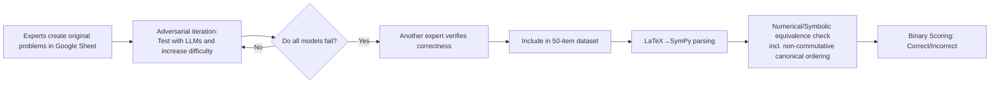

# CMT-Benchmark: A Benchmark for Condensed Matter Theory Built by Expert Researchers

**Conference**: ICLR 2026  
**OpenReview**: [https://openreview.net/forum?id=pX6B28ynNh](https://openreview.net/forum?id=pX6B28ynNh)  
**Code**: Hugging Face dataset is public; machine scoring code is promised for subsequent release  
**Area**: LLM Evaluation / Scientific Reasoning Benchmarks  
**Keywords**: Scientific Benchmarks, Condensed Matter Physics, LLM Reasoning, Automatic Scoring, Non-commutative Operators, AI Research Assistant  

## TL;DR
Global condensed matter theory experts manually curated CMT-Benchmark, a set of 50 research-level physics problems. Using an automated scoring pipeline capable of handling non-commutative operator algebra, 17 frontier LLMs were tested—resulting in the strongest model, GPT-5, scoring only 30% with an overall average of 11.4%, debunking the illusion of LLMs as research assistants.

## Background & Motivation
**Background**: Large language models have achieved gold medals in programming and mathematics olympiads. In mathematics, top mathematicians collaborated to create expert-level benchmarks like FrontierMath. However, in hard sciences, mainstream evaluations such as GPQA are approaching saturation, HLE is difficult but lacks depth, and physics benchmarks like CMPhysBench remain at the level of "textbook calculation problems."

**Limitations of Prior Work**: Existing hard science benchmarks measure student-level knowledge and skills rather than a model's ability to act as a **frontier research assistant**. In highly specialized fields like Condensed Matter Theory (CMT), conventional crowdsourcing is ineffective as the necessary expertise is concentrated within a very small community. Thus, a "hard science version" comparable to FrontierMath has been missing.

**Key Challenge**: Scientific research demands **absolute correctness and reproducible** judgment, requiring the ability to perform "sanity checks" based on fundamental principles (symmetries, scaling dimensions) and to switch seamlessly between linguistic descriptions and precise mathematical/geometric representations. This is precisely the blind spot for LLMs that only perform algorithmic operations. Furthermore, quantum many-body physics heavily utilizes **non-commutative operator algebra**, which standard numerical or symbolic evaluators cannot equate.

**Goal**: To fill this gap by creating a condensed matter theory benchmark that truly measures "research readiness," accompanied by a deterministic, automated scoring system (including operator algebra) to provide a roadmap for the community's ascent toward capable AI research assistants.

**Core Idea**: **Expert Curation + Strict Binary Scoring**. An international panel of experts was convened to create original problems that they would "expect a strong PhD student in their group to answer correctly." They iteratively refined these problems through adversarial testing with LLMs. Scoring abandons partial credit, relying only on deterministic, objective outcomes, and extends LaTeX→SymPy parsers to **understand canonical ordering equivalence for non-commutative operators**.

## Method

### Overall Architecture
CMT-Benchmark consists of two pipelines: an **Expert Problem Generation & Verification Pipeline** (creating problems on a customized Google Sheet, iteratively increasing difficulty through LLM testing, and peer-reviewing by other experts), which produced 50 original problems across 7 categories of computational/theoretical methods; and an **Automated Parsing & Scoring Pipeline** (parsing both author and model LaTeX answers into SymPy expressions for numerical or symbolic equivalence, specifically supporting canonical ordering reduction for non-commutative operators). The two pipelines form a closed loop in a Google Sheet integration, allowing authors to see model performance in real-time to pinpoint failure cases.

### Key Designs
**1. Expert Adversarial Problem Creation to the Research Frontier**: Traditional crowdsourcing fails in niche specialized fields like CMT. The authors convened an international group of experts (postdocs and professors) to contribute original problems that are unambiguous, uniquely verifiable, and machine-parsable. Importantly, authors could feed problems directly to Gemini 2.0/2.5 and GPT-4o on the Sheet, **leveraging model failure modes to increase difficulty**. Once a problem caused all available models to fail, it was peer-reviewed and included. This "human-machine adversarial iteration" eliminated ambiguity and systematically pushed difficulty beyond current model caps; 18 of the 50 problems were solved by no model, and 26 were solved by at most one.

**2. Automated Scoring of Non-commutative Operator Algebra**: The core of quantum many-body physics involves operator expressions such as $H=\sum_{ij}t_{ij}c_i^\dagger c_j + U\sum_i n_i$, for which scalar substitution scoring is invalid. The authors extended the LaTeX→SymPy parser used in math benchmarks: experts declare which expressions contain non-commutative operators (this declaration is hidden from the model). During scoring, these expressions are replaced with non-commutative SymPy symbols, and standard physics reduction rules (e.g., fermion anti-commutation $\{c_i,c_j^\dagger\}=\delta_{ij}$) are applied to reduce both the author and model answers to a **canonical ordering**. Finally, SymPy symbolic equivalence checks determine correctness, allowing the benchmark to cover the critical dimension of operator expression accuracy.

**3. Strict Binary Scoring + Multimodal Answer Formats**: Driven by the belief that "research conclusions must be absolutely correct and reproducible," the scoring gives **no partial credit**. To ensure automation while testing multiple angles, problems use four answer modalities: numerical, multiple-choice (most with >5 options to prevent guessing), algebraic expressions, and non-commutative operator expressions. Models are required to place the final answer in a boxed LaTeX environment without introducing new variables. The pipeline **only evaluates the final boxed expression and discards intermediate reasoning chains**, focusing the benchmark on the final research conclusion while leaving room for future process evaluation.

**4. Eight Problem Categories Covering the CMT Spectrum**: The dataset is divided into 8 categories: Hartree–Fock (self-consistent mean field/order parameter symmetry), Exact Diagonalization (finite-size spectra and conserved quantities), DMRG (bond dimension scaling/correlation length/boundary effects), Quantum Monte Carlo (sign problem diagnosis), Variational Monte Carlo (symmetry projection restoration), PEPS (iPEPS excitations and tensor networks), Statistical Mechanics (non-equilibrium stochastic dynamics/combinatorial models), and "Other" (model construction and fundamental principles). Each category includes representative examples, such as the ground state degeneracy of the Kitaev chain or the $C_4$ rotation symmetry restoration of $J_1–J_2$ wavefunctions.

## Key Experimental Results
The evaluation was conducted in a **zero-shot, closed-book, out-of-the-box** setting without domain fine-tuning, covering 17 frontier models (7 from OpenAI, 3 from Gemini, 5 from Claude, and 2 open-source: DeepSeek v3 / LLaMA Maverick).

### Main Results Table (Pass@1 by Category, Selected %)

| Model | Overall | HF | ED | DMRG | QMC | VMC | PEPS | SM | Other |
|------|---------|----|----|------|-----|-----|------|----|-------|
| GPT-5 | **30.0** | 20.0 | 37.5 | 0.0 | 16.7 | 0.0 | 66.7 | 33.3 | 37.5 |
| GPT-o3 | 26.0 | 20.0 | 50.0 | 25.0 | 16.7 | 0.0 | 66.7 | 16.7 | 18.8 |
| GPT-5-mini | 24.0 | 20.0 | 37.5 | 0.0 | 16.7 | 0.0 | 33.3 | 50.0 | 18.8 |
| GPT-o4-mini | 18.0 | 20.0 | 25.0 | 0.0 | 16.7 | 0.0 | 33.3 | 33.3 | 12.5 |
| Gemini 2.5 Pro | 14.0 | 20.0 | 12.5 | 0.0 | 0.0 | 0.0 | 33.3 | 0.0 | 25.0 |
| LLaMA Maverick | 12.0 | 20.0 | 25.0 | 0.0 | 0.0 | 0.0 | 33.3 | 16.7 | 6.2 |
| Claude 4.0 Opus | 10.0 | 20.0 | 0.0 | 25.0 | 0.0 | 0.0 | 33.3 | 16.7 | 6.2 |
| GPT-4o | 2.0 | 0.0 | 0.0 | 0.0 | 0.0 | 0.0 | 0.0 | 0.0 | 6.2 |

- The average Overall score across 17 models was only **11.4 ± 2.1%**; only three models (GPT-5/o3/5-mini) exceeded 20%.

### Key Findings (By Category)

| Phenomenon | Data |
|------|------|
| Failed Categories | **VMC: All models scored 0.0%** (requires critical judgment) |
| Hardest Categories | QMC: Even top models reached only 16.7%; DMRG: only GPT-o3 and Claude 4.0 Opus achieved 25.0% |
| Relatively Accessible | PEPS (Technical): GPT-5/o3 reached 66.7% |
| Unsolvable Problems | **18 of 50 problems** were solved by no model; **26** by at most one, concentrated in QMC/VMC/DMRG |

### Key Findings (Failure Mode Diagnosis)
- **Language ↔ Math/Geometry Translation Failure**: Models often fail to translate verbal descriptions (e.g., "half-filled Kagome lattice Fermi-Hubbard model") into accurate Hamiltonian operators, producing expressions that violate physical laws. Geometric reasoning (e.g., counting Fermi surfaces) is also a weakness.
- **Inability to Judge Based on First Principles**: Fundamental principles like symmetry are often used only as keywords to recall textbook examples; for instance, in a Transverse Field Ising model where $Z_2$ symmetry is not broken, some models still predict a symmetry-breaking phase transition.
- **Reliance on Heuristics**: In QMC efficiency problems, models frequently misattribute bottlenecks to "sign problems." They only identify the real bottleneck when "sign problem-free" is explicitly stated in the prompt.
- **Blindness to Hidden Reducible Structures**: Models fail to recognize structures that could be mapped to free fermions or underlying Conformal Field Theories (CFT).

## Highlights & Insights
- **The "FrontierMath" of Hard Science**: This is the first expert-curated benchmark in Condensed Matter Theory that tests both analytical and computational reasoning for "research assistant readiness," filling the gap left by saturated GPQA and shallow HLE datasets.
- **Non-commutative Operator Scoring is a True Engineering Innovation**: Implementing canonical ordering reduction and anti-commutation relations into an automated scoring pipeline allows symbolic evaluation to cover core many-body expressions—a hurdle most math/physics benchmarks avoid.
- **"Adversarial Curation" Ensures Difficulty**: The creation process itself pushes problems beyond current model limits, ensuring the benchmark remains relevant and providing a valuable catalog of failure modes.
- **A Chilling but Valuable Conclusion**: A ceiling of 30% and an average of 11.4% provides deterministic evidence against the optimistic narrative that frontier models are currently ready to serve as research assistants.

## Limitations & Future Work
- **Small Scale (50 Problems)**: Because creating a single problem takes experts hours, statistical noise is relatively high (±2.1% error), and sample sizes within the 8 categories are small.
- **Final Answer Evaluation Only**: By discarding reasoning chains, the benchmark cannot distinguish between "guessing right" and "true understanding," nor does it evaluate the quality of the derivation. 
- **Closed-book & No Tools**: Models were not given access to plotting or calculation tools. Since geometric reasoning (e.g., drawing Fermi surfaces) requires tools, this setup may underestimate the upper bound of agentic models.
- **Pipeline Gaps**: A few problems (specifically with Gemini 2.5 Pro's formatting) required manual intervention; automated scoring code has not yet been released.
- **Future Directions**: Connecting the benchmark to tool/reasoning evaluations, increasing the problem count, and covering more hard science subfields to serve as a long-term roadmap for "AI Research Assistant" development.

## Related Work & Insights
- **Expert Math Benchmarks** (FrontierMath, MathArena): Direct methodological counterparts, proving that "expert collaboration + automatic scoring" is a viable paradigm for research-level benchmarks.
- **Science Benchmark Genealogy** (GPQA, HLE, SciCode, TPBench, PhySense, CMPhysBench): Prior works are either saturated or stay at the student exercise level. While CMPhysBench focuses on CMT, it uses SEED for partial credit on textbook problems, whereas Ours uses binary scoring on research-frontier problems.
- **LaTeX Automated Parsing** (Roggeveen et al. 2025): The foundation for the scoring pipeline, onto which this work added non-commutative operator support.
- **Insights**: (1) In specialized niches, "expert-adversarial curation" creates more discriminative benchmarks than crowdsourcing. (2) Testing scientific reasoning requires solving domain-specific expression equivalence (e.g., operator algebra). (3) Failure mode analysis provides a roadmap for LLM improvement: Language ↔ Math translation and first-principle judgment are the next frontiers.

## Rating
- **Novelty**: ⭐⭐⭐⭐⭐ First expert-curated CMT benchmark with non-commutative automated scoring; clear innovation in both positioning and engineering.
- **Experimental Thoroughness**: ⭐⭐⭐⭐ Covers 17 frontier models across 8 categories with deep diagnosis; minor deduction for the small sample size (n=50) and lack of Pass@k analysis.
- **Writing Quality**: ⭐⭐⭐⭐ Clear logic from motivation to diagnosis; examples are vivid, though operator scoring details require some physics background.
- **Value**: ⭐⭐⭐⭐⭐ Provides deterministic evidence of the gap in research-level physics, offering a high-quality roadmap for AI research development.

<!-- RELATED:START -->

## Related Papers

- [\[ICLR 2026\] CMPhysBench: A Benchmark for Evaluating Large Language Models in Condensed Matter Physics](cmphysbench_a_benchmark_for_evaluating_large_language_models_in_condensed_matter.md)
- [\[ICLR 2026\] FormalML: A Benchmark for Evaluating Formal Subgoal Completion in Machine Learning Theory](formalml_a_benchmark_for_evaluating_formal_subgoal_completion_in_machine_learnin.md)
- [\[ICLR 2026\] FinSearchComp: Towards a Realistic, Expert-Level Evaluation of Financial Search and Reasoning](finsearchcomp_towards_a_realistic_expert-level_evaluation_of_financial_search_an.md)
- [\[ICML 2026\] CapBencher: Give Your LLM Benchmark a Built-in Alarm for Test-Set Overfitting](../../ICML2026/llm_evaluation/capbencher_give_your_llm_benchmark_a_built-in_alarm_for_test-set_overfitting.md)
- [\[ICLR 2026\] ExpertLongBench: Benchmarking Language Models on Expert-Level Long-Form Generation Tasks with Structured Checklists](expertlongbench_benchmarking_language_models_on_expert-level_long-form_generatio.md)

<!-- RELATED:END -->
