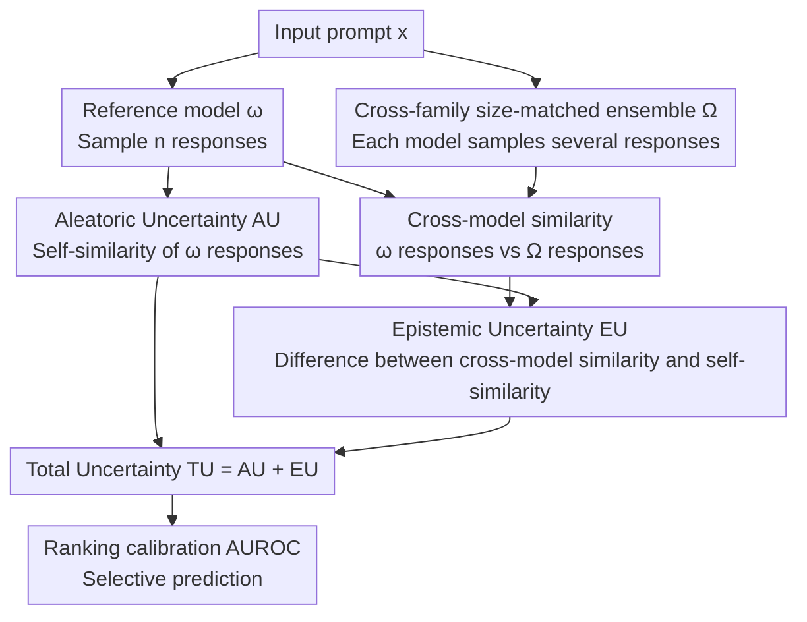

# Complementing Self-Consistency with Cross-Model Disagreement for Uncertainty Quantification

**Conference**: ICLR2026  
**OpenReview**: [https://openreview.net/forum?id=lOoRJo8xWy](https://openreview.net/forum?id=lOoRJo8xWy)  
**Code**: To be confirmed  
**Area**: LLM Evaluation / Uncertainty Quantification  
**Keywords**: Uncertainty Quantification, Epistemic Uncertainty, Self-Consistency, Cross-Model Disagreement, Selective Prediction

## TL;DR
Addressing the failure of self-consistency when a "model confidently gives a wrong answer," this paper estimates epistemic uncertainty (EU) using **semantic disagreement** among a group of same-scale, cross-family open-source LLMs. By adding EU to the original aleatoric uncertainty (AU) to obtain total uncertainty (TU), the study demonstrates that TU's calibration (AUROC) and selective prediction performance are consistently superior to using AU alone across 10 long-form generation tasks using five 7–9B models. The method uses pure text output only, requiring no training or access to logits.

## Background & Motivation

**Background**: Equipping LLM outputs with reliable uncertainty scores is a prerequisite for deployment in high-risk scenarios. Current mainstream approaches are almost entirely built on "model confidence"—the most typical being **self-consistency**: sampling multiple responses for the same prompt and measuring their semantic consistency. Higher divergence indicates higher uncertainty. These metrics measure **aleatoric uncertainty (AU)**, which is the inherent randomness of the model's own response to a given input.

**Limitations of Prior Work**: AU only answers "how certain the model is about its own response" but fails to address a more critical question—"how certain should we be about this model." A model may be **confident but wrong**: for the same factual question, every sample might yield the **same incorrect answer**. In such cases, AU approaches 0 (high consistency), and self-consistency would judge it as "highly confident and trustworthy," while the answer is actually wrong. This is the most dangerous collapse region for self-consistency as a proxy for reliability.

**Key Challenge**: To fill this gap, **epistemic uncertainty (EU)** is required—the uncertainty regarding whether "the chosen model $\omega$ is the correct parameterization to answer the input." However, classical EU estimation requires evaluating a "distribution of plausible models," which is computationally expensive for LLMs. Recent shortcuts (logit-space approximations, injecting Bayesian noise during decoding, or relying on a verifier model) often carry strong task or architectural assumptions and are mostly validated on specific QA data.

**Key Insight**: The authors observe that in regions where AU is low (model is highly confident), the **cross-model semantic disagreement of incorrect responses is actually higher**. That is, when a single model confidently gives a wrong answer, other models of the same scale but from different families often provide different (and differently incorrect) answers. The open-source LLM ecosystem provides a ready-made ensemble of same-scale, cross-family models to estimate EU via their semantic disagreement without additional training.

**Core Idea**: Using a small ensemble of "scale-matched, cross-family" open-source LLMs, EU is estimated as the difference between "cross-model similarity" and "model self-similarity." This is added to the AU from self-consistency to derive the total uncertainty (TU), specifically targeting the "confident but wrong" failures missed by AU.

## Method

### Overall Architecture

The method operates strictly in a **black-box** setting: for each input, only the **text responses** generated by the reference model $\omega$ and a set of auxiliary models $\Omega$ are required. It does not access logits, hidden states, or require any training. The pipeline starts by sampling several responses from $\omega$ to calculate their pairwise semantic similarity—lower consistency leads to higher AU. Simultaneously, the responses of $\omega$ are compared with responses from each model in the auxiliary set $\Omega$ for cross-model similarity. EU is defined as the **drop** in "cross-model similarity" relative to "self-similarity." Finally, $TU = AU + EU$. Intuitively, AU captures "internal model oscillation," while EU captures "deviation of the model relative to other plausible models."

The following diagram illustrates the data flow from input to the three uncertainty scores:

### Key Designs

**1. Identifying self-consistency failure as "confident errors in low-AU regions"**

Many works assume "low AU = trustworthy" and only perform cross-model comparisons when AU is high (e.g., Xue et al. 2025). This paper refutes this assumption via a diagnostic experiment: pooling all data and categorizing it into low/medium/high AU groups to compare the EU distribution of correct vs. incorrect answers. The result shows that **in the low-AU group, the EU of incorrect answers is significantly higher than that of correct answers**, while this discriminative power weakens as AU increases. Even within the lowest 5% AU samples (the most confident ones), the EU of incorrect answers remains notably higher. This highlights that the most confident regions are precisely where hallucinations occur and where EU is most needed.

**2. Unified definitions of AU, EU, and TU using similarity**

AU follows the semantic entropy approach by Lin et al. (2023): drawing two independent responses from $\omega$ and taking the expectation of their semantic similarity, $U_\text{aleatoric}(x;\omega)=\mathbb{E}_{r_1,r_2\sim p(\cdot|x,\omega)}\big[1-s(r_1,r_2)\big]$, where $s(\cdot,\cdot)$ is the cosine similarity in the embedding space.

EU is modeled as the divergence between $\omega$ and an ideal model $\omega^*$. The authors define $D(\omega\|\omega^*)$ as the "cross-model similarity" minus the "self-similarity of $\omega$." When the similarity between $\omega$ and $\omega^*$ equals the internal self-similarity of $\omega$, the divergence is 0. If the responses of $\omega$ diverge significantly from the ideal model after accounting for internal aleatoric diversity, the divergence is high. Since $\omega^*$ is unavailable, the authors marginalize $\omega^*$ into a model distribution $P_\Omega$ (satisfying $\mathbb{E}_{\tilde\omega\sim P_\Omega}[p(\cdot|x;\tilde\omega)]=p(\cdot|x)$), yielding:

$$U_\text{epistemic}(x,\omega)=-\,\mathbb{E}_{\tilde\omega\sim P_\Omega}\,\mathbb{E}_{r_1\sim p(\cdot|x,\omega),\,r_2\sim p(\cdot|x,\tilde\omega)}\big[s(r_1,r_2)\big]+\mathbb{E}_{r_1,r_2\sim p(\cdot|x,\omega)}\big[s(r_1,r_2)\big].$$

Using the additive assumption, total uncertainty is defined as $U_\text{total}=U_\text{aleatoric}+U_\text{epistemic}$, which simplifies to: $U_\text{total}(x;\omega)=\mathbb{E}_{\tilde\omega\sim P_\Omega}\,\mathbb{E}_{r_1\sim p(\cdot|x,\omega),\,r_2\sim p(\cdot|x,\tilde\omega)}\big[1-s(r_1,r_2)\big]$. All three quantities use the same pairwise similarity operator, with differences only in the source of the pairs (self-self = AU, self-others = core of TU, difference = EU).

**3. Black-box empirical estimation and aligned sampling budget**

In practice, for each prompt: the reference model $\omega$ samples $n$ responses $R'$, and each model $\omega_i$ in the auxiliary set samples $n$ responses $R_i$ (where $|\Omega|=m$). The empirical estimates are:

$$\text{AU}=1-\frac{1}{n^2}\sum_{k,j}s(r'_k,r'_j),\qquad \text{TU}=1-\frac{1}{m}\sum_{i=1}^{m}\frac{1}{n^2}\sum_{k,j}s(r'_k,r^{(i)}_j),\qquad \text{EU}=\text{TU}-\text{AU}.$$

Crucially, this estimation **only uses generated text**, making it compatible with black-box APIs like GPT-4o or Claude. Furthermore, for fairness, TU share the **same sampling budget** as AU: the study uses $n=n'/m$ (e.g., 5 models sampling 2 responses each for a total of 10 for TU) compared against a single model sampling 10 responses for AU.

**4. Satisfying the properties of auxiliary distribution $\Omega$ via cross-family ensembles**

The reliability of EU depends on how well $\Omega$ approximates the ideal model distribution. The authors derive three required properties: **(i) Sufficient support**: $\Omega$ must cover multiple plausible interpretations; **(ii) Non-collapsed diversity**: members must not be nearly identical; **(iii) Calibration scaling**: models should be weighted by their posterior reliability. The implementation uses **same-architecture, same-scale (7–9B), but differently trained** Transformer models. Different data pipelines and alignment protocols provide support and diversity, while similar validation performance allows for safe **uniform weighting**.

### Loss & Training
Ours involves **no training**: no fine-tuning or optimization occurs. It relies purely on inference-time sampling and similarity calculations. Correctness is determined using Meta-Llama-3-70B-Instruct as an LM-as-judge to label each "input-response" pair, which is then used to evaluate the discriminative power of the uncertainty scores.

## Key Experimental Results

### Main Results

Setup: Five 7–9B instruction models (Gemma-2-9B-It, Granite-3.0-8B, Llama-3.1-8B, Mistral-7B-v0.3, Qwen2.5-7B) serve as reference/auxiliary models across 10 long-form tasks (QA, Math, Translation, Summarization). Evaluation uses AUROC and selective prediction metrics (Risk–Coverage, C@90/C@80, AURC↓).

| Setup | Metric | AU | TU (AU+EU) | Gain |
| :--- | :--- | :--- | :--- | :--- |
| HotpotQA (Mean of 5 models) | AUROC | 0.65 | 0.80 | +0.15 |
| CoQA | AUROC | 0.66 | ~0.80 | +0.14 |
| WMT16-de-en | AUROC | 0.74 | 0.87 | +0.13 |
| GPT-4o / SimpleQA | AUROC | 0.59 | 0.70 | +0.11 |
| Claude 3.7 Sonnet / SimpleQA | AUROC | 0.53 | 0.58 | +0.05 |
| Aggregated Data | AURC ↓ | 0.256 | 0.217 | −15% |

TU is equal to or higher than AU on **all** benchmarks. The largest gains occur in tasks involving "complex multi-hop reasoning with cross-model disagreement" (HotpotQA) or tasks where "high overall accuracy makes EU vital for catching residual errors" (CoQA, WMT16).

### Ablation Study

| Configuration | Key Findings |
| :--- | :--- |
| Comparison with 12 UQ baselines | TU achieved 0.72 AUROC, whereas the strongest baseline (closeness centrality) only reached 0.64. |
| Auxiliary model scale scan | Even if auxiliary models are smaller (0.43×) or same-scale (1×), TU > AU. |
| Noise-perturbed vs. Cross-family | Noise-perturbed ensembles suffer from diversity collapse, causing EU to fail. |
| Sampling number | AUROC increases with sampling count, but TU already wins under equal budget (10 samples). |

### Key Findings
- **EU is most effective in low-AU regions**: In the lowest 5% of AU samples ("most confident"), the EU of incorrect answers remains high. This targets "confident errors" where self-consistency fails.
- **"More disagreement is always better" is a misconception**: EU's AUROC correlates positively with dataset redundancy (Jaccard consistency, $r=+0.72$) and negatively with Oracle Coverage Gain ($r=-0.72$). When models are complementary and give different but valid expressions for the same question, EU is inflated by "response noise," reducing AUROC.
- **Clear boundaries for EU**: EU is strongest in tasks where the answer is unique and models use similar phrasing (Fact QA, Translation); it is less effective in open-ended summarization (XSum) where answers are naturally diverse.

## Highlights & Insights
- **Converting the "confident but wrong" problem into a computable signal**: By "asking a different group of models," the study illuminates the blind spots of self-consistency.
- **Completely black-box, zero-training EU estimation**: Since it only requires text output, it can be applied seamlessly to proprietary APIs like GPT-4o and Claude.
- **Fair evaluation under equal sampling budget**: By using $n=n'/m$, the authors proactively address the concern that ensembles might win simply because they sample more frequently.
- **Honest characterization of boundaries**: Using Jaccard consistency and Oracle Coverage Gain, the authors clarify that EU is strong for unique-answer tasks but weak for diverse-answer tasks.

## Limitations & Future Work
- **Dependency on cross-family ensembles**: Sampling and inference costs scale linearly with ensemble size; construction of $\Omega$ is limited if appropriate same-scale open-source models are unavailable for a specific domain.
- **Noise contamination in diverse-answer tasks**: In open-ended tasks, EU decouples from correctness due to "true diversity," a limitation the authors acknowledge requires distinguishing "true disagreement" from "multiple correct expressions."
- **Assumption of comparable capability**: If auxiliary models vary greatly in strength, uniform weighting may fail, necessitating research into credibility-based re-weighting.

## Related Work & Insights
- **vs. Self-Consistency / Semantic Entropy (Lin et al. 2023)**: These measure internal consistency (AU) and collapse when the model is consistently wrong; Ours complements this by adding cross-model EU.
- **vs. Verifier-disagreement (Xue et al. 2025)**: The prior work triggers cross-model checks only at **medium AU**, while this paper proves low AU is a high-risk area for hallucinations and applies EU there.
- **vs. Bayesian/Logit-based EU**: These require white-box access; Ours is text-only and compatible with black-box APIs.
- **vs. Explicitly Trained Ensembles**: Training multiples models is expensive; Ours reuses existing open-source models for zero-training EU.

## Rating
- Novelty: ⭐⭐⭐⭐ Clarity in using cross-model disagreement to complement SC, though individual components are reorganizations of existing techniques.
- Experimental Thoroughness: ⭐⭐⭐⭐⭐ Comprehensive coverage with 5 models, 10 tasks, API models, 12 baselines, and budget-aligned controls.
- Writing Quality: ⭐⭐⭐⭐ Clear logic in derivation and diagnosis; unified definitions are elegant, though some formulas are dense.
- Value: ⭐⭐⭐⭐ Black-box and zero-training nature makes it highly practical for LLM deployment.

<!-- RELATED:START -->

## Related Papers

- [\[ICML 2026\] Who Flips? Self- and Cross-Model Counterarguments Reveal Answer Instability in LLMs](../../ICML2026/llm_evaluation/who_flips_self-_and_cross-model_counterarguments_reveal_answer_instability_in_ll.md)
- [\[ICLR 2026\] TokUR: Token-Level Uncertainty Estimation for Large Language Model Reasoning](tokur_token-level_uncertainty_estimation_for_large_language_model_reasoning.md)
- [\[ACL 2025\] Benchmarking Uncertainty Quantification Methods for Large Language Models with LM-Polygraph](../../ACL2025/llm_evaluation/benchmarking_uncertainty_quantification_methods_for_large_language_models_with_l.md)
- [\[NeurIPS 2025\] Efficient Semantic Uncertainty Quantification in Language Models via Diversity-Steered Sampling](../../NeurIPS2025/llm_evaluation/efficient_semantic_uncertainty_quantification_in_language_models_via_diversity-s.md)
- [\[ICLR 2026\] Don't Throw Away Your Beams: Improving Consistency-based Uncertainties in LLMs via Beam Search](dont_throw_away_your_beams_improving_consistency-based_uncertainties_in_llms_via.md)

<!-- RELATED:END -->
