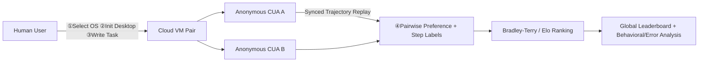

# Computer Agent Arena: Toward Human-Centric Evaluation and Analysis of Computer-Use Agents

**Conference**: ICLR 2026  
**OpenReview**: [https://openreview.net/forum?id=3x4SDbXbgl](https://openreview.net/forum?id=3x4SDbXbgl)  
**Code**: [https://github.com/xlang-ai/computer-agent-arena](https://github.com/xlang-ai/computer-agent-arena)  
**Area**: LLM Evaluation / Computer-Use Agent  
**Keywords**: Computer-Use Agent, Human Preference Evaluation, Elo Leaderboard, Bradley-Terry, Error Analysis, OSWorld  

## TL;DR
The "human blind voting + Elo ranking" paradigm from Chatbot Arena is ported to Computer-Use Agents (CUA): two anonymous CUAs execute user-provided tasks in parallel within real cloud desktop environments. Users provide pairwise preference votes on execution trajectories, revealing ranking flips and behavioral-level errors that static benchmarks (e.g., OSWorld) fail to detect.

## Background & Motivation
**Background**: As Computer-Use Agents (CUAs) like Claude, Operator, and UI-TARS become increasingly capable, the industry primarily relies on **static benchmarks** such as OSWorld, WebArena, WebVoyager, and Online-Mind2Web for evaluation. These benchmarks consist of human-authored computer tasks and manually designed reward functions.

**Limitations of Prior Work**: Static benchmarks suffer from systemic flaws: (1) narrow task domains and fixed environments prone to contamination/overfitting; (2) complete neglect of personalization (different users value different outcomes and interaction styles); (3) underestimation of security/privacy risks; (4) lack of robustness to environmental drift (software updates, network fluctuations, unseen apps); and (5) lack of guidance on "fair pairwise comparison" due to sacrificing realism for reproducibility. Crucially, they only measure **final states**, becoming detached from real-user-driven scenarios.

**Key Challenge**: While CUAs are moving toward real-world deployment, "human-centric evaluation based on user preference, security, and reliability" should be a prerequisite. However, current paradigms only measure "success or failure" and cannot explain "which agents users prefer and why."

**Goal**: To build an open-source, scalable, and fair online platform that converts real-world tasks and human preferences into structured signals and stable rankings, enabling the analysis of CUA failure modes and preference drivers.

**Core Idea**: **Human preference as the evaluation signal.** Using cloud virtual machines, two anonymous CUAs are provided with **identical** real desktop environments to execute the same human task in parallel. Users vote based on synchronized trajectory replays. These votes are aggregated into a leaderboard using Bradley-Terry/Elo models. Beyond preferences, additional step-by-step labels for correctness, security, and self-correction are collected to expand evaluation from "pairwise preference" to capability- and behavioral-level signals.

## Method

### Overall Architecture
COMPUTER AGENT ARENA is a cloud-based online evaluation system with a six-step workflow: ① User selects OS (Windows/Ubuntu) → ② Initializes environment with preset or custom scripts (uploading files / opening sites / cloning repos, etc.) → ③ Writes a task instruction → Two **anonymous** CUAs execute the task concurrently in two **identically configured** virtual machines → ④ User watches synchronized replays and votes (pairwise preference + step-level 👍/👎 + correctness/security labels) → ⑤ Evaluation → ⑥ Agent identities are revealed only after evaluation. The system is supported by three pillars: scalable cloud infrastructure, a unified agent execution interface, and an Elo ranking system.

### Key Designs

**1. Scalable and Realistic Cloud Infrastructure: Fair Comparison via "Identical Environment Fingerprints."** The platform builds standardized AMIs on top of OSWorld and deploys them to AWS EC2. It utilizes a managed pool for low-latency on-demand startup and parallel allocation. Each session is streamed to the browser via VNC. To approximate real use, the authors curated 600+ environment initializations (sampling popular sites from SimilarWeb, installing mainstream apps from Microsoft Store/Snapcraft, pre-loading 100+ heterogeneous files like `.docx`/`.py`). They periodically refresh filesystem content to reduce overfitting to fixed contexts and provide one-click customization tools. Fairness is guaranteed by **environment fingerprints**: two anonymous CUAs execute in parallel under the same AMI, software versions, initialization recipes, and seed configurations. Trajectories are recorded via OBS for synchronized playback.

**2. Unified Action Space + Verbatim Agent Interface: Isolating Differences to the Model.** All CUAs interact with API services via a unified action space to ensure cross-model compatibility: each step takes a 1280×720 screenshot and outputs structured function calls (mouse move/click, keyboard input, scroll, and signals like `DONE`/`FAIL`/`CALL_USER`). Models with official frameworks (Operator, Claude 3.7 Sonnet) use their official implementations; otherwise, a standardized baseline agent handles screenshot ingestion, prompting, and environment interaction. All open-source CUAs are **instantiated verbatim** from public repositories—using released checkpoints, default system prompts/tools, inference parameters (temperature, max-tokens), and tool schemas, while fixing step limits and history access to ensure differences stem from the model itself.

**3. Bradley-Terry/Elo Ranking + Bootstrap Confidence Intervals: Aggregating Votes into a Stable Leaderboard.** Each evaluation generates a preference vote: for a pair of agents $x_i=(m_i^L,m_i^R)$ in comparison $i$, with user preference $y_i\in\{1,0,\tfrac12\}$, and strength parameters $\beta_m$ for each agent $m$, the probability of the left agent winning is modeled as:

$$\Pr(m^L\succ m^R)=\frac{\exp(\beta_{m^L})}{\exp(\beta_{m^L})+\exp(\beta_{m^R})}.$$

The log-likelihood of all votes is optimized to estimate $\beta$, then converted to standard Elo scale $E_m=400\log_{10}(e^{\beta_m})+1000$. Stability is ensured by calculating 95% confidence intervals via bootstrap, with rankings determined by the **lower bound** of the interval.

**4. Expanded Signals for Behavioral and Error Labels: Moving from "What" to "How."** Besides pairwise preference, the platform captures optional step-level evaluations: grounding errors, privacy violations, self-correction, correctness, security, and efficiency labels. This supports subsequent user preference analysis (which behaviors actually win favor), tool-based vs. pure GUI agent comparisons, and systemic error discovery (long-term memory failure, insufficient perception, fine-grained action failure, etc.), turning the Arena into an "error discovery pipeline."

## Key Experimental Results

### Main Results: Leaderboard (2,201 High-Quality Votes / 1,058 Users / 12 CUAs)
A total of 3,418 votes were collected (1,773 public + 1,645 Prolific paid), with 2,201 retained after filtering. Annotation consistency (Krippendorff's α): preference 0.72, correctness 0.78, security 0.68, efficiency 0.70 (moderate to strong consistency).

| Rank | Model | Elo | Votes | Accuracy |
|---|---|---|---|---|
| 1 | Claude Sonnet 4 | 1167 | 416 | 52.0% |
| 2 | Claude 3.7 Sonnet | 1140 | 507 | 52.3% |
| 3 | UI-TARS-1.5 | 1092 | 533 | 49.9% |
| 4 | Operator | 1064 | 511 | 37.4% |
| 5 | CoAct-1* | 1043 | 110 | 41.8% |
| 6 | OpenCUA* | 1023 | 109 | 38.5% |
| 7 | Claude 3.5 Sonnet | 1023 | 425 | 35.8% |
| 8 | GPT-5* | 1002 | 108 | 34.3% |
| 9 | o4-mini | 895 | 266 | 15.4% |
| 10 | Qwen 2.5 VL 72B | 895 | 504 | 15.9% |
| 11 | GPT-4.1 | 837 | 432 | 8.6% |
| 12 | Gemini 2.5 Pro | 829 | 377 | 11.8% |

Key Observation: specialized CUAs (Claude family, UI-TARS, Operator) lead significantly, while **strong general multimodal models (GPT-5, Gemini 2.5 Pro) trail behind**—strong multimodal capability does not necessarily translate into robust computer-use capability.

### Ablation Study: Impact of Task Distribution on Ranking

| Setting | Observation |
|---|---|
| Cross-benchmark ranking comparison (CAA vs OSWorld/WebVoyager) | **Significant ranking flips** occur among top CUAs; several OSWorld leaders are inverted in the Arena. |
| OSWorld In-domain vs OOD (1,000 tasks classified by GPT-4o + human verification) | Rankings shift: Claude 3.7 remains top, but UI-TARS-1.5 rises on in-domain tasks → static benchmarks **overestimate** performance due to overfitting narrow distributions. |
| `CALL_USER` queries vs Win Rate | Inverse U-shape: **moderate querying (1-2 times) yields the highest win rate**; 0 or excessive queries result in lower win rates. |

Statistical significance: Bootstrap confidence intervals are narrow; permutation tests show highly significant win rate differences ($p<0.01$, Cohen's $d>0.5$).

### Key Findings
- **Correctness is the dominant predictor of user preference**, but execution steps and latency have almost no impact on preference when both are "correct."
- User preference values **step-by-step integrity** over the final state: even if a task isn't completed, showing clear intent, meaningful progress, or error recovery can win favor.
- **Tool enhancement $\neq$ better real-world performance**: CoAct-1 achieves 60.1% SOTA on OSWorld-Verified but falls behind significantly in Arena non-technical tasks due to tool selection bias (abusing code tools in GUI tasks) and error amplification.
- Error analysis reveals three types of hidden errors: **long-term memory failure** (forgetting intermediate goals after multiple steps), **insufficient perception** (issuing speculative commands instead of clarifying under-specified tasks), and **fine-grained action failure** (accidental scrolling, clicking non-interactive elements).

## Highlights & Insights
-**Successful Engineering of Paradigm Shift**: Porting Chatbot Arena to CUAs requires solving the challenge of "ensuring two agents run in identical real environments." The environment fingerprints + verbatim reproduction + synchronized replay infrastructure is the primary contribution.
-**Ranking Flip as the Convincing Argument**: The fact that OSWorld leaders are inverted in real user tasks proves a systemic gap between static benchmarks and real deployment.
-**From "Accuracy" to "Process"**: The discovery that user preference is driven by step integrity, moderate clarification (U-shaped `CALL_USER`), and error recovery provides alignment signals beyond outcome correctness.
-**Error Discovery Pipeline**: Treating human preference as a probe systematically unearths failures in long-term memory, perception, and fine-grained actions that are difficult to expose via scripts.

## Limitations & Future Work
- **Voting scale remains small and imbalanced**: Some models have only ~110 votes, leading to wide confidence intervals; rankings for these models are currently for reference only.
- **Subjectivity and population bias in crowdsourcing**: Preferences are influenced by annotator backgrounds (technical vs. non-technical); technical users favor CoAct-1 for technical tasks, indicating sensitivity to population composition.
- **Security/Privacy dimensions remain shallow**: While security labels were collected, consistent alignment was lower ($\alpha=0.68$), and systematic evaluation remains future work.
- **Cost and Scalability**: High marginal costs for cloud VMs and human voting make it difficult to achieve the one-click reproducibility of static benchmarks.
- **Future Directions**: Using Arena-exposed failure modes to inform training (new signals for memory/clarification); researching adaptive tool selection strategies (when/what/how to use tools, including GUI fallbacks).

## Related Work & Insights
- **CUA Benchmarks**: OSWorld, WebArena, WebVoyager, etc. Most remain scripted and rule-based. This work complements them with crowdsourced human tasks and preferences.
- **Human Preference Evaluation**: Chatbot Arena pioneered large-scale pairwise human comparison; this work is the first systematic application of this paradigm to "complete desktop execution trajectories."
- **Inspiration**: (1) "Correctness" is insufficient to characterize user value for any real-world agent; process quality and recovery need dedicated metrics. (2) Beware the "benchmark-real gap" in tool enhancement; more tools can harm usability in open tasks. (3) "Environment fingerprints + verbatim reproduction + parallel anonymity" is a reusable engineering paradigm for fair agent comparison.

## Rating
- **Novelty**: ⭐⭐⭐⭐ The Bradley-Terry formula is established, but the full engineering of a real-desktop CUA Arena and the use of ranking flips to expose benchmark blind spots is a solid combined innovation.
- **Experimental Thoroughness**: ⭐⭐⭐⭐ 2,201 votes / 1,058 users with triple statistical verification and 100 case studies. Deducted for low vote counts on some models.
- **Writing Quality**: ⭐⭐⭐⭐ Clear structure; motivation-to-implications flow is well-defined.
- **Value**: ⭐⭐⭐⭐⭐ Provides a human-centric perspective crucial for CUA evaluation via an open platform and dataset, offering long-term value to community methodology.

<!-- RELATED:START -->

## Related Papers

- [\[ICLR 2026\] HackWorld: Evaluating Computer-Use Agents on Exploiting Web Application Vulnerabilities](hackworld_evaluating_computer-use_agents_on_exploiting_web_application_vulnerabi.md)
- [\[ICLR 2026\] Talk, Evaluate, Diagnose: User-aware Agent Evaluation with Automated Error Analysis](talk_evaluate_diagnose_user-aware_agent_evaluation_with_automated_error_analysis.md)
- [\[ICLR 2026\] Holistic Agent Leaderboard: The Missing Infrastructure for AI Agent Evaluation](holistic_agent_leaderboard_the_missing_infrastructure_for_ai_agent_evaluation.md)
- [\[ICLR 2026\] Fewer Battles, More Gain: An Information-Efficient Framework for Arena-based LLM Evaluation](fewer_battles_more_gain_an_information-efficient_framework_for_arena-based_llm_e.md)
- [\[ICLR 2026\] LLM-as-a-Prophet: Understanding Predictive Intelligence with Prophet Arena](llm-as-a-prophet_understanding_predictive_intelligence_with_prophet_arena.md)

<!-- RELATED:END -->
