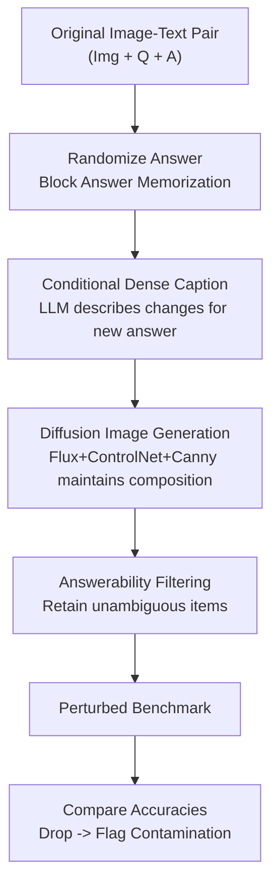

# Contamination Detection for VLMs Using Multi-Modal Semantic Perturbations

**Conference**: ICLR 2026  
**OpenReview**: [https://openreview.net/forum?id=gk6OC3XIZW](https://openreview.net/forum?id=gk6OC3XIZW)  
**Code**: https://github.com/jadenpark0/mm-perturb (Available)  
**Area**: Multi-modal VLM / Evaluation & Benchmarking / Data Contamination Detection  
**Keywords**: Data Contamination, Test-set Leakage, Vision-Language Models, Semantic Perturbations, Generalization Detection

## TL;DR
To address the risk that high scores of VLMs on public benchmarks may derive from training set leakage rather than genuine reasoning, this paper proposes **multi-modal semantic perturbations** for detection. By using LLMs and diffusion models to slightly modify image semantics while simultaneously changing the correct answer, the method compares model accuracy on original vs. perturbed benchmarks. Clean models correctly answer both, while contaminated models (relying on memorization) fail on the perturbed versions, reliably flagging contamination without requiring access to "clean reference models."

## Background & Motivation

**Background**: Modern VLMs (e.g., LLaVA, Qwen2-VL) have achieved State-of-the-Art (SOTA) results on benchmarks like MMMU, MMStar, and RealWorldQA. However, their pre-training corpora are internet-scale and often closed-source, with opaque compositions.

**Limitations of Prior Work**: Public benchmark test items are likely included in training corpora (test-set leakage), leading to inflated scores. For users, it is difficult to distinguish whether a model is "reasoning" or "reciting"; for developers, auditing test samples within massive corpora is prohibitively expensive. Existing de-contamination (n-gram deduplication) and benchmark re-design are mostly "mitigation" strategies for LLMs, while the complementary direction of "detecting if a VLM is contaminated" remains largely unexplored.

**Key Challenge**: Most existing contamination detection methods are designed for text-only LLMs—relying either on verbatim memorization or generalization failure after text paraphrasing. However, VLMs are multi-modal; if only text is perturbed, models can still guess the correct answer using **unaltered visual features**, rendering text perturbations ineffective. The authors formalize this into three requirements and find that existing methods fail to meet them (see Table 1):
- **Practicality**: Detection cannot assume access to a "clean reference model" or its training corpus and must rely on black-box interactions;
- **Reliability**: Detection should be effective across different fine-tuning methods (Standard FT vs. LoRA vs. Full-parameter);
- **Consistency**: The detection signal should positively correlate with the degree of contamination $n=\deg_D(M)$.

**Goal**: To develop a VLM contamination detector that satisfies Practicality, Reliability, and Consistency.

**Key Insight**: Since the visual channel is the critical path for VLMs, perturbations should target the **images themselves**. The core assumption (Assumption 1) is that samples with higher contamination are more easily memorized and prone to overfitting, making them harder to generalize—thus, contaminated models will show a performance drop on image variants of "equal or lower difficulty."

**Core Idea**: Construct multi-modal semantic perturbations to create image-text variants with **equivalent or lower difficulty** but different answers. Clean models succeed on both via reasoning, while contaminated models fail on variants due to memorization—using the **accuracy drop** rather than leakage priors to identify contamination.

## Method

### Overall Architecture
The method addresses the following: given a VLM and a benchmark, determine if the model is contaminated on that benchmark **without knowing which items leaked and without a clean reference model**. The strategy involves constructing a "paired perturbed benchmark" and comparing accuracy curves.

The process consists of three steps. **First**, for each original item, the correct answer is **randomly changed to another option**—blocking the back-door of "answer memorization." **Second**, an LLM (GPT-4o in main experiments) generates a **dense caption** based on the "original image + original question + new target answer." This caption, along with the **Canny edge map** of the original image, is fed into Flux+ControlNet to generate a new image that **maintains the global composition while slightly modifying local semantics** to be consistent with the new correct answer. **Third**, the **aggregated accuracy** of the model on the original versus the perturbed benchmark is compared. A significant accuracy drop indicates contamination.

Since diffusion models may be unreliable for rendering text or complex geometry at low resolutions, the authors include an **answerability filter** to retain only unambiguous perturbed items (manually filtered for upper bounds in main experiments, with automated filtering via o3 demonstrated in the appendix).

### Key Designs

**1. Formal Requirements: Defining a Good Detector**
The authors define a single-sample contamination degree $\deg_D(x)=\left(\sum_{d\in D}\mathbf{1}\{x=d\}\right)\times n$, simplified to $\deg_D(M)=n$ under the setting of fine-tuning on benchmark $D$ for $n$ epochs. Based on Assumption 1 (higher contamination leads to worse generalization), they establish three requirements: Practicality (black-box), Reliability (cross-strategy), and Consistency (monotonicity with $n$). Existing methods (N-gram, Shared Likelihood, CircularEval, etc.) are shown to fail these, whereas the proposed method satisfies all three.

**2. Multi-Modal Semantic Perturbation: Perturbing Visuals and Changing Answers**
This is the core of the approach. Text-only perturbations fail because visual features remain intact; this method **perturbs visual semantics instead**. By **randomly sampling a new correct answer** and using diffusion to align the image with it, the method distinguishes "memorizing the original answer" from "reasoning based on the new image." Using Canny edge constraints ensures the **global layout is preserved**, keeping the difficulty equivalent or lower. The criterion is simple: the accuracy drop $\Delta = \text{Acc}_{\text{perturb}} - \text{Acc}_{\text{orig}}$.

**3. Answer-Conditioned Dense Captions: Precise Semantic Modification**
Rather than direct image-to-image generation, the authors use an LLM as an intermediate "reasoning layer." The LLM identifies **which parts of the image must change** for the new answer to be valid and generates a dense description. Flux+ControlNet then **precisely renders these local regions**. This "Image $\to$ Language Plan $\to$ Image" step significantly improves perturbation quality and difficulty control.

**4. Answerability Filtering: Decoupling Generation Flaws from Detection**
Due to current limitations in diffusion models (e.g., blurry text), an **answerability filter** is used to ensure perturbed items can be answered unambiguously. This design acknowledges that detection relies on "evaluating reasoning" rather than "aesthetic quality." As generative models improve, this filtering step (which can be automated via o3) may become unnecessary.

## Key Experimental Results

**Settings**: Models used include LLaVA-v1.5-7B and Qwen2-VL-7B (13B in appendix); benchmarks used are MMStar and RealWorldQA. Contamination is simulated via continuing fine-tuning (Standard FT, LLM-only, LoRA for 1–3 epochs).

### Main Results (MMStar, $\Delta = \text{Acc}_{\text{perturb}} - \text{Acc}_{\text{orig}}$)

| Model / Setting | Orig Acc | Perturb Acc(_P) | $\Delta$ | Detected? |
| :--- | :---: | :---: | :---: | :---: |
| LLaVA-v1.5-7B (Clean) | 37.78 | 69.29 | **+31.51** | — (Expected +) |
| LLaVA-7B LoRA 3ep (Contam.) | 54.34 | 38.18 | −16.16 | ✓ |
| LLaVA-7B LLM+MLP 3ep (Contam.) | 50.71 | 36.97 | −13.74 | ✓ |
| Qwen2-VL-7B (Clean) | 62.02 | 78.18 | **+16.16** | — (Expected +) |
| Qwen2-VL-7B LoRA 3ep (Contam.) | 95.96 | 63.64 | −32.32 | ✓ |
| Qwen2-VL-7B LLM only 3ep (Contam.) | 98.99 | 55.96 | −43.03 | ✓ |

Clean models actually **gain accuracy** on perturbed versions (verifying equal/lower difficulty), while all contaminated models show drops, with the **drop increasing monotonically with epochs** (satisfying Consistency).

### Baseline Comparisons (MMStar)

| Method | Requires Clean Model | Typical Failure |
| :--- | :---: | :--- |
| Multi-modal Leakage | Yes ✗ | Misses LLaVA Std-FT; unstable signals |
| CircularEval | Yes ✗ | Misses LLaVA-LoRA and Qwen Std-FT |
| Choice Confusion | No ✓ | Misses LLaVA across all strategies; LoRA "gains" |
| **Ours (Semantic Perturb)** | **No ✓** | Satisfies all 3 requirements |

### Ablation & Robustness
- **NaturalBench Real Counterfactuals**: Contaminated models dropped to -45.58%, while clean models remained stable, proving the principle holds for natural semantic changes.
- **Paraphrased Contamination**: Accuracy drop remains robust (up to -21.41) even with low n-gram overlap.
- **Scale (LLaVA-13B)**: Detection remains effective (up to -42.28 $\Delta$).
- **Pre-training Leakage**: Detection works for leakage within $665K$ pre-training samples ($-1.82 \Delta$).
- **Mixed Benchmarks**: Stable detection even when target benchmarks (RQA/MMStar) represent only 6.7%–13.3% of the mix.

## Highlights & Insights
- **Contamination as Generalization Failure**: Instead of guessing which data leaked, the method constructs lower-difficulty equivalent problems to expose memorization—a perspective shift that removes the need for "clean reference models."
- **Controllable Editing Paradigm**: The use of LLM planning for diffusion editing ensures semantic precision and layout preservation, a framework applicable beyond contamination detection to robustness evaluation or data augmentation.
- **Requirement-Driven Design**: By formalizing practical requirements first, the authors provide a rigorous framework for evaluating detection methods rather than relying on heuristic comparisons.

## Limitations & Future Work
- **Visual Dependence**: The framework is limited to tasks where the answer is strictly dependent on visual features (e.g., RealWorldQA); it is less effective for tasks with high language priors.
- **Human/Automated Filtering**: Current diffusion models require a filtering stage for unambiguous answerability.
- **Potential for Concealment**: If perturbations are excessive, a contaminated model might fail on both original and perturbed items, masking the contamination signal.
- **Multiple Choice Focus**: While adaptable to open-ended VQA via likelihood or LLM-as-judge, the primary validation is on multiple-choice formats.

## Related Work & Insights
The work contrasts with text-centric LLM detectors (N-gram, Shared Likelihood), which fail on VLMs because the visual modality remains an "open-book" backdoor. Unlike **Multi-modal Leakage** (which requires clean models) or **CircularEval** (which lacks threshold-independent criteria), this method is the first to systematically investigate VLM behavior across various contamination and detection strategies, satisfying Practicality, Reliability, and Consistency.

## Rating
- Novelty: ⭐⭐⭐⭐⭐ 
- Experimental Thoroughness: ⭐⭐⭐⭐⭐ 
- Writing Quality: ⭐⭐⭐⭐⭐ 
- Value: ⭐⭐⭐⭐⭐

<!-- RELATED:START -->

<!-- RELATED:END -->

## Related Papers

- [\[ICLR 2026\] Preference Leakage: A Contamination Problem in LLM-as-a-judge](preference_leakage_a_contamination_problem_in_llm-as-a-judge.md)
- [\[ICLR 2026\] Detecting Data Contamination in LLMs via In-Context Learning](detecting_data_contamination_in_llms_via_in-context_learning.md)
- [\[ACL 2025\] MMLU-CF: A Contamination-free Multi-task Language Understanding Benchmark](../../ACL2025/llm_evaluation/mmlu-cf_a_contamination-free_multi-task_language_understanding_benchmark.md)
- [\[ICLR 2026\] BiasScope: Towards Automated Detection of Bias in LLM-as-a-Judge Evaluation](biasscope_towards_automated_detection_of_bias_in_llm-as-a-judge_evaluation.md)
- [\[ICLR 2026\] vCache: Verified Semantic Prompt Caching](vcache_verified_semantic_prompt_caching.md)

<!-- RELATED:END -->
