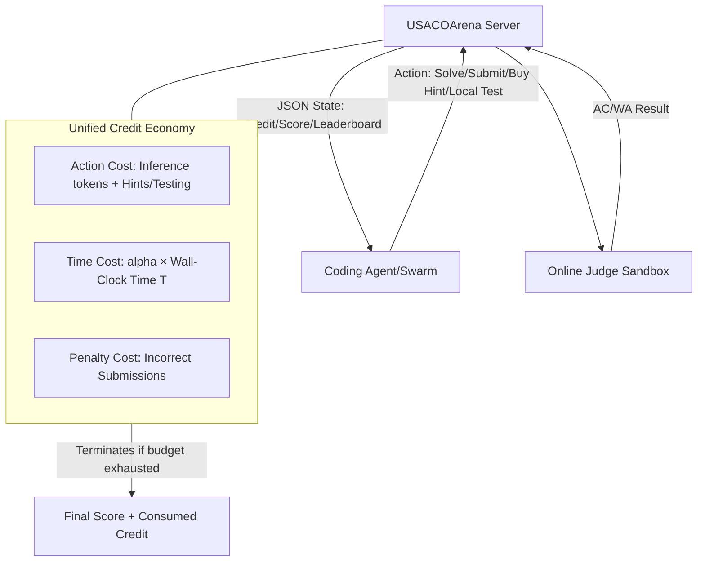

# Credit-Budgeted ICPC-Style Coding: When Agents Must Pay for Every Decision

**Conference**: ICLR 2026  
**OpenReview**: [https://openreview.net/forum?id=WC2g3zDF2o](https://openreview.net/forum?id=WC2g3zDF2o)  
**Code**: [https://github.com/maple-zhou/USACOArena](https://github.com/maple-zhou/USACOArena)  
**Area**: LLM Evaluation / Coding Agents / Resource-Aware Decision Making  
**Keywords**: Coding Agents, Cost-Aware Evaluation, ACM-ICPC, Credit Budget, Agent Swarms, POMDP  

## TL;DR
This paper proposes **USACOArena**, an ACM-ICPC style online arena driven by a unified "credit" economy. Coding agents must pay for every generated token, local test, and second of wall-clock time, shifting evaluation from "isolated code accuracy" to "budget-constrained cost-aware decision making."

## Background & Motivation
**Background**: Autonomous programming agents, represented by Claude Code and Codex, can stably solve complex programming tasks. The community is rapidly shifting toward using multi-agent swarms to compress delivery time. However, almost all benchmarks (HumanEval, SWE-bench, LiveCodeBench, etc.) focus solely on the static accuracy of the final code.

**Limitations of Prior Work**: These benchmarks default to an ideal "infinite resource" environment, judging models in a **temporal vacuum** that ignores token costs, wall-clock time, and local testing overhead. A swarm might "solve the problem" while consuming massive compute and failing due to heavy coordination overhead—strategic waste that no current metric reflects. Ignoring opportunity costs can lead to disastrous budget exhaustion when deploying large-scale agent swarms.

**Key Challenge**: Real-world software engineering is a **resource-constrained competition** where rapid delivery and correct code are equally important. Existing benchmarks simplify this into a static puzzle focusing only on correctness. Agents lack a dynamic feedback signal to quantify the "true cost of every action."

**Goal**: Construct a frictionless, full-information test environment that converts delivery time, inference tokens, and testing overhead into a quantifiable "credit" feedback. This forces agents to make strategic trade-offs between speed, compute, and reliability, thereby measuring and fostering true **cost-aware autonomy**.

**Core Idea (Credit Economy + ICPC Arena)**: The ACM-ICPC format is selected because it is naturally a self-contained game with **full information and pre-disclosed rules/budgets**. This isolates decision costs from confounding variables like "missing documentation" or "complex environments" found in real repositories. Superimposing a credit budget where "every decision costs money" transforms static testing into a dynamic resource-management survival challenge.

## Method

### Overall Architecture
USACOArena models the evaluation of coding agents as a **budget-constrained Partially Observable Markov Decision Process (POMDP)**. Agents interact with a server in a turn-based loop: each turn, the server pushes the game state (remaining credits, current score, leaderboard) via JSON, and the agent responds with an action (e.g., `SUBMIT_SOLUTION`). All submitted code runs in a secure online judge sandbox. The system consists of three components: ICPC-style format and problem set, a unified credit model, and an MCP-based communication architecture.

### Key Designs

**1. ICPC Format × USACO Problem Set: A Stratified, Pollution-Resistant Arena**  The "all-or-nothing" scoring of ACM-ICPC (no partial points, rewards for fast and bug-free code) is chosen as it aligns closer to real software engineering than the IOI format. To match current model capabilities, the USACO problem set is used, stratified from Bronze to Platinum. Each match simulates an ICPC World Final with 12 problems. To prevent data contamination, a "Living Benchmark" strategy is used, adding new USACO problems seasonally. An agent's strategy $\pi$ outputs $(\text{Score}, \text{Consumed Credit})$, aiming to maximize score within budget:

$$\max_{\pi} \ \text{Score}(\pi) \quad \text{s.t.} \quad C_{\text{action}}(\pi) + C_{\text{time}}(\pi) \le C_{\text{limit}}$$

**2. Unified Credit Model: Converting Tokens, Time, and Testing into One Currency**  The economy has three parts. *Action Cost* $C_{\text{action}}$ includes LLM inference (normalized by API price; expensive models consume more credits per token, forcing trade-offs between quality and cost) and local testing overhead. *Delivery Time Cost* $C_{\text{time}}=\alpha T$ is a key addition—tracking absolute wall-clock time $T$ multiplied by coefficient $\alpha$. A larger $\alpha$ simulates "speed-priority" scenarios. *Penalty Cost* $C_{\text{penalty}}$ is triggered by incorrect submissions to prevent guessing. Termination occurs when $C_{\text{action}}+\alpha T \le C_{\text{limit}}$ is breached, but ranking uses total consumption $C_{\text{consumed}}=C_{\text{action}}+\alpha T + C_{\text{penalty}}$ as a tie-breaker, rewarding accuracy and efficiency.

**3. MCP-based Protocol: Reproducible, Language-Agnostic, and Swarm-Ready**  The communication layer is built on the Model Context Protocol to address reproducibility. MCP is language-agnostic, allowing any agent to access the same action space and observations. It natively supports multi-turn dialogue, facilitating the extension from single-agent arenas to multi-agent ICPC team competitions.

## Key Experimental Results

Evaluation was conducted on 48 problems from the 2024–2025 USACO season, with 5 runs per match. Entry required passing a Bronze-level qualification task.

### Main Results: A Stable Two-Tier Hierarchy of Top Models
Across four matches, a stable two-tier performance hierarchy emerged: **Gemini-2.5-pro and GPT-5-Codex consistently ranked first and second**, significantly outperforming others. The benchmark is far from saturated; while the theoretical maximum is 54 points, top agents average ~15 points, corresponding to the **Advanced/Gold level** of USACO.

| Agent | Avg Rank | Win Rate | Max Score | Min Score |
|---|---|---|---|---|
| Gemini-2.5-pro | 1.3 ± 0.47 | 70.0% | 19 | 4 |
| GPT-5-Codex | 1.7 ± 0.47 | 30.0% | 29 | 3 |

A distinct paradox observed: **GPT-5-Codex possesses higher peak capability** (max score 29, showing potential for Platinum problems), yet **Gemini-2.5-pro has double the win rate**. This stems from strategic differences: Gemini adopts an aggressive "breadth-first" exploration (trying more problems), while GPT-5-Codex uses a "perfectionist" conservative exploitation (high accuracy but low coverage). Conclusion: In competitive environments, **breadth-first exploration can defeat stronger but overly conservative exploitation**, indicating the bottleneck is strategic rather than purely technical.

### Ablation Study: Capability-Limited Rather Than Budget-Limited
Ablations on the 2025 February Contest across 8 models:

| Dimension | Setting | Gemini-2.5-pro Score | Conclusion |
|---|---|---|---|
| Credit Budget | 10M (Tight) | 13.2 → 8.3 | Budget reduction significantly drops score. |
| Credit Budget | 40M (Double) | ≈ 13.0 | Budget increase provides **no improvement**. |
| Prompt | Forced CoT (P1.1) | 13.2 → Slight Incr. | Prompt engineering struggles to fix strategic flaws. |
| Prompt | Aggressive (P2.1) | 13.2 → 14.7 | Marginal gains; long few-shots can degrade performance. |

Key Finding: Current SOTA agents are **Capability-Limited rather than Budget-Limited**—they hit a "reasoning wall" long before exhausting credits. Extra budget does not translate to higher scores. The "conservative vs. aggressive" profile is an **intrinsic property** of model alignment and architecture.

### Key Findings
- **First-Move Effect**: In self-play, results correlate strongly with the success of the first problem attempted. Early success leads to a "virtuous cycle" (confidence to take risks), while early failure leads to a "panic cycle" (rapid budget exhaustion and performance collapse).
- **Coordination Tax for Swarms**: Testing Codex swarms revealed that "Speedy Spendthrift" (maximum parallelism) exhausted budgets early due to **explosive communication overhead**. The "Cost-Aware Strategist" achieved the best score (8) by balancing parallel exploration with serial execution based on remaining budget.

## Highlights & Insights
- **Paradigm Shift**: Redefines coding agent evaluation from "is the code correct" to "how to solve problems cost-effectively under competition and constraints."
- **Paid Time**: Incorporating wall-clock time $\alpha T$ into credits makes delivery speed a tunable constraint, allowing simulation of diverse business scenarios.
- **Capability vs. Strategy Decoupling**: The paradox where the model with higher peak capability has a lower win rate proves that strategic decision-making (risk assessment, resource allocation) is as vital as raw problem-solving.
- **Training Ground**: The path-dependency and non-deterministic behavior observed in self-play make USACOArena an ideal RL training environment with clear economic reward gradients.

## Limitations & Future Work
- **Domain Specificity**: The ICPC format is self-contained and isolates variables, but a gap remains between competitive programming and real-world repository-level engineering.
- **Credit Subjectivity**: The normalization of tokens and time depends on API pricing and the choice of $\alpha$, which introduces human-defined parameters.
- **Network Latency**: Commercial API evaluation introduces unfair network delays, forcing $\alpha=0$ for pure strategy comparison in main experiments.
- **Multi-Agent Coordination**: Current swarm experiments use manual strategy profiles; autonomous cost-aware coordination remains an open area for RL exploration.

## Related Work & Insights
- **Programming Benchmarks**: Unlike HumanEval (correctness) or SWE-bench (engineering), this work addresses the "temporal vacuum" of prior benchmarks.
- **Agent Architectures**: While architectures (e.g., MetaGPT, OpenHands) grow complex, their utility is often judged statically. This framework introduces "coordination tax" as a critical metric.
- **Insight**: RL training for cost-aware agents, migrating the $\alpha T$ concept to SWE-agents, and introducing explicit "communication budgets" to swarms are promising directions.

## Rating
- **Novelty**: ⭐⭐⭐⭐⭐ Integrating delivery time/tokens into a "credit economy" and formalizing evaluation as a budget-constrained POMDP is a clear paradigm shift.
- **Experimental Thoroughness**: ⭐⭐⭐⭐ Solid ablations across 8 models and 7 dimensions, though the time dimension was limited to Codex evaluation.
- **Writing Quality**: ⭐⭐⭐⭐ Narrative is clear, though some sections (Section 3.2) contain minor repetitions.
- **Value**: ⭐⭐⭐⭐⭐ Directly addresses budget exhaustion in agent deployment. It serves as both a diagnostic tool for SOTA strategic flaws and an RL training environment.

<!-- RELATED:START -->

## Related Papers

- [\[ICML 2026\] HiPER: Hierarchical Reinforcement Learning with Explicit Credit Assignment for Large Language Model Agents](../../ICML2026/llm_evaluation/hiper_hierarchical_reinforcement_learning_with_explicit_credit_assignment_for_la.md)
- [\[ICML 2026\] Multi$^2$: Hierarchical Multi-Agent Decision-Making with LLM-Based Agents in Interactive Environments](../../ICML2026/llm_evaluation/multi2_hierarchical_multi-agent_decision-making_with_llm-based_agents_in_interac.md)
- [\[ICLR 2026\] When LLMs Get Significantly Worse: A Statistical Approach to Detect Model Degradations](when_llms_get_significantly_worse_a_statistical_approach_to_detect_model_degrada.md)
- [\[ICLR 2026\] When to Ensemble: Identifying Token-Level Points for Stable and Fast LLM Ensembling](when_to_ensemble_identifying_token-level_points_for_stable_and_fast_llm_ensembli.md)
- [\[ICLR 2026\] Do LLM Agents Know How to Ground, Recover, and Assess? Evaluating Epistemic Competence in Information-Seeking Agents](do_llm_agents_know_how_to_ground_recover_and_assess_evaluating_epistemic_compete.md)

<!-- RELATED:END -->
