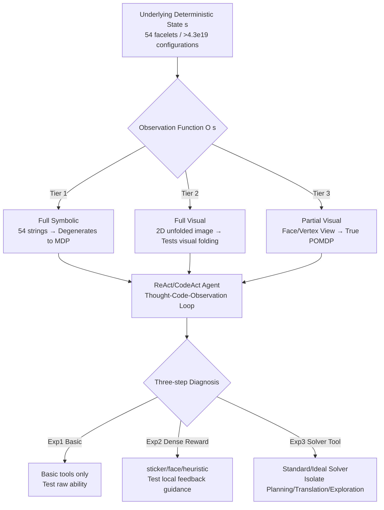

# CubeBench: Diagnosing Interactive, Long-Horizon Spatial Reasoning under Partial Observations

**Conference**: ICLR 2026  
**OpenReview**: [https://openreview.net/forum?id=MCmQyZ9Gxa](https://openreview.net/forum?id=MCmQyZ9Gxa)  
**Code**: [https://cubebench.c7w.tech/](https://cubebench.c7w.tech/)  
**Area**: LLM Evaluation / Agent Benchmark / Spatial Reasoning  
**Keywords**: Spatial Intelligence, Long-horizon Planning, Partial Observability, POMDP, Rubik's Cube, LLM Agent  

## TL;DR
CubeBench is a generative benchmark with three difficulty tiers based on the Rubik's Cube. It isolates three core cognitive abilities—spatial reasoning, long-horizon mental simulation, and active exploration under partial observation—from perception. Findings reveal that all major LLMs, including GPT-5, achieve a consistent 0.00 pass rate on long-horizon tasks.

## Background & Motivation
**Background**: LLM agents are highly capable in digital environments (coding, web navigation, tool use). The next grand objective is deployment in the physical world, which requires constructing and maintaining a robust "spatial mental model" in the mind.

**Limitations of Prior Work**: Existing agent benchmarks cannot cleanly diagnose this ability. Search/GUI benchmarks are mostly 2D with explicit states, lacking 3D reasoning. Code/Gym environments involve long-horizon state tracking but lack 3D geometric understanding. Embodied Simulators involve all three abilities but couple them with complex visual perception, making it impossible to distinguish between cognitive and perceptual failures. The most related work, MindCube, only tests reasoning in static 3D scenes without long-horizon, state-changing interactions.

**Key Challenge**: The goal is to evaluate pure cognitive abilities (reasoning, planning, exploration), but real-world tasks often conflate cognition with perceptual noise, leading to unclear failure attribution.

**Goal**: Create a diagnostic benchmark that decouples perception from reasoning, allows for precise failure attribution, and can infinitely generate tasks of varying difficulty.

**Core Idea**: **[Deterministic Micro-world]** The Rubik's Cube is chosen as an ideal experimental platform. It has deterministic rules, a massive state space ($>4.3 \times 10^{19}$ configurations), and a clear group-theoretic structure. It is complex enough to defy random search yet entirely predictable, allowing the isolation of cognitive abilities without physical uncertainty. This is paired with a **three-tier progressive observation** framework, degrading from "full symbolic state" to "partial visual observation" to increase difficulty along the cognitive axis rather than the perceptual noise axis.

## Method

### Overall Architecture
CubeBench formalizes Rubik's Cube solving as a POMDP $(S, A, T, R, \Omega, O)$. The state $S$ represents all configurations (54 facelet colors, deterministic representation), actions $A$ comprise 12 standard Singmaster notations plus tier-specific view transformations, and transitions $T$ are deterministic. The same underlying state is exposed to the agent through different observation functions $O(s)$, forming three tiers of diagnostic difficulty. Evaluation employs a three-step diagnostic framework (base agent $\rightarrow$ adding dense rewards $\rightarrow$ adding solver tools) to strip away causes of failure layer by layer.

### Key Designs

**1. Three-tier Observations**: Difficulty increases along the cognitive axis. Tier 1 (Full Symbolic) provides the state as a 54-character string of facelet colors, making the task a fully observable MDP to test basic state tracking and planning. Tier 2 (Full Visual) presents the same state as a 2D unfolded map, requiring the agent to "fold" it into a 3D cube mentally to understand spatial adjacency. Tier 3 (Partial Visual) provides only local views—either a single face (Face View) or three adjacent faces from a vertex (Vertex View)—forming a true POMDP where the agent must actively explore to build a world model. All tiers share the same engine; only $O(s)$ varies, allowing performance gaps to be cleanly attributed to specific cognitive abilities.

**2. Optional Dense Rewards**: Defaulting to sparse binary rewards ($R=1$ only upon completion), the paper implements three dense rewards based on metric differences $\Delta \phi$: $R_t = \phi(s_{t+1}) - \phi(s_t)$. These include $\phi_{\text{sticker}}$ (count of correctly placed stickers), $\phi_{\text{face}}$ (count of completed faces), and $\phi_{\text{heuristic}}$ (distance estimation via classic solving algorithms). These four reward levels (including no-reward) diagnose the utility of process feedback for agent reasoning.

**3. Three-tier Solver Diagnosis**: This is the core of the diagnostic framework. **Basic Agents** plan from scratch. **Standard-Solver Agents** use an optimal solver requiring strict symbolic input, testing the agent's ability to **translate** perception into program formats. **Ideal-Solver Agents** automate the translation, testing the agent's ability to perceive state directly. Comparing these enables precise localization: Basic vs. Standard gap = long-horizon planning ability; Standard vs. Ideal gap = spatial translation/programmatic tool use; Ideal-Solver failure under partial observation = defects in active exploration.

**4. Generative Curriculum**: Task difficulty is defined by the length of the optimal solution (state depth $d$). Test cases are generated using a provably optimal solver (Kociemba-based) to ensure the shortest path is exactly $d$. Depths 1/2/3/4 are categorized as short-horizon, while 8/12/16/20 are long-horizon.

## Key Experimental Results

### Main Results (Experiment 1: Basic Agent Pass Rate)

| Model | Sym-Short | Sym-Long | Vis-Short | Face-Short | Vertex-Short | All Long-hor. |
|------|---------|---------|---------|---------|-----------|----------|
| **GPT-5** | **0.75** | 0.00 | 0.20 | 0.40 | 0.05 | **0.00** |
| MLP (Policy Gradient) | 0.75 | 0.00 | – | – | – | 0.00 |
| Grok-4 | 0.20 | 0.00 | 0.05 | 0.00 | 0.00 | 0.00 |
| Gemini 2.5 Pro | 0.10 | 0.00 | 0.05 | 0.05 | 0.00 | 0.00 |
| Claude Sonnet 4 | 0.05 | 0.00 | 0.00 | 0.00 | 0.00 | 0.00 |
| GPT-4o | 0.00 | 0.00 | 0.00 | 0.10 | 0.00 | 0.00 |

Significant finding: **All models across all modalities achieved a 0.00 pass rate on long-horizon tasks.** Even for GPT-5, performance plummeted from symbolic to visual inputs, highlighting "visual thinking" as a major bottleneck.

### Ablation Study (Experiment 2: GPT-5 Pass Rate with Dense Rewards)

| Reward | Sym-Short | Vis-Short | Face-Short | Vertex-Short | Long-hor. |
|--------|---------|---------|---------|-----------|------|
| no reward | 0.75 | 0.20 | 0.40 | 0.05 | 0.00 |
| face | 0.85 | 0.55 | 0.50 | 0.40 | 0.00 |
| sticker | 0.65 | 0.55 | 0.55 | 0.50 | 0.00 |
| heuristic | 0.50 | 0.45 | 0.65 | 0.30 | 0.00 |

Dense rewards generally improved short-horizon performance, especially pulling visual/vertex tasks from near-zero to 0.4~0.5. However, **long-horizon pass rates remained zero**. Notably, for GPT-5 on symbolic tasks, complex rewards like heuristic/sticker performed worse than no-reward, suggesting external rewards conflict with emergent internal strategies of strong models.

### Key Findings
- **Long-horizon planning is the primary out-sourceable defect**: Providing an optimal solver increased symbolic long-horizon pass rates from 0.00 to nearly 1.00, proving the bottleneck is state tracking and planning, not algorithm deficiency.
- **Spatial translation is non-trivial**: The gap between Standard and Ideal solvers indicates that translating perception into tool-compatible formats requires genuine spatial understanding.
- **Active exploration is a major barrier**: Even with an Ideal-Solver, **all models failed completely (0.00) on Vertex View tasks**. While models could bypass spatial reasoning in Face View via algorithmic string parsing, the complexity of Vertex View exposed the total lack of 3D spatial reasoning and active exploration.

## Highlights & Insights
- **Deterministic Micro-worlds as Diagnostic Benchmarks**: The Rubik's Cube structure allows "precise failure attribution" to move from a concept to an operational design, which embodied simulators cannot provide.
- **Subtraction Experiments**: The three-tier solver design elegantly decomposes mixed failures into planning, translation, and exploration segments.
- **Model Shortcuts**: Models attempt to bypass spatial reasoning through dimensionality reduction (e.g., parsing Face View as a grid). Vertex View blocks these shortcuts, revealing the absence of true 3D reasoning.
- **Alarming Performance**: The universal 0.00 pass rate on long-horizon tasks serves as a stark reality check against the optimistic narrative of LLM deployment in physical environments.

## Limitations & Future Work
- **Domain Specificity**: The Rubik's Cube is discrete and deterministic, lacking physical noise (friction, collisions). Findings might not immediately generalize to continuous physical manipulation.
- **Diagnosis vs. Solution**: The paper focuses on identifying bottlenecks rather than proposing architectural improvements for agents.
- **Budget Constraints**: The zero pass rate might be influenced by interaction limits (20 steps) or timeouts. Future work could explore different agent scaffolding under larger budgets.
- **Future Directions**: Utilizing the generative curriculum for training (self-evolving agents), maintaining updateable spatial world models, and making exploration strategies learnable.

## Related Work & Insights
- **Comparison to Embodied Simulators (AI2-THOR, etc.)**: Simulators include perceptual complexity, making failure attribution difficult; CubeBench decouples perception for diagnostic clarity.
- **Comparison to MindCube**: MindCube evaluates static reasoning; CubeBench introduces state-changing interactions over long horizons.
- **Methodological Insight**: Using a rule-governed, generative toy domain to isolate single cognitive abilities via subtraction experiments is a transferable paradigm for diagnosing other LLM capabilities like compositional generalization.

## Rating
- **Novelty**: ⭐⭐⭐⭐ Using Rubik's Cube with tiered observations and solvers for cognitive diagnosis is clever and operationalizes perception-reasoning decoupling.
- **Experimental Thoroughness**: ⭐⭐⭐⭐ Covers ~17 models, 4 modalities, 2 horizons, and multiple diagnostic axes. Lacks deeper exploration of budget sensitivity.
- **Writing Quality**: ⭐⭐⭐⭐ Clear structure following the Research Question $\rightarrow$ Experiment $\rightarrow$ Attribution flow.
- **Value**: ⭐⭐⭐⭐ Provides a clean, generative, and attributable suite for spatial intelligence, serving as a critical benchmark for agents moving toward the physical world.

<!-- RELATED:START -->

## Related Papers

- [\[ICCV 2025\] 3DSRBench: A Comprehensive 3D Spatial Reasoning Benchmark](../../ICCV2025/llm_evaluation/3dsrbench_a_comprehensive_3d_spatial_reasoning_benchmark.md)
- [\[ICML 2026\] NarrativeWorldBench: A Frontier-Saturated Benchmark and a Latent World Model for Long-Horizon Co-Creative Audio Drama](../../ICML2026/llm_evaluation/narrativeworldbench_a_frontier-saturated_benchmark_and_a_latent_world_model_for_.md)
- [\[ICLR 2026\] LFQA-E: Carefully Benchmarking Long-form QA Evaluation](lfqa-e_carefully_benchmarking_long-form_qa_evaluation.md)
- [\[ICLR 2026\] Can You Hear Me Now? A Benchmark for Long-Range Graph Propagation and Beyond](can_you_hear_me_now_a_benchmark_for_long-range_graph_propagation_and_beyond.md)
- [\[ICLR 2026\] ExpertLongBench: Benchmarking Language Models on Expert-Level Long-Form Generation Tasks with Structured Checklists](expertlongbench_benchmarking_language_models_on_expert-level_long-form_generatio.md)

<!-- RELATED:END -->
