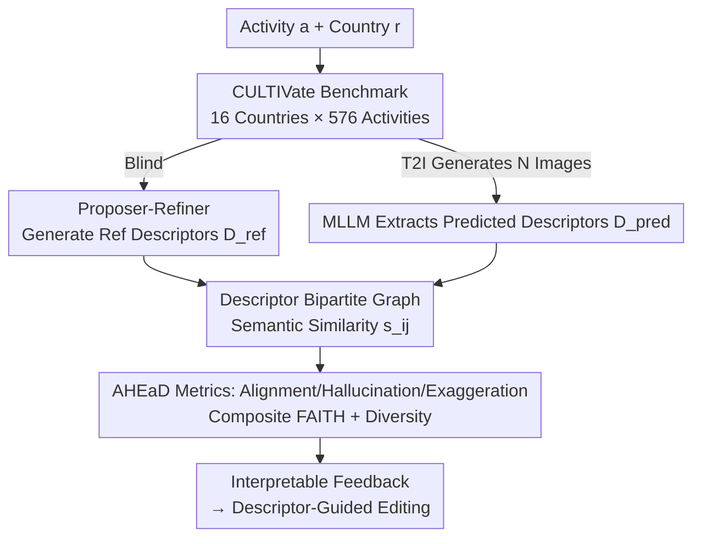

# Culture in Action: Evaluating Text-to-Image Models through Social Activities

**Conference**: ICLR 2026  
**OpenReview**: [https://openreview.net/forum?id=opG4m2U0Oo](https://openreview.net/forum?id=opG4m2U0Oo)  
**Project Page**: https://sinamalakouti.github.io/AHEaD/  
**Code**: To be confirmed  
**Area**: Generative Model Evaluation / Text-to-Image / Cultural Faithfulness / Benchmark  
**Keywords**: T2I Evaluation, Cultural Faithfulness, Social Activities, Interpretable Metrics, WEIRD Bias

## TL;DR
This paper argues that existing text-to-image (T2I) evaluation focuses only on static objects like "food/landmarks/clothing," neglecting social activities that truly carry culture. The authors construct the CULTIVate benchmark (16 countries × 576 social activities × 19k generated images) and propose the AHEaD framework. This framework uses LLM-generated "cultural descriptors" to decompose images into interpretable dimensions, quantifying cultural faithfulness through alignment, hallucination, exaggeration, and diversity. Its composite metric, FAITH, correlates 27% better with human judgment than baselines and reveals that T2I models are systematically more faithful to the Global North than the Global South.

## Background & Motivation
**Background**: The quality of T2I models (SD, FLUX, DALL·E, GPT-Image, etc.) is improving rapidly, with expectations for automatic generation of culturally nuanced content for advertising and film. To assess "whether generated images are culturally faithful," existing cross-cultural benchmarks (Kannen et al., Jha et al., Basu et al.) are almost entirely **object-centric**, testing landmarks, clothing, or food to see if models depict them correctly.

**Limitations of Prior Work**: The authors contend that the essence of culture lies not in isolated objects but in **social activities**—dining, greetings, dancing, and rites of passage. Activities are contextual and compositional, involving multiple elements like objects, interactions, and spatial layouts, which reflect culture more deeply than static objects. For example, "dining at home in Iran" might involve sitting at a table or on the floor around a traditional *sofreh*; the same activity has multiple valid cultural variants. Object-centric benchmarks cannot measure this compositional and contextual cultural expression.

**Key Challenge**: Evaluation methods themselves are problematic. Previous work either relies on **expensive and non-scalable human evaluation** or uses **VLM Image-Text Alignment (ITA) scores** (e.g., CLIPScore) as proxies for human judgment. However, VLMs inherit similar cultural biases and suffer from "bag-of-words" compositional misunderstanding. The authors' analysis reveals a sharper issue: ITA metrics are **positively correlated with exaggeration**. Adding more stereotypical elements (e.g., drawing an actual elephant for an Indonesian "elephant-ant-human" game) increases the CLIPScore while destroying cultural faithfulness. In short, existing automatic metrics reward the wrong behavior.

**Goal**: (1) Build a benchmark that evaluates cultural expression in social activities; (2) Design an **interpretable, scalable, and label-free** automatic metric that correctly penalizes hallucinations and exaggeration.

**Key Insight**: Instead of asking a VLM to directly provide a "faithfulness" score for an entire image (which incorporates its internal bias), evaluation should be **decomposed into descriptor-level comparisons**. First, an LLM (without seeing the image) generates a set of "reference descriptors" expected for an "activity-country" pair. Then, an MLLM extracts "predicted descriptors" from the generated image by performing general scene understanding. The MLLM is only responsible for "identifying what is in the image"—a task it excels at with lower bias—while cultural judgment is handled via structured comparison.

**Core Idea**: Replace "VLM direct scoring" with "set-based comparison of external cultural descriptors," decomposing cultural faithfulness into Alignment, Hallucination, Exaggeration, and Diversity, which are then combined into the composite FAITH metric.

## Method

### Overall Architecture
AHEaD (Alignment, Hallucination, Exaggeration, Diversity) is a **descriptor-based** diagnostic framework. For each pair of "activity $a$ + country $r$," the pipeline consists of three steps:

1.  **Reference Side (Blind)**: A Proposer–Refiner pipeline uses LLMs to generate a set of cultural reference descriptors $D^{\text{ref}}_{r,a}$ covering background, clothing, objects, actions/interactions, and spatial layout.
2.  **Prediction Side (Vision)**: The target T2I model generates $N$ images based on the prompt "A photorealistic photo of {activity} in {country}." An MLLM (InternVL3 / Qwen2.5-VL) parses each image into predicted descriptors, aggregated as $D^{\text{pred}}_{r,a}$.
3.  **Comparison & Metrics**: A complete bipartite graph is constructed between $D^{\text{pred}}$ and $D^{\text{ref}}$, where edge weights represent semantic similarity $s_{i,j}=\text{sim}(\hat d_i, d_j)$. Alignment, hallucination, exaggeration, and diversity are calculated to form the FAITH score. The framework also provides descriptor-level feedback on what matches, what is missing, and what is exaggerated.

### Key Designs

**1. CULTIVate: An Activity-Centric Cross-Cultural Benchmark**

To address the lack of cultural activity measurement, the authors systematically constructed an activity-centric benchmark. They used GPT-4o to parse two complementary knowledge bases: CulturalAtlas (recording greetings, religious practices, and etiquette) and Wikipedia (providing lists of games and celebrations). This resulted in **576 activities across 16 countries and 9 categories** (dance, greetings, games, dining, celebration, religion, music, weddings, funerals). Activities are categorized as multi-variant, setting-dependent, or single-variant. Over **19,000 images** were generated using 6 T2I models. Approximately 3,000 real-world reference images were curated after filtering 12,000 Google search results via CLIPScore. Countries are split into Global North (GN) and Global South (GS) for bias analysis.

**2. Proposer–Refiner: High-Quality Reference Descriptors without Manual Annotation**

The quality of reference descriptors determines the metric's credibility. Using a two-stage approach: the **Proposer** uses multiple LLMs to independently generate up to 10 unique descriptors per dimension to capture diverse cultural variants and cancel individual model bias. The **Refiner** (using GPT-4o) filters duplicates and errors. Human evaluation showed 90% of descriptors are correct, with a coverage score of 4.5/5. Ablation studies (Tab. 4) show the two-stage process increases Spearman correlation from 0.28–0.30 to 0.33. Crucially, reference descriptors are **generated independently of the images** to serve as an untainted baseline.

**3. AHEaD Four-Dimensional Metrics: Decomposing "Faithfulness" into Interpretable Components**

**Alignment (ALIGN)** measures the coverage of expected cultural elements:
$$\text{ALIGN}(x_{r,a}) = \frac{1}{|D^{\text{ref}}_{r,a}|}\sum_{d_j \in D^{\text{ref}}_{r,a}} \mathbb{1}\!\left[\max_i s_{i,j} > \tau\right]$$
where $\tau$ is calibrated using real images. **Hallucination (HAL)** measures the proportion of predicted descriptors that have no match in the reference set:
$$\text{HAL}(x_{r,a}) = \frac{1}{|D^{\text{pred}}_{r,a}|}\sum_{\hat d_i \in D^{\text{pred}}_{r,a}} \mathbb{1}\!\left[\max_j s_{i,j} \le \tau\right]$$
**Exaggeration (EXAG)** targets "over-emphasis of stereotypes" by measuring the positive deviation of stereotype ITA scores $f(I_n, d_k)$ relative to a real-world baseline $\bar f_{gt}(d_k)$:
$$\text{EXAG}(x_{r,a}) = \frac{1}{N}\sum_{n=1}^{N}\max_{d_k \in S_r}\left[\max\!\left(0,\, f(I_n, d_k) - \bar f_{gt}(d_k)\right)\right]$$
These are combined into **FAITH**:
$$\text{FAITH}(x_{r,a}) = g\!\left(\text{ALIGN},\, 1-\text{HAL},\, 1-\text{EXAG}\right)$$

**4. Dual Diversity Measures**

**Descriptor Diversity (DDIV)** uses normalized entropy to measure the frequency distribution of reference descriptors across $N$ images. **Semantic Diversity (SDIV)** is defined as the marginal gain in alignment when moving from one image to $N$ images: $\text{SDIV}=\text{ALIGN}_N - \mathbb{E}[\text{ALIGN}_1]$.

## Key Experimental Results

### Main Results

Evaluating 6 T2I models (SD-3.5, FLUX, Qwen-Image, DALL·E 3, etc.) reveals that **all models are consistently more faithful to the Global North**.

| Model | Region | ALIGN↑ | HAL↓ | FAITH↑ |
|-------|--------|--------|------|--------|
| Qwen-Image | GN | 0.36 | 0.51 | 0.60 |
| Qwen-Image | GS | 0.30 | 0.56 | 0.55 |
| GPT-Image-1 | GN | 0.36 | 0.49 | 0.61 |
| GPT-Image-1 | GS | 0.30 | 0.55 | 0.56 |
| Gemini 2.5 Flash | GN | 0.40 | 0.46 | 0.61 |
| Gemini 2.5 Flash | GS | 0.35 | 0.50 | 0.57 |

Alignment for GN is 4–8% higher than for GS. Models also exhibit higher hallucination and lower diversity for GS.

**FAITH correlates significantly better with human judgment** (Spearman correlation):

| Metric | Type | All |
|--------|------|-----|
| CLIPScore | ITA | 0.04 |
| VQAScore | ITA | 0.14 |
| CuRe | Cultural | 0.10 |
| **FAITH (InternVL3)** | Ours | **0.47 (+0.27)** |
| Human-Human | Upper Bound | 0.58 |

### Ablation Study

- **ALIGN only** achieves 0.41 correlation. Adding HAL (0.44) and EXAG (0.47) proves that faithfulness requires penalizing errors and stereotypes.
- **Proposer–Refiner** two-stage filtering raises the quality from 0.28 to 0.33.

### Key Findings
- **ITA metrics correlate positively with exaggeration**, meaning they reward stereotypical depictions that humans find less faithful.
- T2I models perform best on "universal activities" (concerts, dining) but struggle significantly with "culture-specific activities" (celebrations).
- A documented "Northern bias" exists across all tested models, quantified by a 4-8% gap in alignment.

## Highlights & Insights
- **Separation of Evaluation Responsibility**: By using MLLMs only for perception (extracting descriptors) and delegating judgment to the AHEaD logic, the framework bypasses the inherent cultural bias of the VLM scorer.
- **Relative Baseline for Exaggeration**: Defining exaggeration as "more stereotypical than reality" provides a quantifiable measure for a previously vague concept.
- **Explainability**: Descriptor-level matching allows the framework to specify which elements are missing or hallucinated, enabling descriptor-guided image editing.

## Limitations & Future Work
- **Reliance on LLM/MLLM Knowledge**: The accuracy of metrics depends on the models' understanding of niche cultures.
- **Reference Image Bias**: Real images sourced from Google Search may still carry Western stylistic biases.
- **Cost for Proprietary Models**: Diversity metrics (DDIV/SDIV) could not be calculated for some proprietary models due to the high cost of generating multiple images per prompt.
- **Human Consistency**: The 0.58 human-human correlation ceiling reflects the inherent subjectivity in cultural evaluation.

## Related Work & Insights
- **vs. Object-centric Benchmarks**: Moves from simple object recognition to complex activity evaluation involving interactions and contexts.
- **vs. ITA Metrics**: Demonstrates that CLIPScore and similar metrics fail in cultural contexts and even reward negative behaviors like exaggeration.
- **vs. MLLM-as-judge**: Improves correlation by 0.27–0.32 by avoiding direct subjective scoring from biased models.

## Rating
- Novelty: ⭐⭐⭐⭐⭐ 
- Experimental Thoroughness: ⭐⭐⭐⭐ 
- Writing Quality: ⭐⭐⭐⭐ 
- Value: ⭐⭐⭐⭐⭐ 

<!-- RELATED:START -->

## Related Papers

- [\[ACL 2026\] Minos: A Multimodal Evaluation Model for Bidirectional Generation Between Image and Text](../../ACL2026/llm_evaluation/minos_a_multimodal_evaluation_model_for_bidirectional_generation_between_image_a.md)
- [\[ACL 2025\] SANSKRITI: A Comprehensive Benchmark for Evaluating Language Models' Knowledge of Indian Culture](../../ACL2025/llm_evaluation/sanskriti_a_comprehensive_benchmark_for_evaluating_language_models_knowledge_of_.md)
- [\[ACL 2025\] EditInspector: A Benchmark for Evaluation of Text-Guided Image Edits](../../ACL2025/llm_evaluation/editinspector_a_benchmark_for_evaluation_of_text-guided_image_edits.md)
- [\[ICLR 2026\] Evaluating Language Models' Evaluations of Games](evaluating_language_models_evaluations_of_games.md)
- [\[ICLR 2026\] Mapping Overlaps in Benchmarks through Perplexity in the Wild](mapping_overlaps_in_benchmarks_through_perplexity_in_the_wild.md)

<!-- RELATED:END -->
